시력강화 운동

시력강화 이렇게 해보세요!

나이가 들수록 가장 빨리 퇴화하는 우리 신체기관 눈,

시력의 퇴화를 조금이라도 늦추기 위해서는

시력강화를 위한 생활습관이 무엇보다 중요합니다.

오늘 미아체 한의원에서는 여러분들의 이러한

시력건강을 위해 시력강화에 좋은 생활습관들을 알려드리겠습니다.

​

평소 눈 건강에 자신이 없고, 눈이 침침하신 분들

눈 동그랗게 뜨고 주목해주세요!

​

​

시력강화 방법 1. 가까운곳을 보려 하지 말고 먼곳을 바라보기

초원에서 유목생활을 하는 몽골인들!

몽골인들의 시력은 매의눈이라고 불릴 정도로

시력이 좋은데요. 몽골인들의 평균시력은

일반적인 시력검사표에서 최고시력인 2.0을 뛰어넘는

3.0, 4.0, 5.0입니다. 이렇게 몽골인들이 시력이

좋은 이유는 바로 어렸을 때 부터 먼곳을

바라보는 생활에 익숙해져 있기 때문이랍니다.

이제부터 시간이 날 때 가까운 곳을 보려하지말고

건물의 옥상에 올라가 먼 곳을 많이 바라보는 노력을 해보세요!

일상생활에서 실천할 수 있는 시력강화에 도움이 되는 탁월한 방법이랍니다.

​

시력강화 방법 2. 스마트폰, 컴퓨터 사용시 일정한 거리 유지

시력을 개선시키는 것도 좋지만, 지금 현재 시력 상태에서

시력이 퇴행되지 않게 하는 것도 중요하답니다.

컴퓨터에 오래 앉아 일하는 사무직환경이라면

1시간에 10분씩 눈 휴식을 위해, 눈을 쉬어주는 것이 좋고

어두운 곳에서나 움직이는 버스, 차 안에서

스마트폰이나 영상기기 사용을 자제해주는 것이 좋습니다.

​

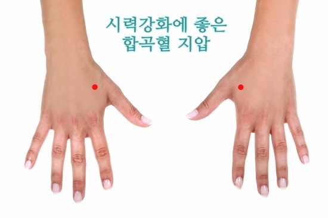

​

시력강화 방법 3. 시력 혈자리 지압

​

합곡혈을 꾸주준히 지압해 주는 것만으로도

시력이 개선되고, 시력감퇴를 막아주는데 탁월합니다.

​

합곡혈은위 사진에 표기된 혈자리인데요.

합곡혈을 꾸준히 지압해주면 시력감퇴는 물론

근시, 원시, 눈의 통증 등 각종 안구질환에도 도움이 된답니다.

&#39;가버 패치(gabor-patch)&#39;를 보면서 원하는 모양과 각도를 찾는 것이었다. 가버 패치는 어둡고 밝은 줄무늬를 원하는 방향과 각도로 만들어 낸 패턴을 말한다. 이 외에도 집에서 쉽게 할 수 있는 안구 운동법이 있다.

다음과 같은 안구 운동법은 눈의 근육을 탄력 있게 하고 안구의 혈액 순환을 도와 시력을 향상시키는 데 효과가 있다. 안경을 착용하지 않은 사람은 1분에 15~20회 정도 눈을 깜빡인다. 만일, 눈을 깜빡이는 데 불편함이 있는 사람은 눈을 감고 고개를 가볍게 젖힌 뒤, 2~4회 숨을 마실 떄와 내쉴 때 1회씩 깜빡인다. 이 운동은 눈의 산소량을 늘리는 데 효과적이다. 눈동자를 굴리면서 눈을 깜빡이는 것도 좋다. 시계 12시, 6시, 9시, 3시 방향으로 보면서 1번씩 깜빡인다. 그 뒤, 1시, 7시, 11시, 5시 방향으로 눈동자를 움직이고 마지막엔 눈을 시계 방향으로 한 번, 반시계 방향으로 한 번씩 돌려준다.

시력저하에 좋은 시력강화 눈체조법



눈을 감았다 떳다하는 시간은 2~3초 간격으로 눈동자를 최대한 멀리 보내면서 눈운동을 합니다.



* [위, 아래, 오른쪽, 왼쪽]눈을 감는다 → 눈을 뜨고 위를본다 → 감는다 → 눈을 뜨고 아래를 본다 →감는다 → 눈을 뜨고 오른쪽을 본다 →눈을 감는다 → 눈을 뜨고 왼쪽을 본다 → [우상, 좌하, 좌상,우하]눈을 감는다 → 눈을 뜨고 오른쪽 위를 본다 → 눈을 감는다 → 눈을 뜨고 왼쪽 아래를 본다 → 눈을 감는다 → 눈을 뜨고 왼쪽 위를 본다 →눈을 감는다 → 눈을 뜨고 오른쪽 아래를 본다

※ 위 시력강화훈련을 5세트 반복한후 눈회전(눈동자 돌리기) 운동을 이어서 합니다.

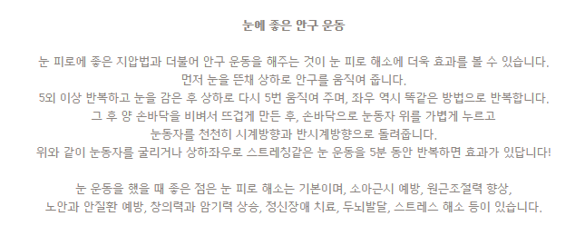

가버패치 시력 교정법

[http://cafeblog.search.naver.com/search.naver?sm=tab_hty.top&amp;where=post&amp;ie=utf8&amp;query=%EA%B0%80%EB%B2%84+%ED%8C%A8%EC%B9%98](http://cafeblog.search.naver.com/search.naver?sm=tab_hty.top&amp;where=post&amp;ie=utf8&amp;query=%EA%B0%80%EB%B2%84+%ED%8C%A8%EC%B9%98)

[
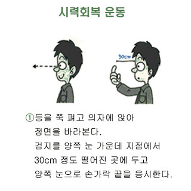
](https://4.bp.blogspot.com/-gTc9U7VKpeM/WINVcQ9jYQI/AAAAAAAAAcc/RJ6GRomD9GYZINbe1AAsrkYZXvkjYdj3ACLcB/s1600/4.jpg)

[
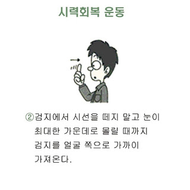
](https://2.bp.blogspot.com/-KchZz_OMJfY/WINVcRuZeAI/AAAAAAAAAcg/P4nPLzmFD-gxZv8Wgz6pQRFib7oQhSjDgCLcB/s1600/5.jpg)

[
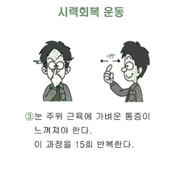
](https://2.bp.blogspot.com/-VR6eLQhQCSs/WINVcvOAXiI/AAAAAAAAAck/DzCJtEe3tlE5YmDElSvNTH7VUEZO48fxACLcB/s1600/6.jpg)

[
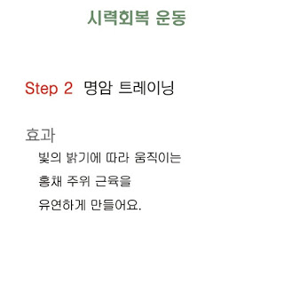
](https://4.bp.blogspot.com/-WOM-DRgA9fA/WINVc4nFopI/AAAAAAAAAco/Epn_CfVFDcEzIPNsvgiHKClPDcPjWhx6QCLcB/s1600/7.jpg)

[
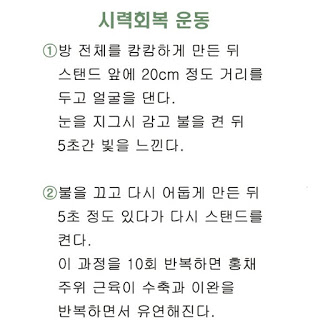
](https://4.bp.blogspot.com/-cG5YoGBwhdY/WINVcyNhWpI/AAAAAAAAAcs/qrM7zs8xmog8m0Bzie7weyUAf1KVLinXgCLcB/s1600/8.jpg)

[
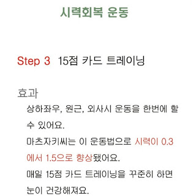
](https://1.bp.blogspot.com/-VYbqyIqbn9Y/WINVdOjW6fI/AAAAAAAAAcw/RD5QARbiXjIfEKZd04Q2RF61g0Ge3lNLgCLcB/s1600/9.jpg)

[
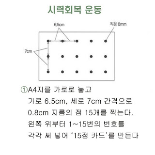
](https://3.bp.blogspot.com/-k6Plnaf7-54/WINVbcBTQ9I/AAAAAAAAAcE/2ooimzIFThE2_y_qYmjj4SpukL8ROQhIgCLcB/s1600/10.jpg)

[
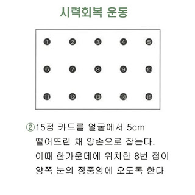
](https://2.bp.blogspot.com/-gg0t0j3ldrc/WINVbfzg4FI/AAAAAAAAAcM/lKIVaf2JOKUimdgpfEPQP7x6z9wwWtfgwCLcB/s1600/11.jpg)

[
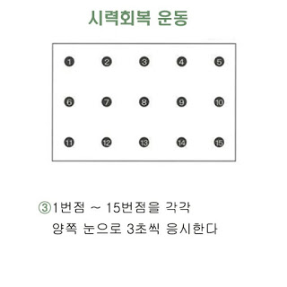
](https://1.bp.blogspot.com/-pjJ9BysG7Tg/WINVb6JXWsI/AAAAAAAAAcQ/K3BlqQJ5CKQg8SHv3N1ziDBC71VFB1FWgCLcB/s1600/12.jpg)

출처: &lt;[http://gotdemm.blogspot.kr/2017/01/15.html?m=1](http://gotdemm.blogspot.kr/2017/01/15.html?m=1)&gt;
