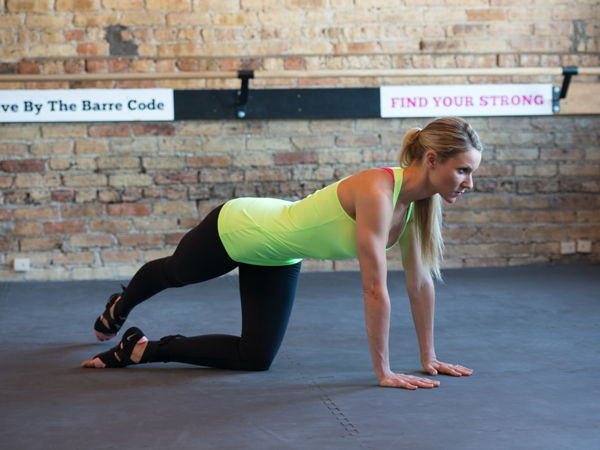
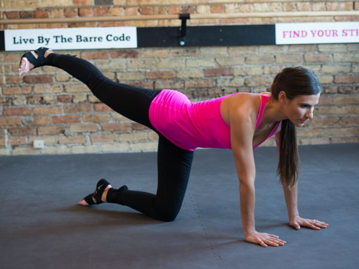
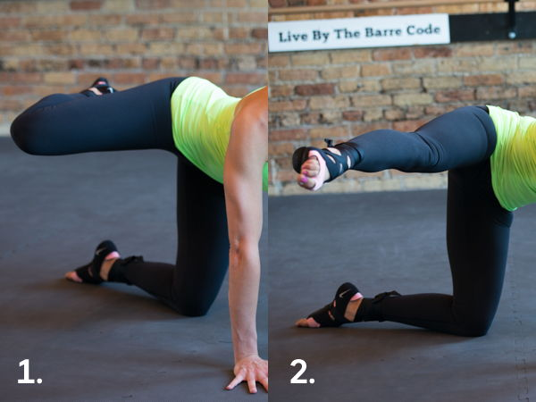
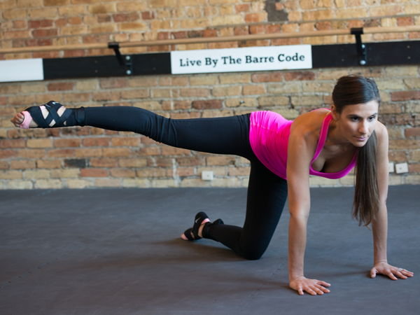

엉덩이

2. 리어 레이저스(Rear Raisers)

엉덩이 상부 외측을 단력하는 운동으로 오른쪽 다리를 쭉 펴서 반대편인 왼쪽으로 뻗어준다. 이 때 발가락은 마치 화살촉처럼 땅 바닥으로 향하게 한다. 물론 닿지 않아야 한다. 이때 주의할 것은 허리가 굽어지지 않게 신경을 써야 한다. 같은 동작을 반복한 뒤 반대쪽 다리도 같은 방법으로 운동을 한다.&#160;&#160;

&#160;&#160;

3. 부티 박스(Booty Boxes)

&#160;

이 운동법은 1번의 퍼키 리프트와 비슷하다. 다만 엉덩이 중앙과 상부 근육을 단력 시키는 운동법이다.

&#160;

퍼키 리프트와 유사하지만 발가락을 수평으로 향하도록 살짝 틀어주는 것이 포인트. 다리를 들어올린 뒤에 잠시 멈춘 뒤 발 전체를 시계방향으로 틀어주면 된다.&#160;

&#160;

ⓒ&#160;GAIL REICH&#160;​

&#160;

4. 킬러 킥스(Killer Kicks)

&#160;

그림에서 보는 것처럼 다리를 접었다가 앞으로 뻗어준다. 킬러의 발차기처럼 말이다. 이 운동은 엉덩이의 측면 근육에 탄력을 준다.&#160;

&#160;

다만 너무 세게 발차기를 하면 근육과 관절에 무리를 줄 수 있으니 주의해야 한다.&#160;

&#160;

ⓒ&#160;GAIL REICH&#160;​

&#160;

5. 리프트 잇 업(Lift It Up)

&#160;

다리를 측면으로 들어올리는 방법으로 엉덩이의 측면 근육에 영향을 준다. 운동을 할 때 몸의 중심이 흔들리지 않고 특히 척추가 비틀리지 않도록 주의할 필요가 있다.

&#160;

ⓒ&#160;GAIL REICH&#160;​
