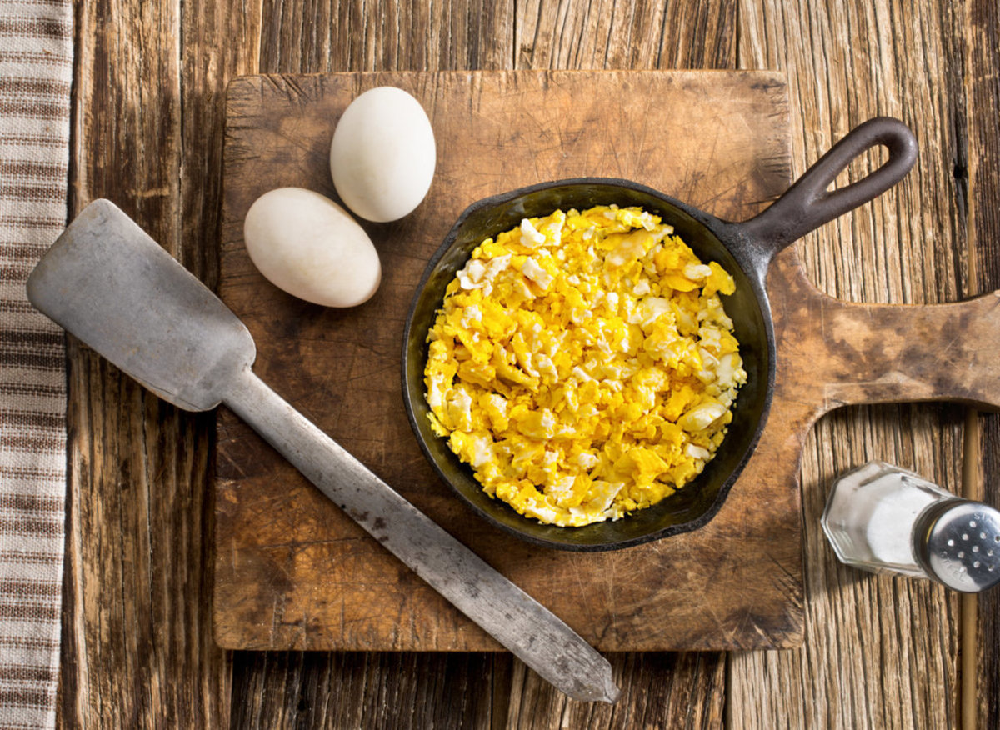
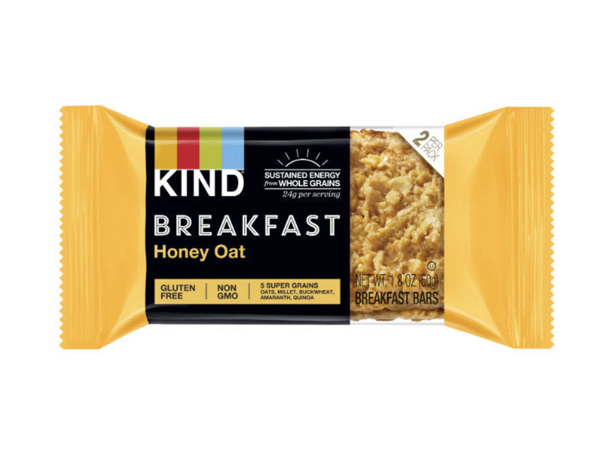
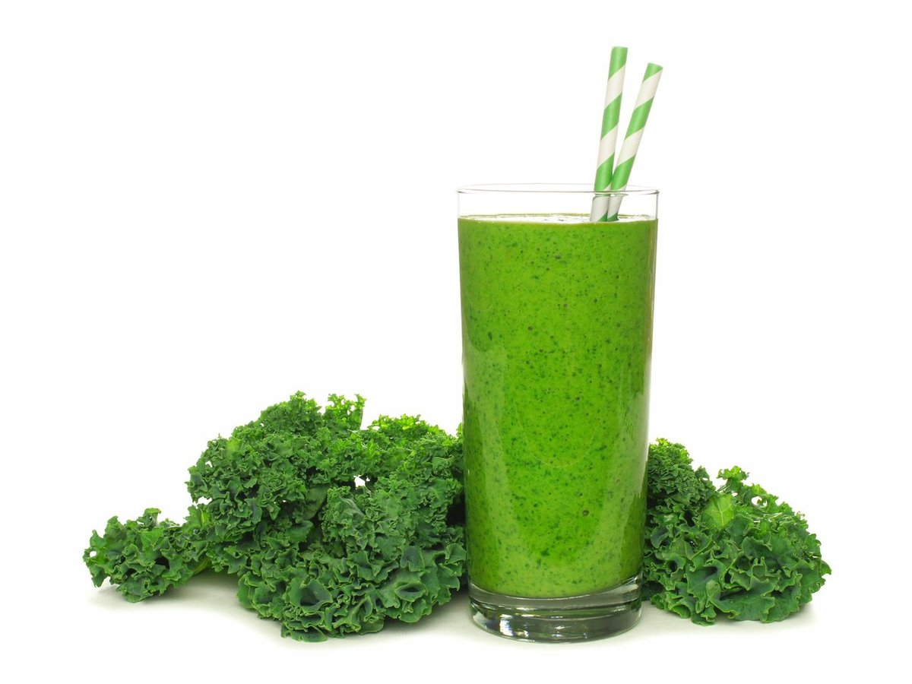
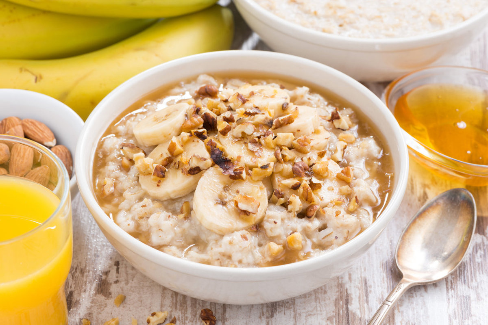
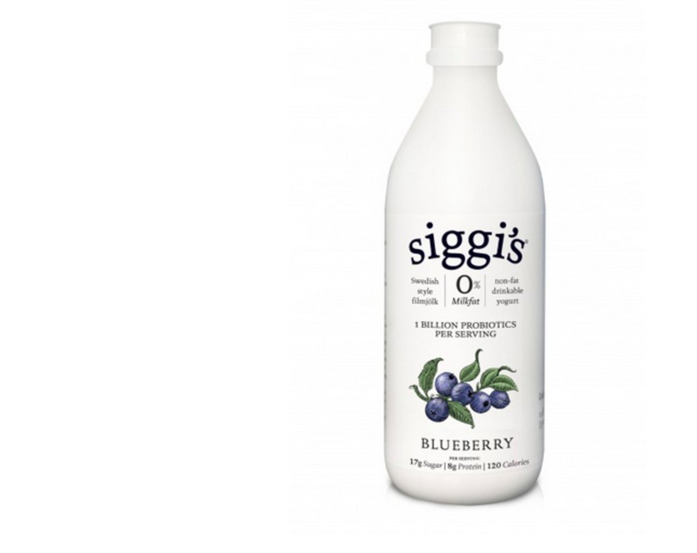
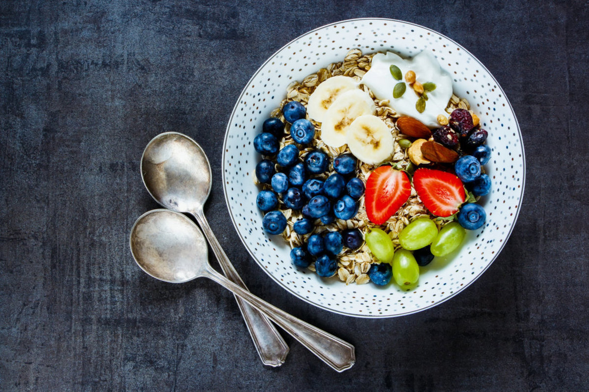
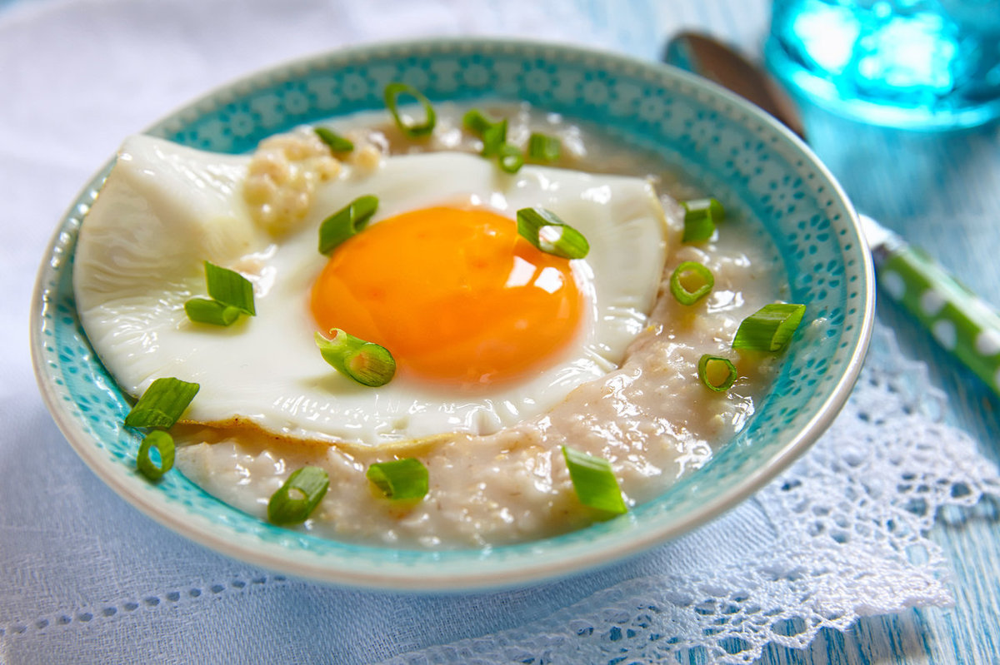
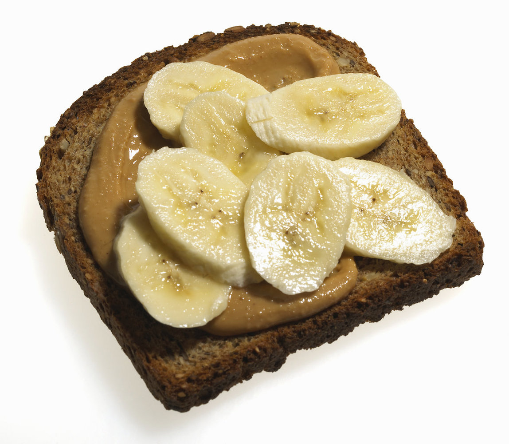
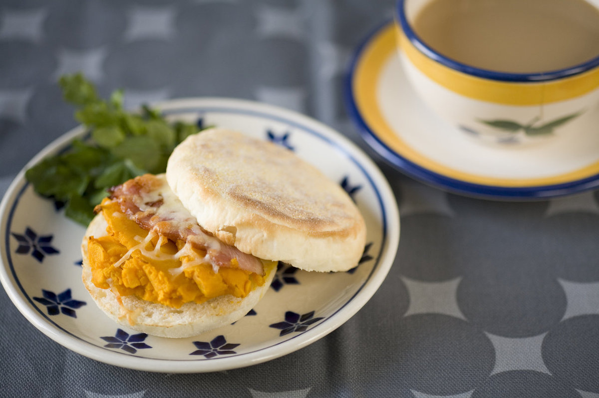

영양학자들이 밝힌 자신의 아침 식사 메뉴 9

The Huffington Post &#160;|&#160; 작성자 [Kate Bratskeir](http://www.huffingtonpost.kr/kate-bratskeir/)

- [이메일](http://www.huffingtonpost.kr/users/login/)

게시됨: 2016년 04월 11일 14시 51분 KST 업데이트됨: 2016년 06월 23일 00시 05분 KST

- [페이스북 502](https://www.facebook.com/sharer/sharer.php?u=http%3A%2F%2Fwww.huffingtonpost.kr%2F2016%2F04%2F11%2Fstory_n_9657514.html)

- [트윗 ](https://twitter.com/intent/tweet?lang=ko&amp;text=%EC%98%81%EC%96%91%ED%95%99%EC%9E%90+9%EB%AA%85%EC%9D%B4+%EB%B0%9D%ED%9E%8C+%EC%9E%90%EC%8B%A0%EC%9D%98+%EC%95%84%EC%B9%A8+%EC%8B%9D%EC%82%AC+%EB%A9%94%EB%89%B4+http%3A%2F%2Fwww.huffingtonpost.kr%2F2016%2F04%2F11%2Fstory_n_9657514.html)

- [이메일](http://www.huffingtonpost.kr/2016/04/11/story_n_9657514.html#) 0

- 댓글 0
)

)
영양학자들은 달걀, 귀리, 녹색 채소 스무디 등 다양한 몸에 좋고 맛있는 아침 식사를 먹는다. 공통점? 아침을 먹는다는 점.

아침 식사가 하루의 가장 중요한 식사라는 말에 당신이 찬성할 수도 반대할 수도 있지만, 전문가들은 매일 아침을 먹는 것이 중요하다고 말한다. 일본의 대규모 연구에 의하면 아침을 먹는 사람들은 다른 건강한 습관도 가지고 있는 경우가 많으며, 아침을 거르는 사람들은 흡연 확률이 높고 과일과 채소를 덜 먹는다고 한다. 게다가 점심 때까지 아무것도 먹지 않는 사람들은 당뇨병에 걸릴 확률이 2배 더 높았다.

아침을 먹으면 자녀들에게도 좋은 본보기가 된다. [건강한 아침 식사를 먹는 학생들의 성적이 더 좋다는 연구](http://www.huffingtonpost.com/entry/breakfast-kids-better-performance_us_564e0236e4b08c74b734b067)가 있다.

공인 영양사 9명이 자신의 아침 식사 메뉴를 공개했다. 참고해도 좋겠다.

(사진을 누르면 레시피가 뜹니다.)

- 1스크램블 에그와 과일

Andrew Unangst via Getty Images [줄리 업튼](http://appforhealth.com/about-us/julie-upton/): 달걀 두세 개(보통은 한 개와 흰자 두 개를 먹는다고 한다)로 만든 스크램블드 에그와 호두 버터를 바른 과일 한 쪽, 차 한 잔으로 하루를 시작한다. “쉽고 빠르다. 나는 아침에 배고픔과 음식 생각을 달래기 위해 단백질을 20~25g 먹으려고 한다. 달걀의 단백질과 균형을 맞추기 위해 탄수화물이 든 바나나, 지방이 든 호두 버터를 먹는다.”

- 2휴대용 영양 바

Kind [레베카 스크리치필드](http://www.rebeccascritchfield.com/): &#39;카인드 브렉퍼스트 바&#39;와 라테를 먹는다. “카페인과 칼슘을 같이 먹고, 좋은 재료로 만든, 인공적인 것이 들지 않은 영양 많은 바를 먹는다.”

- 3그린 스무디

jenifoto via Getty Images [크리스타 맨티](http://www.christamantey.com/): 녹색 채소들, 얼린 망고와 베리, 바나나와 물. “가장 건강한 음식으로 하루를 시작하는 멋진 방법이다. 짙은 녹색잎 채소와 과일을 생으로 먹는다. 에너지를 주고, 남은 하루 동안 건강한 음식을 먹게 해준다.”

- 4오트밀과 호두

Yulia_Davidovich via Getty Images [캐서린 브루킹](http://www.katherinebrooking.com/): 하루를 달콤하게 시작하는 걸 즐긴다. 호두를 넣은 오트밀 한 대접에 꿀이나 흑설탕을 넣어 달게 만든다. “오트밀을 먹으면 점심 때까지 든든하다. 나트륨과 포화지방은 적고, 건강한 탄수화물이 오전 동안 에너지를 준다.”

- 5섬유 강화 커피 + 마시는 요거트

Siggis [펠리샤 스톨러](http://www.feliciastoler.com/): 아침에 운동을 하기 때문에 해가 뜰 무렵 영양분을 섭취한다. 선파이버와 같은 섬유질 보충제를 넣은 커피 한 잔, 오렌지 주스 작은 컵 한 잔, 시기스 등 마시는 요거트를 보통 먹는다. 배부른 느낌, 처지는 느낌 없이 섬유질 섭취를 늘리려고 선파이버를 커피에 넣는다고 한다. 주스는 운동 직전에 마셔 지구력을 늘린다. 요거트는 땀을 흘린 다음 마신다. “탄수화물과 단백질 비율이 적절해 운동 후 영양 공급에 최적이다.”

- 6귀리와 신선한 과일

mustipan via Getty Images [알리샤 럼지](http://alissarumsey.com/): 전통적인 으깬 귀리에 우유, 견과류, 치아 시드, 신선한 과일을 넣고 바닐라와 계피 풍미를 내서 먹는다. 포만감을 노린 메뉴다. “귀리에는 수용성 섬유질이 있고, 견과류와 씨앗에는 지방, 우유에는 단백질이 있어서 점심 때까지 든든하다.” “오메가 3 지방이 있어서 치아씨를 즐겨 사용한다.” “설탕 대신 딸기나 사과, 바닐라 추출물 등을 사용해서 단 맛을 낸다. 오트밀에는 무엇이든 섞을 수 있고, 끝없이 다양한 조합이 가능하다.”

- 7단백질 오트밀

Azurita via Getty Images [마조리 콘](http://www.mncnutrition.com/): 오트밀에 달걀을 넣어 업그레이드한다. 오트밀에 달걀, 치아 시드, 통조림 호박 계피와 피넛 버터를 넣는다. 사과나 배를 곁들인다. “쉽고 빠르고 맛있고, 단백질과 섬유가 풍부해서 오전 내내 에너지를 준다.”

- 8땅콩 버터 + 토스트

Alex Cao via Getty Images [반다나 셰스](http://www.vandanasheth.com/): 섬유가 풍부한 통곡물 토스트에 땅콩 버터를 바르고 바나나 슬라이스를 얹은 다음 대마 씨앗이나 치아씨를 곁들인다. 포장해서 갖고 다니기 편하고, 영양이 많고 풍미가 강하다고 한다. 심장에 좋은 지방, 단백질, 섬유가 포함되어 있어 훌륭한 아침 식사다.

- 9달걀 흰자와 치즈를 곁들인 잉글리시 머핀

MIXA via Getty Images [앤젤라 진 메도우](http://www.eatrightpro.org/resource/media/meet-our-spokespeople/spokespeople/angela-ginn-rdn-ldn-cde): 통곡물로 만든 잉글리시 머핀에 달걀 흰자와 치즈 한 장을 얹어 먹는다. 유제품, 단백질, 통곡물이 합쳐진 이 식사는 들고 다니며 먹기 편해서 정신없는 아침에 특히 좋다고 한다.

출처: &lt;[http://www.huffingtonpost.kr/2016/04/11/story_n_9657514.html](http://www.huffingtonpost.kr/2016/04/11/story_n_9657514.html)&gt;

)

)

출처: &lt;[http://www.huffingtonpost.kr/2016/04/11/story_n_9657514.html](http://www.huffingtonpost.kr/2016/04/11/story_n_9657514.html)&gt;
