타이탄의 도구들

삶의 유일한 배움은 마이크로micro에서 매크로macro를 찾아내는 것이다.”

• 유발 하라리의 《사피엔스》, 찰스 멍거의 《불쌍한 찰리 이야기》, 로버트 치알다니의 《설득의 심리학》, 빅터 프랭클의 《죽수용소에서》, 헤르만 헤세의 《싯다르타》를 다른 책들보다 훨씬 더 칭찬하고 더 많이 인용한다.

• 유발 하라리의 《사피엔스》, 찰스 멍거의 《불쌍한 찰리 이야기》, 로버트 치알다니의 《설득의 심리학》, 빅터 프랭클의 《죽

명상록

잠자리를 정리하라

아르킬로코스의 명언을 마음에 품고 산다. “우리는 기대하는 수준까지 올라가는 게 아니라, 훈련한 수준까지 떨어진다.”

명상하라 헤드스페이스Headspace나 캄Calm등의 앱ap

아침일기

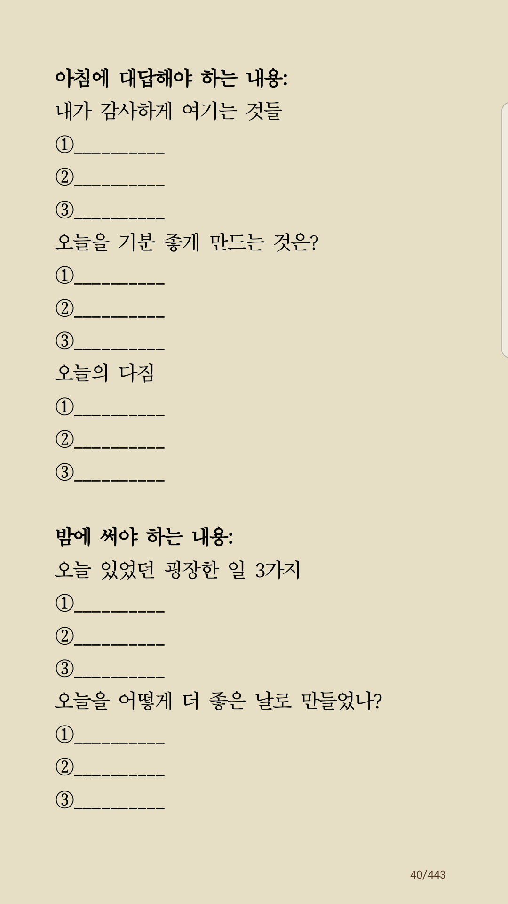

책 창의성을 지휘하라

당장 시작하지 못하는 가장 큰 이유는 게으름 때문이 아니라 ‘두려움’ 때문이라는 것을. 실패하면 인생을 망칠 수도 있다는 불안

해지기 시작했다.”

피터 틸도 맞장구를 친다. “다음에 등장할 빌 게이츠는 운영체제를 개발하지 않을 것이다. 다음에 등장할 래

제를 개발하지 않을 것이다. 다음에 등장할 래리 페이지나 세르게이 브린은 검색 엔진을 만들지 않을 것이다. 그리고 다음에 등장

마크 주커버그는 소셜 네트워크를 창조하지 않을 것이다. 당신이 그들을 멋지게 모방했다는 건 그들에게서 아무것도 배우지 못했다는

첫째, ‘내가 매일 떠올리는 문제들 중 아직 아무도 해결하지 못한 것은 무엇인가?’

독점하라

매일 10분 10개의 아이디어

. “첫 걸음을 떼는 게 너무 힘들게 느껴지는 아이디어는 버려라. 그건 갖고 있을수록 계속 머릿속만 복잡해진다.

아이디어는 무조건 많아야 하고, 아이디어의 실행 플랜은 무조건 간단해야 한다.

내가 새롭게 만들 수 있는 낡은 아이디어 10가지

• 내가 직접 발명할 수 있는 우스꽝스러운 물건 10가지(인공지능 변기 같은

• 내가 쓸 수 있는 10권의 책

• 구글, 아마존, 트위터 등을 이용한 사업 아이디어 10가지

• 내가 아이디어를 보낼 수

사람 10명

• 내가 촬영할 수 있는 팟캐스트나 동영상 아이디어 10가지

서촌 한옥마을에 살자

모든 투자는 ‘사람’에게 하는 것이다.

수준 높은 모임에 참석하라

조언했다. “초대받지 않았지만 내가 가고 싶은 모임엔 최대한 참석해서 어떻게 하면 그 자리에 있는 사람들에게 도움이 될지 방법을 찾아야한다

강력한 의견, 유연한 수용

평범한 사람들의 보편적 인정과 동의

그걸 뛰어남이라고

독창성은 소수만 깨달은 것을

아는것이다.

자멸적 습관

성과를 내는 날을  성과를 내지 못하는 날보다 많이 만들것

사랑, 즐거움

기본기 세개를 엮어라

글쓰기. 아이디어.  ?

1000명의 유료팬을 만들어라

 작가 아나이스 닌Anais Nin의 글을 발견하고는 크게 고개를 끄덕였다.

“인생은 용기의 양에 따라 줄어들거나, 늘어난다.

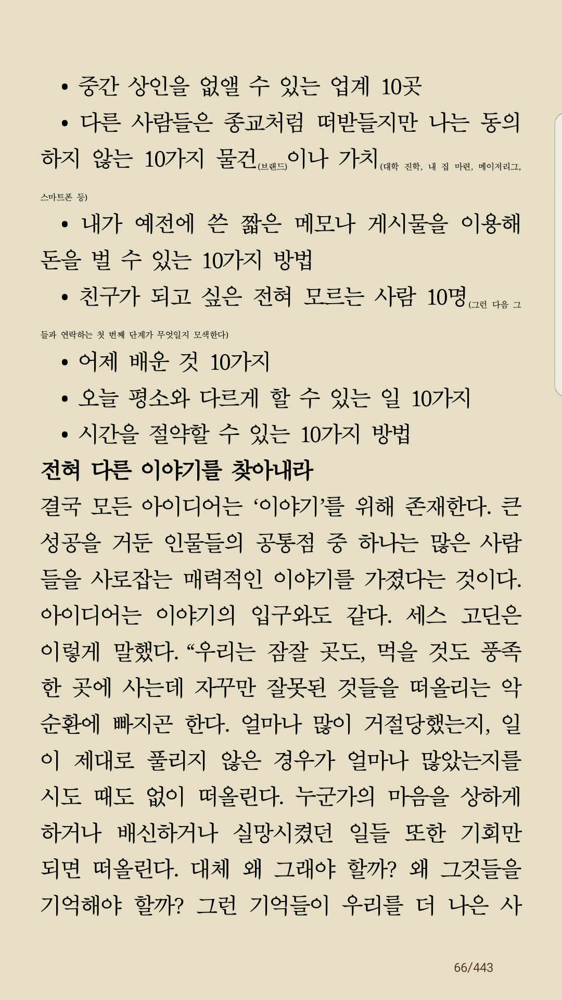

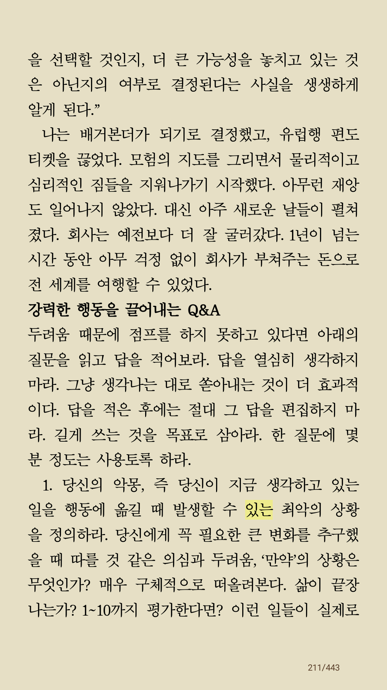

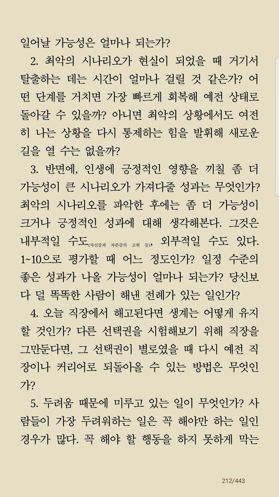

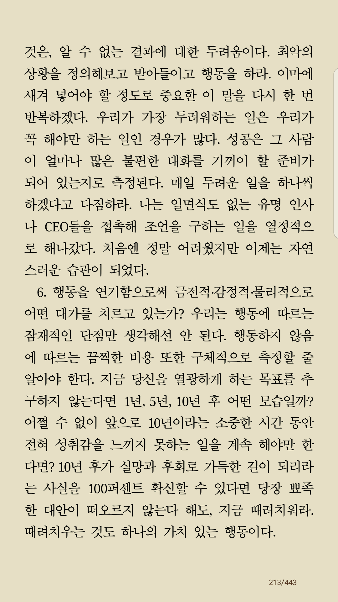

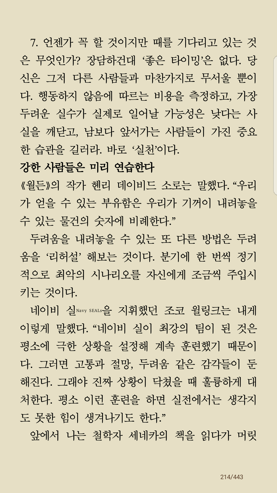

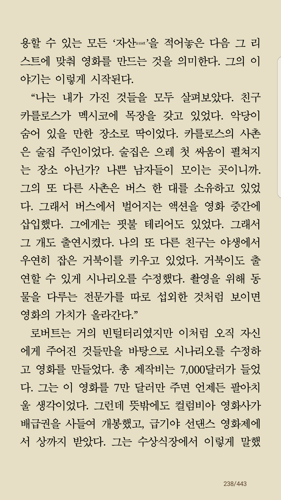

멋진일. 감사리스트

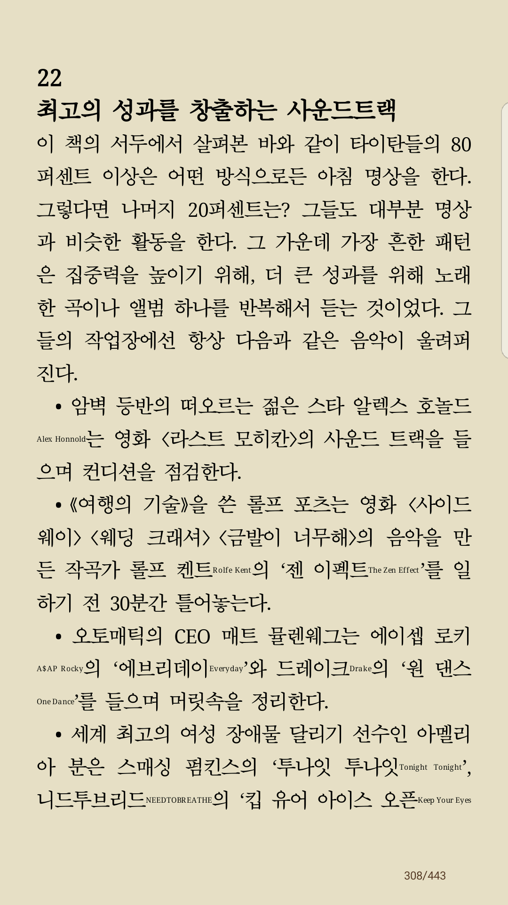

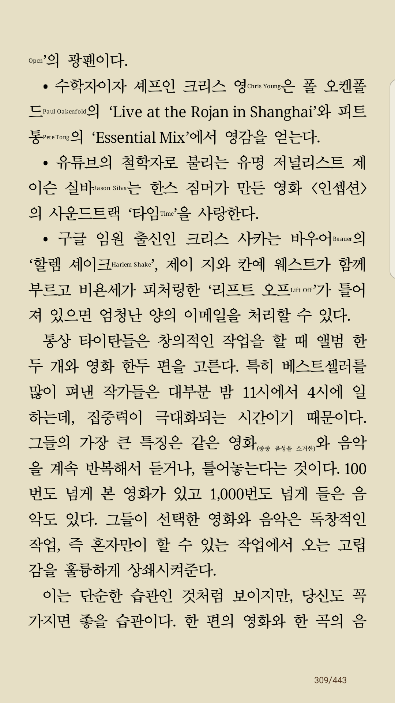

Deloading

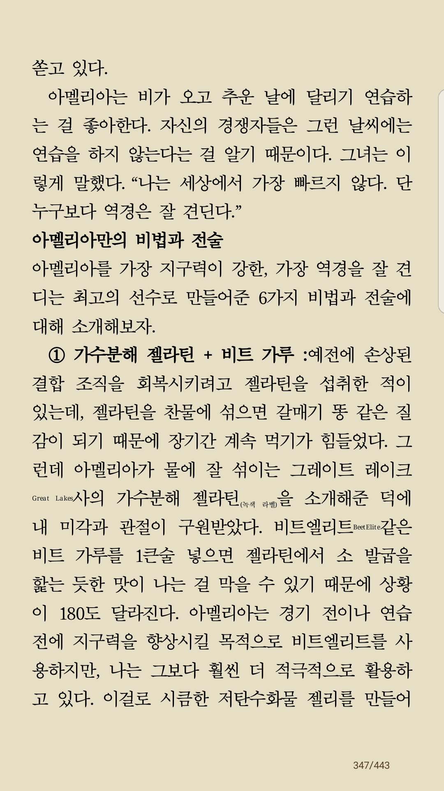

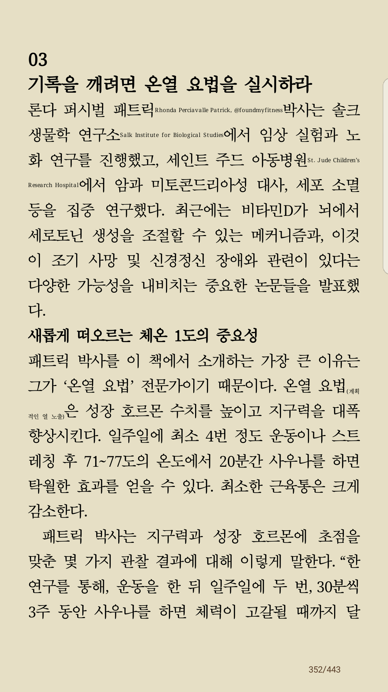

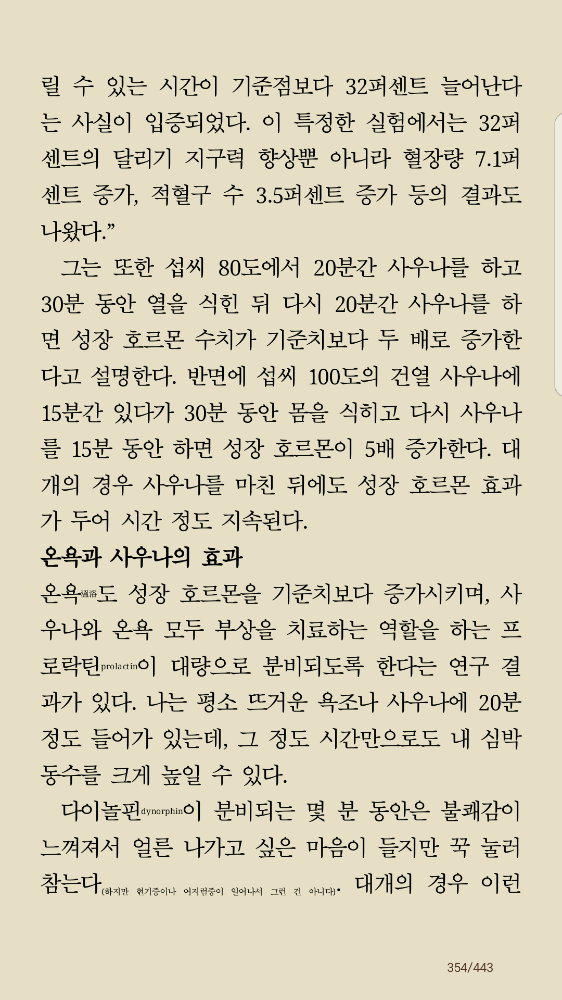

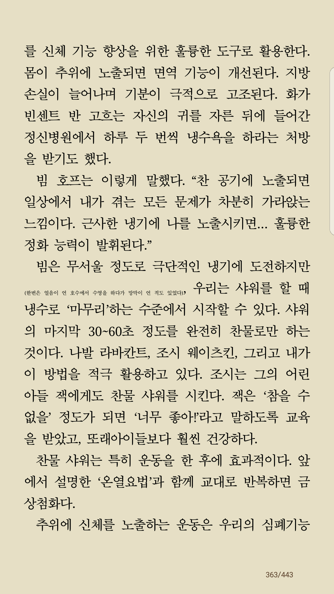

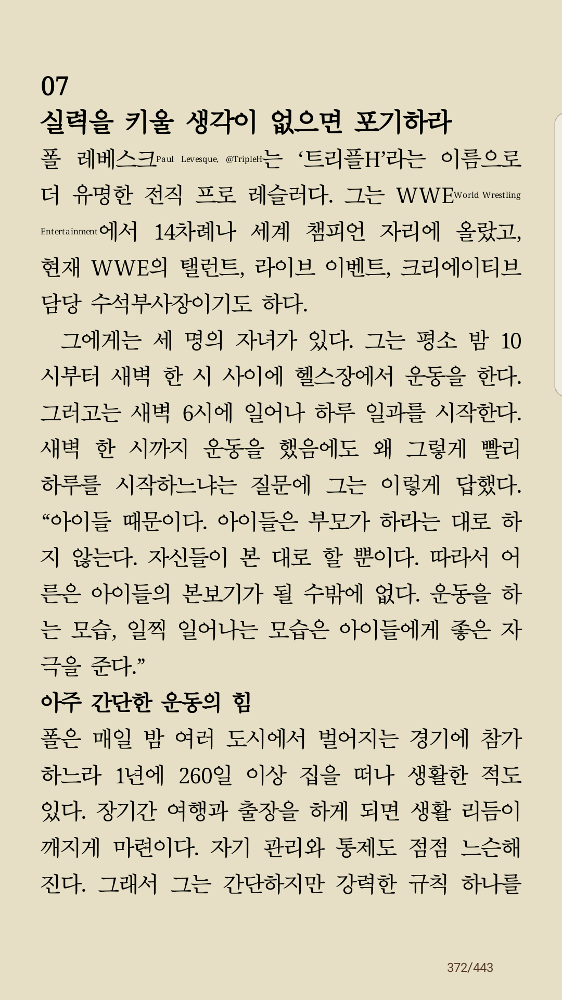

케톤식이요법

윔 호프 호홉법

[https://spanish-adventure-with-tito.tistory.com/entry/%EB%A9%B4%EC%97%AD%EB%A0%A5-%EB%86%92%EC%9D%B4%EB%8A%94-%EB%B2%95-%EC%9C%94-%ED%98%B8%ED%94%84-%ED%98%B8%ED%9D%A1%EB%B2%95-4%EB%8B%A8%EA%B3%84-%EA%B7%80%EB%84%A4%EC%8A%A4-%ED%8E%A0%ED%8A%B8%EB%A1%9C%EC%9D%98-%EC%9B%B0%EB%B9%99%EC%8B%A4%ED%97%98%EC%8B%A4](https://spanish-adventure-with-tito.tistory.com/entry/%EB%A9%B4%EC%97%AD%EB%A0%A5-%EB%86%92%EC%9D%B4%EB%8A%94-%EB%B2%95-%EC%9C%94-%ED%98%B8%ED%94%84-%ED%98%B8%ED%9D%A1%EB%B2%95-4%EB%8B%A8%EA%B3%84-%EA%B7%80%EB%84%A4%EC%8A%A4-%ED%8E%A0%ED%8A%B8%EB%A1%9C%EC%9D%98-%EC%9B%B0%EB%B9%99%EC%8B%A4%ED%97%98%EC%8B%A4)
