✡&#39;17 VISION BOARD : Executive Summary for my feature

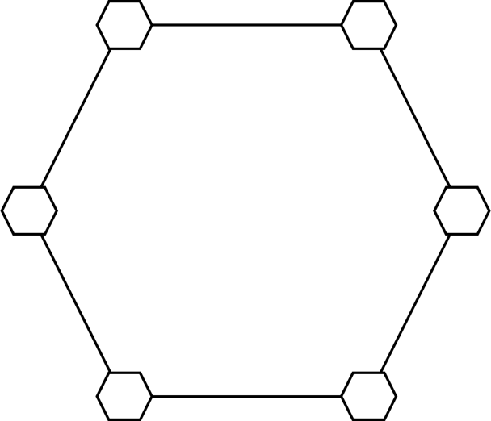

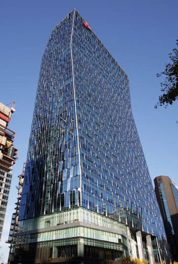

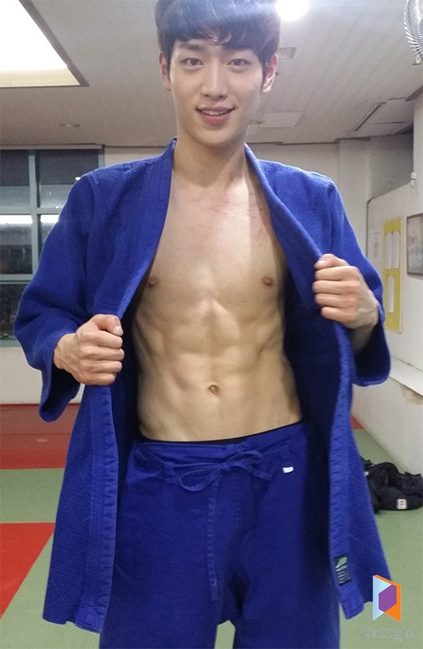

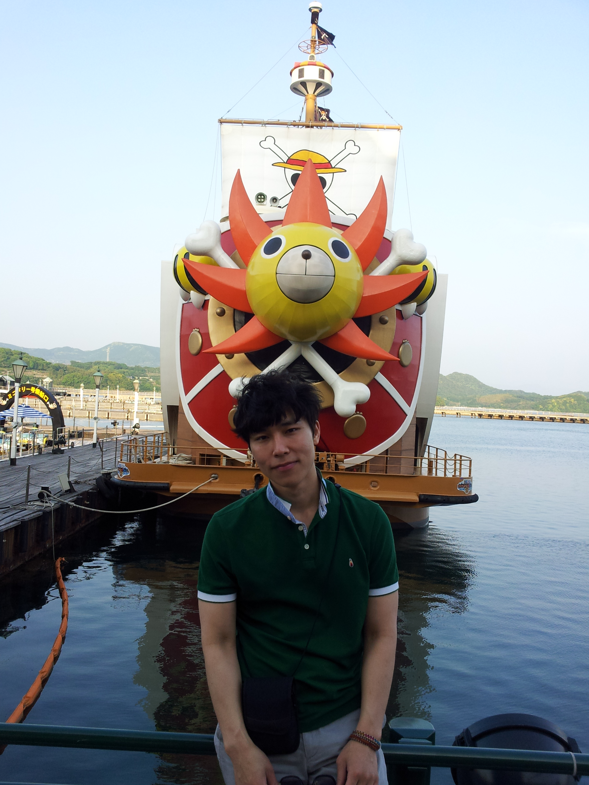

 [비전보드 만드는법](http://cafe.naver.com/switchman/5124)

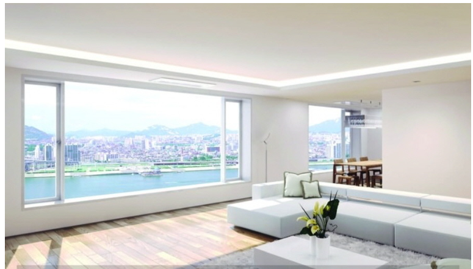

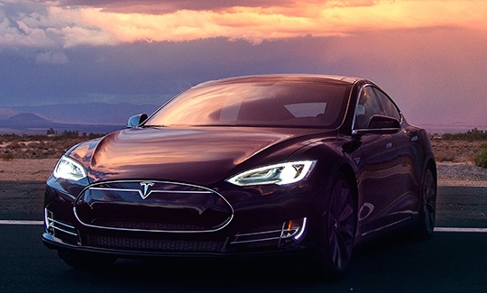

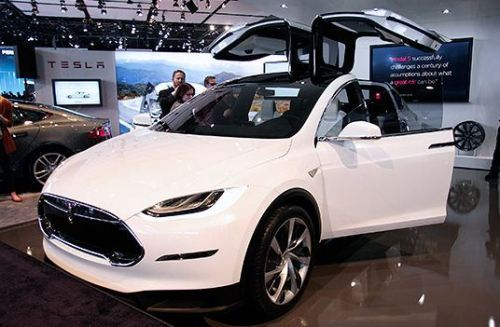

[Matt bomer](https://www.google.co.kr/search?q=matt+bomer&amp;newwindow=1&amp;biw=1366&amp;bih=621&amp;source=lnms&amp;tbm=isch&amp;sa=X&amp;ei=5gt2VK-QDOLAmwX9i4CYCQ&amp;ved=0CAYQ_AUoAQ#imgdii=_)

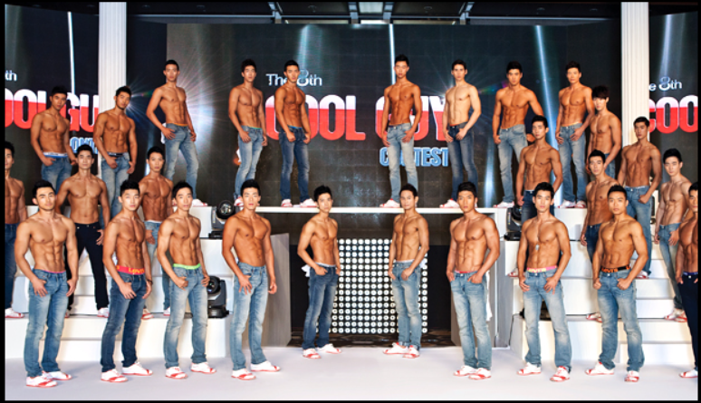

[
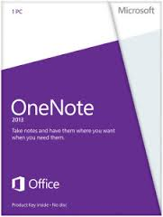
](http://www.google.co.kr/url?sa=i&amp;rct=j&amp;q=&amp;esrc=s&amp;source=images&amp;cd=&amp;cad=rja&amp;uact=8&amp;ved=0CAcQjRw&amp;url=http%3A%2F%2Fwww.microsoftstore.com%2Fstore%2Fmsusa%2Fen_US%2Fpdp%2FOneNote-2013%2FproductID.259322100&amp;ei=36q7VPa0D6LSmAWU9YKQCg&amp;bvm=bv.83829542,d.dGY&amp;psig=AFQjCNE2vCkXMWo6BIjC-UmxnYSH6c4FtQ&amp;ust=1421671509970457)

내 주변인의 삶의 평균이

나의 삶이다.

좇고, 끌어 올려라.

Smart Home EXPERT

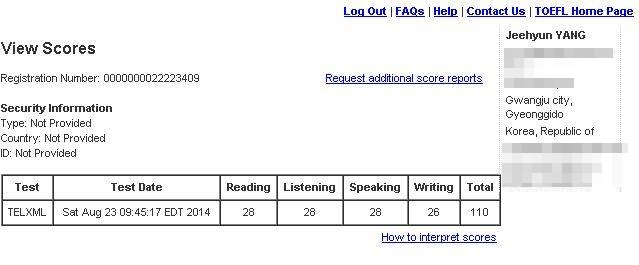

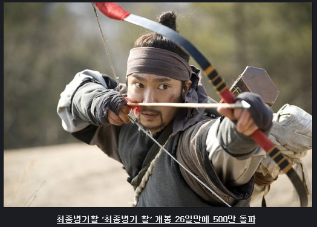

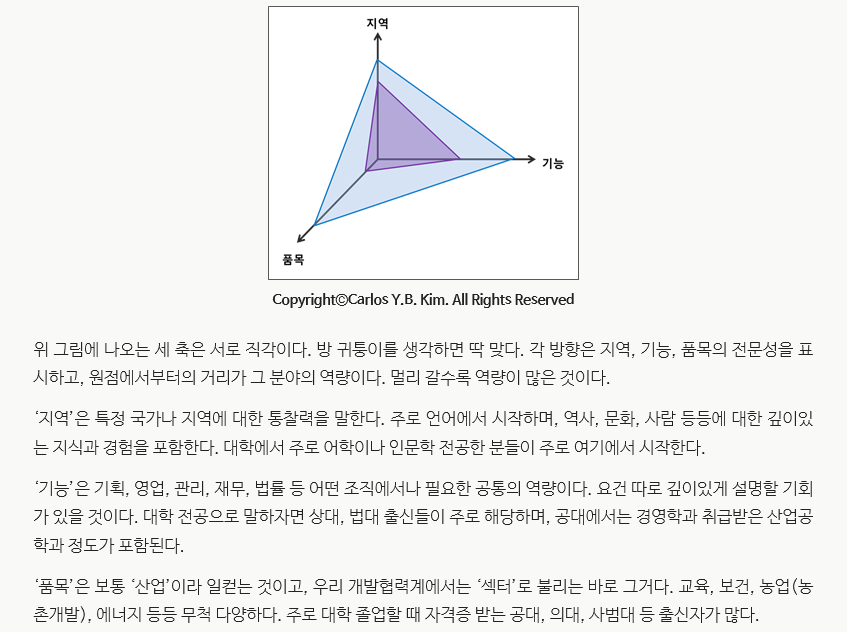

30대 - 안전판 → 굴기

  MBA 아니면 사내 스핀오프 벤처로 나가기

40대 - 재도약

50대 - VC &amp; 셔터맨

MBA/ 구글/ 방송인/ VC

봉사와 기부(봉사의 아웃소싱)

목표하는 분야의 롤모델을 찾아라

아침마다 긍정연상 - 몰디브 효과

긍정의 시각화 - 피그말리온

피드백과 연습

내가 인생에서 가장

사랑하는 것들을 떠올려라.

언어의 외연은 곧 사고의 외연이다.

모국어의 어휘를 다양하게 구사하라,

어휘의 확장은 개념의 확장,

제 2외국어를 배우는 것은

사고하는 방식의 확장이다.

무엇을 바라 사는가.

35세 창업.

재미 X 의미

강점 X 강점

글쓰기 X 비즈니스

노력 X 혁신 : 필살기

Phases 1. 오왕

Phases 2. Insight

Phases 3. Growth hacker X Data science : 구글 애널리틱스, R, 하둡 + 미디어/ 중국 전문가

Map of my life

인생의 지도나 스케쥴 도식/그래프 그려보기. 끝까지.

어디서 어떤 모습으로 어떻게 죽고싶은지

인생의롤모델들 Network에 저장하기 - 갭이어, 대기업 - 창업한 사람?

내 성공의 기준은 무엇인가?

ㅇ 35세 이전에 안전판 만들기, 35세 전후로 건곤일척 승부걸기

31세 -

32세 - 결혼

33세

[
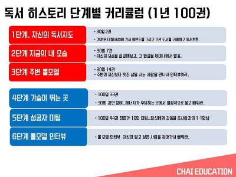
](http://cfile276.uf.daum.net/image/233BFF3C54AA1722097BD2)

출처: &lt;[http://m.cafe.daum.net/wfwijs/ETUc/8](http://m.cafe.daum.net/wfwijs/ETUc/8)&gt;

ㅇ 갈망하고 열망하고, 잠을 못이루게 하는 것, 간절한 것 이외에는 깡그리 쓸어버려라.

    절대적으로, 이미 이뤄진 것처럼 감사하고, 당연히 이뤄질 현실처럼 행동해라. 생생하게 상상하라

    좋은기분을 유지하는것이 중요하다, 그것이 성공의 엑셀레이터다.

ㅇ 비전보드의 모든 내용을, 내가 소유할 것이 아니라. 내가 세상에 뿌려놓을 것 중심으로 짠다.
