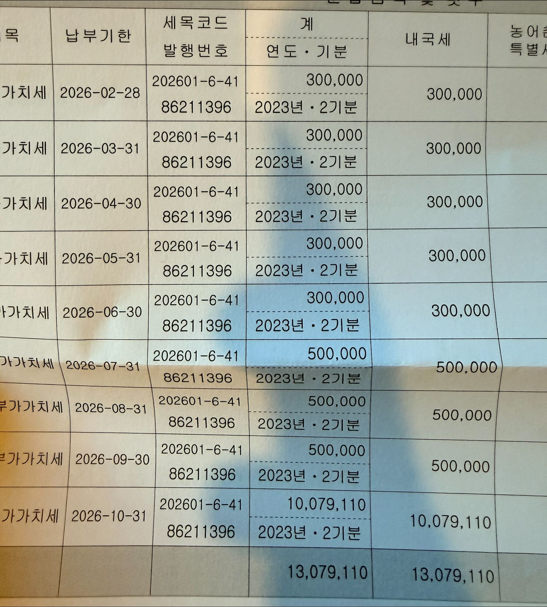

e편한세상 부가세 환수

2026년 2월부터 10월까지 매월 말일 납입

분할납부 스케줄 (총 13,079,110원 / 9회)

- 기업 059-3993-5593-84-2

- [https://hometax.go.kr/websquare/websquare.html?w2xPath=/ui/pp/index_pp.xml&amp;tmIdx=42&amp;tm2lIdx=4201000000&amp;tm3lIdx=4201010000](https://hometax.go.kr/websquare/websquare.html?w2xPath=/ui/pp/index_pp.xml&amp;tmIdx=42&amp;tm2lIdx=4201000000&amp;tm3lIdx=4201010000)

회차
납부액
누적액
잔액

1
300,000
300,000
12,779,110

2
300,000
600,000
12,479,110

3
300,000
900,000
12,179,110

4
300,000
1,200,000
11,879,110

5
300,000
1,500,000
11,579,110

6
500,000
2,000,000
11,079,110

7
500,000
2,500,000
10,579,110

8
500,000
3,000,000
10,079,110

9
10,079,110
13,079,110
0

[https://claude.ai/chat/4b215380-3de1-4b82-ae5f-236aecf3839b](https://claude.ai/chat/4b215380-3de1-4b82-ae5f-236aecf3839b)

