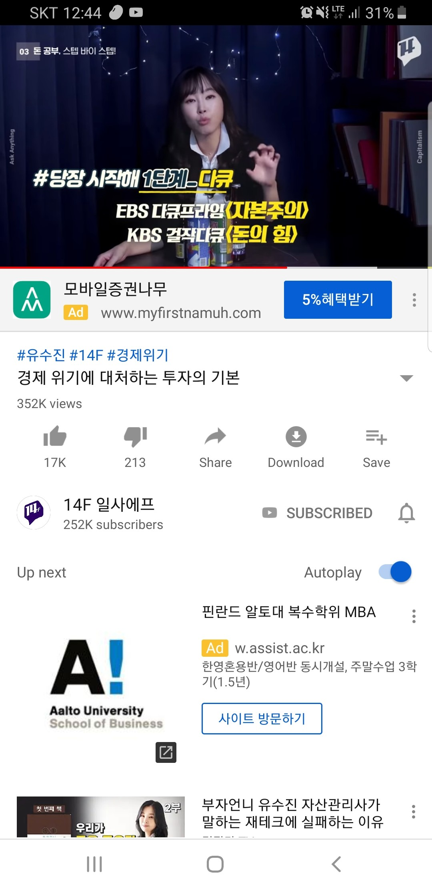

성취목표

LG이노텍
테슬라, 애플에 카메라 모듈 공급 중

Housing
3.0억원

주식
국내: 영웅문S, 해외: 영웅문 글로벌, SKT &amp; 스퀘어 주식: 하나

코인
업비트 &amp; 라인 LN코인: MEXC 거래소 - [https://www.mexc.com/ko-KR/assets/record](https://www.mexc.com/ko-KR/assets/record)

유동성 자산
기업은행 &amp; 국민은행

E편한세상시티 부평역
 - 분양권 17백 + 관리비 예치금 277천원

[중국생산자물가지수](https://m.blog.naver.com/gaajur/223115616470?utm_source=substack&amp;utm_medium=email) 종목은?

롯데케미칼, 금호석유?

Rich : 집마련 계획(보험, 저축)

수입의 3/1은 나, 3/1은 가까운 사람들, 3/1은 사회를 위해 사용

경제위기 대비: 자산 유동화

해법은 디지털 시스템 밖에 있는 금, 은, 예술품, 토지 그리고 개인 자산과 같이 경화(금화 은화)의 형태로 보유하는 것이다. 이들은 디지털 기록과 어떠한 계약에 의존하지 않는다.

전체 투자자산의 10%를 금으로 보유하고 토지는 자기집으로 시작하는 게 좋다. 미술품은 박물관에 전시됐거나 큐레이터가 관리하는 순수작품이어야 한다. 굳이 적절한 배분비율이 궁금하다면 이것도 알려줄 수 있다. 실물 금과 은 10%, 현금 30%, 부동산 20%, 아트펀드 5%, 엔젤투자 10%, 헤지펀드 5%, 채권 10%, 주식 10%.&#160;

다큐 자본주의, 돈의 힘

책 환율전쟁, 화폐전쟁

영화 국가부도의 날, 인사이드 잡, 빅숀트

한/미 [인버스 ETF](http://www.paxnet.co.kr/news/200030/stockView?vNewsSetId=&amp;articleId=2015082515024002142&amp;currentPageNo=62&amp;stockCode=200030&amp;objId=A2015082515024002142)

우량주나 토지를 사라. 장기적으로 가장많이 오른다.

스타트업에 투자하라 [https://www.wadiz.kr/web/winvest/startup?keyword=&amp;viewType=&amp;order=recommend](https://www.wadiz.kr/web/winvest/startup?keyword=&amp;viewType=&amp;order=recommend)

금에 투자하라. 레이 달리오.

집이나 건물을 사서 들어가라. 아현, 왕십리, 용산

내가 가진 자산들을 레버리지 할 방법, 자산들이 일하게 할 방법을 찾아라.

집 촬영장소로 대여: 아우어플레이스

[https://www.nextunicorn.kr/](https://www.nextunicorn.kr/)

ㅇ 아마존 셀러 FBA

2018년 12월까지 3억 모으기.

Gap closing 방법???

차를 하나 사야겠고, 당장 현금화 가능하도록 수익률 관리 필요 - 주식. 펀드 등

총 1억 8천 : 2017-11-06 오전 2:42에 DEAN KIM이(가) 수정

총 2억 4천 8백 : 2017-11-28 오전 2:42에 DEAN KIM이(가) 수정

총 4억 8천 9백 : 2017-12-21 오후 17:43에 DEAN KIM이(가) 수정

총 3억 4천 + : 2018-09-01 오후 18:28에 DEAN KIM이(가) 수정

2018-02-04 오후 08:52에 DEAN KIM이(가) 수정

안전지대 : 31.8천

28.5천 전세 보증금

3.3천 기업은행

 - 1.56천 주택청약

 - 1.3천 목적통장

 - 0.5천 채권/RP

0.9천 : 카카오

0.4천 : 현대차

*부채 : 회사 전세자금대출 3천

비트코인 : 22천

5천 빗썸 이오스 ▶ 17백

1.5천(2.5천) : 코빗 BCH ▶ 3백

13천(13천) : 업비트 비트, 에이다, 스텔라, 스테이터스 ▶ 5.8천

===============================

1천 : 원룸 보증금

4천: 준일이 생활비

9백 : 준일이

140만 : 호수

2.4천 : 엄빠 인테리어비

2백 : 아빠 임플란트

위안화 50만원 환전 타이밍

2G폰 가입

- 재무설계 받기

가장 중요한 자산은 나 자신이고

가장 중요한 투자는 스스로를 가르치는 일이다.

가장 심각한 손실은 건강을 잃는 것이며,

매주 투자서적 1권 읽기

05 INVESTMENT : 富와 悳

창업 커뮤니티 [http://www.primer.kr/](http://www.primer.kr/)

플랫폼과 빅데이터 큐레이션 코즈마케팅(착한 소비;기부프로모션)

ELS

생계형 저축

실손보험

00

01 부동산

02 주식/원자재

03

부자아빠세미나

연망정산/

소득공제

펀드닥터

[http://www.edaily.co.kr/news/NewsRead.edy?SCD=JA21&amp;newsid=02000806602746928&amp;DCD=A00102&amp;OutLnkChk=Y](http://www.edaily.co.kr/news/NewsRead.edy?SCD=JA21&amp;newsid=02000806602746928&amp;DCD=A00102&amp;OutLnkChk=Y)

&#160;

[http://www.emetro.co.kr/news/newsview?newscd=2014022500128](http://www.emetro.co.kr/news/newsview?newscd=2014022500128)

&#160;

금융상품 설계에 따라 원금보장이 가능한 다양한 상품이 있지.

님 기호에 맞춰서 하삼.

&#160;

달러 강세 예상되면 달러 기초자산으로 하는 원금보장 dls, 유럽쪽 유망하다고 생각하면 유럽 특정 기업 및 독일/프랑스/영국 지수 등을 기초자산으로 하는 원금보장 etf, elb 알아봐 증권사에. 은행에도 문의 가능

&#160;

나도 증권사 리테일이 아니니 각각의 상품에 대해서는 몰라.

&#160;

앞서 언급한 두 가지는 작년부터 유망했던 상품들이고 각각의 증권/은행에서 추천하는 상품을 알아보렴, (펀드인인가? 뭐 이런 사이트들 보면 나와 있음)

&#160;

[http://finance.naver.com/news/news_read.nhn?article_id=0002531245&amp;office_id=112&amp;mode=LSS2D&amp;type=0&amp;section_id=101&amp;section_id2=258&amp;section_id3=&amp;date=20140225&amp;page=1](http://finance.naver.com/news/news_read.nhn?article_id=0002531245&amp;office_id=112&amp;mode=LSS2D&amp;type=0&amp;section_id=101&amp;section_id2=258&amp;section_id3=&amp;date=20140225&amp;page=1)

&#160;

주식은 이렇게 해야하는거야...

개인이 이길 수 없음. 하루종일 붙잡고 있지 않으면 ㅋ

[http://finance.naver.com/news/news_read.nhn?article_id=0002937741&amp;office_id=018&amp;mode=LSS2D&amp;type=0&amp;section_id=101&amp;section_id2=258&amp;section_id3=&amp;date=20140226&amp;page=10](http://finance.naver.com/news/news_read.nhn?article_id=0002937741&amp;office_id=018&amp;mode=LSS2D&amp;type=0&amp;section_id=101&amp;section_id2=258&amp;section_id3=&amp;date=20140226&amp;page=10)

준영이 참고해라

&#160;

[http://finance.naver.com/news/news_read.nhn?article_id=0002937702&amp;office_id=018&amp;mode=LSS2D&amp;type=0&amp;section_id=101&amp;section_id2=258&amp;section_id3=&amp;date=20140226&amp;page=13](http://finance.naver.com/news/news_read.nhn?article_id=0002937702&amp;office_id=018&amp;mode=LSS2D&amp;type=0&amp;section_id=101&amp;section_id2=258&amp;section_id3=&amp;date=20140226&amp;page=13)

준영이 참고해라

[https://www.airbnb.co.kr/rooms/1521616/edit?section=details#](https://www.airbnb.co.kr/rooms/1521616/edit?section=details#)

여행. 결혼자금. 차량구입. 주택자금. 학자금. 창업 등

모든 재정지출에는 목표수준을 설정하고

남으면 저축한다. Ex 사교육비 절약통장

결국

내가 소유했다고 생각한 것들이

사실은 나를 소유한다.

굳이 차, 시계, 옷 따위로 표현하기에는

내 에고는 그렇게 저렴하지 않으니까.

만큼 당신의 자아는 무채색인가

소비하기 위해 스스로를 소비하는 것을 멈추라.

차, 시계, 옷 따위로

수식할 수 있을 정도로 너의 에고가

값싼 것인지 숙고하라.

(차, 시계, 옷 따위로 돋보이게 하기엔, 내 에고는 이미 너무 비싸니깐)

인생에대한 실험적 자세를 견지한다

누구나 돈이면 살 수 있는 것을

굳이 너 까지 욕심낼 필요가 있나?

남과 비슷해지기 위해 함부로 돈을 쓰지 마라.

멍청한 짓이다.

돈으로는 살 수 없는 것들에 집중해라.

급여통장

지출통장

차량구매(주식)

여행통장(목적통장, 뭘 산다던지)
