Twilight Mood board

[https://www.ytn.co.kr/_ln/0104_201704131135438931](https://www.ytn.co.kr/_ln/0104_201704131135438931)

[Move Forward](https://www.instagram.com/reel/C8Y71lZRuvF/?igsh=MTJwZHFjOWttcW81dA==)  - Sam Altman

[부의](https://www.instagram.com/reel/C3j55KJPA4H/?igsh=MXF1aThibWd1NWUyZw==) 갓길 차선

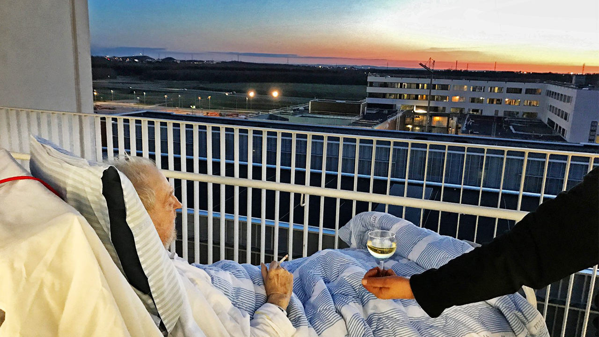

고통은 두개골 속에 갇혀 있는 뇌가 자기 맘대로 외쳐대는 반응일 뿐이다.

세상의 것이 아니다.3인칭으로 스스로를 바라보고, 2인칭으로 도전/추동하라

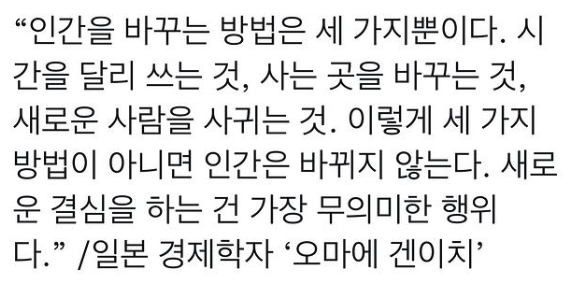

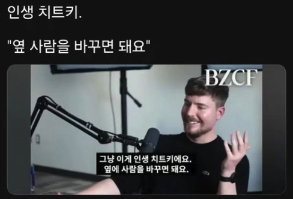

마이크가 꾸준함을 유지해온 방법은 이랬어요.

-
매일 예술 작품을 만들도록 강제하기.

- 엉덩이를 붙이고 있는 것이 가장 어려워서 이를 강제했어요. 나중에는 이 덕분에 사람들에게도 알려지게 되었어요.

-
지루함을 피하기 위해 계속해서 기술을 확장했어요.&#160;

- 연필 그림에서 3D 렌더링으로 발전했습니다.

-
매일 포스팅하기

- 트렌드와 시대정신에 맞는 작품을 만들 수 있었고 공감을 살 수 있었어요.

-
작품을 만들수록 쉬워졌어요.

- 작품을 만들 때마다 향상된 실력과 시스템, 프리셋, 템플릿들 덕분에 훨씬 더 빠르고 쉽게 만들 수 있었어요.

출처: &lt;[https://eopla.net/magazines/20543#](https://eopla.net/magazines/20543#)&gt;

처음부터 완벽한 아이디어는 없어요. 그냥 시작하세요. 그리고 포기하지 마세요.

출처: &lt;[https://eopla.net/magazines/20543#](https://eopla.net/magazines/20543#)&gt;

 (1998)" width="480" height="426.5" src="../../../../attachments/onenote/a05a7082c4.png" data-src-type="image/png" data-fullres-src="../../../../attachments/onenote/a05a7082c4.png" data-fullres-src-type="image/png" />

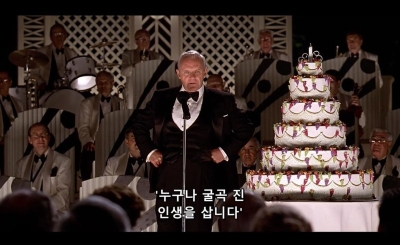

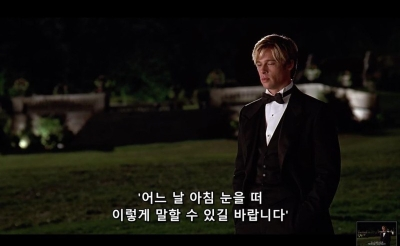

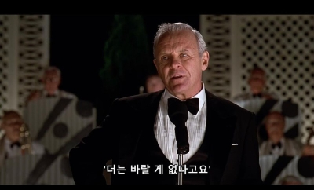

- 만약 다음 5년 동안 아무것도 변하지 않는다면, 당신의 평범한 화요일은 어떤 모습일까? 어디서 깨어나는가? 몸 상태는 어떠한가? 아침에 눈을 뜨자마자 드는 생각은 무엇인가? 주변엔 누가 있는가? 오전 9시부터 오후 6시까지 당신은 무엇을 하는가? 밤 10시의 기분은 어떠한가?

- 위 상황을 10년으로 확장하라. 당신은 무엇을 놓쳤는가? 어떤 기회가 영영 사라졌는가? 누가 당신을 포기했는가? 당신이 없는 자리에서 사람들은 당신을 어떻게 평가하는가?

- 당신은 인생의 끝자락에 서 있다. 안전한 버전의 삶만 살았고 패턴을 한 번도 깨지 못했다. 그 대가는 무엇인가? 한 번도 느껴보지 못하고, 시도하지 못하고, 되지 못한 당신의 모습은 무엇인가?

- 주변 인물 중 당신이 방금 묘사한 비참한 미래를 이미 살고 있는 사람은 누구인가? 당신보다 5년, 10년, 20년 앞선 궤적을 걷는 그들을 보며 어떤 기분이 드는가? 당신도 그들처럼 된다는 사실을 상상하면 어떤 기분인가?

- 실제로 변화하기 위해 당신이 버려야 할 정체성은 무엇인가? (&quot;나는 ~한 사람이다&quot;라는 정의)

- 그 정체성을 버릴 때 따르는 사회적 비용은 얼마인가?

- 당신이 지금까지 변하지 못한 가장 창피한 진짜 이유는 무엇인가? 합리적인 이유가 아니라 당신을 약하고, 겁쟁이며, 게으르게 보이게 만드는 그 진실은 무엇인가?

- 만약 현재의 행동이 일종의 자기보호 수단이라면, 당신은 구체적으로 무엇을 보호하고 있는가? 그리고 그 보호의 대가로 당신은 무엇을 지불하고 있는가?

- [https://m.blog.naver.com/bizucafe/224152448230?fbclid=PAdGRleAPdnmVleHRuA2FlbQExAHNydGMGYXBwX2lkDzEyNDAyNDU3NDI4NzQxNAABpyeXvvEecY4RnwkRP6vPvM-VjdmAMg_9y3-0rpvAdAOjjUxoAOfsMIEYivSj_aem_o46mw8y-JDIrAJ4Ihch-Sw](https://m.blog.naver.com/bizucafe/224152448230?fbclid=PAdGRleAPdnmVleHRuA2FlbQExAHNydGMGYXBwX2lkDzEyNDAyNDU3NDI4NzQxNAABpyeXvvEecY4RnwkRP6vPvM-VjdmAMg_9y3-0rpvAdAOjjUxoAOfsMIEYivSj_aem_o46mw8y-JDIrAJ4Ihch-Sw)

출처: &lt;[https://eopla.net/magazines/20543#](https://eopla.net/magazines/20543#)&gt;

출처: &lt;[https://eopla.net/magazines/20543#](https://eopla.net/magazines/20543#)&gt;

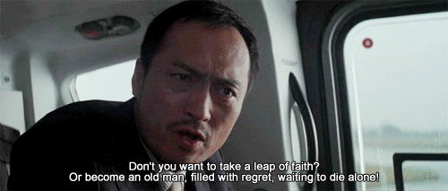

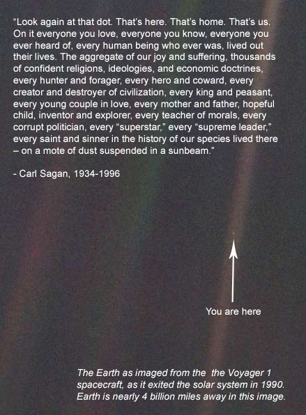

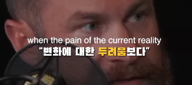
[
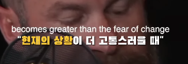
](https://www.instagram.com/reel/C-FMoYkR2yn/?igsh=MTBxNnJkeWU1Ymg0Mw%3D%3D)[
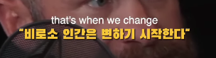
](https://www.instagram.com/reel/C-FMoYkR2yn/?igsh=MTBxNnJkeWU1Ymg0Mw%3D%3D)

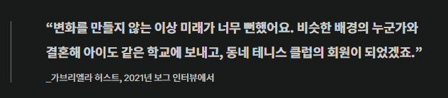

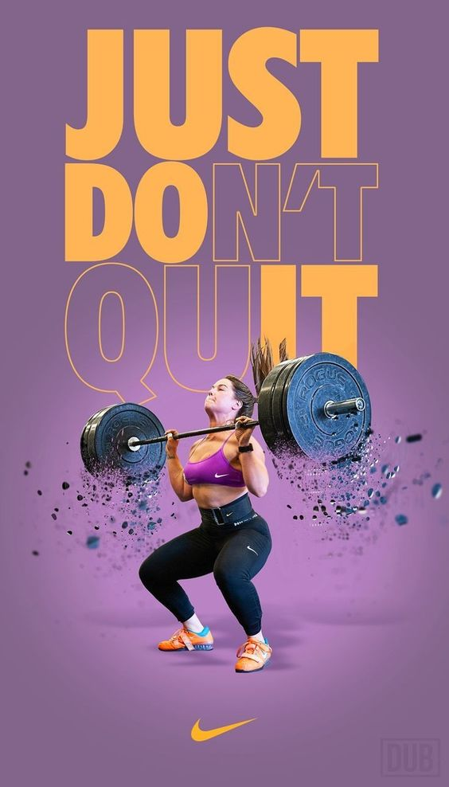

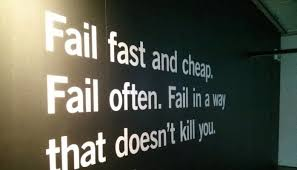

Necessity is the mother of invention

[https://www.instagram.com/reel/DGZljqeTIg8/?igsh=MWJrbDlwdXlsNXZ4Mg==](https://www.instagram.com/reel/DGZljqeTIg8/?igsh=MWJrbDlwdXlsNXZ4Mg==)

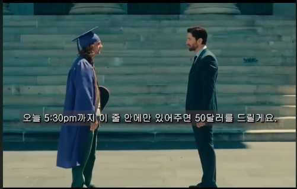

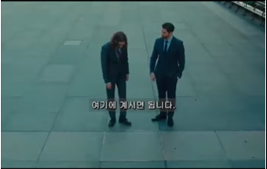

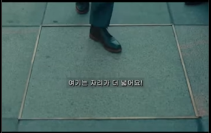

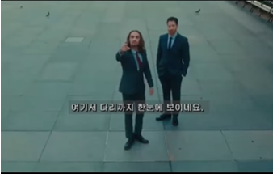

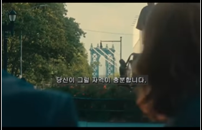

아무 것도 하지 않은 대가 역시 치르게 될 것이다.

망해봤자 잃는 건 넷플릭스 볼 수 있었던 주말 이틀 뿐

고정우 곽석영 이윤행을봐. 여기서 잘 되어봤자 지역팀 팀장이야 그걸 원해?

학교에 가라. 취업해라. 상처받아라. 피해자 노릇을 해라. 65세에 은퇴해라.

​

이것은 이미 실패가 예견된, 낡은 길이다. 더 지능적인 사람이 되기 위해 당신은 다음 과정을 따라야 한다.

​

- 남들이 정해준 알려진 길을 거부하라.

- 미지의 영역으로 과감히 뛰어들어라.

- 마음을 확장하기 위해 새롭고 더 높은 목표를 세워라.

- 혼란을 기꺼이 받아들이고 성장을 허용하라.

- 자연의 보편적인 원리를 공부하라.

- 깊이 있는 제너럴리스트가 되어라.

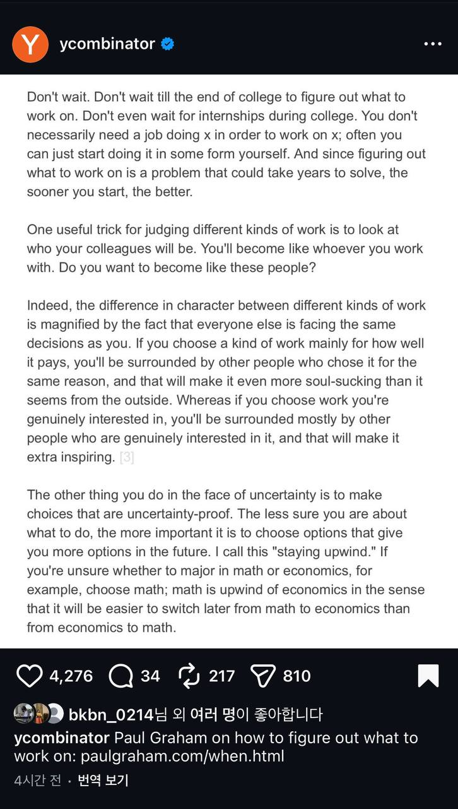

기다리지 마세요. 무엇을 할지 결정하기 위해 대학 졸업 때까지 기다리지 마세요. 대학 시절의 인턴십조차 기다리지 마세요. X라는 일을 하기 위해 반드시 X라는 직업을 가질 필요는 없습니다. 종종 스스로 어떤 형태로든 그 일을 바로 시작할 수 있습니다. 무엇을 할지 알아내는 것은 해결하는 데 몇 년이 걸릴 수도 있는 문제이기에, 빨리 시작할수록 좋습니다.”
