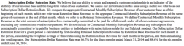
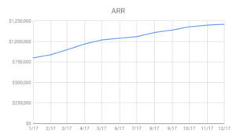
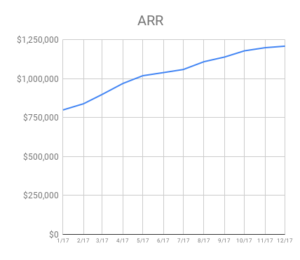
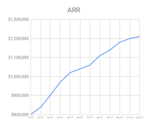
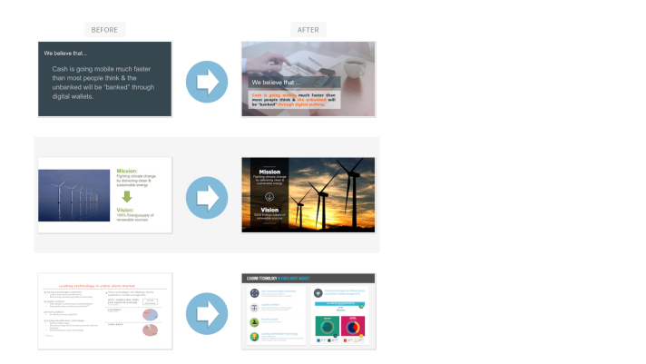
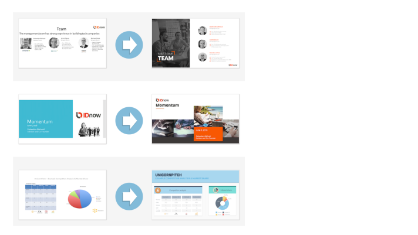
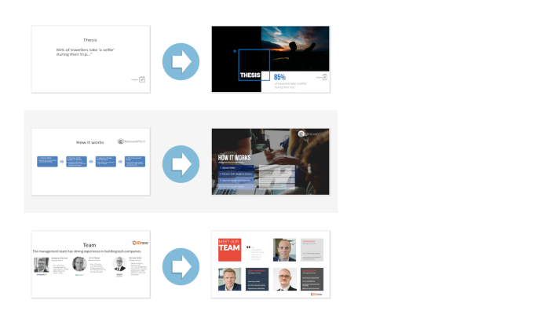
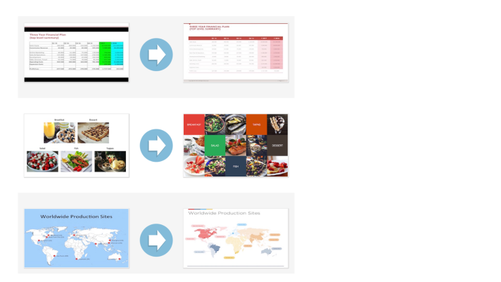
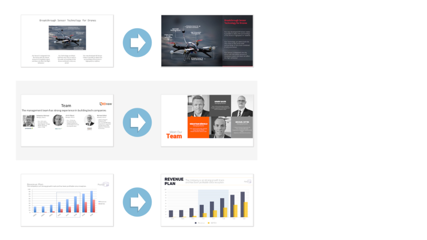
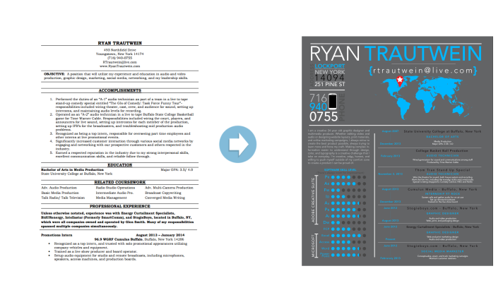

IR Pitch Deck

[https://www.cirrusinsight.com/blog/startup-pitch-decks](https://www.cirrusinsight.com/blog/startup-pitch-decks)

무적의 투자유치용 덱 작성법

[Editor&#39;s Note ](http://bridge.500startups.co.kr/%eb%ac%b4%ec%a0%81%ec%9d%98-%ed%88%ac%ec%9e%90%ec%9c%a0%ec%b9%98%ec%9a%a9-%eb%8d%b1-%ec%9e%91%ec%84%b1%eb%b2%95/)

좋은 투자유치용 덱을 만들기 위해 참고할만한 좋은 조언들은 충분히 많다. 500스타트업이 특히 사랑하는 저자 마크 수스터의 글이 대표적이다.온라인 상에 다양함 템플릿과 실제 실제 스타트업의 투자유치용 덱 자료 모음집들(https://attach.io/startup-pitch-decks/)도 있다. 이 글의 저자인 잔즈는 이런 자료들을 한 번쯤 시간 내어 읽어볼 것을 추천한다. 이 글에서는 그간 많이 다뤄지지 않은 세부적인 내용을 설명한다. 투자유치용 덱에서 숫자, 도표, 그리고 추정치를 제시할때 고려해야할 요소들을 다루고 있다. 간략하고 명료한 내용이므로 실행에 옮기기 그리 어렵진 않을 것으로 예상한다. 탄탄한 투자유치용 덱으로 무장하고 전쟁터에 나가길 바라는 마음에 이 글을 소개한다.

&lt;style type=&quot;text/css&quot;&gt; .wpb_animate_when_almost_visible { opacity: 1; }&lt;/style&gt;

납득할만한 바텀업 방식의 총 유효시장(TAM) 추정 제시

대부분의 투자유치용 덱에는 회사의 총 유효시장(TAM)에 대한 추정치가 포함된다. 하지만 일부 회사들은 가끔 허무맹랑한 숫자를 제시하는데, 이는 구체적인 수치가 없기 때문이다.

예를 들어, 미국내 의사들을 위한 실습 관리 소프트웨어 시장의 규모를 추산하면서 투자자에게 “헬스케어 소프트웨어 산업이 100억 달러 규모의 시장”이라고 한다면 “중국의 1% 수준”이라고 말하는 것보다는 낫다. 하지만 그렇다고 유의미한 수치로 보기도 어렵다. 하지만 당신이 미국에 대략 23만 명의 내과의사가 있고 &#160;단위당 매출(ARPA)이 500달러므로 총 유효시장(TAM)은 14억 달러 정도의 규모라고 설명한다면 훨씬 신빙성 있다. 물론, 이후 회사가 어떻게 새로운 분야를 개척하고 지불금액을 키워 총 유효시장을 키울 것인지 설명하는 것도 좋다.

총 유효시장에 대한 추정치를 제시하는 과정에서 바텀업 방식의 추산 방식을 택하는 것이 어디선가 검색해서 얻은 자료를 제시하는 탑다운 방식보다 낫다. 마켓플레이스를 만드는 회사라면 시장 규모를 제시할 때 총 거래규모(GMV)인지 그 중 일부분인지를 명확히 밝혀야 한다.

업종마다, 마켓플레이스 유형마다 차이도 크다. 마켓플레이스 전문가가 작성한 [마켓플레이스 수익화 전략](https://medium.com/point-nine-news/10-marketplace-monetisation-strategies-7d2371afd7d5https:/medium.com/point-nine-news/10-marketplace-monetisation-strategies-7d2371afd7d5)에 관한 글을 참고하기 바란다. 진입하려는 시장에 소프트웨어와 서비스가 섞여있다면 각각 지출 규모는 어느 정도인지 구분해 파악해야 한다. 제품에 따라 (전체 시장 규모가 감소 추세더라도) 소프트웨어 부문 시장은 성장한다고 얘기해도 충분히 설득력이 있을 수 있다.

이것이 왜 중요한가?

초기 시장의 규모는 투자자들이 매우 중요시하는 점이다. 그렇다고 모든 투자자가 규모가 큰 초기 시장에만 투자한다는 얘긴 아니다. 어떤 회사는 작은 시장에 침투해 총 유효시장을 확장한다. 또 새로운 시장을 개척하는 경우에는 숫자를 제시하기 어려울 때도 있다. 총 유효시장은 투자자들이 투자 기회를 평가할 때 검토하는 수 많은 지표 중 하나다. 하지만 매우 중요한 것은 사실이므로 듣는 이가 명확하게 감을 잡을 수 있도록 전달하는데 신경을 써야 한다.

&#160;

쉽게 검증할 수 있도록 추정치와 주장을 제시

투자유치용 덱에서 가령 총 유효시장 규모를 외부 시장조사 업체 자료에서 인용했다면 항상 그 출처를 밝혀라. 그외에 슬라이드에 포함한 모든 수치 등 덱에 포함한 내용은 근거를 명시해야 한다. 외부 자료나 분석은 원본 출처 링크를 포함시켜야 한다. 박사 학위 논문에 버금갈 만큼 한 줄 한 줄 참고 문헌이나 주석을 달라는 얘기는 아니지만, 외부 자료를 인용할 때는 그만큼 근거를 명확히 보여줘야 한다는 얘기다.

벤처투자자들은 매달 수 백 개의 덱을 살펴보는데, 상당수는 꽤나 강력한 주장이나 가설을 담고 있다. 투자자를 설득해 투자를 유치하려면 주장에 대한 근거를 제시해야 하는 것은 당연하다. 예를 들어, 당신의 소프트웨어가 기존 제품들보다 ‘20% 더 효과적’이라고 주장한다면 그 근거가 무엇인지 궁금해할 것이다. ‘효과적’이라 것을 어떻게 정의하고 측정했는지, 비교 대상은 무엇인지 등 말이다. 지나치게 깐깐하다고 불만스러울 수도 있다. 하지만 고객생애가치(LTV) 대비 고객획득비용(CAC)의 비율이 1:5라고 주장하려면 당연히 어떻게 이를 계산하고 추정했는지, 그리고 어떤 소비자 코호트를 분석했는지 설명이 필요하다. &#160;

특수한 주장에는 그에 맞는 특수한 근거가 필요하다. -칼 세이건(미국의 천문학자이자 ‘코스모스’의 저자)

그렇다고 투자자가 그 자리에서 모든 자료를 꼼꼼히 읽는 것은 아니다. 하지만 당신의 주장에 대한 근거를 명확하게 제시하고, 자료를 검토할 기회를 준다면 장기적인 관점에서 신뢰를 쌓는데 도움이 될 것은 분명하다. 당신의 주장이 강력할수록 전달하는 근거도 강력해야 한다.

애매모호함을 피하라

당신이 사용하는 지표에 널리 통용되거나 합의된 정의가 없다면 스스로 정의하고 덱에 포함시켜라. 가령 당신이 소비자 대상 웹 서비스를 운영하는데 “반복 비율이 80%”라고 주장했다고 가정해보자. 추가적인 설명이 없다면 이는 유의미한 정보가 아니다. 방문자의 80%가 재방문 사용자라는 의미인가? 사용자의 80%가 재방문한다는 의미인가? 이 경우에 시간 간격은 어떤가? 유사한 맥락에서 이탈율에 대해 이야기할 때 가입 취소(logo churn)인지 구매 취소(dollar churn)인지를 구분해야 하며, 후자의 경우에도 총 취소액인지 순 취소액인지 등을 명시해야 한다.

월별반복매출(MRR) 혹은 이자및세전이익(EBIT) 등 명확히 정의된 개념은 투자자가 이해하기 쉽다. 하지만 애매한 경우 정확한 정의를 짚어주는 것이 좋다. 실제로 공기업들이 재무제표 혹은 미국 증권거래위원회(SEC) 제출자료에서 GAAP(미국 회계기준) 지표를 따르지 않는 경우를 얼마나 철저하게 구분하는지를 보라. 관련 주제에 대해 더 알고 싶다면 [SaaS 회사들이 이탈(구매 취소)을 정의하는 다양한 방법에 대한 글](http://christophjanz.blogspot.com/2017/12/how-public-saas-companies-report-churn.html)을 참고하라.

공기업들은 정확한 지표를 사용하는 것이 생존의 여부와 직결되는 중요한 문제다. 부정확한 재무정보 전달은 법적인 문제가 될 수 있고, 크게는 주주 소송으로까지 이어질 수 있는 매우 민감한 사안이다. 따라서 재무 및 법무팀에서는 혹시 모를 분쟁을 피하기 위해서라도 최대한 상세하게 문서를 준비한다.

허브스팟(Hubspot)이 정의한 유지율에 대한 내용. 회사의 IPO 투자설명서 발췌

초기 단계 창업자라면 부정확한 회계 보고 때문에 송사에 휘말리거나 감옥에 가는 일까지는 우려하지 않아도 된다. 다만 명확하지 않은 지표를 두고 얘기하면 투자자와 소통이 어렵고, 회사에 대한 이해를 더욱 어렵게 만든다.

도표로 속이려 하지마라

위의 아름다운 일러스트를 그려준 게코보드 팀에 감사드린다.

통계를 가지고 속이는 방법은 다양하다. 심지어 ‘통계로 거짓말하기’라는 책도 있다. 도표도 마찬가지다. 게다가 이는 단순한 거짓말이 아니라, 조금의 창의력을 보태면 같은 자료를 가지고도 전혀 다른 메시지를 도출할 수 있다. 연 매출 곡선이 원하는만큼 가파르게 그려지지 않는다면? X축을 압축하고 Y축을 늘리면 된다. 아직도 충분히 가파르지 않다면? Y축의 일부를 잘라내면 된다. 아니면 월별 가입자 수 그래프가 별로라면? 누적 가입자 수로 대체하라. &#160;

도표를 가공하기전 실제 연 매출(ARR) 자료

같은 도표에 X축을 압축했을 경우

같은 도표에 Y축 일부를 잘라낸 경우

실제로 회사의 숫자보다 더 좋아보이게 만드는 방법은 많다. 필자의 조언은 이렇다. 숫자를 좋아보이게 만드는 건 괜찮지만, 과도하면 안된다. 6개월 치 자료를 보여줄 때는 도표를 와이드스크린 형태에 채울 필요는 없다. 피벗 전 매출 수치가 적절하지 않다면 피벗 후 수치로 시작하는 도표로 대체하라. 평균 이탈률이 회사의 단골 고객군의 낮은 이탈률을 덮어버린다면, 별도의 도표를 통해 단골 소비자의 이탈률을 개별적으로 제시하면 좋다. 하지만 언제나 합리적인 수준에서 해야 하며, 투자자가 가공되지 않은 원본 자료를 요구할 수 있다는 점도 명심하라.

밴처캐피탈은 대부분 숫자를 파헤치는데 통달한 사람들이며 허무맹랑한 자료를 식별해내는 정교한 ‘안테나’를 가지고 있다. 그들은 매일 액셀을 통해 1만 시간씩 투자유치용 덱을 검토하는 사람들임을 기억하라. 그러므로 숫자에 과한 상상력을 발휘해 이들을 속인다는 것은 매우 어려운 일이고, 이는 이들과 관계를 쌓는 데에도 도움이 되지 않는다.

[원문 링크](https://medium.com/point-nine-news/how-to-bulletproof-your-fundraising-deck-d18c0de6d93d)

Pitch deck

[https://yeonlab.com/pitchdeck/](https://yeonlab.com/pitchdeck/)

IR&#160;(Investor Relations)란, 투자자들을 대상으로 기업 설명 및 홍보 활동을 하여 투자 유치를 원활하게 하는 활동을 의미한다.

Pitch deck의 목적

영화의 trailers (미리보기/예고편) 처럼, 당신이 투자를 받기 위해 보여주는 비즈니스 모델의 teaser 와 유사하다.

- 최종적으로 fundraising을 통한 IR 목적이며

- 기관/투자자와의 investment interests fit을 어필하고

- 기본적인 관심 preliminary interest 유도하여

- 최우선적으로, 투자자와의 미팅을 하기 위해 만드는 짧은 발표이다.

당신의 그 부담스러움을 덜어주기 위해, 김도연 컨설턴트가 몇 개의 베스트 스타트업 피치덱을 가지고 왔다. 이 예시를 참고하면서, 이제는 엄청나게 거대해진 Facebook 이나 수백만 달러의 valuation 을 평가받는 회사들이 그 당시에 어떻게 회사를 어필하여 투자를 유치했는지 아이디어를 가질 수 있으리라 믿는다.

피치덱에 포함시켜야 할 내용은?

- 팀 구성

- 당신이 해결하고자 하는 문제(유저들이 겪고 있는 문제점)

- 당신만이 제공하는 문제 해결법(USP)

- 당신이 제공하는 문제 해결법이 고객들에게 중요한 이유(ROI)

- 기본 기술에 대한 설명 및 차별화된 IP

- 시장 규모([TAM](https://verticalplatform.kr/archives/5494))

- 경쟁구도

- 유닛 이코노믹

- 회사의 재정적 전망:&#160;최근 18 개월 동안 월별 소득 계산서와 향후 3~5년간 예상되는 소득 계산서(미래를 정확히 예측할 수는 없지만 어쨋든 향후 전망에 대한 정보를 제공하는 것은 매우 중요)

- 유저 메트릭 혹은 기업을 대상으로 하는 서비스 일 경우 주요 고객 및 파이프라인

- 목표로 잡고 있는 투자 유치 금액

- 수익금 사용

포함시키지 말아야 할 내용은?

- 곧 출시 예정인 기능에 대한 자세한 설명

- 고객에 대한 자세한 설명

- 연봉에 관한 정보

- 당신의 경쟁사 혹은 대중들에게 알리고 싶지 않은 정보들

Unicorn Pitch deck Sample

[https://www.cirrusinsight.com/blog/startup-pitch-decks](https://www.cirrusinsight.com/blog/startup-pitch-decks)

[buzzfeed-pitch-deck](https://www.slideshare.net/TechInAsiaID/buzzfeed-pitch-deck?ref=https://yeonlab.com/pitchdeck/)

[thrive-global-pitch-deck](https://www.slideshare.net/AlexanderJarvis/thrive-global-pitch-deck?ref=https://www.cirrusinsight.com/blog/startup-pitch-decks)

[youtube-pitch-deck](https://www.slideshare.net/AlexanderJarvis/youtube-pitch-deck?ref=https://www.cirrusinsight.com/blog/startup-pitch-decks)

[DanielleMorrill](https://www.slideshare.net/DanielleMorrill/mattermark-2nd-final-series-a-deck?ref=https://www.cirrusinsight.com/blog/startup-pitch-decks)

[crew-pitch-deck](https://www.slideshare.net/AlexanderJarvis/crew-pitch-deck-seriesa?ref=https://www.cirrusinsight.com/blog/startup-pitch-decks)

[wework-pitch-deck](https://www.slideshare.net/AlexanderJarvis/wework-pitch-deck-55170129?ref=https://www.cirrusinsight.com/blog/startup-pitch-decks) D

