Singapore Biz trip

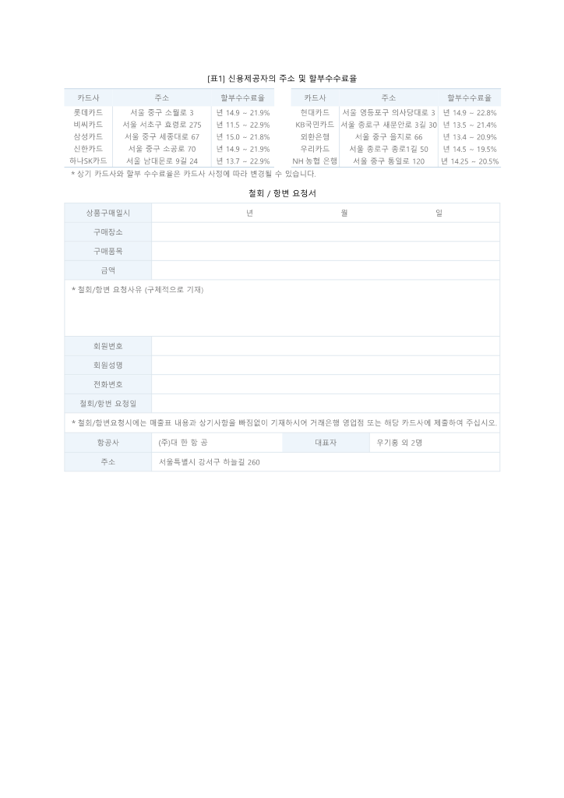

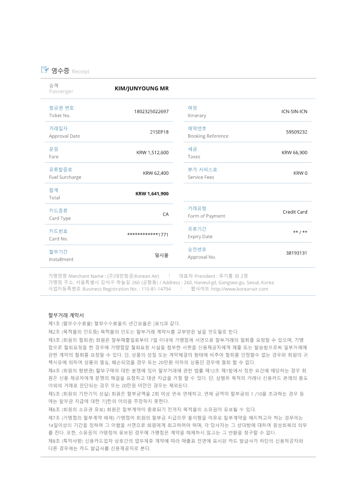

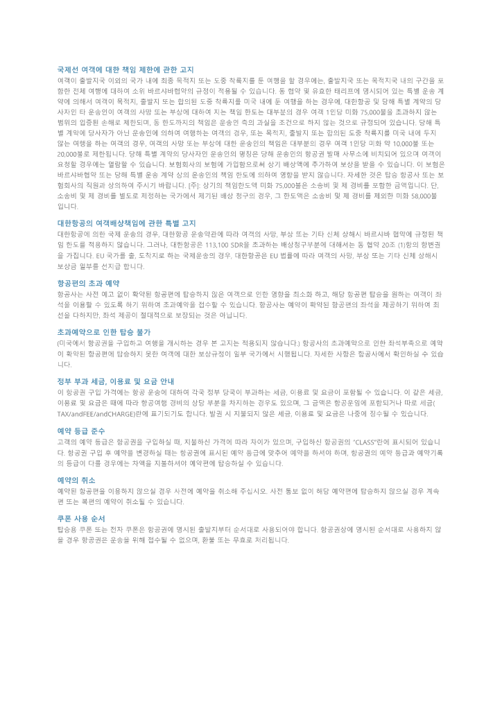

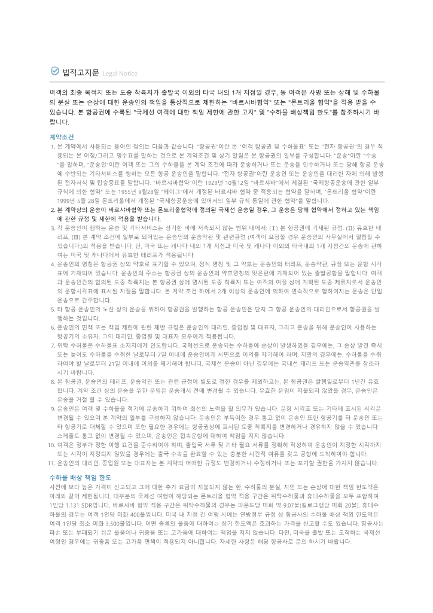

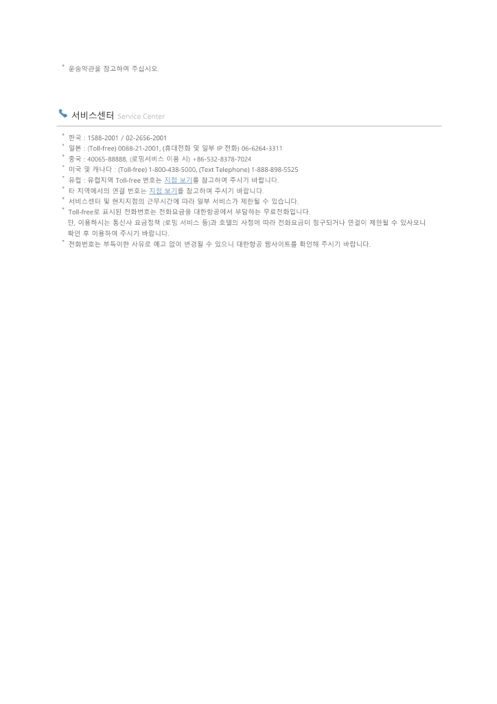

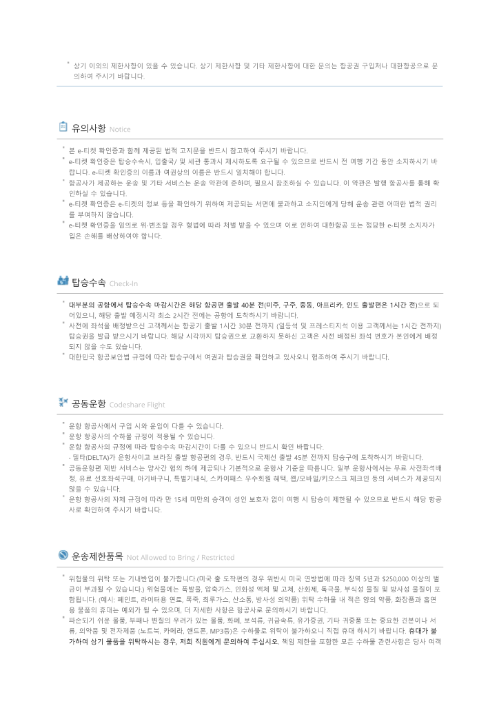

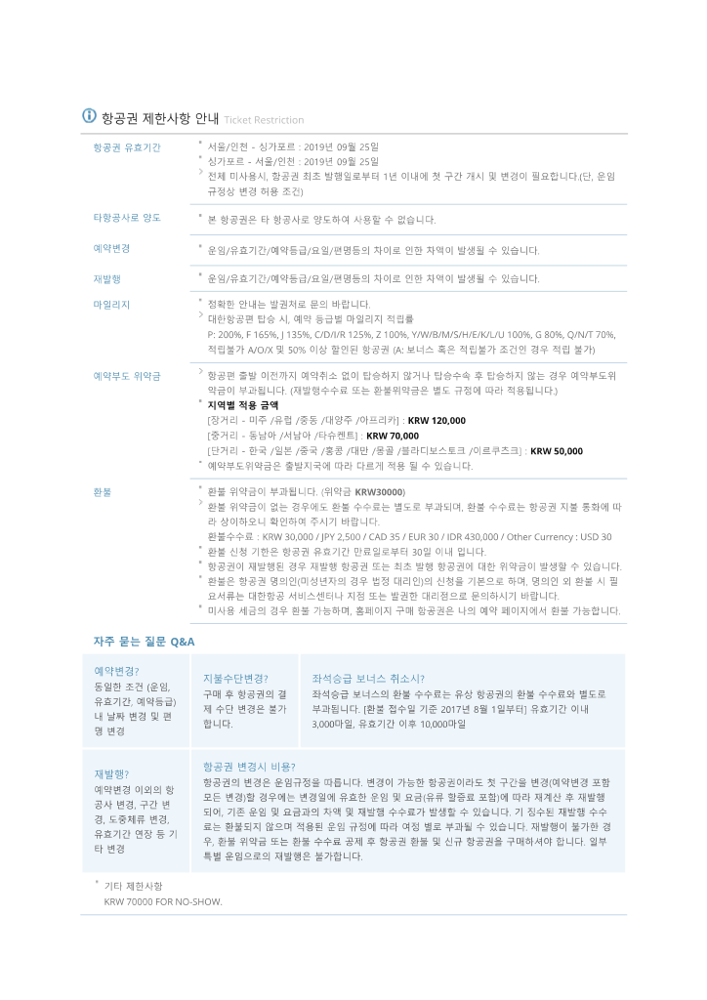

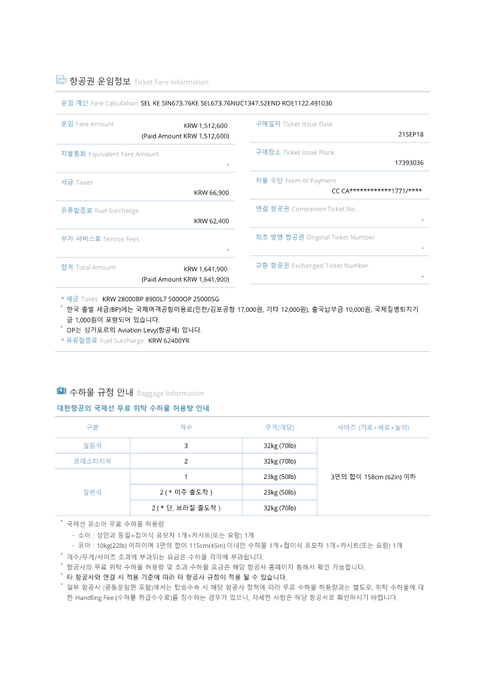

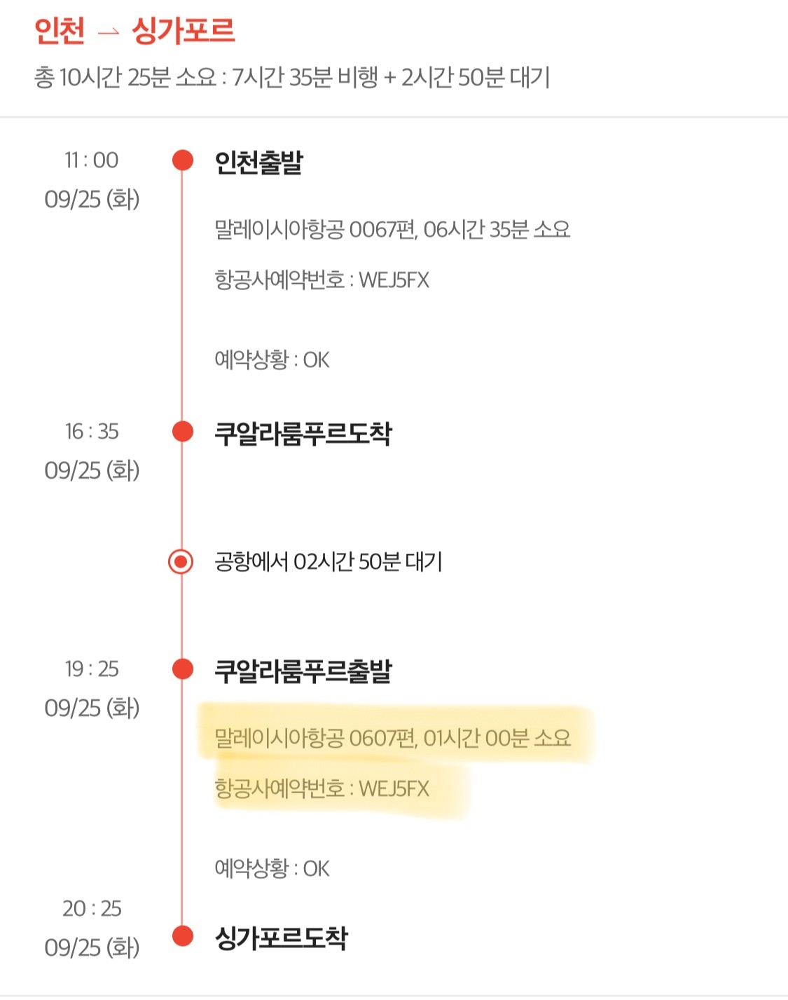

Hotel

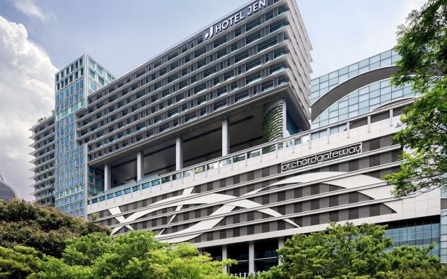

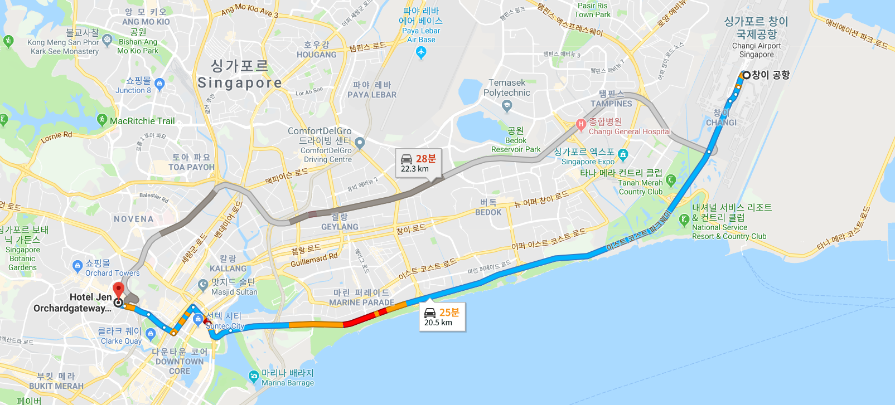

- 예약 번호:&#160;1246270532 │ PIN코드:&#160;1684&#160;

Hotel Jen Orchardgateway Singapore 新加坡乌节门今旅酒店

277 Orchard Road #10-01, Orchard, 싱가포르, 238858, Singapore 전화:&#160;+65 6831 4333

디럭스 킹룸 - 고객:&#160;KIM JUNYOUNG,Han songhee

체크인
2018년 9월 25일 (화)&#160;(14:00부터)

체크아웃
2018년 9월 29일 (토)&#160;(12:00까지)

요금

(투숙객 1명)

예상 요금&#160;₩964,598

S$&#160;1,180

세금&#160;&#160;(7.00%)
₩74,274

숙소 서비스 요금&#160;&#160;(10.00%)
₩96,460

최종 결제 금액

(세금 포함)

예상 요금&#160;&#160;₩1,135,332

SGD&#160;통화로1,388.86의 금액이 결제됩니다.

[https://m.blog.naver.com/PostView.nhn?blogId=rar24&amp;logNo=220476068837&amp;proxyReferer=https%3A%2F%2Fwww.google.co.kr%2F](https://m.blog.naver.com/PostView.nhn?blogId=rar24&amp;logNo=220476068837&amp;proxyReferer=https%3A%2F%2Fwww.google.co.kr%2Fhttps://raycat.net/3943)https://raycat.net/3943

조식은 19층 라운지와 10층 양쪽에서 다 가능했는데 음식은 비슷하고 19층이 덜 붐빌거라던 직원의 말과는 달리 10층에 음식의 종류가 훨씬 다양하고 상태도 좋았다. 조식이 너무 휼륭해서 거의 한시간 넘게 아침식사를 즐겼다. 그리고 조식 후 커피나 TEA를 휴대용 컵에 담아서 갈 수 있도록 해주어서 매일 잘 이용했음.

체크아웃 후 리프레쉬룸(샤워실) 사용 가능.

AIRLINE _ 1,641,900

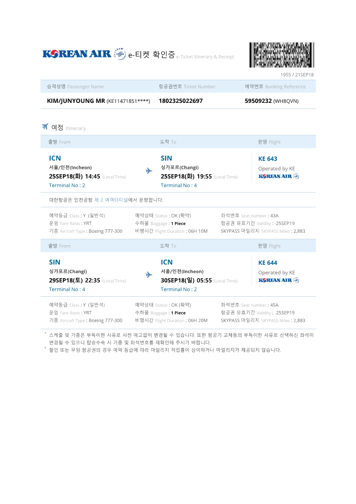

-----------------------------------------------------------------------

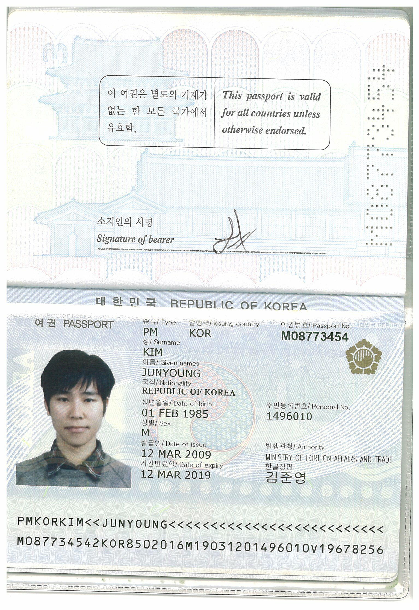

준비물

호텔

비행기

ㅇ [출장] 명함, 노트패드, 펜, 노트북, 어댑터, HDMI 젠더, 마우스, RGB/HDMI케이블, USB, 포인터&amp;여벌 건전지, 법인카드

ㅇ [여행 필수] 여권, 비자카드, 지갑, 작은 가방, 현금, 여권사본, 여행책자, 프라이어티 패스 카드, 전자티켓 출력본, 캐리어, 자물쇠,  여권용 사진, 필기도구,  면세점 쇼핑리스트

ㅇ [비행용] 수면베게, 안대, 귀마게, 미스트, 마스크

ㅇ [옷] 상/하의, 신발, 모자, 벨트, 썬글래스, 썬그리 목걸이, 팔찌, 속옷, 양말, 잠옷, 운동화, 슬리퍼, 수영복, 조리, 조깅용 운동화, 운동복 상하의, CD

ㅇ [세면도구] 화장품(썬크림, 로션), 약품, 칫솔, 면도기, 면도크림, 클라리소닉, 폼클렌저, 물티슈, 수건, 세탁물용 비닐

ㅇ [전자기기] 충전기, 배터리팩, 핸드폰(여행어플), 셀카봉, 카메라, 폰카 렌즈, 어댑터, 가이드용 이어폰, 유심 갈아낄 핀

ㅇ 면세점 쇼핑리스트 : [최현경](https://search.shopping.naver.com/detail/detail.nhn?nv_mid=12301852248), 팀선물, 위스키, 해피히포, [추천리스트](https://m.blog.naver.com/b117711/221357090313)

ㅇ [시즌]

  - 여름: 모기퇴치기, 핸디선풍기, 우산

  - 겨울: 핫팩

숙박

[https://www.booking.com/hotel/sg/jen-orchardgateway-singapore.ko.html?aid=964694&amp;app_hotel_id=1134953&amp;checkin=2018-09-25&amp;checkout=2018-09-29&amp;from_sn=android&amp;group_adults=1&amp;group_children=0&amp;label=Share-Z87uZJ%401537434338&amp;no_rooms=1&amp;req_adults=1&amp;req_children=0&amp;room1=A&amp;hp_refreshed_with_new_dates=1](https://www.booking.com/hotel/sg/jen-orchardgateway-singapore.ko.html?aid=964694&amp;app_hotel_id=1134953&amp;checkin=2018-09-25&amp;checkout=2018-09-29&amp;from_sn=android&amp;group_adults=1&amp;group_children=0&amp;label=Share-Z87uZJ%401537434338&amp;no_rooms=1&amp;req_adults=1&amp;req_children=0&amp;room1=A&amp;hp_refreshed_with_new_dates=1)

[https://www.booking.com/hotel/sg/m-social-singapore.ko.html?aid=964694&amp;app_hotel_id=1704897&amp;checkin=2018-09-25&amp;checkout=2018-09-29&amp;from_sn=android&amp;group_adults=1&amp;group_children=0&amp;label=Share-a1NMmb%401537436078&amp;no_rooms=1&amp;req_adults=1&amp;req_children=0&amp;room1=A&amp;hp_refreshed_with_new_dates=1](https://www.booking.com/hotel/sg/m-social-singapore.ko.html?aid=964694&amp;app_hotel_id=1704897&amp;checkin=2018-09-25&amp;checkout=2018-09-29&amp;from_sn=android&amp;group_adults=1&amp;group_children=0&amp;label=Share-a1NMmb%401537436078&amp;no_rooms=1&amp;req_adults=1&amp;req_children=0&amp;room1=A&amp;hp_refreshed_with_new_dates=1)

동선

[https://www.google.co.kr/maps/dir/277+Orchard+Road,+%EC%8B%B1%EA%B0%80%ED%8F%AC%EB%A5%B4/M+SOCIAL/@1.2959218,103.8353527,16z/data=!4m14!4m13!1m5!1m1!1s0x31da19972b78b549:0x60b5d80353224b27!2m2!1d103.8390263!2d1.3006643!1m5!1m1!1s0x31da199db6802b85:0x37ad8e9ae39e4654!2m2!1d103.8373128!2d1.2908987!3e0](https://www.google.co.kr/maps/dir/277+Orchard+Road,+%EC%8B%B1%EA%B0%80%ED%8F%AC%EB%A5%B4/M+SOCIAL/@1.2959218,103.8353527,16z/data=!4m14!4m13!1m5!1m1!1s0x31da19972b78b549:0x60b5d80353224b27!2m2!1d103.8390263!2d1.3006643!1m5!1m1!1s0x31da199db6802b85:0x37ad8e9ae39e4654!2m2!1d103.8373128!2d1.2908987!3e0)

출국전

짐싸기

알쓸초안

책 다운, 영화 다운

빨래 맡기기

엄빠 돈 붙이기

화요일

이동

손톱깍기

환전

면세

라운지

도착 후 찰스 메세지 보내기

알쓸신잡 작성

PC최적화

영상편집

GIC 투자이력 스터디

회화 리스트업

버핏 서울?골프

스타 이즈 본 9일 예매

로밍 요금제 변경

수요일
시현하다 예약

목요일

아크네

GIC미팅 준비

금요일

아쓸신잡 마감

GIC 미팅

토요일
