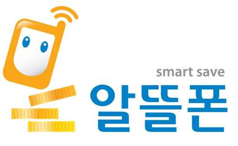
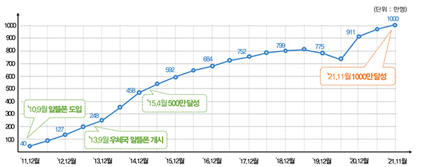
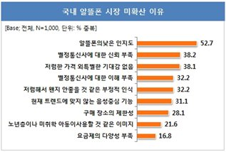
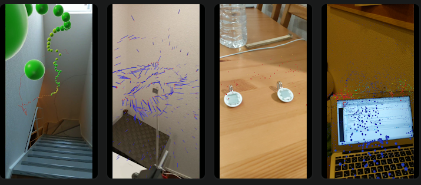
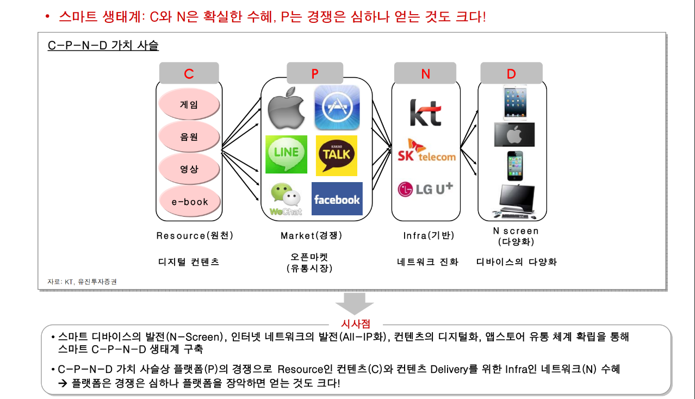
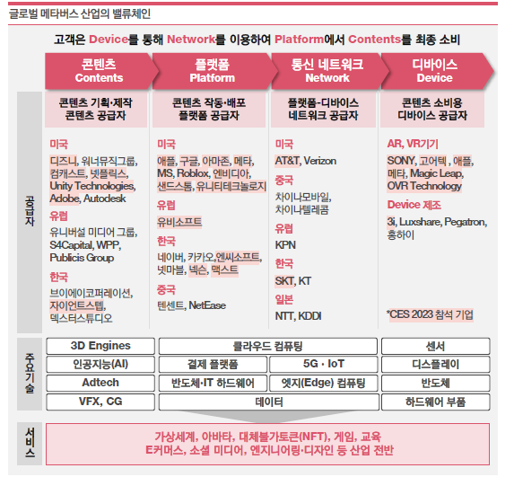
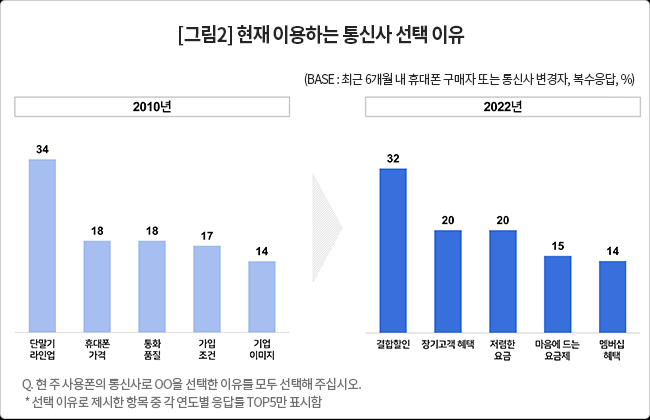
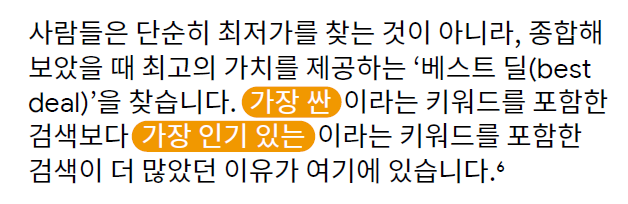
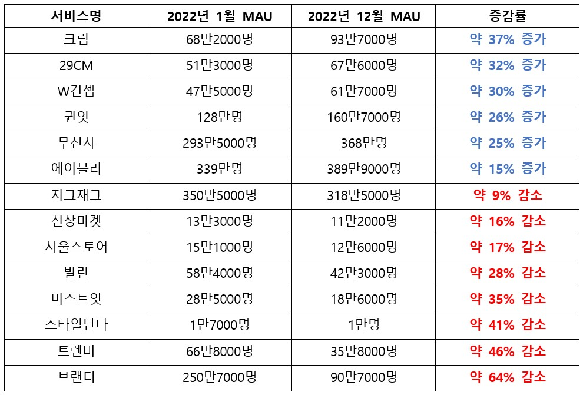
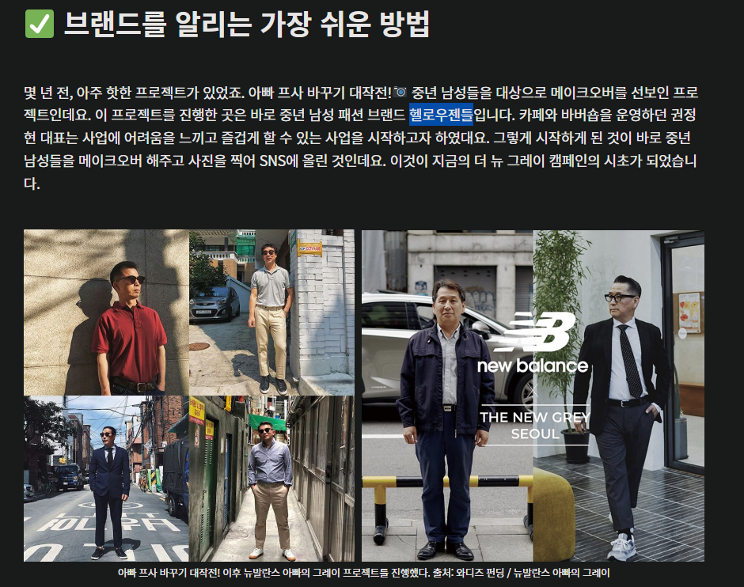

● 아이템 정리

2/23일 MVNO 보고: 김빠진다, 우선 보고 아이템먼저 or 전체 리스트를 얇게

- 피저빌리티, 구체화, 장애요인, Dos &amp; Don&#39;ts (서베이 필요한 내용)

- 최종 6개 정도 화두(카테고리) 우리 요금제는 고객들이 원하는 것을 잘 반영하고 있나?

Scenario 1. - 바보야, 문제는 브랜딩이야.

1/ 전체 기업에서 우리의 포지셔닝은 우리가 희망하는 사랑받고 존경받는 기업과 큰 괴리가 있는 것이 현실이다. → 산업군별 1~3위 기업과 우리의 호감도 포지셔닝 조사

2/ 브랜드

Scenario 2. - Comm.

1/ 이성 소구 vs 감성 소구 - 팩트는 남을 이유로는 결합 할인과 멤버십만 남았고, 돌아올 이유로는 멤버십 하나 뿐이다. 네트워크 품질은 이미 대동소이하며, 체감 차이도 미미한 수준

2/ 감성 = 브랜드 이미지

호감의 법칙 4가지 - 근접성. 외모, 유사성, 상호성

설득의 심리학 [https://brunch.co.kr/@bellrings/58](https://brunch.co.kr/@bellrings/58)

•사람들은 받은 것을 돌려주려 하고(상호성),

•부족하면 더 간절하게 원하게 되며(회귀성)

•답을 모를 때 전문성과 경험을 가진 사람이나(권위) 또는

•유사한 사람들 혹은 다수의 의견(사회적 증거)을 따르게 되며

•자신이 공개적이거나 자발적으로 밝힌 의견에 맞춰 행동하려 하고(일관성),

•자기가 좋아하는 사람의 요청을 잘 거절하지 못하는(호감) 심리적 특성을 가지고 있다.

[사랑받는 제품의 9가지 특징]

1️⃣ 저렴해서 (가격경쟁력)

2️⃣ 편해서 (편의성)

3️⃣ 좋아하는 브랜드라서 (동질성)

4️⃣ 빨라서 (속도, 체감)

5️⃣ 가벼워서 (휴대성)

6️⃣ 오래가서 (지속성)

7️⃣ 시간을 아껴주기 때문에 (경제성, 생산성)

8️⃣ 아름다워서 (심미성)

9️⃣ 유일해서 (대체불가성)

Target은 누구인가? 연령? 성별? 라이프 스타일? 아이폰 사용자? Topic으로 라이프 스타일 타겟팅

TTL, 그때는맞고지금은틀리다.

실체보다 브랜드로 승부해야 할 때

브랜드 이미지는, 시공간에 존재하는 것을 오감으로 인지하는 방식을 통해 형성되고, Call to action까지 가져오는 것이 목적

- BPI -&gt; 인터브랜드 : 브랜딩이 답이라는 결론 or not

- 브랜드만으로 선택하고 사용하는 브랜드들??

- Target 연령층 확인

MVNO로 나가는 연령대

MVNO에서 돌아오는 고객 특성 등등

중고 MNP

화장품, 선글라스 등 공급업체가 독점적인 곳들 -&gt; 제품 자체의 차별화가 어려움 -&gt; 브랜딩으로 승부

과제
Synopsis
TDL

MVNO

Demarketing

1/ SKT가 직접 화자가 되어 말하는 것의 한계와 위험성

- 알뜰폰의 경제성 등 우위는 팩트이자, 이미 널리 퍼진 인식→ 인식 전환에 한계 존재

[http://kidd.co.kr/news/171602](http://kidd.co.kr/news/171602)

[https://www.trendmonitor.co.kr/tmweb/trend/allTrend/detail.do?bIdx=1129&amp;code=0102&amp;trendType=CKOREA](https://www.trendmonitor.co.kr/tmweb/trend/allTrend/detail.do?bIdx=1129&amp;code=0102&amp;trendType=CKOREA)

- 때릴 수록 커진다: 트럼프 vs 힐러리, 추미애/지난 정권 vs 윤석열

알뜰폰 13년, 가입자 1500만명’ 시대 U+ 1573만명

2/ 우리가 이길 필요는 없다, 알뜰폰이 지면 된다.

- 7모바일의 현실: 공격도 방어도 어렵다.

7모바일 출시 이후 MVNO 점유율 추이

- 창도, 방패도 될 수 없다면, 스파이가 되어야 한다.

3/ 알뜰폰 디마케팅 IMC: 알뜰폰 쓰는 청년=빈곤한, 열악한 이미지를 ESG 관점에서 소구

ㅇ 레토릭: SKT(영&amp;리치) ↔ 알뜰폰(사회취약계층&amp;노인 효도폰)

#Comm. keyword: 기초생활수급자, 다문화 가정, 서민, 청년, 노인, 효도폰, 실업급여, 임대아파트 거주자

[IDC: Integrated Demarketing Comm.]

- 브랜드명: SK세븐모바일 → 알뜰폰 전체를 상징하는 것으로 변경 (e.g. 알뜰모바일, 알뜰한통신 등)

- 4P mix

Product 요금제

Price 인하

Place? 가난해보이는 채널? 꺼림직한 채널?

Promotion

- 광고 (e.g. DB 그룹 광고)

[https://www.apnews.kr/news/articleView.html?idxno=3006758](https://www.apnews.kr/news/articleView.html?idxno=3006758)

- 요금제: 기초생활 수급자 전용 요금제 및 멤버십 런칭

- 단말기: 저가 중고폰 유통 (w/민팃)

- 멤버십:

- 데이터 리필/쉐어링: 청년/노인 데이터 바우처

(SKT 고객이 남는 데이터 기부하는 형태? Risky? ESG?)

- 결합: 사회적약자가 모이면 결합할인 제공

- 직원들 연탄봉사

- 사회적약자를 지원하는 단체들과의 협업

- 유무선 결합: 7모바일-SKB 결합 → 7모바일 약정 종료 시, SKT 오퍼?

디마케팅/디인플루언싱 [http://fpost.co.kr/board/bbs/board.php?bo_table=special&amp;wr_id=1092](http://fpost.co.kr/board/bbs/board.php?bo_table=special&amp;wr_id=1092)

[https://www.thescoop.co.kr/news/articleView.html?idxno=55498](https://www.thescoop.co.kr/news/articleView.html?idxno=55498)

[http://www.kmvno.or.kr/info/info_02.php?PHPSESSID=7df05ae6e52a1e1fc944d39b04e294aa](http://www.kmvno.or.kr/info/info_02.php?PHPSESSID=7df05ae6e52a1e1fc944d39b04e294aa)

TTL [https://dbr.donga.com/article/view/1202/article_no/2522/ac/a_view](https://dbr.donga.com/article/view/1202/article_no/2522/ac/a_view)

[http://www.economy21.co.kr/news/articleView.html?idxno=35165](http://www.economy21.co.kr/news/articleView.html?idxno=35165)

7모바일 런칭 이후 실적 MVNO내 점유율(공격/방어 성적)

IMC아이디어

Light &amp; night

한강 드론 라이트쇼

&amp;

EDM 공연

고객 인지 순서대로 정리

뒷단에 프로세스, 피저빌리티 및 Dos &amp; Don&#39;ts

1/ 기술력을 어필 할 수 있는 새로운 Comm. 채널 도입

- 드론 라이트쇼와  EDM 공연 두가지로 메세지 전달

- The Stickmen - Tujamo &amp; Sleepwalkrs

[J Balvin, Skrillex - In Da Getto // DJ Snake, Malla // Darude](https://www.youtube.com/watch?v=WDt1BOv9gwU&amp;ab_channel=TheStickmenProject) [The Stickmen - Lockdown Mix #4](https://www.youtube.com/watch?v=p-jZqricMZk&amp;ab_channel=TheStickmenProject)

[Contact]

[https://www.facebook.com/thestickmenproject/](https://www.facebook.com/thestickmenproject/)

[https://thestickmenproject.komi.io/](https://thestickmenproject.komi.io/)

[https://www.thestickmenproject.com/](https://www.thestickmenproject.com/)

[The Hyundai A League Grand Final Pre Show Ft. The Stickmen](https://www.youtube.com/watch?v=uaQ9Rx3Xwj4&amp;ab_channel=TheStickmenProject)

2/ 어떤 것이 가능하고 얼마나 폭발력 있을 것인가

- 한화 세계불꽃축제 100만명 이상 운집

- 광안리 드론쇼 반응

- 드론과 선도적 기술 기업 이미지 building

3/ 불꽃 축제 대비 장점 - 소음 없음, 친환경적, 메시지 전달 가능, ESG, 비용효율적(불꽃축제 비용은 2019년 기준으로 불꽃 발사 비용과 행사 진행 비용을 포함해서, 약&#160;80억원), 리허설 가능, 음악 번호와 함께 제공되는 사운드 시스템의 음향 효과와 함께 놀라운 감각적 높이를 달성할 수 있습니다.

4/ 어떻게 진행 할건가?

- 국내 메이저 3개 업체 비교

- 진행 프로세스 타임라인으로 간략하게 정리

5/ Contents

- EDM/LED/트론 콘서트 진행 및 Z세대 고객 전용좌석 마련

- QR코드 랜딩 페이지 [https://stonebc.com/archives/27384](https://stonebc.com/archives/27384)

- 드론 레이싱 or 드론 체험

- 로봇 댄싱 [http://www.headlinejeju.co.kr/news/articleView.html?idxno=354371](http://www.headlinejeju.co.kr/news/articleView.html?idxno=354371)

- VR 체험존이나 Tum모바일 운영

- 드론쇼 양옆으로 T &amp; 서울시 LED 드론에 묶어서 띄우기

6/ 확대 재생산

- 실시간 생중계 유튜브, 웨이브 + 방송사

광고, V컬러링 등 우리가 가진 모든 미디어에 노출

전파는 파동 = 리듬게임이랑 연동 할 수 없을까?

T응원봉

Z세대 특화 혜택은?

V컬러링 등 우리가 가진 모

LED 광섬유 댄스 채찍 댄스 - 틱톡존 : 틱톡 제휴

[J Balvin, Skrillex - In Da Getto // DJ Snake, Malla // Darude](https://www.youtube.com/watch?v=WDt1BOv9gwU&amp;ab_channel=TheStickmenProject)

[https://www.donga.com/news/Economy/article/all/20210131/105205931/1](https://www.donga.com/news/Economy/article/all/20210131/105205931/1)

[The Hyundai A League Grand Final Pre Show Ft. The Stickmen](https://www.youtube.com/watch?v=uaQ9Rx3Xwj4&amp;ab_channel=TheStickmenProject)

[THE STICKMEN - DJ MAG LIVESTREAM](https://youtu.be/WU28bAxh9f0)

+ 모바일 드론쇼 + 티움 모바일

[참고]

1/ 업체별 레퍼런스

2/ 드론쇼 레퍼런스 이미지 - UAM, AI, 5대 사업 영역 + 사람들이 좋아할만 한 것

AMR(Allied Market Research)는 &quot; [Drone Light Shows Market  by Type(Drone Formations, Animated Shows, Indoor Shows, Drone Launched Fireworks), by Application(Tourist)](https://www.alliedmarketresearch.com/drone-light-shows-market-A31664)&quot;이라는 제목의 보고서를 발표

전 세계 드론 조명 쇼 산업은 2021년 13억 달러 에서 2031년까지 22억 달러 에 달할 것으로 예상되며2022년부터 2031년까지 연평균 5.7% 성장할 것으로 예상

[https://www.alliedmarketresearch.com/drone-light-shows-market-A31664](https://www.alliedmarketresearch.com/drone-light-shows-market-A31664)

[https://www.maximizemarketresearch.com/market-report/drone-light-shows-market/148130/](https://www.maximizemarketresearch.com/market-report/drone-light-shows-market/148130/)

국내 대행사들 견적 받아보기

한강에서 가능한지 체크, 플랜B 광화문 등 탐색

인텔 담당자 컨택해서 코웍 및 견적/장애요인 등 세부 사항 파악하기

장소 물색

장소 협조

드론 견적 쪼으기

조명, 음악, 진행 등 대행사 문의 및 견적 문의 - 염지윤/에프엠커뮤니케이션즈

휴대폰: 01073836545

회사: 0234980881

회사: yjyfm@promotion.co.kr

파블로, 다온 포트폴리오 받아보기

한화 담당자 연락처 다시 물어보기

EDM 공연 견적 알아보기 - 유재환

로봇 스퀘어 연락처 알아보기 → 망함

전파 시각화 AR 게임

1/ 통신의 가치가 평가절하되는 이유 중 하나는    보이지 않고, 만질 수 없기 때문임

2/ See the unseen - 고객들에게 전파를 보여주고 체험 할 수 있게 하자

3/ AR로 전파를 시각화해서 보여주자

4/ AR 게임으로 사람들의 폰에서 나오고 들어가는 전파를 시각화

- AR로 다른 사람들의 스마트폰 인식(머신러닝 활용)

- 폰에서 전파를 수신하고 내보내는 것처럼 비쥬얼 구현

- 각 스마트폰에서 [방](https://www.google.com/imgres?imgurl=https://s3.ap-northeast-2.amazonaws.com/univ-careet/FileData/Article/127/b82016ba-91da-44fb-b846-a6c068f0f2b2.gif&amp;imgrefurl=https://univ20.com/107997&amp;tbnid=XFs5O3GquDyt9M&amp;vet=1&amp;docid=UgrVaK6yCy0j_M&amp;w=396&amp;h=719&amp;source=sh/x/im)울방울 올라오는 데이터들을 터뜨리는게임?

- 보상: 데이터?

[참고]

왜 게임인가? - MZ게임↑, 침투율, Stickiness 강화

[(93) The Hyundai A League Grand Final Pre Show Ft. The Stickmen - YouTube](https://www.youtube.com/watch?v=uaQ9Rx3Xwj4&amp;ab_channel=TheStickmenProject)

[Ref]

[https://architectureofradio.com/](https://architectureofradio.com/)

[https://twitter.com/kenkawakenkenke/status/1079385558751690753](https://twitter.com/kenkawakenkenke/status/1079385558751690753)

[http://coldspotting.com/](http://coldspotting.com/)

[https://gigazine.net/news/20190107-ar-sensor/](https://gigazine.net/news/20190107-ar-sensor/)

[https://jgoldbergdesign.com/signal-strength](https://jgoldbergdesign.com/signal-strength) - wifi로 할까? 기지국이슈 없게

[http://coldspotting.com/](http://coldspotting.com/)

=========================================

기지국을 보여주지말고 전파만 시각화해서 보여주면 어때?

그리고 꼭 핸드폰이어야 하나? 나중에 핸드폰을 추가하더라도 처음엔

다른 사물, 인식률이 높은 것이면 어떨까?

??? 이게 꼭 시각화 여야 하나? 인지 = 오감에 의한 피드백

통신의 가치를 지각 할 수 있는 - 전파, 데이터

 x

인지 - 시각, 청각, 촉각, 미각, 후각

눝 - Play[Rotating] to Earn[Data]

Connect to Data

Post to

Dance to

폰으로 꼭 뭔가를 해야하나? 꼭 데이터를 줘야하나?

인지적인 가치를 올릴 수 있는 방법이면 뭐든 가능하지 않나?

상징물이라던지,

사내 조직들 컨택해서 피저빌리티 체크

-&gt; 실제 스마트폰으로 전파 트래킹은 불가능하다?

해긴(이창윤), Jump AR 부서 - 모프 인터랙티브

스마트폰 인식 머신러닝은 어디에서 해줘야 하나?

Data GO

or

오징어 게임

0/ [본디](https://brunch.co.kr/@lhilosophy/69) 처럼 아바타 제작, 미니룸 같은 곳에 아바타가 들어와 있으면 데이터 충전

1/ AR: 각 디바이스에서 나오는 데이터를 AR로 보고 그걸 ㅇㅇ하면 데이터몬(?)을 획득/수집

  *광고 보면 데이터 제공

캐릭터가 전파를 잡고 날아다닌다 던지? 전파 사이사이를 뛴다던지 삼킨다던지

미니룸에 들어가 있으면 세상으로부터 차단

2/ 획득/수집한 OO을 가지고 유저간 대전 혹은 경기/시합

3/ 일정 이상 OO를 모은 고객에 한해, 대전/경기 참여 가능. 이기면 데이터/데이터 리필 쿠폰 획득 (무제한은 OO를 획득), 지면 데이터를 빼았김 (무제한은 데이터가 아닌 OO를 잃게됨)

▶ 테더링 데이터, 함께쓰기데이터, T가족모아데이터

▶ 멤버십 한도

▶ 레벨이 올라가면, T멤버십 등급 승급? T우주 혜택 제공? Date 리필 제공?

▶ 길드 결합 할인?

+ 데이터 채굴 시스템 - OO를 하면 데이터 생성

포획(레벨업) -

대전(전투) -

더미 프로필을 생성해서 npc처럼 처음에는 우리가 데이터를 제공해서 게임 자체를 붐업

[https://www.bookjournalism.com/books/54201/chapters/54203](https://www.bookjournalism.com/books/54201/chapters/54203)

전파 시각화_이미지

[Ref.]

[https://gigazine.net/gsc_news/en/20131229-cellular-network-visualization/](https://gigazine.net/gsc_news/en/20131229-cellular-network-visualization/)

[https://www.vice.com/en/article/9an9m7/heres-what-wi-fi-would-look-like-if-we-could-see-it](https://www.vice.com/en/article/9an9m7/heres-what-wi-fi-would-look-like-if-we-could-see-it)

[Immaterials: Light painting WiFi](https://www.youtube.com/watch?v=cxdjfOkPu-E&amp;ab_channel=TimoArnall)

[https://www.vice.com/en/article/wnp5yz/a-machine-is-visualizing-the-ghostly-wifi-waves-that-surround-us](https://www.vice.com/en/article/wnp5yz/a-machine-is-visualizing-the-ghostly-wifi-waves-that-surround-us)

[http://www.digitalethereal.com/](http://www.digitalethereal.com/)

[https://m.blog.naver.com/PostView.naver?isHttpsRedirect=true&amp;blogId=vixlee&amp;logNo=70170831331](https://m.blog.naver.com/PostView.naver?isHttpsRedirect=true&amp;blogId=vixlee&amp;logNo=70170831331)

내 사람들과 얼마나 연결되었나?

통화이력을 네트워크로 지도상에 표기?

폰으로 전파 시각화 이미지 촬영이 가능한가?

히든 마케팅 - 독립 브랜드

(스트리트 브랜드)

1/ TTL, 그때는맞고지금은틀리다. [https://m.blog.naver.com/mchan21/221345586763](https://m.blog.naver.com/mchan21/221345586763)

TTL 이후 20년, 무엇이 변했고 무엇이 변치 않았나.

3C

고객

경쟁 알뜰폰, 산업 헤게모니가 플랫폼, 탈중앙화 까지, 스타링크

우리 네트웤품질 초격차,

규제 알뜰폰, 제 4이통, 단통법

제조사 자급제, 전용단말, SKY폰

플랫폼

콘텐츠

대체제

남은 것은, 브랜드 뿐.

- TTL과 유사한 환경 but, 품질의 격차는 초격차. 고객들이 인지하는 SKT의 차별적 우위는 미미한 수준

사업자마다 식별번호가 다르던 시절 SKT는 ‘011’이 상징하는 넘버원 이미지로 타사를 압도했다. 당시 `011이시죠?`라는 광고 카피가 등장했던 것처럼 품질&#183;서비스 그 이상의 자부심과 만족감을 소비자에게 줬다. 그러나 요즘 소비자가 원하는 것은 가심비보다는 가성비다.

1999년 7월 SK텔레콤에서 19세~24세 사이의 젊은층을 대상으로 출범한 휴대 전화 서비스 브랜드

TTL 표준요금제가&#160;2009년 6월 1일자로 폐지

2006 스피드011 종료하며 ttl도 페이드아웃 2010년까지 TTL요금제 가입이 가능하였다가 스마트폰 요금제가 대중화 될 때쯤 TTL요금제와 명칭은 자취를 감췄다.?

- 2004년 1월 1일 SKT 신규 고객은 010을 부여받기 시작함. - Speed011 빠염

실제로 빠르고 높은 퀄리티의 통신, 독점/전용 단말 - SKY폰

엠부시 마케팅 - 2002 한일월드컵 때부터 붉은악마를 후원, 그 유명한 &#39;대한민국&#39; 광고

모바일 금융서비스 &#39;모네타&#39;와 모바일 멀티미디어 서비스 &#39;june&#39;을 탄생

ms 오픈에이아이 레버리자 사례

 &lt;혁신 기업의 딜레마&gt;에서 사례 가져오기

- 디스크 산업

그럼에도 희망적인 것, 우리가 레버리지 해야 할 것 인지적 자산.

토스도 비싼데 가입자가...

- 본원적인 상품/서비스인 품질의 우위가 0이면 뭘 곱해도 0

- 현재 초격차, 고객들이 인지하는 품질 차이는 미미한 수준

- 네트워크 실제 품질과 인식의 갭 - 이미지가 더 중요하다. 관성이 있기땜에 인지적 구두쇠. 더 오래가는 인지적 자산.

- [컨슈머인사이트](https://www.consumerinsight.co.kr/voc_view.aspx?no=3321&amp;id=ins02_list&amp;PageNo=1&amp;schFlag=0), 2010~2022 통신사 선호도&#183;선택이유 추이

- [2022](https://www.msit.go.kr/bbs/view.do?sCode=user&amp;mPid=238&amp;mId=113&amp;bbsSeqNo=94&amp;nttSeqNo=3182596)년 통신서비스 수신권역(커버리지) 점검 및 품질평가 결과 발표

- CX, 그를 통한 인식제고 즉 브랜딩이 답이다. -&gt; 고가혁 자료 활용

- 화장품, 콜라, 안경 등 제픔 자체의 차이가 미미한 모든 산업군 예시

THE hype cycle for telecommunication Industry

[https://www.gartner.com/interactive/hc/4016428?ref=solrResearch&amp;refval=356659377](https://www.gartner.com/interactive/hc/4016428?ref=solrResearch&amp;refval=356659377)

[https://www.gartner.com/interactive/hc/4016428?ref=solrResearch&amp;refval=356659486](https://www.gartner.com/interactive/hc/4016428?ref=solrResearch&amp;refval=356659486)

2/ 산업의 사이클이 있다. 대세는 우리를 지나 플랫폼, 이제 탈 중앙화까지 바라보고 있다.

지금 텔레콤에서 브랜드를 만들어도 고객들은 부가서비스, 요금제 등으로 인식 할 뿐이다.

그래서 텔레콤이 묻으면 안된다. 요거 조사결과 있나?

3/ 텔레콤의 또다른 브랜드가 아니라, 독립 브랜드가 필요하다.

통신회사의 브랜드가 아닌, Target 고객들이 선호하는 브랜드를 만들고

이를 통신에 이입해야 한다.

- 좋은 브랜드가 업종의 경계를 넘어 사업을 성공적으로 확장한 사례

4/ what. Gen Z가 열광하고 매일 사용하며 자주 구매하는 브랜드?

- Streetwear brands

4/ Why Streetwear?

- 걸어다니는 광고판

- Z가 열광하는 것 보여지는 것

- 물리적 실체, 물성이 있는 것은 SNS에 자랑할 수 있지만, 통신은

기지국과 요금제 말고는 고객들에게 보여줄 수 있는 것이 없다.

본 제안이 너무 급진적이라면,

중간 단계도 있음.

한국 타이어의 의류 브랜드 마데인한국 [https://www.donga.com/news/article/all/20230225/118066869/1](https://www.donga.com/news/article/all/20230225/118066869/1)

서브웨이 알바생도 아닌데 서브웨이 티셔츠, 모자, 양말 풀착장하고 돌아다님  [https://www.careet.net/125](https://www.careet.net/125)

공간 브랜딩 - 젠틀 몬스터 [https://brunch.co.kr/@pig83/182](https://brunch.co.kr/@pig83/182)

[https://www.openads.co.kr/content/contentDetail?contsId=10199](https://www.openads.co.kr/content/contentDetail?contsId=10199)

플래그십 스토어들 [https://www.openads.co.kr/content/contentDetail?contsId=9571](https://www.openads.co.kr/content/contentDetail?contsId=9571)

==============================================

이게 꼭 스트릿 브랜드여야 하나? - 햄버거?

더 효과적인 매질/물성이 있는 것은 없나?

국내외 스트릿 브랜드들 리스트업

스트릿 브랜드들 창업 프로세스 체크

레버리지 방법: 우리에게 SUPRME이 있다면 어떻게 활용할 것인가?

자기 패션 브랜드 런칭한 사람들 인터뷰

우리 기존 리서치 자료 중에,

1/ 네트웍/요금 차이에 대한 인식은 이미 미미하다. (3사+알뜰폰)

2/ 0브랜드는 통신사의 요금제일 뿐이라고 인식되고 있다.

3/ 통신사 서비스/부가 요금제에 대한 부정적 인식.

에 대한 내용이 담긴 자료가 있을까요?

SKT Gen Z 고객 한정

최저가 or 한정판 Deal

혜택 제공

코스트코

구조 차용

코스트코 사례 공유 - 유통마진이 아닌 연회비로 남기는 구조

물건이 싸고, 독점적일 수록 연회비 매출이 증가

Z가입자 대상 국내 최저가/Exclusive 상품 핫딜 혜택 제공

1/ 우리가 가진 장점 중 하나는 막대하 가입자 기반

이를 레버리지 할 수 있는 방안

- 비용효율적 고객혜택

- 가입자 기반 레버리지

[Scheme]

1/ 3~7개 카테고리를 미리 정해두고(소싱해두고) or Exclusive 상품 소싱

2/ 1달 혹은 분기에 1회 SKT Z고객 대상 카테고리 open(11번가, T딜, T멤버십, T월드)

3/ 투표 결과에 따라, 최종 라인업 1~3개 선정 및 최종 소싱 계약체결

4/ SKT Z고객 대상 Deal 오픈: 리셀 1개, 최저가 1개, 해외직구(11마존) 1개

5/ Open시 지코 섭외해서 라방 이벤트

ㅇ 내러티브 - 매월 1개 or 분기 1개씩 아이템을 모으면 콜렉션이 되는

  → 리셀/판매 활성화

ㅇ 헝거 마케팅: 수량 제한으로 피켓팅 유도

ㅇ T월드나 T팩토리에 전시, 다음 작품(상품)은 거치대 비워두기

커머스는 성별, 연령, 지역, 구매패턴으로 타겟팅 가능

[Pilot test 진행]

패션, 뷰티, 미용

└ 신발,옷,레고,LP 등

플랜B: 번개장터??

크림과 제휴, 크림의 가려운 곳이 뭘까?

[https://www.vop.co.kr/A00001605373.html](https://www.vop.co.kr/A00001605373.html)

크림 등 타 플랫폼과 제휴로 테스트 하고, 이후 t딜 인력 통해 상품 소싱하여 진행

크림의 주요 비즈니스 모델은 ▲C2C(판매자-인증-소비자) ▲빠른배송(판매자 보관판매–구매자 빠른배송) ▲B2C(크림 독점 발매 상품) 등

[https://www.innoforest.co.kr/report/NS00000009](https://www.innoforest.co.kr/report/NS00000009)

공동구매 [https://www.careet.net/853#move03](https://www.careet.net/853#move03)

중고명품시장 성장세

[https://www.chosun.com/economy/money/2023/02/27/PEA7EV6A5BF7ZADAKDJR4OWDRU/?utm_source=naver&amp;utm_medium=referral&amp;utm_campaign=naver-news](https://www.chosun.com/economy/money/2023/02/27/PEA7EV6A5BF7ZADAKDJR4OWDRU/?utm_source=naver&amp;utm_medium=referral&amp;utm_campaign=naver-news)

[https://www.chosun.com/economy/weeklybiz/2022/10/06/5UOJHTTGKNGFVOSHWZ3XVFKWZM/](https://www.chosun.com/economy/weeklybiz/2022/10/06/5UOJHTTGKNGFVOSHWZ3XVFKWZM/)

[https://mirakle.mk.co.kr/view.php?year=2023&amp;no=159709](https://mirakle.mk.co.kr/view.php?year=2023&amp;no=159709)

[http://www.digitaltoday.co.kr/news/articleView.html?idxno=471098](http://www.digitaltoday.co.kr/news/articleView.html?idxno=471098)

중고거래 [https://mobile.newsis.com/view.html?ar_id=NISX20230302_0002210712#_PA](https://mobile.newsis.com/view.html?ar_id=NISX20230302_0002210712#_PA)

[런칭 프로모션 - 평행소비]

[(125) ](https://www.youtube.com/watch?v=iMJpsjCy_oE&amp;ab_channel=14F%EC%9D%BC%EC%82%AC%EC%97%90%ED%94%84)이 세상 힙이 아닌 90s 패션, 옷 좀 입었던 90년대 스타일 대방출 / 14F - YouTube

[90](https://www.youtube.com/watch?v=c9P2XwDYYfg&amp;ab_channel=14F%EC%9D%BC%EC%82%AC%EC%97%90%ED%94%84)년대 사람들은 ‘오렌지족’을 어떻게 생각했을까 / 14F

런칭 이벤트: 힙한 80년대 부모 011과 현재의 mz

80~90년대 힙한 패션 사진으로 사람 찾고

런웨이 컨테스트

부모님과 함께 나의 나이든 버전, 부모님의 젊은 시절 버전, 현재버전으로 사진 포토샵 이벤트

[준영,] [오전 7:07] [https://youtu.be/LnUwYGcfOAk](https://youtu.be/LnUwYGcfOAk)

T딜 등 커머스 관련 조직 만나서 문의 - T딜 딜소싱 담당 임슬기/광고사업팀

폭발력 있을만한 상품들 예시 물어보기

- 싸게 사려면 기다릴 수도 있는 것- 11번가, 임슬기 또 누구한테 물어보지? 11번가 강혜중, 이영건

11번가 전화해보기

기획팀, CRM, 편성팀 → 오후중에 팀장한테 말 해보고 연락주기로 함.

크림, 29CM, 퀸잇(40대) 컨택

- 크림 마케팅팀 김동섭님 (네이버 승연님 소개)

이메일: dongsebi@kreamcorp.com

번호: 010-7133-5297

- 29CM&#160;신사업기획실 김선영([sunkim@29cm.co.kr](mailto:sunkim@29cm.co.kr))

- 이창원 팀장/아마존 담당

연령, 트렌드, 시즌, 배송, 배송조건

T타워 미디어 파사드 적용

1/ 건축 조형물로 설치된 것 - 해당 법 확인 필요

2/ 광고법 - 법적으로 크기 등 구청 마다 다를 듯

3/ 민원 우려 - 이건 조도를 조절하면 되지 않나?

[https://news.mt.co.kr/mtview.php?no=2018082208440532173](https://news.mt.co.kr/mtview.php?no=2018082208440532173)

광고는 안됨.

[https://www.goodlight.or.kr/main.do;jsessionid=0qYVKzNkLNRxtukYayaUVBPgt9k6ahPLTzFn0OZZ018PNRa8b7p5SS79Eo6fh8QO.KECOGICWAS_servlet_gih](https://www.goodlight.or.kr/main.do;jsessionid=0qYVKzNkLNRxtukYayaUVBPgt9k6ahPLTzFn0OZZ018PNRa8b7p5SS79Eo6fh8QO.KECOGICWAS_servlet_gih)

서울도시계획포털

[https://urban.seoul.go.kr/view/html/PMNU0000000000](https://urban.seoul.go.kr/view/html/PMNU0000000000)

1/ 광고물심의: 광고인허가 담당자 - @명동 이소희 주무관(도시디자인과 광고물)

2/ 서울시 좋은빛위원회: 미디어심의 - 서울시

미디어폴=미디어파사드 - 조형물이라 예술성 있는 것만 가능

광고물 - 자치구

미디어 시설문 - 자문

디지털컴팀 정재원 - 전광판 콘텐츠 관리

행복지원팀 담당자 확인 - 사옥 관리

아트센터 나비?

조형물 법무검토 - 황수진님

구청 규제 확인 - 중구청

시청 규제 확인

견적 뽑아보기

- 지스마트글로벌

- 디스트릭트: 콘텐츠만 함

- 해비턴트: 010-3222-6264 리아드 or 삼성/엘지

- 레트로 미디어:

미디어 파사드는 광고가 안되고, 전광판은 되는건지?

코엑스는 왜 광고가 되는거지?

1/ 광고물심의: 광고인허가 담당자 - @명동 이소희 주무관(도시디자인과 광고물)

2/ 좋은빛위원회: 미디어심의 - 서울시

중구 도시경관개선팀
주무관
박준희
[02-3396-5993](tel:02-3396-5993)
경관 개선사업 전기&#183;통신분야 공사,좋은 빛 위원회 심의 관련 업무,조명환경 관리구역 빛환경 관리업무,빛방사 허용기준 준수 정기검사

서울시 디자인정책관 - 도시경관사업팀
주무관
홍하나

02-2133-1918

[https://org.seoul.go.kr/org/orgChartView.do](https://org.seoul.go.kr/org/orgChartView.do)

- ○ 좋은빛위원회 운영 및 제도개선, 현장점검 업무

- ○ 국제도시조명연맹 정책교류업무(보조)

- ○ 좋은빛상 공모전 개최 및 운영

- ○ 건축허가 등 외부기관 협의 업무

- [대직자 : 김희원]

삼성 ㅇㅇ 광고물로 허가를 받아서 낮에도 표출 가능

하려면, 상업지역인가?

이대현님/행복지원팀 - 기둥

T팩토리

댄스 스튜디오 wt/Tiktok

3층 - 카카오의 노티드 처럼 방문 빈도가 높고 핫한 브랜드 입점 [더현대서울](https://www.instagram.com/thehyundai_seoul/related_profiles/?hl=ko) 입점했던 브랜드들 참고

2층 - 버츄얼/AR 즉석 사진 스튜디오

1층 - 버츄얼 댄스 촬영 스튜디오 w/틱톡

촬영후 T팩토리 계정으로 DM 보내고 현장에서 본인 인증하면 즉석사진과 함께 영상증정

리액션캠 설치

실시간 24시간 방송

SKT x dingo 연계해서 헤이즈 깜짝 버스킹 같은 걸 해도 되고, 쇼미더머니처럼 서바이벌 컨테스트를 열거나, BDC로 만들어도 되고ㅎㅎ 버스팅 하는 MZ 소재로 웹드라마도 만들고

[https://brunch.co.kr/@fullmoonnc/83#](https://brunch.co.kr/@fullmoonnc/83#)

윤지원님 연락해서 틱톡 제휴담당 찾기

소니랑 협업해서 실시간 AR 필터 제공?

지오비전 문의해서 T팩토리 상권분석 방법 물어보기

메타버스쪽에 리깅하는 업체 알아보기, 카톡방들에도 물어보기

팀 스튜디오 패널 얼마인지 물어보기

T월드Monetization

애플페이+

카메라 모듈 접착식 NFC 카드??

- 판매는 T머니 정책에 따라 편의점에서만 가능, 우리가 직접 유통하려면 T머니랑 직접 풀어야함

- 비용은 현카랑 애플 역어서 같이 분담해서 배포하면 어때? 애플이 빼앗아 갈라나?

- 최소

- [https://zdnet.co.kr/view/?no=20230220083220#_enliple](https://zdnet.co.kr/view/?no=20230220083220#_enliple)

티머니 애플페이 지원계획, 언제까지 안할건지? 계약으로 엮을 수 있나?

T머니 제휴  7~8월, 2~3개월

국내에 이거 생산 가능한 다른 업체 찾기, 티머니에 물어보기.

NDA 맺기.

애플은 이거 하고나면 어떤 반응일까? 지들도 사서 공급? 혹은 타사에 압력?

캐해석 [https://www.careet.net/930](https://www.careet.net/930)

[https://www.careet.net/895#move04](https://www.careet.net/895#move04)

럭셔리 주얼리 [https://www.joongang.co.kr/article/25144402#home](https://www.joongang.co.kr/article/25144402#home)

Target 정의 - 경제활동을 시작하는, 우리 기변 고객 중 ARPU가 상승하는 연령대?

Image target: 스무살, 20-24

혜택 target: 경제활동을 시작해서 구매력이 생긴 28-38 (ARPU 상승 구간으로 검증 필요)

디자인 시스템

애플 [https://developer.apple.com/design/human-interface-guidelines/guidelines/overview/](https://developer.apple.com/design/human-interface-guidelines/guidelines/overview/)          [https://brunch.co.kr/@3756ea803def4ac/16](https://brunch.co.kr/@3756ea803def4ac/16)

구글 [https://m3.material.io/](https://m3.material.io/)

서타벅스 [https://creative.starbucks.com/](https://creative.starbucks.com/)

어도비 [https://spectrum.adobe.com/?ref=evernote.design](https://spectrum.adobe.com/?ref=evernote.design)

쇼피파이 [https://polaris.shopify.com/design/design](https://polaris.shopify.com/design/design)

스포티파이 [https://spotify.design/tools/](https://spotify.design/tools/)

에어비앤비 [https://airbnb.design/cereal/](https://airbnb.design/cereal/)

MS [https://www.microsoft.com/design/fluent/](https://www.microsoft.com/design/fluent/)

BBC [https://www.bbc.co.uk/gel/guidelines/category/design-patterns](https://www.bbc.co.uk/gel/guidelines/category/design-patterns)

IBM [https://www.ibm.com/design/language/](https://www.ibm.com/design/language/)

피그마 [https://www.designsystemsforfigma.com/](https://www.designsystemsforfigma.com/)

라인 [https://designsystem.line.me/](https://designsystem.line.me/)

MZ 고객 대상 SKT 긍정 인식 회복을 위한 ‘comm. 방안’ 구체화

- MNO 全 영역 (접점, 혜택/ 프로그램 등) 에서 언어, 소통 방식, 새로운 접근 고민
