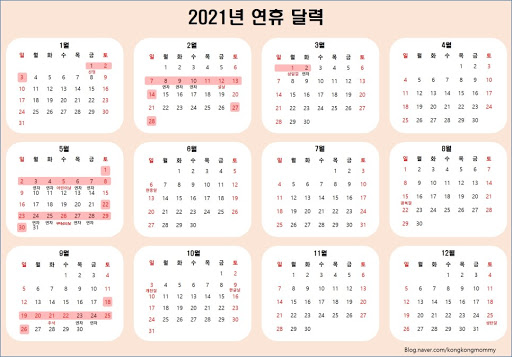
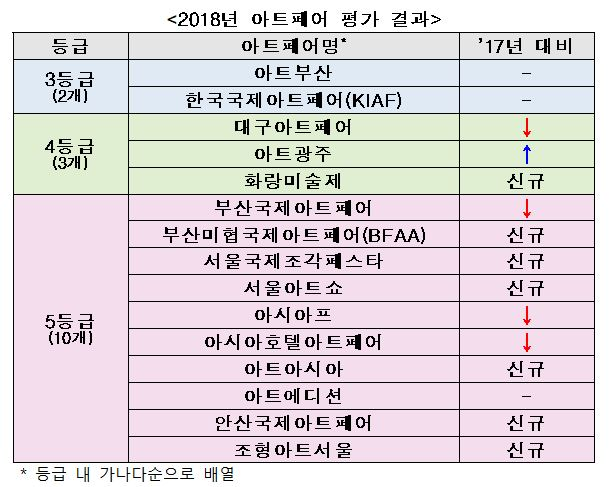

&#127937; Growth Plan : 기간별 성취 목표

Remember, Raise. Not Race. 경쟁은 루저들을 위한 것이다.

퍼포먼스와 삶의 80%를 결정짓는 요소에, 깨어있는 시간의 20%를 투자한다.

R&amp;D에는 시간과 자본이 투입된다. 수입과 시간의 20%를 확보하라.

목표와 무관한 모든 것을, 포기하라.

■&#39;20년 1월 [MS 캘린더](https://sharing.calendar.live.com/calendar/private/5bf24110-3f13-469d-95ee-6e04ded12fe6/bf23f0f2-f7f7-48d2-8922-14228c82c41b/cid-733661839cc53ba5/index.html) / [구글 캘린더](https://www.google.com/calendar/render?hl=ko#main_7%7Cmonth)

3
4
5
6
7
8
9

6 Pillar

신세계 상품권 교환

HAY

KOSDAQ, 1개

미국 주식 1개씩

kbs 자본주의 5부작

물가연동채, 금 등 인플레이션 대비

로블록스

하고싶은 프로젝트 말하기 JTBC,

원노트 정리

Journey map A5

집안 정리

사경인 회계사 강의

Ux, 퍼포먼스 마케팅

데이터 사이언스

듀오링고

개발/포토샵/프리미어 배우기

비트코인 옵션매도 스켈핑

시골의사 W

집에 안쓰는 물건 당근마켓에 팔기

레전드가 될 노력. 매일 할? DCF천

공부법 영상

모춘티비

풋볼차트 그리기

[https://www.youtube.com/watch?v=cCYZ9DF34-Y](https://www.youtube.com/watch?v=cCYZ9DF34-Y)

PT 차트그리기 보강

매크로 인터렉티브

로 ppt 제작

[https://drive.google.com/file/d/1BZNT6wtyewAMwGP9tpO37sab7770mopf/view?fbclid=IwAR0tWEyoODdpVKJNUUsl4EJgdqi-5ft4omzB4m0AcnngfN86p4CHXAWjrD0](https://drive.google.com/file/d/1BZNT6wtyewAMwGP9tpO37sab7770mopf/view?fbclid=IwAR0tWEyoODdpVKJNUUsl4EJgdqi-5ft4omzB4m0AcnngfN86p4CHXAWjrD0)

[Growth Note](onenote:#Contribution%20Note&amp;section-id={20AF4667-F983-49B5-BC14-EA4920950D6B}&amp;page-id={11D30B56-2327-493A-AC7B-84F4F0019A8E}&amp;object-id={88E4845E-8645-0061-1FDE-11743F1D4F52}&amp;12&amp;base-path=https://d.docs.live.net/733661839cc53ba5/문서/이상/Dashboard.one)

6 Pillar

위례자이더시티 언제분양?

마이크로닉스 전화

반하트 디알바자

발뮤다 틀잡고 리서치

보훈저 무주택 기준 문의

 성장 Routine

친절, 유머, 극기, 여유

일, 사랑, 놀이, 연대

명상

운동

큐비즘

[자경문](onenote:Direction.one#자경문&amp;section-id={01F613CD-B039-46DF-AF2A-717746B81363}&amp;page-id={C7C2E532-C07E-491B-B20E-2FB1BD31064A}&amp;end&amp;base-path=https://d.docs.live.net/733661839cc53ba5/문서/이상海_)

비전보드

재무관리 78강

[경제단신](https://m.post.naver.com/my/series/detail.nhn?seriesNo=489323&amp;memberNo=3000356&amp;prevVolumeNo=27252782)

1 [Valuation](http://blog.naver.com/PostView.nhn?blogId=phoonie&amp;logNo=220258130918&amp;redirect=Dlog&amp;widgetTypeCall=true&amp;directAccess=false)

뉴스클립&amp;동향

FN Guide/ BM

[String](https://docs.google.com/spreadsheets/d/1DBxuxvveXrqtqBtJhTwaK2x3RxSz8jK494pN2ycUXy0/edit#gid=0)

[일신우일신](onenote:#일신우일신&amp;section-id={20AF4667-F983-49B5-BC14-EA4920950D6B}&amp;page-id={E5BC2ADA-5C49-4D98-93B7-EDA18322137C}&amp;object-id={0AE9D042-9FB7-0E45-2CEA-E769F074B6A6}&amp;12&amp;base-path=https://d.docs.live.net/733661839cc53ba5/문서/이상海_/Dashboard.one)

[골프](onenote:5.%20Life%20X-lab.one#Golf%20Note&amp;section-id={A1358BBF-6A89-420D-87B8-A657A8842C48}&amp;page-id={5563B739-CBA4-4989-8AF0-644133ECBDA8}&amp;object-id={2FA9F9A0-2896-4758-9615-EC08895DB2A8}&amp;7C&amp;base-path=https://d.docs.live.net/733661839cc53ba5/문서/이상)

W 메일 필사

문장/단어

[Pilot Biz](onenote:#Pilot%20Biz%20요건&amp;section-id={20AF4667-F983-49B5-BC14-EA4920950D6B}&amp;page-id={12490A00-E92D-4A6A-9037-85387C7CA180}&amp;end&amp;base-path=https://d.docs.live.net/733661839cc53ba5/문서/이상/Dashboard.one)

운동

청약홈

[Victory] DCF

[WAVVE] 리포트 or 즉시실행

[New Project]

1/ 글로벌 네임드

2/ 기존사업영역과 시너지

버크셔 해서웨이

점: 산책

저:

Run to Learn

쉐도잉

샤워

[명상](https://www.google.com/amp/s/ko.m.wikihow.com/%25EB%25AA%2585%25EC%2583%2581%25ED%2595%2598%25EB%258A%2594-%25EB%25B2%2595%3famp=1)

[목표설정](onenote:Direction.one#목표설정&amp;section-id={01F613CD-B039-46DF-AF2A-717746B81363}&amp;page-id={24D8666D-A96A-485C-833B-E435E8E3CDEC}&amp;end&amp;base-path=https://d.docs.live.net/733661839cc53ba5/문서/이상海_), 비전보드 - 뉴욕?

[책상 습관](onenote:Direction.one#동기부여%20영상&amp;section-id={B7CA9680-7AC9-4C64-8978-6E313399B595}&amp;page-id={F3F635C0-1178-4BA3-831D-F208AAE9B439}&amp;object-id={54086544-F281-48DF-9B0D-7E984AF931D7}&amp;B8&amp;base-path=https://d.docs.live.net/733661839cc53ba5/문서/이상)

휴식-큐비즘, 독서, 쇼핑

브런치/SNS

6 Pillar

엄마아빠 정읍 표 끊기

기업은행 내방해서 ATM출금한도 상향(신분증 지참)

팀장님 워크샾

6 Pillar

연민님 비행기 변경

반하트 디 알바자

02-2283-2026

신한 71백 마통실행

IBK에서 출금실행

체크카드 챙기기

10시 고터

중도금자서

빨래 찾기

현백 신촌 지크

준일이 오기전 빨래

6 Pillar

박준범님 자료 보기

10시 박준범님 미팅[https://us02web.zoom.us/j/88488183859#success](https://us02web.zoom.us/j/88488183859#success)

IDP 정산

팀 폴더 이관

도서

디자인 띵킹

애자일

Lean

구글 스프린트

[Growth Note](onenote:#Contribution%20Note&amp;section-id={20AF4667-F983-49B5-BC14-EA4920950D6B}&amp;page-id={11D30B56-2327-493A-AC7B-84F4F0019A8E}&amp;object-id={88E4845E-8645-0061-1FDE-11743F1D4F52}&amp;12&amp;base-path=https://d.docs.live.net/733661839cc53ba5/문서/이상/Dashboard.one)

Peer

6 Pillar

4시~6시 택배 15천원

국세청 카톡 확인

표형님 화요일 점약 잡기?

무인양품 교환-타임스퀘어

차량 인수-마포

태블릿 회선 신청

벤 숙제하기

MS 연락해보기

100일 숙소 예약

기존회선 해지하기?

IRP 해지

E식권 사용

청약 자격 사전관리

6 Pillar

종로3가 커플링

폰 필름교체

바이낸스 비트코인 롱/숏 학습

하락때 풀숏.을 치는거야.

10만원 가지고 연습.

구독미디어담당

Subscription media

SMG

사이다 익명 공유

이오스 저점 시 업비트로 출금

디앤씨/키다리/에이스토리 매수 검토

10
11
12
13
14
15
16

브랜드 센싱: BALMUDA

5시 준일이 방문

[Growth Note](onenote:#Contribution%20Note&amp;section-id={20AF4667-F983-49B5-BC14-EA4920950D6B}&amp;page-id={11D30B56-2327-493A-AC7B-84F4F0019A8E}&amp;object-id={88E4845E-8645-0061-1FDE-11743F1D4F52}&amp;12&amp;base-path=https://d.docs.live.net/733661839cc53ba5/문서/이상/Dashboard.one)

엘스타 3:10

위례 자이더 시티 분양

[연명치료](https://m.blog.naver.com/oey2602/221779529793) 거부등록

(오후)연명치료 거부등록

- 연세의료원, 희망도레미, 마포구보건소 서강분소, 중구보건분소 사전연락

엄빠  청약통장

보훈청 문의

세대주만가능? 세대원도 가능?

Zoom 링크 공유

13:30~ 워크샾: 호스트로 선 접속

오후 계약서 읽어두기

4시 부평역 대출금 자서

Jaze도~!!

[Growth Note](onenote:#Contribution%20Note&amp;section-id={20AF4667-F983-49B5-BC14-EA4920950D6B}&amp;page-id={11D30B56-2327-493A-AC7B-84F4F0019A8E}&amp;object-id={88E4845E-8645-0061-1FDE-11743F1D4F52}&amp;12&amp;base-path=https://d.docs.live.net/733661839cc53ba5/문서/이상/Dashboard.one)

17
18
19
20
21
22
23

[Growth Note](onenote:#Contribution%20Note&amp;section-id={20AF4667-F983-49B5-BC14-EA4920950D6B}&amp;page-id={11D30B56-2327-493A-AC7B-84F4F0019A8E}&amp;object-id={88E4845E-8645-0061-1FDE-11743F1D4F52}&amp;12&amp;base-path=https://d.docs.live.net/733661839cc53ba5/문서/이상/Dashboard.one)

휴가

문서규약 업데이트

현백 지이크 옷 수령

[https://ppss.kr/archives/233725](https://ppss.kr/archives/233725)

아루히 예약 준비 전월 20일 오후 5시 [네이버](https://waiting.booking.naver.com/?waitingId=release-223362-3020244&amp;businessId=223362&amp;bizItemId=3020244&amp;title=%EC%98%A4%EB%A7%88%EC%B9%B4%EC%84%B8%20%EB%94%94%EB%84%88&amp;startDateTime=2020-11-20T16:49:43+09:00&amp;pcImageUrl=https://ldb-phinf.pstatic.net/20190227_268/15512563826654E3P4_JPEG/W09GhSwxyXXkx1z0q744tJBG.jpg&amp;mobileImageUrl=https://ldb-phinf.pstatic.net/20190227_268/15512563826654E3P4_JPEG/W09GhSwxyXXkx1z0q744tJBG.jpg&amp;desc1=&amp;desc2=&amp;bookingTerm=%EC%98%88%EC%95%BD&amp;isSeatUsed=false&amp;cssRgbColor=eaecef&amp;bookingUrl=http://booking.naver.com/booking/6/bizes/223362) 예약

테스트테스트

[Growth Note](onenote:#Contribution%20Note&amp;section-id={20AF4667-F983-49B5-BC14-EA4920950D6B}&amp;page-id={11D30B56-2327-493A-AC7B-84F4F0019A8E}&amp;object-id={88E4845E-8645-0061-1FDE-11743F1D4F52}&amp;12&amp;base-path=https://d.docs.live.net/733661839cc53ba5/문서/이상/Dashboard.one)

24
25
26
27
28
29
30

브랜드 센싱: HOME or 필드트립?

[Growth Note](onenote:#Contribution%20Note&amp;section-id={20AF4667-F983-49B5-BC14-EA4920950D6B}&amp;page-id={11D30B56-2327-493A-AC7B-84F4F0019A8E}&amp;object-id={88E4845E-8645-0061-1FDE-11743F1D4F52}&amp;12&amp;base-path=https://d.docs.live.net/733661839cc53ba5/문서/이상/Dashboard.one)

IDP 이수증빙

탁상용 선풍기 사무용품비

탁상용 수납장 검은색-헤이,이케아

[Growth Note](onenote:#Contribution%20Note&amp;section-id={20AF4667-F983-49B5-BC14-EA4920950D6B}&amp;page-id={11D30B56-2327-493A-AC7B-84F4F0019A8E}&amp;object-id={88E4845E-8645-0061-1FDE-11743F1D4F52}&amp;12&amp;base-path=https://d.docs.live.net/733661839cc53ba5/문서/이상/Dashboard.one)

2시 아크네마인드, 턱말고 이마

31
1
2
3
4
5
6

[Growth Note](onenote:#Contribution%20Note&amp;section-id={20AF4667-F983-49B5-BC14-EA4920950D6B}&amp;page-id={11D30B56-2327-493A-AC7B-84F4F0019A8E}&amp;object-id={88E4845E-8645-0061-1FDE-11743F1D4F52}&amp;12&amp;base-path=https://d.docs.live.net/733661839cc53ba5/문서/이상/Dashboard.one)

[Growth Note](onenote:#Contribution%20Note&amp;section-id={20AF4667-F983-49B5-BC14-EA4920950D6B}&amp;page-id={11D30B56-2327-493A-AC7B-84F4F0019A8E}&amp;object-id={88E4845E-8645-0061-1FDE-11743F1D4F52}&amp;12&amp;base-path=https://d.docs.live.net/733661839cc53ba5/문서/이상/Dashboard.one)

■&#39;20년 2월 [MS 캘린더](https://sharing.calendar.live.com/calendar/private/5bf24110-3f13-469d-95ee-6e04ded12fe6/bf23f0f2-f7f7-48d2-8922-14228c82c41b/cid-733661839cc53ba5/index.html) / [구글 캘린더](https://www.google.com/calendar/render?hl=ko#main_7%7Cmonth)

7
8
9
10
11
12
13

[Growth Note](onenote:#Contribution%20Note&amp;section-id={20AF4667-F983-49B5-BC14-EA4920950D6B}&amp;page-id={11D30B56-2327-493A-AC7B-84F4F0019A8E}&amp;object-id={88E4845E-8645-0061-1FDE-11743F1D4F52}&amp;12&amp;base-path=https://d.docs.live.net/733661839cc53ba5/문서/이상/Dashboard.one)

[Growth Note](onenote:#Contribution%20Note&amp;section-id={20AF4667-F983-49B5-BC14-EA4920950D6B}&amp;page-id={11D30B56-2327-493A-AC7B-84F4F0019A8E}&amp;object-id={88E4845E-8645-0061-1FDE-11743F1D4F52}&amp;12&amp;base-path=https://d.docs.live.net/733661839cc53ba5/문서/이상/Dashboard.one)

Peer

14
15
16
17
18
19
20

[Growth Note](onenote:#Contribution%20Note&amp;section-id={20AF4667-F983-49B5-BC14-EA4920950D6B}&amp;page-id={11D30B56-2327-493A-AC7B-84F4F0019A8E}&amp;object-id={88E4845E-8645-0061-1FDE-11743F1D4F52}&amp;12&amp;base-path=https://d.docs.live.net/733661839cc53ba5/문서/이상/Dashboard.one)

[Growth Note](onenote:#Contribution%20Note&amp;section-id={20AF4667-F983-49B5-BC14-EA4920950D6B}&amp;page-id={11D30B56-2327-493A-AC7B-84F4F0019A8E}&amp;object-id={88E4845E-8645-0061-1FDE-11743F1D4F52}&amp;12&amp;base-path=https://d.docs.live.net/733661839cc53ba5/문서/이상/Dashboard.one)

Peer

21
2
23
24
25
26
27

[Growth Note](onenote:#Contribution%20Note&amp;section-id={20AF4667-F983-49B5-BC14-EA4920950D6B}&amp;page-id={11D30B56-2327-493A-AC7B-84F4F0019A8E}&amp;object-id={88E4845E-8645-0061-1FDE-11743F1D4F52}&amp;12&amp;base-path=https://d.docs.live.net/733661839cc53ba5/문서/이상/Dashboard.one)

[Growth Note](onenote:#Contribution%20Note&amp;section-id={20AF4667-F983-49B5-BC14-EA4920950D6B}&amp;page-id={11D30B56-2327-493A-AC7B-84F4F0019A8E}&amp;object-id={88E4845E-8645-0061-1FDE-11743F1D4F52}&amp;12&amp;base-path=https://d.docs.live.net/733661839cc53ba5/문서/이상/Dashboard.one)

Peer

28
1
2
3
4
5
6

[Growth Note](onenote:#Contribution%20Note&amp;section-id={20AF4667-F983-49B5-BC14-EA4920950D6B}&amp;page-id={11D30B56-2327-493A-AC7B-84F4F0019A8E}&amp;object-id={88E4845E-8645-0061-1FDE-11743F1D4F52}&amp;12&amp;base-path=https://d.docs.live.net/733661839cc53ba5/문서/이상/Dashboard.one)

[Growth Note](onenote:#Contribution%20Note&amp;section-id={20AF4667-F983-49B5-BC14-EA4920950D6B}&amp;page-id={11D30B56-2327-493A-AC7B-84F4F0019A8E}&amp;object-id={88E4845E-8645-0061-1FDE-11743F1D4F52}&amp;12&amp;base-path=https://d.docs.live.net/733661839cc53ba5/문서/이상/Dashboard.one)

Peer

■ Action plan _ Monthly _ 1월  [이력서](onenote:4.%20Interstellar.one#이력서\Bio&amp;section-id={CBEFECF2-06BB-4950-876F-CDE1A59D474F}&amp;page-id={7B5BA492-89D3-4771-9824-D0538E677A81}&amp;object-id={F0EE8E59-37F5-032B-2391-1D21F44A89BB}&amp;17&amp;base-path=https://d.docs.live.net/733661839cc53ba5/문서/이상)/Bio 업데이트,

한 달간 얼마나 성장했고, 가장 기쁜 일은?

적어도 한 분기당 1번 새 버전/컨셉의 김준영을 출시한다.

프로가 되고 싶다면, 하루를 프로답게 살아라.

구분

To Be List

Character

Mo chuisle

String

Interstellar

(Basecamp)

Life X-lab

(Serendipity)

Assets

(소비습관)

■ Action plan _ 분기

구분
1Q19
2Q19
3Q19
4Q19
1Q20

[목표](onenote:Direction.one#section-id={9E0D6DD5-2F03-4514-AA1C-9451191DB379}&amp;end&amp;base-path=https://d.docs.live.net/733661839cc53ba5/문서/이상海_)

■ Valuation: CFA Study

■ 영어: 학원 &amp; 독학 구조 확립

■ 연애: ...

■ [금융모델링 과정 수강](https://www.wstbm.com/intermediate/)

Character

ㅇ 정서적 건강 :

-매일 저녁 명상

-매일 1가지 주제 글쓰기(브런치, 인스타, 페북)

-코노/ 볼링 2주 1회

-주 1~2회 저녁 약속

ㅇ 신체적 건강 :

- 식: 채식 + 단백질 위주 식사,

      약 의존도 줄이기

- Out-fit: 62kg 유지, 반장슬 교정

- Face: 코 모공 관리(새살침)- Sports : 마라톤 1회 완주

ㅇ 정서적 건강 :

ㅇ 신체적 건강 :

- 식: 채식 + 단백질 위주 식사, 약 의존도 줄이기

- Out-fit: 62kg 유지, 반장슬 교정

- Face: 팔자(슈링크), 목 기미(레이져)

- Sports : 골프 80타

ㅇ 정서적 건강 :

ㅇ 신체적 건강 :

- 식: 채식 + 단백질 위주 식사, 약 의존도 줄이기

  - Out-fit: 62kg 유지, X자 교정

  - Face: 팔자(슈링크), 목 기미(레이져)

  - Sports : 골프 80타, 수영[TCS New York City Marathon](https://www.tcsnycmarathon.org/)

11월 3일 일요일

Mo chuisle

ㅇ 건강 &amp; 행복한 가족 유지

- 건강: 아버지 어깨 추적 관리

- 문화: [가훈](https://www.google.com/search?ei=ZWgxXKuSCs_p-QbcgKeACg&amp;q=%EC%84%B8%EA%B3%84+%EB%AA%85%EB%AC%B8%EA%B0%80+%EA%B0%80%ED%9B%88&amp;oq=%EC%84%B8%EA%B3%84+%EB%AA%85%EB%AC%B8%EA%B0%80+%EA%B0%80%ED%9B%88&amp;gs_l=psy-ab.3...3344.6714..19145...0.0..0.265.1213.0j3j3......0....1..gws-wiz.......35i304i39.-6f0hGoTSC0) 정하기, 설명절 가족 식사, 년 1회 가족 여행, 가풍(Ritual)

- 관계: 친척들과 관계 다지기, 통화하기, 2달에 한번 연락 및 찾아가기

- 가족 개개인의 목표와 삶의 의미 점검

ㅇ 내 가족 꾸리기:

- 매월 4건 소개팅

- 소모임/ 신명/ 프래그/ 골프/ 버핏/ 목공예/ 학원 등 커뮤니티 적극 참여

- 회사: 점심 네트웍 확대

ㅇ 어떤 가정을 꾸릴 것인가

- 가사: #가지 기본 요리 마스터

- 육아: 잡지/도서 온라인 구독, 형들 물어보기

ㅇ 내 가족 꾸리기:

- HBR/ 트레바리/

추석 가족 식사

가족 여행

아버지 어깨 추적관리

친척들 모아서 식사한번 하기

String

1K명 엑셀 리스트 제작 및 관리

ㅇ 사내: 성장성 있는 관리 그룹 설정, 점심/저녁, 사내 프로그램 참여

ㅇ 사외: 멘토 찾기 -

ㅇ 점심 혼자 먹지 말고, 토요일 저녁은 반드시 약속 잡기

ㅇ 사외: 멘토 찾기 - HBR/ 트레바리

Interstellar

(Basecamp)

■ 과업/영역과 고객 정의

ㅇ 첫 Pilot Biz 요건 정리

- 매일 10분씩 문제/ Idea Develop

- 불편/부조리, 버블, 기술/환경 변화에 기회가 있다.

ㅇ 철학/ 문화/ 사명 정의

- 넷플릭스, 브리지워터 어소시에이츠, 아이데오 같은 경영철학 수합 및 스터디

■ Start-up CSO/CMO로써 필요한 능력 배양

ㅇ 분석능력: 머신러닝, R, G/A, Growth hacker

ㅇ 운영능력: 마케팅, 재무/회계

ㅇ 라면 &amp; 소시지(안전판): 특허 출원, 브런치

■ Basecamp

ㅇ Valuation: CFA 취득

ㅇ Communication: TOFLE 110Point

 - 학원?

 - 업무관련 영문 Biz article 읽기

■ 과업/영역과 고객 정의

ㅇ Moon-shot story Building

■ Start-up CSO/CMO로써 필요한 능력 배양

ㅇ Biz 모델 Insight(수익화): Biz Case 스터디 ─ uU5T-infornet &amp; [Start-業](onenote:#Start-業&amp;section-id={06059A38-302B-4197-AFEC-6A64FB48F181}&amp;page-id={BBE224A0-D3AE-401A-8051-E209FEFF7E21}&amp;end&amp;base-path=https://d.docs.live.net/733661839cc53ba5/문서/Biz/Dashboard.one)

■ Basecamp

ㅇ Valuation: CFA 6월/ 12월 1차 시험

ㅇ Communication: TOFLE ???Point

ㅇ 중국어

ㅇ 영어 목표: 코세라 강의듣기. 핵심결과는 아이엘츠 점수 따기

Life X-lab

(Serendipity)

ㅇ 사람: 멘토와 롤모델 - 잭웰치, 스티브잡스, 엘론 머스크

ㅇ 읽고&amp;쓰기: 고전, 건축, 역사, 세계사, 문학, 신경경제학, 인지 심리학 → 브런치, 페북, 인스타-One Note 관련 내용

ㅇ 여행 : 국내외 테마 여행 - [세계 축제 일정](http://search.naver.com/search.naver?sm=tab_hty.top&amp;where=nexearch&amp;ie=utf8&amp;query=%EC%84%B8%EA%B3%84+%EC%B6%95%EC%A0%9C)

ㅇ [취미](onenote:5.%20Life%20X-lab.one#Activities&amp;section-id={A1358BBF-6A89-420D-87B8-A657A8842C48}&amp;page-id={97729EFF-BA43-46E5-93FD-9EBE6FFFA1E9}&amp;end&amp;base-path=https://d.docs.live.net/733661839cc53ba5/문서/이상): MAKER - 오감, 의식주

ㅇ One Note MVP??

뉴욕 여행 + 시티 마라톤

Or 버닝 맨 8/26~9/2

Assets

(소비습관)

■ 2020년까지 총 5.5억(Gap 1.5억)

ㅇ Income: 자본시장 참여

ㅇ 저축: 월 200빼고 다 저축

ㅇ 지출: 월 급여를 200으로 상정하고 총 용돈 100으로 고정

ㅇ Real Estate: 주말 부동산 Study

ㅇ 인적 자산: 자기 계발에 20%

■ 2019 Action plan

구분
세부 실행 계획

[Mission](onenote:Direction.one#section-id={9E0D6DD5-2F03-4514-AA1C-9451191DB379}&amp;end&amp;base-path=https://d.docs.live.net/733661839cc53ba5/문서/이상海_)

ㅇ 기본기 X 기본기 → 응용기 → 필살기

    PPT X Valuation/영어 → 해외 투자 유치/Deal 전문가

ㅇ Interstellar 영역 정의 - 요건(Early Monetization 등)

ㅇ 상반기 중 연애 재개

Character

ㅇ 정서적 건강 : 명상, 글쓰기, 노래, 사람 많이 만나기

ㅇ 신체적 건강 :

  - 식: 채식 + 단백질 위주 식사, 약 의존도 줄이기

  - Out-fit: 62kg 달성, X자 교정

  - Face: 코 모공 관리(새살침), 팔자(슈링크), 목 기미(레이져)

  - Sports : 마라톤 1회 완주, 골프 80타, 수영 ㅇㅇ형 까지 마스터

Mo shuisle

ㅇ 건강 &amp; 행복한 가족 유지

  - 건강: 아버지 어깨 추적 관리

  - 문화: 가훈 정하기, 반기 1회 가족 식사, 년 1회 가족 여행, 가풍(Ritual)

  - 관계: 친척들과 관계 다지기_2달에 한번 연락 및 찾아가기

  - 가족 개개인의 목표와 삶의 의미 점검

ㅇ 내 가족 꾸리기: 어떤 사람을 어디서 만날 것 인가?

  - 매월 4건 소개팅

  - HBR/ 트레바리/ 소모임/ 신명/ 프래그/ 골프/ 버핏/ 목공예/ 학원 등 커뮤니티 적극 참여

  - 회사: 점심 네트웍 확대

ㅇ 어떤 가정을 꾸릴 것인가

  - 가사: #가지 기본 요리 마스터

  - 육아: 잡지/도서 구독

String

1K명

ㅇ 사내: 성장성 있는 관리 그룹 설정, 점심/저녁, 사내 프로그램 참여

ㅇ 사외: 멘토 찾기 - HBR/ 트레바리, 영역에 맞는 Team원 물색 및 관계 관리

ㅇ 점심 혼자 먹지 말고, 토요일 저녁은 반드시 약속 잡기

Interstellar

(Basecamp)

■ 과업/영역과 고객 정의

ㅇ 첫 Pilot Biz를 무엇으로 시작할 것인가?

- 매일 10분씩 문제/ Idea Develop

- 불편/부조리, 버블, 기술/환경 변화에 기회가 있다.

ㅇ 철학/ 문화/ 사명 정의

- 넷플릭스, 브리지워터 어소시에이츠, 아이데오 같은 경영철학

ㅇ Moon-shot story Building

■ Start-up CSO/CMO로써 필요한 능력 배양

ㅇ Biz 모델 Insight(수익화): Biz Case 스터디 ─ T-infornet &amp; [Start-業](onenote:#Start-業&amp;section-id={06059A38-302B-4197-AFEC-6A64FB48F181}&amp;page-id={BBE224A0-D3AE-401A-8051-E209FEFF7E21}&amp;end&amp;base-path=https://d.docs.live.net/733661839cc53ba5/문서/Biz/Dashboard.one)

ㅇ 분석능력: 머신러닝, R, G/A, Growth hacker

ㅇ 운영능력: 마케팅, 재무/회계

ㅇ 라면 &amp; 소시지(안전판): 특허 출원, 책 쓰기

■ Basecamp

ㅇ Valuation: CFA 취득

ㅇ Communication: TOFLE 110Point

 - 학원?

 - 업무관련 영문 Biz article 읽기

▶ 투자유치 전문가: SKMS 실천상/전사 우수구성원/H-Hipo/T-PRO/EXPERT/LIP/T-PRO/T-챌

Life X-lab

(Serendipity)

ㅇ 사람: 멘토와 롤모델 - 잭웰치, 스티브잡스, 엘론 머스크

ㅇ 읽고&amp;쓰기: 고전, 건축, 역사, 세계사, 문학, 신경경제학, 인지 심리학 → 블로깅

ㅇ 여행 : 국내외 테마 여행 - 버닝맨, 오로라, [세계 축제 일정](http://search.naver.com/search.naver?sm=tab_hty.top&amp;where=nexearch&amp;ie=utf8&amp;query=%EC%84%B8%EA%B3%84+%EC%B6%95%EC%A0%9C)

ㅇ 추억 : 동기들이랑 여행

ㅇ [취미](onenote:5.%20Life%20X-lab.one#Activities&amp;section-id={A1358BBF-6A89-420D-87B8-A657A8842C48}&amp;page-id={97729EFF-BA43-46E5-93FD-9EBE6FFFA1E9}&amp;end&amp;base-path=https://d.docs.live.net/733661839cc53ba5/문서/이상): MAKER - 오감, 의식주

ㅇ One Note MVP??

Assets

(소비습관)

■ Interstellar(1억)/ 주택(10억 중4억)/ 대학원(5천) - 2020년까지 총 5.5억(Gap 1.5억)

ㅇ Income: 회사급여 + 자본시장 참여

ㅇ 저축: 월 200빼고 다 저축

ㅇ 지출: 월 급여를 200으로 상정하고 지출 고정

ㅇ Real Estate: 부동산 제도/ 동향 Study

ㅇ 인적 자산: 자기 계발에 20%(40만원) 투자

■ Vision/ Root: 지금부터 Interstellar를 준비한다. 목표는 성공이며,

내가 정의하는 성공 &quot;아침에 일어나서 원하는 것을 할 수 있는 것, 즉 자유&quot;

라이벌

멘토

롤모델

구분
2019
2020
2023
2025
END

[목표](onenote:Direction.one#section-id={9E0D6DD5-2F03-4514-AA1C-9451191DB379}&amp;end&amp;base-path=https://d.docs.live.net/733661839cc53ba5/문서/이상海_)

ㅇ 필생의 사랑을 찾을 것.

ㅇ 필생의 과업을 찾을 것.

ㅇ 결혼 - 정서적/경제적 안전판

ㅇ Start業 팀 꾸리기/Pilot

ㅇ 아이 낳기

ㅇ Start業

셔터맨 VC

Character

body, emotions, mind, spirit

ㅇ 정서적 건강: 심리적 안정

ㅇ 신체적 건강: 마라톤 완주 가능

  - 식:

  - Out-fit: 62~63Kg 유지

  - Face: 피부 관리

  - Sports : 골프/수영 마스터

  →  사람들과 어울려 할 수 있는

ㅇ 신체적 건강: 국궁, 골프80타, 보스톤 마라톤

ㅇ 피톨로지와 함께 &quot;목숨관리는 Self&quot; 책 내기

ㅇ CFA 1차 따기

Mo shuisle

ㅇ 건강 &amp; 행복한

  - 건강/ 관계/ 가풍

  - 가족 개개인의 목표와 삶의 의미

ㅇ 상반기 중으로 동반자 찾기

ㅇ 어떤 가정을 꾸릴 것인가

  - 가사: 요리

  - 육아: 사전 스터디

ㅇ 5월 결혼

ㅇ 가정 설계 - 가풍(가훈 등)

ㅇ 가족 사진 촬영

ㅇ 아이들을 어디서 어떻게 키울 것인가?

 - 기러기? Or 이민

 - MOOC으로 홈 스쿨링

   Hybrid 홈스쿨링

   (학교 + MOOC)

String

■ Start-業 위한 네트워크 Building

ㅇ 1000명의 인맥

  - 사내: 성장성 있는 관리 그룹 설정

  - 사외: 내 분야 및 Team원 물색

ㅇ 멘토 그룹 만들기

ㅇ Start-業 팀 Building

ㅇ 위대한 멘토들 모시기

ㅇ 초 국가적 네트웍

Interstellar

(Basecamp)

ㅇ 과업/영역과 고객 정의

  - 철학/ 문화/ 사명 정의

넷플릭스, 브리지워터 어소시에이츠, 아이데오 같은 경영철학

  - Moon-shot story

  - 해당 영역/고객에 대한 전문성 쌓기

ㅇ CSO/CMO로써 필요한 능력 기르기

ㅇ Basecamp: CFA 취득

A. Growth hacker X B. 인지심리학/신경경제학 + Biz Insight : 중국

ㅇ Start-業 Pilot 서비스 런칭

ㅇ IR

 - MWC/ CES/ TED 연사로 서기

ㅇ 10년차 리프레시때 풀타임으로 해야만 하는걸 시작하는거야. 실제 운영에 돌입하는 거지

Life X-lab

(Serendipity)

■ 전방위 무차별적 경험주의

 다른 선택을 저해하지 않는 범위 내에서 가능한 많은 것을 경험하라. 죽는 것, 죽이는 것 빼고는 다 해볼 가치가 있다.

ㅇ 뭔가를 만들어 낼 수 있는 것을 끊임없이 배우라 - 오감, 의식주와 관련된 것으로

ㅇ 사람, 독서, 여정/취미에 투자

ㅇ 덕업 일치: 일로써 배우고, 배운 것을 즐긴다.

Assets

(소비습관)

&#39;부&#39;는 나에게 어떤 의미인가?

 → 안전판이자 성공의 지표

■ Interstellar/ 주택/ 대학원

ㅇ Income: 회사 급여 + 자본시장 참여

ㅇ 저축: 월 250 저축

ㅇ 지출: 월 200으로도 살 수 있도록

자산관리는 소비습관을 길들이는 것이

다.

ㅇ Real Estate: 부동산 제도/ 동향 Study

ㅇ 인적 자산: 자기 계발에 20% 투자

ㅇ 급여 외 자본소득 월 500↑

ㅇ 가정 단위의 자산관리 목적 및 로드맵 수립

ㅇ 기부 (봉사의 아웃소싱, 나보다 더 잘 할 단체나 사람에게 위탁)

ㅇ 주택 구입: 회사에서 30분 이내(용산, 아현, 서대문, 왕십리)

ㅇ 투자목적 부동산 구입 준비

ㅇ 주: 한강이 보이는 집/ 5개의 테마 방

죽기 전에 꼭 하고 싶은, 이루고 싶은 일? 꿈? 질문이 모호하면 대답도 모호해.

더 나은 질문은 이거야, 네가 어떤 일을 이룬다면, 어떤 일이 일어난다면 마음편히 죽을 수 있겠어? 그것도 언제라도 말야.

구분
30대
40대
50대
60~80대
END

어떤 사람으로 기억되고 싶어?

세상에 뭘 남기고 떠날거야?

인생이란, 어짜피 하나의 이야기다.

내가 삶을 유지하는 근본적인 이유는 호기심에서 발원한다. 이 삶이 어떻게, 어디까지 흘러갈지에 대한 호기심.

근본적으로 소설을 읽거나 영화를 보거나, 게임을 하는 이유와 크게 다르지 않아. 아니 정확히 같아.

Specific: 구체적이고

Measurable: 측정 가능하며

Attainable/Action-oriented: 달성 가능한 수준의 / 행동 중심적으로

Realistic: 현실적인 목표를

Time based: 시간 제한을 두고 설정하라&#160;

Collaborative: 한 팀이 되어 협력적으로 일할 수 있도록 구성원을&#160;독려하는

Limited: 범위와 기한을 한정한

Emotional: 구성원들의 에너지와 열정을 모을 수 있도록 정서적으로 연결된

Appreciable: 보다 빠르고 쉽게 달성할 수 있도록 큰 목표를 작은 목표로 쪼개어

Refinable: 확고부동하되, 상황 변동에 따라 적절히 수정할 수 있는 권한을 명시한

[Bucket List](onenote:5.%20Bravo%20my%20life.one#Bucket%20List&amp;section-id={516349C3-2B7A-4A76-9B32-40B159C0E645}&amp;page-id={414E6B6E-7A5D-47D2-BB11-99D62A86FC6B}&amp;end&amp;base-path=https://d.docs.live.net/733661839cc53ba5/문서/이상海_)

Memory is residue of thought.

해야 는다, 성장하고 싶은영역을 직접 해라.

[휴가 현황_1월 기준]

구분
부여
사용
잔여

연차
19
-
19

체단
5
-
5

포상
-
-
-

연차보상 없는(=무급) 연차가 10일

즉, 체단5일+연차10일 = 총 15일이 의무사용(=무급)

올해 일년 얼마나 성장했고, 올해 일하면서 가장 기쁜 경험은?

On your best day, What did you do?

[1월]

★ 코딩, 수영, 영어, 수학, 골프

★ 매 분기말 반성 및 계획

1 엄마 데이터 보내기

마이 레쥬메 업데이트

[더채움](http://www.derchaeum.com/shop/shopdetail.html?branduid=1003187)

AICPA 준비

[https://www.fastcampus.co.kr/fin_camp_modeling/](https://www.fastcampus.co.kr/fin_camp_modeling/)

[http://insight.stockplus.com/articles/170](http://insight.stockplus.com/articles/170)

[2월]

4 CJ몰 포인트 소진

어쩌다창업, 10/17(토) 시작, 강남역

격주 토요일 14:30-17:00(2시간 30분)

사경인회계사 강의

회사 강의 듣기

12화 자동이체 부탁드려요! 3,250원

계좌번호 : 우리은행 199-08-405777 이지홍

캠 커버, 노트북 선정리 테잎

키아프KIAF

브랜드센싱 01/10, 01/24)

[2월]

화랑미술제

[12월]

SK Pay 소진/ Ocb소진/ 폰수리/ 자계비 소진/ IDP정산/ 팀 정산 마감 - 예산 프리징

내 포트폴리오는 다른 사람과는 달라,

난 부동산, 주식 대신 나를 포트폴리오에 넣었어. 명심해.

주말은, 나를 성장 시킬 수 있는 유일한 시간이다.

주말은, 금요일날 준비된다.

주말을 앞둔 저녁의 방종은

주말에 대한 부채다.

주말에만 할 수 있는 것을 해라.

네가 안주하는 오늘의 안정이,

네 미래의 안정을 좀먹을 것이다.

남과 다른 목표가 있다면

남과 다른 여가를 보내야 한다.

주말은 추월차선과도 같은 것이다

주말에 치고 나가지 않으면,

평생 도로 위를 달리다

목적지에 당도하지 못하고

삶을 다 할 것이다.

네가 헛되이 보낸 주말은

주중의 네가 그토록 그리던 내일이었다.

ㅇ 주말에만 지울 수 있는 ‘버킷리스트’ 만들기

   - 일회성 or 중장기

ㅇ 나 자신과의 약속 시간과 장소를 잡는다.

    이 시간을 타인과의 약속처럼 지킨다.

ㅇ 토요일 오전은 푹 자둔다. (단 10시를 넘기지 않는다.)

ㅇ 주말 아침 Ritual (나만의 작은 전통과 의식)

ㅇ 주말이다. 많은 것을 해내려고 하지말자

    3~5개만 정하고, 각 일들간에 여유시간을 둬라

ㅇ 주말을 ‘한도초과’하지 않는다

 자유게시판" width="470.5" height="624" src="https://graph.microsoft.com/v1.0/users('realpage@naver.com')/onenote/resources/0-2725e14597132f599b897056f550eb8d!1-733661839CC53BA5!8018/$value" data-src-type="image/jpeg" data-fullres-src="https://graph.microsoft.com/v1.0/users('realpage@naver.com')/onenote/resources/0-2725e14597132f599b897056f550eb8d!1-733661839CC53BA5!8018/$value" data-fullres-src-type="image/jpeg" />
 테크" width="480" height="297.5" src="https://graph.microsoft.com/v1.0/users('realpage@naver.com')/onenote/resources/0-04fd087e02752cada4dd413f73700739!1-733661839CC53BA5!8018/$value" data-src-type="image/jpeg" data-fullres-src="https://graph.microsoft.com/v1.0/users('realpage@naver.com')/onenote/resources/0-04fd087e02752cada4dd413f73700739!1-733661839CC53BA5!8018/$value" data-fullres-src-type="image/jpeg" />

이상적 스펙과 이력

[Comm.] 영어, 중국어 능통

[Skill]

- Valuation 및 Deal 경험 다수(AICPA 보유)

- 피칭덱 제작 능통, 각종 문서 제작은 물론 영상 촬영 및 편집 가능

- 수리 분석

- 머신러닝, 기본적인 코딩

수학 과학 예술

진짜 돈에 구애받지 읺는다면, 능력이 무한정이리면 뭘 하고싶어?

PPG에서 일을 잘 한다는 것?

[전략]

[Valuation]

[Structure]

투자/펀딩 Term sheet를 이해하고, 작성할 수 있다.

브레겐츠 페스티벌

일 연대 사랑 놀이에 대응하는 4~6가지 속성

호기심, 친절함,

시간을 구성하는 요소 - 수면, 식사, 운동, 일, 학습, 유대, 놀이, 화장실+목욕,

공간을 구성하는 요소 - 물리적 공간, 정신

자신감, 호기심, 공감능력

호기심

학구열

판단력

비판적 사고

창의성

독창성

사회성

대인관계

예견력

통찰력

끈기, 성실, 근면

지조, 진실, 정직

친절, 아량

사랑하고 받을줄 아는 능력

시민정신

의무감

협동정신

충성심

공정성, 평등정신

지도력

자기통제력

사려, 신중함, 조심성

겸손, 겸양

감상력

감사

희망, 낙관주의, 미래지향성

영성, 목적의식, 신념, 신앙심,

용서, 연민

명랑함, 유머감각,

신명, 열정, 열광

12

저희팀 줌 유료 계정 공유 드립니다! 회의 잡히면 미리 예약해두시고 사용하시면 됩니다 :)

ID : mediacontents2021@gmail.com

Password : Media2021!
