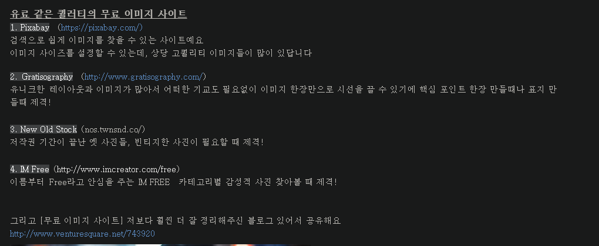
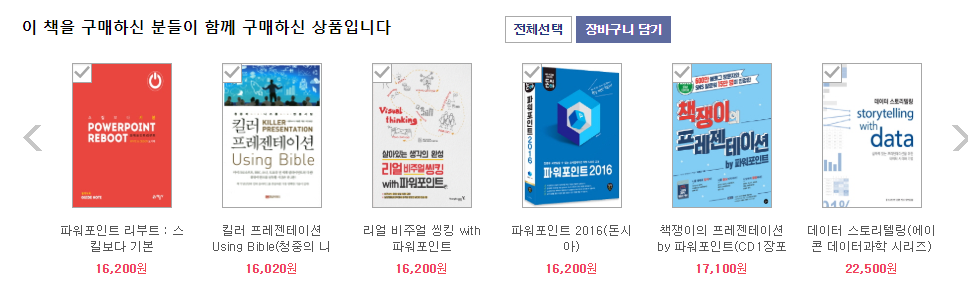
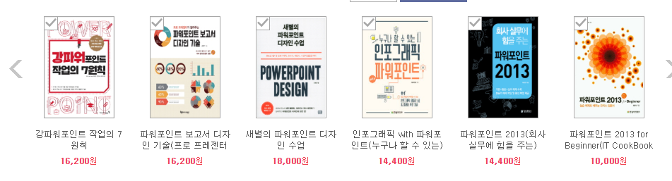

Image &amp; Icon

[https://www.autodraw.com/](https://www.autodraw.com/)

Clipart &amp; Icon

[https://www.reshot.com/](https://www.reshot.com/)

[https://phosphoricons.com/](https://phosphoricons.com/)

아이콘스피디아 [http://www.iconspedia.com/](http://www.iconspedia.com/)

아이콘 파인드 [http://iconfind.co.kr/find/index.jsp](http://iconfind.co.kr/find/index.jsp)

아이콘 파인더 [https://www.iconfinder.com/](https://www.iconfinder.com/)

아이콘스 DB [http://www.iconsdb.com/](http://www.iconsdb.com/)

클립아트 코리아 [http://www.clipartkorea.co.kr/](http://www.clipartkorea.co.kr/)

무료클립아트 [http://www.clker.com/](http://www.clker.com/)

클립아트 포털 [https://openclipart.org/](https://openclipart.org/)

오픈클립아트 [https://openclipart.org/](https://openclipart.org/)

소프트아이콘 닷컴 [http://www.softicons.com/](http://www.softicons.com/)

아이콘아카이브 닷컴 [http://www.iconarchive.com/](http://www.iconarchive.com/)

PNG ING 닷컴

MS Clipart [http://office.microsoft.com/en-us/images/results.aspx?qu=STYLE](http://office.microsoft.com/en-us/images/results.aspx?qu=STYLE)

 -&gt; 추천 검색어 : style 1541, style 1540 , &#160;style 1539 , style 1562 , avatar , avatars, png

ㅇ Googling

  Silhouette or * / + 키워드 + .PNG/.dot 로 검색

  *key word : party streamers, happy birth day, Retro, ribon

                  line drawing / diamond backgraound(pattern) / dot backgraound(pattern)

                  Seat layouts

  키워드 + Background image

  키워드 + clipart

  키워드 + pictogram

  *색상 찾을 때는 Light + color

  [*banner riboon.png](https://www.google.co.kr/search?q=hite&amp;newwindow=1&amp;biw=1920&amp;bih=971&amp;source=lnms&amp;tbm=isch&amp;sa=X&amp;ei=0w50VJ64CJL18QXEqoGgCw&amp;ved=0CAYQ_AUoAQ#newwindow=1&amp;tbm=isch&amp;q=banner+ribbon.png&amp;spell=1&amp;imgdii=_)

  *Filetype:PDF, PPT…..

상 : [https://www.google.co.kr/search?q=ribbon&amp;newwindow=1&amp;biw=1843&amp;bih=918&amp;source=lnms&amp;tbm=isch&amp;sa=X&amp;ei=M1q3VNvfHIi3mwW7_YLQDQ&amp;ved=0CAYQ_AUoAQ#tbm=isch&amp;tbs=rimg%3ACZq-OhUJx_1rPIjh2PcRCyCV2MR7J5AvJsxgiieg2Yta0syex-rqlMcBmOExUZmbdH8yx1o-6t08DXaQsOwzNDxkBSSoSCXY9xELIJXYxEWSYT9do--FUKhIJHsnkC8mzGCIRamfhVoacNoAqEgmJ6DZi1rSzJxEjQdu5h0Ey9yoSCbH6uqUxwGY4EThX9YnuQ-o3KhIJTFRmZt0fzLERGA9wurB2PBUqEgnWj7q3TwNdpBFJ_1A7k8Tx7ASoSCSw7DM0PGQFJEYxZejjojU_1W&amp;q=ribbon&amp;imgdii=_](https://www.google.co.kr/search?q=ribbon&amp;newwindow=1&amp;biw=1843&amp;bih=918&amp;source=lnms&amp;tbm=isch&amp;sa=X&amp;ei=M1q3VNvfHIi3mwW7_YLQDQ&amp;ved=0CAYQ_AUoAQ#tbm=isch&amp;tbs=rimg%3ACZq-OhUJx_1rPIjh2PcRCyCV2MR7J5AvJsxgiieg2Yta0syex-rqlMcBmOExUZmbdH8yx1o-6t08DXaQsOwzNDxkBSSoSCXY9xELIJXYxEWSYT9do--FUKhIJHsnkC8mzGCIRamfhVoacNoAqEgmJ6DZi1rSzJxEjQdu5h0Ey9yoSCbH6uqUxwGY4EThX9YnuQ-o3KhIJTFRmZt0fzLERGA9wurB2PBUqEgnWj7q3TwNdpBFJ_1A7k8Tx7ASoSCSw7DM0PGQFJEYxZejjojU_1W&amp;q=ribbon&amp;imgdii=_)

ㅇ 기업 로고- 외국 기업 Logo 검색 -&gt; Flikr (ex. 검색 : apple logo png)- 국내 기업 Logo 검색 -&gt; KMUG &#160;의 로고 자료실&#160;-&gt; 디자인 내에 로고 자료실이 있음. 자유게시판 형태여서 무료로 다운로드 가능

ㅇ 배경날리기 : [http://clippingmagic.com/](http://clippingmagic.com/)

                    [http://apps.pixlr.com/editor/](http://apps.pixlr.com/editor/)

더나운프로젝트: [https://thenounproject.com/](https://thenounproject.com/) 아이콘 모음

Icons DB

아이콘 몬스터

엔들리스아이콘스

플랫아이콘

ㅇ STYLE 1539~41, 1562

LOGO : 플리커, 국내 - [KMUG](https://kmug.co.kr/bbs/board.php?bo_table=design), [brandsofttheworld.com](http://www.brandsoftheworld.com/)

ㅇ 픽토그램

The noun project [http://thenounproject.com/](http://thenounproject.com/)

ㅇ Google Autodraw

[https://www.autodraw.com/](https://www.autodraw.com/)

Photo &amp; Image

아이스탁 포토   ([www.Istockphoto.com](http://www.istockphoto.com/))

토픽 포토   ([www.topicphoto.com](http://www.topicphoto.com/))

게티이미지    ([www.gettyimageskorea.com](http://www.gettyimageskorea.com/))

Flickr    ([www.Flickr.com](http://www.flickr.com/))

Morguefile   ([www.morguefile.com](http://www.morguefile.com/))

Stock.xchng   ([www.sxc.hu](http://www.sxc.hu/))

Compifht      ([http://compfight.com/](http://compfight.com/))

Everystockphoto   ([www.everystockphoto.com](http://www.everystockphoto.com/))

&#160;

ㅇ Image file로 검색

[http://www.tineye.com/](http://www.tineye.com/)

[http://kr.pictriev.com/facedb/fs2.php](http://kr.pictriev.com/facedb/fs2.php)

[http://www.gazopa.com/](http://www.gazopa.com/)

[구글 이미지 검색](https://www.google.co.kr/imghp?hl=ko&amp;tab=wi&amp;ei=ayF0VLzQKcOF8gXjlILwBA&amp;ved=0CAQQqi4oAg)

ㅇ PPT Study site

[런웨이](onenote:Working%20SUPEX.one#http//cafe.naver.com/runwaypthouse.cafeiframe_url=%2FMyCafeIntro.nhn%3Fclubid%3D19199434&amp;section-id={D16FD285-1829-495A-93E9-71390DD3C8A8}&amp;page-id={88999967-ECC9-4F55-B9A5-1443B72CC792}&amp;base-path=https://d.docs.live.net/733661839cc53ba5/문서/Biz)

+인포그래픽 &amp; 픽토그램 &amp; 잡지 레이아웃&amp;모션그래픽 : 애프터 이펙트

중앙 Guide 선 : Alt + F9

선택창, 개체 숨기기/표시 : Alt + F9

이미지는 PNG, 아이콘은 SVG 파일로 검색

슬라이드쇼 상태에서 Ctrl + 마우스 휠: 바둑판식 배열

모핑 효과 - 프레지 처럼 만들 수 있음

[https://trendw.kr/2016-02262429.t1m](https://trendw.kr/2016-02262429.t1m)

[https://www.sindohblog.com/category/LIFE/%EC%A7%81%EC%9E%A5%EB%85%B8%ED%95%98%EC%9A%B0](https://www.sindohblog.com/category/LIFE/%EC%A7%81%EC%9E%A5%EB%85%B8%ED%95%98%EC%9A%B0)

자료

[https://www.gilbut.co.kr/book/view?bookcode=BN002005&amp;pdscode=pds](https://www.gilbut.co.kr/book/view?bookcode=BN002005&amp;pdscode=pds)

[https://brunch.co.kr/@hyungsukkim/70?fbclid=IwAR05vZFkUFqoa8EtL_HRkus7jN_r5C_eDFqf4Q6j2pvtsUGMK5oSYt6yxDI](https://brunch.co.kr/@hyungsukkim/70?fbclid=IwAR05vZFkUFqoa8EtL_HRkus7jN_r5C_eDFqf4Q6j2pvtsUGMK5oSYt6yxDI)

[아이콘]

[http://icunow.co.kr/freeicon6/](http://icunow.co.kr/freeicon6/)

[https://pixelbuddha.net/](https://pixelbuddha.net/)

[https://tilda.cc/free-icons/](https://tilda.cc/free-icons/)

[https://www.ikonate.com/](https://www.ikonate.com/)

설명 [http://icunow.co.kr/ikonate/](http://icunow.co.kr/ikonate/)

[https://boxicons.com/cheatsheet](https://boxicons.com/cheatsheet)

[로고]

[http://instantlogosearch.com/](http://instantlogosearch.com/)

[http://icunow.co.kr/khroma/](http://icunow.co.kr/khroma/)

&#160;‘[unDraw](http://icunow.co.kr/%EC%BB%AC%EB%9F%AC%EC%97%90-%EB%94%B0%EB%A5%B8-%EB%AC%B4%EB%A3%8C%EB%A1%9C-%EC%82%AC%EC%9A%A9-%EA%B0%80%EB%8A%A5%ED%95%9C-%EB%8B%A4%EC%96%91%ED%95%9C-%EC%9D%BC%EB%9F%AC%EC%8A%A4%ED%8A%B8%EB%A5%BC/)‘는 무료로 사용 가능한 일러스트를 원하는 컬러에 맞춰 다운로드 받을 수 있는 서비스입니다.

출처: &lt;[http://icunow.co.kr/polygon-art/](http://icunow.co.kr/polygon-art/)&gt;

머티리얼 디자인을 위한 색 조합을 만들어주는 ‘Material mixer’

[https://material.io/tools/icons/?style=baseline](https://material.io/tools/icons/?style=baseline)

출처: &lt;[http://icunow.co.kr/%EB%A8%B8%ED%8B%B0%EB%A6%AC%EC%96%BC-%EB%94%94%EC%9E%90%EC%9D%B8%EC%9D%84-%EC%9C%84%ED%95%9C-%EC%83%89-%EC%A1%B0%ED%95%A9%EC%9D%84-%EB%A7%8C%EB%93%A4%EC%96%B4%EC%A3%BC%EB%8A%94-material-mixer/?utm_source=icunow_link_material-icon&amp;utm_medium=cpc&amp;utm_campaign=material-mix](http://icunow.co.kr/%EB%A8%B8%ED%8B%B0%EB%A6%AC%EC%96%BC-%EB%94%94%EC%9E%90%EC%9D%B8%EC%9D%84-%EC%9C%84%ED%95%9C-%EC%83%89-%EC%A1%B0%ED%95%A9%EC%9D%84-%EB%A7%8C%EB%93%A4%EC%96%B4%EC%A3%BC%EB%8A%94-material-mixer/?utm_source=icunow_link_material-icon&amp;utm_medium=cpc&amp;utm_campaign=material-mix)&gt;

[디자인]

[https://principles.design/](https://principles.design/)

[http://icunow.co.kr/%EC%97%90%EC%96%B4%EB%B9%84%EC%97%94%EB%B9%84%EC%9D%98-%EB%94%94%EC%9E%90%EC%9D%B8%EC%9D%80-%EB%8B%A4%EC%96%91%ED%95%9C-%EB%94%94%EC%9E%90%EC%9D%B8-%EA%B8%B0%EC%A4%80%EB%93%A4%EC%9D%84-%ED%95%9C/](http://icunow.co.kr/%EC%97%90%EC%96%B4%EB%B9%84%EC%97%94%EB%B9%84%EC%9D%98-%EB%94%94%EC%9E%90%EC%9D%B8%EC%9D%80-%EB%8B%A4%EC%96%91%ED%95%9C-%EB%94%94%EC%9E%90%EC%9D%B8-%EA%B8%B0%EC%A4%80%EB%93%A4%EC%9D%84-%ED%95%9C/)

[표지]

[http://www.lowpolygonart.com/](http://www.lowpolygonart.com/)

일러스트

[https://undraw.co/illustrations](https://undraw.co/illustrations)

[http://icunow.co.kr/atlasicons/](http://icunow.co.kr/atlasicons/)

Font

[https://news.hada.io/topic?id=11835&amp;utm_source=discord&amp;utm_medium=bot&amp;utm_campaign=280](https://news.hada.io/topic?id=11835&amp;utm_source=discord&amp;utm_medium=bot&amp;utm_campaign=280)

- [imgur](http://www.imgur.com/) [www.](http://www.imgur.com/)imgur.com 사진 공유 서비스, 갤러리 및 회원간 평가 수록.

[http://leehyekang.blogspot.kr/2015/03/floral-frame-powerpoint-template.html?m=1](http://leehyekang.blogspot.kr/2015/03/floral-frame-powerpoint-template.html?m=1)

PPT Form 다운로드

친절한 혜강씨 [http://leehyekang.com/](http://leehyekang.com/)

무료 아이콘 사이트입니다~

[http://www.iconarchive.com](http://www.iconarchive.com)

벡터아트 [https://www.google.co.kr/search?q=%EB%B3%B5%EC%88%98%EC%B4%88&amp;biw=1600&amp;bih=775&amp;source=lnms&amp;tbm=isch&amp;sa=X&amp;ved=0ahUKEwjNsN32gKHJAhVGE6YKHdIXD1IQ_AUIBigB#tbm=isch&amp;q=%EB%B2%A1%ED%84%B0+%EC%95%84%ED%8A%B8](https://www.google.co.kr/search?q=%EB%B3%B5%EC%88%98%EC%B4%88&amp;biw=1600&amp;bih=775&amp;source=lnms&amp;tbm=isch&amp;sa=X&amp;ved=0ahUKEwjNsN32gKHJAhVGE6YKHdIXD1IQ_AUIBigB#tbm=isch&amp;q=%EB%B2%A1%ED%84%B0+%EC%95%84%ED%8A%B8)

Clipart &amp; Icon

아이콘스피디아&#160;[http://www.iconspedia.com/](http://www.iconspedia.com/)

아이콘 파인드&#160;[http://iconfind.co.kr/find/index.jsp](http://iconfind.co.kr/find/index.jsp)

아이콘 파인더&#160;[https://www.iconfinder.com/](https://www.iconfinder.com/)

아이콘스&#160;DB&#160;[http://www.iconsdb.com/](http://www.iconsdb.com/)

클립아트 코리아&#160;[http://www.clipartkorea.co.kr/](http://www.clipartkorea.co.kr/)

무료클립아트&#160;[http://www.clker.com/](http://www.clker.com/)

클립아트 포털&#160;[https://openclipart.org/](https://openclipart.org/)

오픈클립아트&#160;[https://openclipart.org/](https://openclipart.org/)

MS Clipart&#160;[http://office.microsoft.com/en-us/images/results.aspx?qu=STYLE](http://office.microsoft.com/en-us/images/results.aspx?qu=STYLE)

-&gt;&#160;추천 검색어&#160;: style 1541, style 1540 , &#160;style 1539 , style 1562 , avatar , avatars, png

ㅇ&#160;Googling

&#160; Silhouette or * / +&#160;키워드&#160;+ .PNG/.dot&#160;로 검색

&#160; *key word : party streamers, happy birth day, Retro, ribon

&#160;&#160;&#160;&#160;&#160;&#160;&#160;&#160;&#160;&#160;&#160;&#160;&#160;&#160;&#160;&#160;&#160; line drawing / diamond backgraound(pattern) / dot backgraound(pattern)

&#160;&#160;&#160;&#160;&#160;&#160;&#160;&#160;&#160;&#160;&#160;&#160;&#160;&#160;&#160;&#160;&#160; Seat layouts

&#160;&#160;키워드&#160;+ Background image

&#160;&#160;키워드&#160;+ clipart

&#160;&#160;키워드&#160;+ pictogram

&#160; *색상 찾을 때는&#160;Light + color

&#160;&#160;[*banner riboon.png](https://www.google.co.kr/search?q=hite&amp;newwindow=1&amp;biw=1920&amp;bih=971&amp;source=lnms&amp;tbm=isch&amp;sa=X&amp;ei=0w50VJ64CJL18QXEqoGgCw&amp;ved=0CAYQ_AUoAQ)

&#160; *Filetype:PDF, PPT…..

ㅇ 기업 로고

-&#160;외국 기업&#160;Logo&#160;검색&#160;-&gt; Flikr (ex.&#160;검색&#160;: apple logo png)

-&#160;국내 기업&#160;Logo&#160;검색&#160;-&gt; KMUG &#160;의 로고 자료실

&#160;-&gt;&#160;디자인 내에 로고 자료실이 있음.&#160;자유게시판 형태여서 무료로 다운로드 가능

ㅇ 배경날리기&#160;:&#160;[http://clippingmagic.com/](http://clippingmagic.com/)

&#160;&#160;&#160;&#160;&#160;&#160;&#160;&#160;&#160;&#160;&#160;&#160;&#160;&#160;&#160;&#160;&#160;&#160;&#160;&#160;[http://apps.pixlr.com/editor/](http://apps.pixlr.com/editor/)

&#160;

ㅇ&#160;PPT Study site

런웨이

- 인포그래픽

- 픽토그램

- [잡지레이아웃](http://search.naver.com/search.naver?sm=tab_hty.top&amp;where=nexearch&amp;ie=utf8&amp;query=%EC%9E%A1%EC%A7%80%EB%A0%88%EC%9D%B4%EC%95%84%EC%9B%83)

- 모션그래픽

&#160;

플래티콘: [https://www.flaticon.com/](https://www.flaticon.com/) 무료 아이콘

[http://reddreams.tistory.com/1447](http://reddreams.tistory.com/1447)

SVG -&gt; WMF 컨버터 [https://github.com/stjeong/svg/releases](https://github.com/stjeong/svg/releases)

*WMF는 벡터방식으로 조합해서 만든 파일이므로 파워포인트에서 수정가능

&#160;

Photo &amp; Image

아이스탁 포토&#160;&#160; ([www.Istockphoto.com](http://www.istockphoto.com/))

토픽 포토&#160;&#160; ([www.topicphoto.com](http://www.topicphoto.com/))

게티이미지&#160;&#160;&#160; ([www.gettyimageskorea.com](http://www.gettyimageskorea.com/))

Flickr&#160;&#160;&#160; ([www.Flickr.com](http://www.flickr.com/))

Morguefile&#160;&#160; ([www.morguefile.com](http://www.morguefile.com/))

Stock.xchng&#160;&#160; ([www.sxc.hu](http://www.sxc.hu/))

Compifht&#160;&#160;&#160;&#160;&#160; ([http://compfight.com/](http://compfight.com/))

Everystockphoto&#160;&#160; ([www.everystockphoto.com](http://www.everystockphoto.com/))

&#160;

ㅇ&#160;Image file로 검색 구글 이미지 검색

[http://www.tineye.com/](http://www.tineye.com/)

[http://kr.pictriev.com/facedb/fs2.php](http://kr.pictriev.com/facedb/fs2.php)

[http://www.gazopa.com/](http://www.gazopa.com/)

무료 클립아트 찾는 곳&#160;: Microsoft Office Online&#160;클립아트 검색

-&#160;추천 검색어&#160;: style 1541, style 1540 , style 1539 , style 1562 , avatar , avatars, png

=&gt;&#160;마이크로소프트 홈페이지 개편으로 현재는&#160;

[http://office.microsoft.com/ko-kr/images/?CTT=97](http://office.microsoft.com/ko-kr/images/?CTT=97)&#160;에서 이미지 검색이 가능함

[http://www.demitrio.com/?p=5250](http://www.demitrio.com/?p=5250)

- 좋은 서체:&#160;-&#160;클립아트 대체용 서체: WingDings

- 파워포인트 활용소프트전체스토리 트리구조로 짜기: MS-word&#160;개요보기, Freemind(프리웨어)이미지 작업: Photoworks, GIMP

- 글자크기:&#160;-&#160;본문: 14포인트 추천-&#160;제목: 18포인트 추천-&#160;추천글꼴:&#160;서울남산체(추천),&#160;서울한강체(서울시 배포),&#160;아리따체(아모레퍼시픽)-&#160;서체를 같이 저장하기 위해 저장옵션에서 글꼴 포함 선택

- 국내기업로고 구하기KMUG - kmug.co.kr의 로고자료실

- 글로벌기업로고 구하기brandsoftheworld.com, helpai.com

- 고화질의 무료 아이콘 구하기iconfactory - iconfactory.cominterpascelift - interfacelift.com[출처]&#160;[파워포인트](http://blog.naver.com/comsnow96/60139308567)&#160;블루스|작성자&#160;[쭈니](http://blog.naver.com/comsnow96)

이미지 편집툴 : [PhotoWORKS](https://photo-works.net/), [GIMP](https://www.gimp.org/)

템플릿 [https://1boon.daum.net/aplusgirl/20180325_PPTtemplate](https://1boon.daum.net/aplusgirl/20180325_PPTtemplate)

친절한 혜강씨

[http://leehyekang.blogspot.com/](http://leehyekang.blogspot.com/)

[https://www.youtube.com/channel/UCrRm40vhmc8UtbZd8dO79Tg](https://www.youtube.com/channel/UCrRm40vhmc8UtbZd8dO79Tg)

[http://trendw.kr/media/16-011101.t1m](http://trendw.kr/media/16-011101.t1m)

Shift + 오른쪽 하단 기본보기 : 슬라이드 마스터 진입

도형빼기: 중첩된 부분에서 나중에 선택한 도형을 뺀다.

도형빼기로 누끼도 딸 수 있음(단, 노가다)

점편집 조절점 추가: CTR+클릭

일괄 글꼴 바꾸기: 홈 - 바꾸기 - 글꼴 바꾸기

&#160;

&#160;
