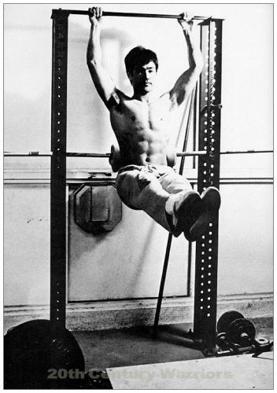
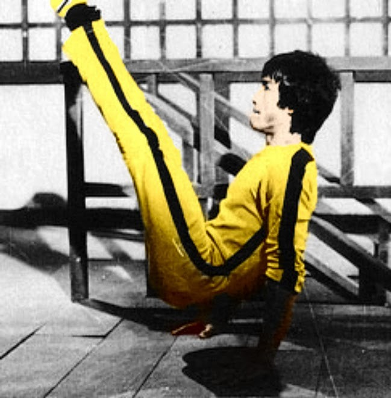
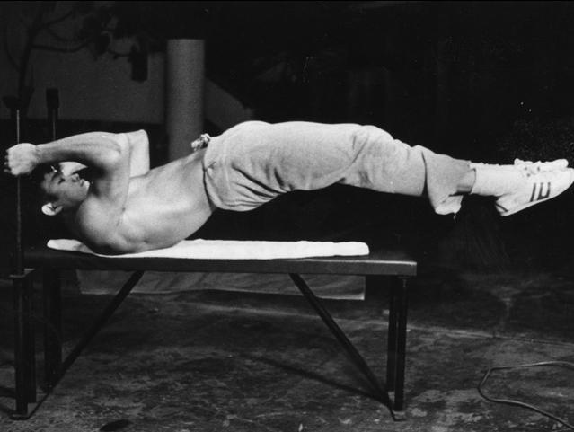

Bruce LEE Training

스쿼트, 풀오버, 컬 기본 동작 3세트씩

                   세트 / 횟수

Clean &amp; Press 2 / 8

Squats 2 / 12

Pullovers 2 / 8

Bench Presses 2 / 6

Good Mornings 2 / 8

Barbell Cuts 2 / 8

1. Clean &amp; Press

&#160;Olympic 바벨을 어깨너비로 잡고, 무릎을 구부린 자세로&#160;스쿼드 자세에서 재빠르게 팔을 낚아채고, 바벨을 가슴에 대고 일어선다.&#160;잠시 정지한 상태로 있다가&#160;바벨을 머리 위로 든다.&#160;잠시 동작을 멈추었다가&#160;바벨을 가슴으로 내리고, 다시 정지.&#160;시작 위치로 돌아와 바벨을 바닥에 내려놓는다.&#160;이 동작을 휴식 없이 8회 한다.&#160;심혈관계와 근력향상을 위해 한 세트를 더 한다.

&#160;

2. 스쿼드

&#160;바디빌딩에서 주요&#160;동작인 스쿼드는&#160;이소룡의 바벨 트레이닝에서 가장 기본이 되는 운동이었다.&#160;그는 스쿼드의 장점과 그 역학적 이론을 여러 차례 글로 썼으며 이 운동의 여러가지 변형 동작들을 훈련하였다.&#160;하지만 대개 일반적인 스쿼드를 행하였으며 바벨을 그의 어깨에 올려놓고&#160;양발은 어깨너비로 벌리고, 중심을 잡고 천천히 풀스퉈드 포지션으로 내려갔다가, 히프와 둔부 그리고 햄스트링과 허벅지 근육에서 힘을 끌어내어 원위치로 돌아오는 방식으로 운동했다.&#160;이소룡은 이 동작을 12회씩&#160;2 세트를 행하였다.

3.&#160;Pullovers

[https://hbrforum.org/2017/09/01/%EC%95%88%EB%82%B4-9%EC%9B%94-%EC%B1%85%EC%9D%BD%EC%96%B4%EC%A3%BC%EB%8A%94%EB%82%A8%EC%9E%90/](https://hbrforum.org/2017/09/01/%EC%95%88%EB%82%B4-9%EC%9B%94-%EC%B1%85%EC%9D%BD%EC%96%B4%EC%A3%BC%EB%8A%94%EB%82%A8%EC%9E%90/)

&#160;벤치에 등을 대고&#160;바벨을 어깨너비로 잡는다*요즘 웨이트 트레이닝에서는 아령을 양손으로 모아 잡고 하는 방법도 있음).&#160;&#160;바벨을 든&#160;양팔을&#160;머리뒤로&#160;바닥에 살짝 닿을 정도까지 죽 내린다. 팔꿈치는 살짝 구부린 상태.&#160;&#160;이렇게 완전히 뻗은 상태에서&#160;활배근과 대흉근, 그리고 삼두근을 이용하여&#160;천천히 원위치로 돌아온다.&#160;&#160;이소룡은 8회씩 2 세트를 행하였다.

&#160;

&#160;

4.&#160;벤치 프레스

&#160;이소룡은 가슴근육 또한 발달했는데,&#160;그의 훈련 기록을 보면 알 수 있듯이, 이소룡은 가슴근육 운동으로 벤치 프레스만을 행하였다.&#160;벤치에 등을 대고 누워,&#160;올림피아 바벨을 어께너비로 잡고 들고,&#160;바벨을 가슴쪽으로 내린다.&#160;숨을 내쉬고 바벨을 밀어 원래 위치로 간다.&#160;이 동작을 6회 하고 조금 뒤에 다시 한 세트를 더했다.

&#160;

&#160;

5. Barbell Curls

&#160;이소룡은 바벨 컬을 벨 에어,&#160;Roscomare Ave. 의 자신의 집에서 운동하였을 뿐 아니라 홍콩에 돌아갔을 떄도 지속적으로 단련했다.&#160;이두박근 운동은 이소룡이 아주 중요시한 운동이었는데 특히 그의 잡아당기는 힘은 엄청나서 스파링 시에 종종 사용했다고 한다.&#160;어깨 너비로 바벨을 잡고 다리는 약간 구부린 채로 이두박근을 이용하여 바벨을 가슴높이까지 들어올렸다.&#160;완전수축 상태에서 잠시 동작을 멈추고 천천히 바벨을 원위치로 내린다.&#160;8회 2 세트 반복.

&#160;

1965년, 이소룡이 홍콩으로 돌아가 머물 당시, 그는 단지 24살이었고, 그가 했던 웨이트 트레이닝 프로그램은 팔운동에 많이 중점을 두고있었는데, 그는 실전 격투에서 자신의 팔과 손의 위치를 자신이 점하고 싶어했다.&#160;당시 이소룡은 이두박근 운동으로&#160;32 kg 에서 36&#160;kg (70 to- 80&#160;lb) 짜리 아령으로 8회씩 3 세트를 했다.&#160;그리고 스쿼드와 푸쉬업, 리버스 컬&#160;reverse curls (손등이 전방을 향하도록 바벨을 잡고 팔꿈치를 구부려 바벨을 들여올림), concentration curls (벤치에 앉은 상태에서 덤벨을 들고, 팔꿈치를 다리 안쪽에 대고 이두근을 수축하여 덤벨을 들어 올림),&#160;French presses (벤치 프레스 자세에서 바벨을 가슴이 아니라 눈 위치로 내리는 동작. 삼두근 운동), 그리고&#160;wrist curls 과&#160;reverse wrist curls 등을 했다.&#160;횟수는&#160;6회에서 12회를 행했다 (당시).

&#160;

이러한&#160;순발력을 기르기 위한&#160;속근을 키우는 트레이닝법을 행하는 동안 이소룡은 근육량이 늘어나 뭄무게가&#160;약&#160;72&#160;kg (160&#160;lb) 까지 늘어났다.

이소룡은 자신의 서재에 책이 2천5백여권이나 있었는데, 그는 당시 &quot;강한 근육은 큰 근육에서 그 힘이 나온다.&quot; 라고 생각했다 (하지만 나중에&#160;이 사실에 의문을 가진다).

또한 이소룡은 손아귀 힘과 펀치력을 키우기 위해서&#160;전완근(팔뚝) 트레이닝에 열중하였다.&#160;그는 전완근 운동을 매일 하였으며, 그의 부인 린다에 의하면, 이소룡은 전완근 운동 매니아로, 어떤 프로 바디빌더가 전완근 강좌를 열면 바로 신청했을 거라 한다.&#160;또한 그는 샌프란시스코의 친구 조지 리에게 &quot;악력 훈련기&quot; 를 만들어 달라고 다지인까지 해서 보내기도 했다고한다.&#160;이에 조지 리는 그런 운동기구를 만들어 하나는 이소룡에게 보내고 다른 하나는 자신이 사용햇다고 한다.&#160;그리고&#160;Allen Joe 에 따르면, 이소룡은 항상 팔 근육을 단련하는데 힘을 쏟았으며, TV 를 보면서도 바벨을 들고 Wrist curls 를 하고, 이어서 복근운동을 하고, 다시 전완근 운동을 했다고 한다.&#160;이소룡이&#160;가장 좋아한 동작은 Zottman curl 로 (발은 어깨너비로 벌리고 서서, 양손에 각각 덤벨을 손바닥이 전방으로 향하게 들고, 팔꿈치를 고정한 채 들어올린다. 그 상태에서&#160;손바닥이 전방을 향하도록 손목을 돌리고 천천히 손을 내림), &#160;이소룡은 이 운동을 시도때도없이 했다고 한다.

&#160;“브루스 리는 항상 가벼운 아령을 손에 들고 섀도우 복싱을 했습니다.&#160;&#160;그리고 12 종류의 펀치를 이어서 하는 훈련을 했지요.&#160;한 종류의 펀치는 100회로, 아령도 피라미드식으로 1 파운드에서 2, 3, 5, 7, 그리고 10 파운드까지 들고 했습니다.&#160;&#160;그리고 다시 아령 무게를 거꾸로 내려가면서 같은 방식으로 섀도우 복싱을 했고, 마지막에는 아령을 들지 않고 맨손으로 했지요.&#160;브루스는 저한테도 이 훈련을 하라고 시켰습니다. 휴!&#160;상체부위는 완전히 녹초가 되었지요.&quot;

&#160;

이소룡은 특히 홍콩으로 돌아가 영화에 매진할 떄도 특히 집에 있을 떄에는&#160;덤벨을 손에서 놓지 않았다고 한다.&#160;린다에 의하면 이소룡은 집에서 TV 로 복싱경기를 보면서 다리를 찢고, 한손에는 덤벨로 운동을 하고 한 손에는 책을 들고 책을 읽었다고 한다.

&#160;

&#160;

이소룡은 하루 약 4 시간 정도, 그것도 아주 강도 높은 운동을 했는데, 아침 7시부터 9시까지는 복근 유연성 운동과 달리기를 하였고, 한 시간 휴식 후 11시부터 12시까지 웨이트 트레이닝을 하고 자전거를 탔다.&#160;이소룡은 2마일에서 6마일을 15분에서 45분 동안 뛰었으며, 3-5분 간격으로 달리는 속도를 달리하였다.&#160;또한 이소룡은 규칙적으로 실내자전거로 10마일(약 15&#160;킬로미터) 을&#160;45분 동안 타며 심폐운동도 게을리 하지 않았다.

&#160;

&#160;

그는&#160;몇 가지 트레이닝&#160;routines 과 내용을 만들었는데, 트레이닝과 바디빌딩에 효과적인 줄넘기도 포함시켜,&#160;자전거 타기를 하고 줄넘기를 800회씩 했다.

그는 복근 훈련에 특히 열중하였으며, 윗몸 일으키기는 물론,&#160;크런치와&#160;로만 체어 운동 Roman chair&#160;(역시 복근운동으로 기구 위에 자리를 잡고 복근 또는 허리쪽 등근육 부위를 운동할 수 있다), 그리고 다리 들어올리기와&#160;V-up 등을 했으며, 트레이닝을 하지 않을 떄에도 TV 등을 보면서 윗몸 일으키기나 복근 운동을 했다고한다.

&#160;

척 노리스 Chuck Norris 가 한번은 이소룡의 집에 놀러 갔을때&#160;이소룡은 누워서 덤벨을 양팔로 좌우로&#160;들어올리며 가슴근육 운동을 하면서 배 위에서는 그의 아들 브랜든이 뛰어놀고, 동시에 다리를 들어올리며&#160;복근 운동을 하고 TV 를 보고있었다고 한다.

이소룡의 트레이닝 노트에는 &#39;허리 트위스트 - 90회 4세트, 싯업 sit-up 트위스트 - 20회 4세트, 다리 들어올리기 - 20회 4세트, 리닝&#160;트위스트 - 50회 4세트, 개구리점프킥 - 50개 4세트&#39;&#160;식의 복근 단련 운동 과정이 적혀 있었고,특히 벤치에 누워 어깨 힘과 배, 등의 힘만으로 몸을 거의 &#39;공중에&#160;수평으로 유지하는 동작&#39; 인&#160;&#39;드래건 프래그 dragon flag&#39;&#160;은 이소룡이 개발한&#160;복근 단련법으로 그의 복근 단련에 빠지지 않고 들어갔다.

“브루스 리는 덤벨을 들고 선 자세에서 수평으로 팔을 뻗는 동작을 하는데, 56 kg&#160;을 수평으로 들고 서 있는 것을 본적도 있습니다.&quot;

이소룡의 제자 제시 글로버도

&#160;&quot;브루스는 32kg 짜리 덤벨을 한 손으로 들고 옆으로 어꺠높이까지 들어올려서 그 상태로 몇 초간 있었지요. 덤벨을 거기까지 들어올릴 수 있는&#160;사람도 저는&#160;본적이 없습니다.&quot;

&#160;

용상 150 kg 을 들며 1894년 유럽 역도 챔피언인 Karl Abs 가 같은 동작으로 40 kg 을 들어올린 것이 세계기록이라고 한다.

“브루스 리는&#160;bicep curls 을 하는데&#160;36 kg 짜리 덤벨로 8회를 하였는데, 이는 50 kg 덤벨로 1회 하는것과 같은 운동량이며&#160;55 kg 에서 63.5 kg&#160;의 몸무게를 가진 사람으로서는 자신의 힘을 100 % 다 쓴것과 같습니다.&quot;

영양섭취

&#160;

이소룡의 부인 린다 리 커드웰 부인에 따르면, 이소룡은 미국에 오자 곧바로 영양섭취를 신중하게 생각하여 건강식이나 고단백 음료, 비타민과 미네랄 보충제 등에 많은 관심을 보였다고 한다.

&#160;

이소룡은 햄버거나 피자 같은 정크 푸드나 인스턴트 식품 등으로는 고효율의 몸을 만들기 어렵다고 생각하였고, 또한 정제된 밀가루도 칼로리만 제공할 뿐 자신의 몸에 아무런 이득도 없다고 멀리하였다.

&#160;

이소룡은 매일 야채와 과일을&#160;섭취하였으며&#160;항상 중국음식이나 다른 아시아 나라들의 다양한&#160;음식을 선호하였다.&#160;중국음식으로는&#160;굴소스를 뿌린 쇠고기나 두부 그리고 스테이크와 간요리를 즐겨먹었다고 한다.&#160;또한 이소룡은 영양보충제에&#160;많은 관심을 보였는데, 그는&#160;비타민 C, 과립 레시틴 Lecithin, 벌 화분 bee pollen, 비타민 E, 로즈 힙 오일 rose hip oil (들장미 열매 오일), wheat germ oil (소맥 베아 오일.&#160;비타민 A,&#160;E가 풍부), Acerola — C 와 B-Folia 등을 섭취하였다.&#160;반면 이소룡은 근육을 만드는데 우유와 계란을 섭취해야 한다는 것을 알고 있었지만 그는 유제품을 싫어하여서&#160;시리얼이나 단백질 분말을 먹을때만 우유를 넣어 먹었고 평상시에는 분유를 섭취했다고 한다.

&#160;

이소룡의 식단에는 단배질 음료도 포함되었는데, 그는&#160;매일 한 두잔의 단백질 음료를 마셨는데, 나중에는 그만두었다고 한다.&#160;단백질 음료로는 대개 분말 우유로 다른 제품보다 칼슘 함유량이 많은 제품을 섭취하였고, 그외에 계란, 밀 씨눈, 땅콩잼, 바나나와 레시틴 보충제를 섭취했다.

&#160;

린다에 따르면 이소룡의 허리는 26-28 인치를 왔다갔다 했다고 하는데, 그는 믹서기로 사과를 비롯한 각종 과일과 셀러리, 당근과 각종 야채를 넣어 쥬스로 만들어 마셨다고 한다.&#160;이소룡은 신체의 특정부위의 사이즈와 식사 횟수는 중요하다고 여겼는데, 그는&#160;하루에 많은 양의 식사를 두 번하는 것 보다, 소량의 식사를 네 번에서 다섯 번 했으며&#160;하루 종일 과일과 같은 건강음식을 조금씩 먹으면서 신진대사를 활발히 했다.

&#160;과일과 야채는 탄수화물이 풍부하였고,&#160;이소룡은 특히 당근을 높이 여겨서 그가 만드는 음료의 절반이 당근이었다고 한다.&#160;이소룡이 야채와 과일을 쥬스로 만들어 마시는 이유는 그렇게하면 인체에서 더 수월하게 영양분을 흡수하리라 여겼기 때문이라한다.&#160;이렇게 갈아서 음료로 만든 쥬스에 함유된 효소는 신진대사와 영양분 흡수를 향상시키는 촉진제 역할을 하는데, 요리를 할 경우 이 효소들이 다 파괴된다하여 이소룡은 과일과 야채를 익히지 않고 날것을 먹었다.

&#160;또한 이소룡은 고농축 비타민 B5(판토텐산 pantothenic acid: 항체형성에 중요한 역할을 하고, 비타민의 활용을 돕고 지방, 탄수화물 및 단백질의 에너지 전환을 도움) 와 비타민 B6(피리독신 pyridoxine: 아미노산 대사와 단백질 합성에 관여), 아세틸콜린&#160;(acetylcholine),&#160;그리고 신속하게 에너지를 공급하는 18가지 아미노산과 같은 복합 B 비타민을 섭취하기 위해 인삼과 로얄 젤리를 자주 섭취하였다.&#160;전통 한의학에서 인삼은&#160;혈액순환에 좋고, 혈행을 도우며,&#160;몸이 자극을 받거나 피로해졌을때 피로회복을 돕는다고 해서 이소룡은 인삼도 자주 섭취했다.&#160;그리고 이소룡은 규칙적으로 차를 마셨는데, 대개 꿀을 넣거나 우유에 설탕을 넣어 마셨다.

클린 &amp; 프레스

클린 &amp; 프레스가 무었인지 생소하신 분들이 많으실 텐데, 이것은 간단하게 데드리프트 + 오버헤드 프레스가 합쳐진 형태로, 역도의 용상에서 주저 앉는 부분을 뺀 것 이라고 생각하시면 됩니다. 용상에서는 바벨을 가슴위까지 들면서 한번 주저 앉은 다음 일어서는데, 이소룡은 바벨을 들어 서 있는 자세로 가슴까지 올려 그래도 오버헤드 프레스 한것 입니다. 이것은 그가 따로 스쿼트를 했기 때문에 주저앉는 부분을 뺀 것이라 추측 됩니다.&#160;

이 운동의 효과는 이루 말할 수 없습니다. 가슴, 어깨, 다리, 등, 이두, 삼두, 몸통 등 모든 근육이 동시에 발달됩니다. 이 운동의 생명은 스피드와 템포에 있으므로, 각 개별적 근육의 큰 벌크를 만들기는 어렵지만, 체조선수들과 같은 유연성과 파워가 조화로이 갖추어 질 수 있도록 해줍니다.

이소룡이 이 운동을 가장 처음 루틴으로 넣은것은, 이 운동이 전신의 모든 근육을 사용하기 때문일 것 입니다. 모든 근신경을 마음대로 움직일 수 있는 이소룡 입장에서는, 자신의 근육이 가장 신선한 (지치지 않은) 상태에서 전신운동을 해야만 최상의 순발력 결과를 가져올 수 있다고 믿었을 것 입니다.&#160;

사실 이 운동은 파워바디에서 엄청나게 강력 추천하고 싶은 운동입니다. 벤치프레스, 데드리프트, 스쿼트보다 한수 더 높게 쳐주는 운동법입니다. 이것은 근육의 모양새를 다듬기 전에, 전신의 조화로운 근육사용능력을 (motor coordiation) 길러주어 고도의 중량을 마음 먹은대로 느낄수 있도록 &#39;쥐어짜게&#39; 해주며, 또한 심폐기능 향상에도 대단한 영향을 주기 때문입니다.&#160;

하지만 클린계통의 운동은 일반 체육관에서 하기에는 약간 무리가 있을수 있는 운동입니다. 이 운동은 올림픽 바벨로 하기 때문에 좁은 체육관에서는 자리를 아주 많이 차지하며, 중량이 점점 증가함에 따라 주변 사람들에게 위협적으로(?) 보일수 있습니다. 또한 이것은 바벨을 지면에 세게 내려 놓기가 쉬우므로, 이런 동작이 큰 운동들은 요즘 신새대(?) 관장님들이 좋아하지 않습니다.&#160;

스쿼트

여러 기록들을 보면 이소룡이 가장 극찬했던 운동은 바로 스쿼트 입니다. 이소룡이 생전에 남긴 무술 트레이닝 자료들에 가장 많이 언급이 된 운동이 바로 스쿼트라 하지요. 그는 스쿼트를 무척이나 다양한 방법으로 시도해보고 소화 했다고 합니다.&#160;

이소룡은 하체의 파워없는 상체의 스피드는 아무 의미가 없다는것을 잘 아는 무술인 이엇습니다. 그는 스탠드보다 풀 스쿼트를 선호했다고 하는데, 이것은 그가 정석적인 스쿼트를 통해서도 충분히 근력과 순발력 모두를 잡을 수 있었기 때문이었겠지요.

그가 얼마만큼의 중량으로 이 운동을 했는지 알 수는 없지만, 아마도 클린&amp;프레스의 전신근육 풀어주기후, 이 스쿼트를 꽤 무겁게 하여 하체를 강화 했으리라 짐작됩니다. 만일 그러했다면 이소룡은 다리의 힘 뿐만 아니라 무거운 스쿼트에서 얻어지는 몸통의 힘 (허리)도 무척 중시했다는 것을 알 수 있습니다. 이것은 나중에 하게되는 굳모닝에도 연결됩니다.&#160;

풀오버

주로 광배근 발달에 막대한 영향을 주는 이 운동은 상체의 순발력을 위해 벤치프레스보다 더 놀라운 위력을 발휘하는 운동입니다. 무술수련에 있어, 튕겨주고, 밀고 당기고 내려 찍고 들어 올리는 상체 파워의 뿌리는 바로 광배근에서 나온다 할 수 있습니다. 이것을 잘 아는 이소룡은 광배근 트레이닝을 위해 풀오버를 가장 신경 썻던 것임이 틀림 없습니다. 그의 전체적인 체구에 비해 지나치게 비대한 그의 광배근을 보면 그것이 절대 그냥 나온것이 아님을 알 수 있습니다.&#160;

물론 풀오버는 광배근만을 다루지는 않습니다. 이두와 삼두, 어깨 삼면, 그리고 가슴과 복부까지 무척 많은 상체근육을 써야지만 완전히 그 효과를 볼 수 있는 운동입니다. 어찌 보면 상체의 순발력만을 놓고 본다면 풀오버가 벤치 프레스보다 더 많은 장점을 가진 운동이라 할 수 있습니다. 하지만 풀오버는 벤치프레스와 달리 관절을 회전시키는 동작이 있기 때문에, 벤치프레스에 비해 상대적으로 중량제한이 따르게 됩니다.

추측컨데, 아마도 이소룡은 풀오버를 스쿼트와 슈퍼세트로 조합하여 사용했던것 같습니다. 이소룡이 풀오버를 스쿼트와 슈퍼세트로 같이 했다는 기록은 어디에도 없습니다. 하지만 스쿼트와 풀오버의 슈퍼세트조합은 1960~70년대 일종의 공식처럼 아주 흔하게 행하여 지던 것 이었습니다. 이소룡의 실전 웨이트 트레이닝의 지식은 주로 당시의 보디빌딩 잡지와 주변의 선수급 친구들에게서 얻었다는 점을 감안하면, 이소룡도 당연히 그렇게 했으리라 짐작이 갑니다.

또한 자신을 극한의 상태로 몰아가기를 좋아하는 이소룡의 성격에 비추어 볼 때도, 스쿼트와 풀오버의 초고강도의 슈퍼세트 조합이야말로 그에게 상당한 만족감을 줄 수 있는 트레이닝법이라는것은 짐작하기 어렵지 않을것 입니다.&#160;

결국 이것이 무술수련에 있어서도 상체와 하체의 움직임을 조화로이 통일 시킬수 있는 순발력을 위해 가장 힘들고 효과적인 구성이라고 할 수 있겠습니다. 혹자는 스쿼트 + 벤치프레스가 가장 막강하지 않겠는냐 하겠지만, 이소룡의 입장에 있어서 벤치프레스는 그 단순한 메카니즘으로 (오직 푸시)로 인해 풀오버보다 활용도가 떨어졌을 것 입니다.&#160;

벤치 프레스&#160;

이소룡의 가슴근육 세퍼레이션을 보면, 그가 벤치프레스에도 대단한 일가견이 있음을 알 수 있습니다. 가슴 외곽과 내부의 근육형태를 보면 그가 충분히 벤치프레스를 통해 가슴근육을 단련해 왔을음 알 수 있습니다.

하지만 광배근에 비해 가슴근육이 상대적으로 빈약해 보이는것은 사실입니다. 이것은 아마도 이소룡이 벤치프레스를 &#39;가슴 사이즈&#39;를 위한 운동이 아닌, 그 푸싱 메카니즘상 펀칭 파워의 도구로 사용했기 때문일 것 입니다.

광배근의 경우 그 위치로 인해 방어시 상체를 버티게 해주고 상대를 밀어 부칠 수 있게 해주는 지지목의 역할을 합니다. 그런데 벤치프레스에서 단련되는 가슴과 어깨는 그 연결성으로 인해 스피드를 중시한 펀치시 유용히 사용될 수 있습니다.&#160;

이로써 이소룡이 풀오버를 전통적인 웨이트 트레이닝 법대로 대체적으로 무겁고 강하게 트레이닝 했음을 알 수 있으며, 벤치프레스는 상체의 유연성과 스피디한 펀칭능력을 위해 적은 무게로 최대한 빨리 진행했음을 알 수 있습니다. 그래서인지 대체적으로 이소룡은 벤치프레스 만큼은 특별한 변형을 하지 않고 스탠다드 식으로 했다고 합니다.&#160;

굳모닝

이소룡이 왜 1970년에 웨이트 트레이닝을 그만 두었는지에 관한 정확한 근거자료는 없지만, 아마도 틀림없이 굳모닝 트레이닝 때문일것 입니다.&#160;

이소룡은 전통적인 방식대로 굳모닝을 허리 강화 때문에 하였습니다. 그런데 1970년 어느날 이소룡은 자신의 몸무게와 똑같은 61kg을 (큰 원판 2개와 작은 원판 2개) 바벨 양쪽에 적재하고 특별한 워밍업 없이 늘 하던대로 상체가 지면과 평행이 되도록 굳모닝을 하였습니다. 그가 마지막 8회를 끝마쳤을 때, 이소룡은 척추에서 &#39;뚝&#39; 하는 소리를 들었고, 그것은 그의 척추의 천골 4번째 부위신경을 크게 상처를 준것 이었습니다.

이후로 이소룡은 허리에 일반인의 상상을 초월한 엄청난 통증을 느끼며 살아가야 했다고 합니다. 그의 아내 린다의 말에 의해도 옆에서 지켜보기 차마 혹독할 정도의 고통이었다 합니다. (여담이지만 이소룡이 72년 약물 중독으로 사망한 원인중 하나가 바로 이 척추손상으로 인한 과다 약물투여가 아닌가 합니다.)&#160;

이소룡의 허리 부상원인은 어느날 우연히 덜컥 일어난 일이 아니라, 오랜기간에 걸쳐 조금씩 미세한 부상이 겹쳐오다가 발생한 예견된 사고 였던것 같습니다. 이미 자신의 몸컨디션에대해 누구보다 잘 이해를 하고 있었으며, 스스로도 트레이닝의 달인이었던 이소룡은, 단순히 워밍업을 안했다는 이유로 허리를 다쳤을 리는 없었을것 입니다. 자신의 몸에 철저하고자 했던 그의 무한한 정신력이, 어쩔 수 없는 한계를 지닌 육신을 짓눌러 버린것 이겠지요.&#160;

후에 이소룡은 크게 자신의 굳모닝 트레이닝을 후회하며, 가까운 지인에게 오직 빈 바만을 가지고 굳모닝 할것을 권유했다 합니다. 굳모닝은 단순히 구부렸다 펴는 유연성 운동이지 힘을 기르는 운동이 아니라는 경험을 설파하면서 말이지요.&#160;

만일 이소룡이 처음부터 꾸준히 데드리프트를 해왔다면 그런 일이 벌어졌을까 하고 반문을 해보기도 합니다. 하지만 이소룡은 나름대로 데드리프트가 자신의 무술 트레이닝 철학에 부합하지 않는다고 생각했을 것 입니다. 역동적이고, 큰 몸통의 움직임을 좋아했던 이소룡의 성격을 볼 때, 직선적으로 힘만 주고 버티는 데드리프트보다, 좀더 복잡한 운동반경을 지닌 풀오버 + 굳모닝을 선택한 것이 아마도 당연한 이치였을 것 입니다.&#160;

바벨 컬&#160;

이소룡이 가장 좋아 했던 운동이 바로 바벨 컬이라 합니다. 찌르기나 펀치의 빠른 타격회수를 위해서 필수적인 이 운동은, 그의 실전 무술 철학과 가장 직접적으로 연관이 되는 운동이 아닌가 합니다.&#160;

이소룡의 이두근육이 위 아래 안쪽 바깥쪽 할것 없이 고른 밀도를 보이고 있다는 점을 미루어 볼때, 그는 이운동에 있어서 여러가지 변형을 가져가며 트레이닝 했을것 이라고 짐작됩니다. 예를 들자면 다리 스탠스, 좌우 손의 넓이, 어깨를 내미는 정도, 혹은 그립 등등 말 입니다.&#160;

그 외의 트레이닝

근력기초를 쌓기위한 웨이트 트레이닝은 아니지만, 이소룡이 흔히 실행하던 실전 무술 훈련중 하나가 바로 덤벨 쉐도우 복싱이었습니다. 이소룡은 펀칭 연습시 12세트, 각 100회의 펀칭을 (한손당 100회) 덤벨을 쥐고 했다고 합니다. 그리고 덤벨의 무게는&#160;

1세트 : 0.5kg&#160;

2세트 : 1kg,&#160;

3세트 : 1.5kg,&#160;

4세트 : 2.5kg,&#160;

5세트 : 3.5kg,&#160;

6세트 : 5kg,&#160;

7세트 : 5kg,&#160;

8세트 : 3.5kg,&#160;

9세트 : 2.5kg,&#160;

10세트 : 1.5kg,&#160;

11세트 : 1kg,&#160;

12세트 : 0.5&#160;

이후는 빈손으로 펀칭&#160;

이었다 합니다. 각각 100회라면 정말 대단하지 않습니까? 엄청난 펌핑에서 오는 버닝을 생각해 보고, 또 이것이 웨이트 트레이닝에 맞물려 돌아갔다는것을 보면 정말 그가 몸관리를 얼마나 철저히 해왔는지 이해할 수 있을것 입니다. (이소룡이 AB형 이었는가?)&#160;

또한 이소룡은 복부근육에 있어 지나치리라 만큼 광적인 집착도를 가지고 있었다 하는데, 아내 린다가 전하길, 이소룡은 집에서도 틈만 있으면 아이들과 놀아주면서, 혹은 TV를 보면서 끊임없이&#160;

싯업&#160;

크런치&#160;

레그 레이즈&#160;

V-업&#160;

로만체어 활용&#160;

을 했다고 합니다.&#160;

[https://www.youtube.com/watch?v=LADmzAZQwnU](https://www.youtube.com/watch?v=LADmzAZQwnU) 이소룡 트레이닝

[https://www.youtube.com/watch?v=vdJMItbm0WQ](https://www.youtube.com/watch?v=vdJMItbm0WQ) 드래곤 플래그

이소룡의 必勝 웨이트 트레이닝 (화 목 토)

&#160;

클린 &amp; 프레스 2세트 8회

&#160;

바벨 스쿼트 2세트 12회

&#160;

바벨 풀 오버 2세트 8회

&#160;

바벨 벤치 프레스 2세트 6회

&#160;

굳&#160;모닝 2세트 8회

&#160;

바벨&#160; 컬 2세트 8회

&#160;

lat pull down과 lat pull up을 병행하시고

push up을 비롯해서 shadow boxing을 해보세요

&#160;

&#160;

&#160;

근력기초를 쌓기위한 웨이트 트레이닝은 아니지만

이소룡이 흔히 실행하던 실전 무술 훈련중

하나가 바로 덤벨 쉐도우 복싱이었습니다

이소룡은 펀칭 연습시 12세트 각 100회의 펀칭을 (한손당 100회) 덤벨을 쥐고 했다고 합니다

그리고 덤벨의 무게는

1세트 : 0.5kg

2세트 : 1kg

3세트 : 1.5kg

4세트 : 2.5kg

5세트 : 3.5kg

6세트 : 5kg

7세트 : 5kg

8세트 : 3.5kg

9세트 : 2.5kg

10세트 : 1.5kg

11세트 : 1kg

12세트 : 0.5

이후는 빈손으로 펀칭 이었다 합니다.

&#160;

각각 100회라면 정말 대단하지 않습니까? 엄청난 펌핑에서 오는 버닝을 생각해 보고, 또 이것이 웨이트 트레이닝에 맞물려 돌아갔다는것을 보면 정말 그가 몸관리를 얼마나 철저히 해왔는지 이해할 수 있을것 입니다. (이소룡이 AB형 이었는가?)&#160;

&#160;

V-업 복근 훈련

또한 이소룡은 복부근육에 있어 지나치리라 만큼 광적인 집착도를 가지고 있었다 하는데, 아내 린다가 전하길,

이소룡은 집에서도 틈만 있으면 아이들과 놀아주면서, 혹은 TV를 보면서 끊임없이

싯업

크런치

레그 레이즈

V-업

로만체어 활용 을 했다고 합니다.&#160;

&#160;

단련

&#160;

두다리 벌리기

팔 굽혀펴기

제자리 달리기

어깨회전

높이차기

무릎 깊이 굽히기

옆 차 올리기

복근 비틀기

허리 뒤틀기

상반신 앞으로 굽히기

줄넘기

&#160;

보충 트레이닝

&#160;

1. 월 수 금

&#160;

A. Rope Jumping

B. Forward Bend

C. Cat Stretch

D. Jumping jack

E. Squat

F. High Kick

&#160;

2. 화 목 토

&#160;

A. Leg raises

B. Reverse Curl

C. Sit-up twist

D. Leverage Bar twist

E. [Altermate leg raise](https://www.youtube.com/watch?v=Hp8rPGLHRWc)

F. Wrist Roller

&#160;

파워 트레이닝

&#160;

A. [Press lockout](https://www.youtube.com/watch?v=XwAtRONAdHE)

B.&#160;Press strart

C. Rise on toes

D. Pull

E. Squat

F. sgrug

G. Dead lift

H. Quarter squat

I. [Frog Kick](https://www.youtube.com/watch?v=8zOu9nFiMmA)

&#160;

그리고 차승원이나 이소룡 같이 우람하진 않아도 단단하고 균형있는 근육을 마들려면

18개에서 20개 정도 할 수 있는 무게의 기구로 4세트 정도를 권합니다

보디빌딩 중급자라면 7세트 ㅈ어도 권할수도 있구요

덤벨컬 같은 경우는 10세트도 할수만 있다면 나쁘진 않겠군요

하루에 우유3컵 , 달걀 2개(노른자 빼고 3개정도 좋음)

두유 2컵 두부는 무조건 자주 치즈간식 콩반찬 굿

이렇게 고단백의 식생활을 하시는 것이 좋습니다

감자들을 자주 먹을수 있음 자주 드시구요

&#160;

팔굽혀 펴기

&#160;

일단 양손을 모읍니다

그래서 양손의 엄지와 약지로 삼각형 모양이 나오게

손을 모은후에 그 삼각형 안의 땅에 코가 닿도록

몸을 내렸다가 올리는 거죠

이소룡은 매일 100회씩 했따고 하네요

가슴근육은 팔굽혀펴기 할때 다리를 의자에 올리고

팔은 어깨넓이보다 조금 넓게 펴시고(그럼 어깨도 넓어져서 떡대가 굿이됩니다)

&#160;

스트레치 푸쉬업

&#160;

손을 두개의 의자 위에 놓는다

충분히 강하다면 받로 그렇게 한다

스트레치된 자세로 몸을 낮추지만 너무 깊어서 어깨가 다치지 않게 한다

그상태를 유지하라

당신의 근육은 수동착암기처럼 흔들릴 것이다

쓴 웃음을 지으며 고통을 참고 무너져서 어깨를 다치기 전에 일어서는 것을 잊지말라

[https://www.youtube.com/watch?v=VZPZZSLJ4fY](https://www.youtube.com/watch?v=VZPZZSLJ4fY)

[복근운동](https://youtu.be/KfvrfhffdH4)

[https://www.youtube.com/results?search_query=bruce+lee+training](https://www.youtube.com/results?search_query=bruce+lee+training)
