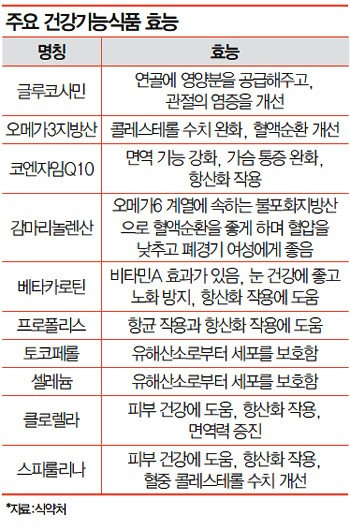
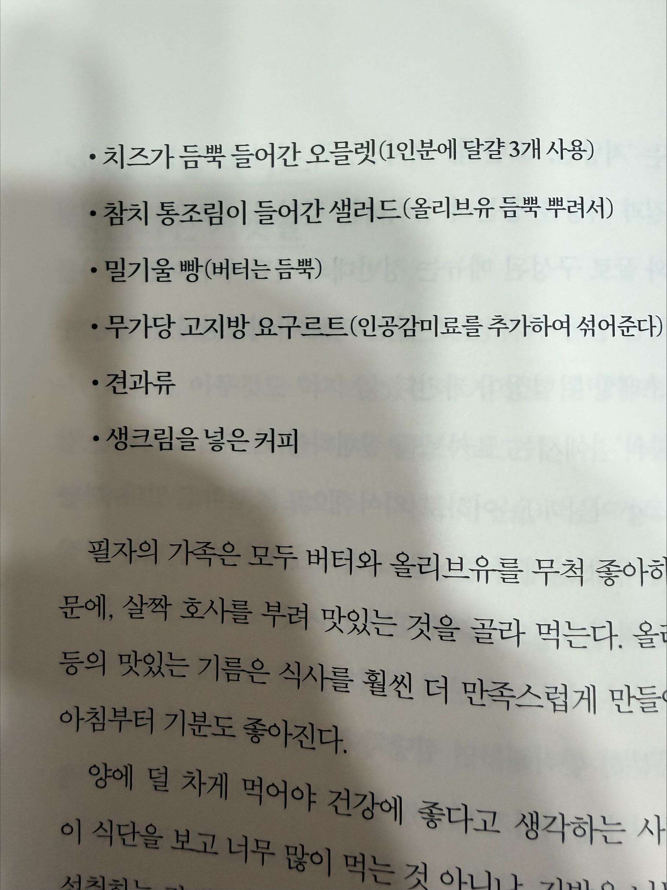

Diet_원시 식단

Daily Diet

[Appetizer] 견과류 + CAA + 토마토 + 마늘 + 영양제

[Main] 보충제/ 마라샹궈/ 고등어/ 닭가슴살/  [통닭다리살](https://m.dakbro.shop/surl/p/286?utm_source=meta&amp;utm_medium=display&amp;utm_campaign=adv&amp;utm_content=img_special_100_1&amp;fbclid=PAAab3daahZQKuEt6yrWSn9nDb0Uo-xcobRICmuvdUoOyRlHcHVaFn0fWkJqc_aem_AQcXLq4ZOdzVtNwkxS4DUCZbXavjQStn4GZEXciq4MHt2PkW8U5VGtjSN8xq2W7i8DkeCgT3TRyu_eXUUfzTEmTU)

송이/목이 버섯, 버섯 탕수, 샐러리, 샐러드, 두부,

[Dessert] 당근/ 오이/ 영양제/ 바질시드(포만감, 30x)/ 시나몬/ 코코아분말/ 치아시드(슈퍼푸드, 15x), 곤약국수, 레미레미 [땅콩버터](https://m.remyremy.co.kr/product/%EB%A0%88%EB%AF%B8%EB%A0%88%EB%AF%B8-%EC%A7%9C%EB%A8%B9%EB%8A%94-%EA%B7%B9%EA%B0%95%EC%9D%98-%EB%95%85%EC%BD%A9%EB%B2%84%ED%84%B0-250g-25g-x-10%EA%B0%9C%EC%9E%85/20/category/1/display/3/?fbclid=PAZXh0bgNhZW0BMABhZGlkAasWeshHpuYBplIZxQuAtnDfKU7TiZvqPZpyZPnYPst6UB1ms3IgbwevAj9UKFiOz-tvhQ_aem_Ix1d6qPlFZ8n_eWERccc2Q#none)

[잠자기 진전에 추가로 뭔가 먹어야 한다면] 바나나, 견과류, 카제인 프로틴, 그릭 요거트, 젤리

집중력/에너지 필요 할 때

초콜릿 대신 고구마

단백질 강화 두유(매일유업)

집에서 단거 너무 땡길 때
젤리, 널담, 마이노멀, 버섯치킨, 샤인머스캣[아이즈프로틴바](https://idea-nutrition.com/product/%EC%9D%B4%EB%8D%B0%EC%95%84%EB%89%B4%ED%8A%B8%EB%A6%AC%EC%85%98-%EC%95%84%EC%9D%B4%EC%A6%88%ED%94%84%EB%A1%9C%ED%8B%B4%EB%B0%94-3%EC%A2%85-1%EB%B0%95%EC%8A%A412%EA%B0%9C%EC%9E%85/15/category/42/display/1/?utm_medium=paid&amp;utm_source=ig&amp;utm_id=120207426561020626&amp;utm_content=120207427644390626&amp;utm_term=120207426561620626&amp;utm_campaign=120207426561020626&amp;fbclid=PAAaaxL69YUZ2Sk5U8RoyDG-Ya9nWm0JmGluR8dKaqSKgWMYzf07YkX04R90A_aem_AZNipsUXoWj8bZV2Nh3vm7GoCisual_1kSw6UnvRJ1N0VJRbPWtS1wBz5TYxZik_dDDNIxD0VmnGYTENfWZMs8tp), [널담](https://m.nuldam.com/myshop/order/list.html), [레미레미](https://m.remyremy.co.kr/product/%EB%8B%A8%EB%B0%B1%ED%96%88%EC%8A%88-%EB%8B%A8%EB%B0%B1%EC%BA%90%EC%8A%88-%EB%AC%B4%EA%B0%80%EB%8B%B9-%EC%B4%88%EC%BD%94%EB%B3%BC/18/category/1/display/3/?utm_medium=paid&amp;utm_source=ig&amp;utm_id=120206042063320278&amp;utm_content=120207430949590278&amp;utm_term=120206042063330278&amp;utm_campaign=120206042063320278&amp;fbclid=PAAabQmwYvbI4ImHF-qJC-Ncogr5WoWTbA3FadejpfEnli8bDGsJc4uvkXpeY_aem_AR17vodTS66YeTSAq0LqXmssoW3ul0_033XeyMggMlu55EOipb6f4DFCkDjkpjVcnjmcp3BQiDrV0wdmh6Ns-DnF#none), 마이노벌 초코볼, [꾸요바](https://kaligreek.com/product/%EC%B9%BC%EB%A6%AC%EA%B7%B8%EB%A6%AD-%EA%BE%B8%EB%8D%95%ED%95%9C-%EA%B7%B8%EB%A6%AD%EC%9A%94%EA%B1%B0%ED%8A%B8-%EB%8B%A8%EB%B0%B1%EC%A7%88%EB%B0%94-50g-x-20%EA%B0%9C%EC%9E%85-%ED%94%8C%EB%A0%88%EC%9D%B8-%EB%94%B8%EA%B8%B0%EB%A7%9B/12/category/1/display/2/?utm_medium=paid&amp;utm_source=ig&amp;utm_id=120213025374760729&amp;utm_content=120213025419240729&amp;utm_term=120213025374740729&amp;utm_campaign=120213025374760729&amp;fbclid=PAZXh0bgNhZW0BMAABpnH69wQXodizhqu_72ncYHbUG1wGslxLs9Xeo01Pr8sjcxM8iPorQvRZxQ_aem_POQL9C9YUZcZmbj9_ILV0A)곤약젤리, 씨드, 탄산수, 수면제, 프로틴

당근라페/ 감동란/ 수육

간수를 뺀 천일염 구매, 융용소금 3g 개별포장, 죽염

키토제닉 - 아보카도/코코넛 오일 마요네즈([설켄싱턴](https://gall.dcinside.com/mgallery/board/view/?id=lchf&amp;no=10207)), 오넛티 땅콩버터, 흰자 에그스크럼블 with 베이컨

카니보어

브로컬리 with 마요/땅콩버터, 방울토마토 20개 + 블루베리 20개

간헐적 단식 근손실 방지 영양제

1. BCAA (Branch Chain Amino Acids)

효과: 류신, 이소류신, 발린으로 구성된 필수 아미노산으로, 단식 상태에서도 근육 분해를 억제하고 단백질 합성을 촉진.

추천 제품:

마이프로틴 BCAA 4:1:1

섭취 시점: 공복 상태에서 운동 전/중에 섭취하면 근손실 방지에 효과적.

2. EAA (Essential Amino Acids)

효과: 9가지 필수 아미노산을 포함해 단백질 합성과 근육 회복을 지원하며, BCAA보다 더 포괄적인 아미노산 공급 가능.

추천 제품:

마이프로틴 임팩트 EAA

스캇츠 EAA

섭취 시점: 공복 상태에서 운동 전&#183;중&#183;후 모두 적합하며, 특히 단백질 섭취가 부족한 날 유용.

3. 크레아틴 (Creatine Monohydrate)

효과: 근육 내 에너지 저장을 증가시켜 운동 퍼포먼스를 높이고 근육량 증가를 촉진.

크레아틴은 칼로리가 없으며 간헐적 단식 중에도 안전하게 사용할 수 있음.

추천 제품:

옵티멈 뉴트리션 크레아틴

마이프로틴 크레아틴 모노하이드레이트

섭취 시점: 단식 시간과 관계없이 매일 일정량(3~5g) 섭취.

영양제 + 베리류 + 생강 + 견과류 + 과일 + 현미 + 녹황색 채소

항산화 음식 [http://www.insight.co.kr/view.php?ArtNo=5631&amp;MainCode=006](http://www.insight.co.kr/view.php?ArtNo=5631&amp;MainCode=006)

[http://m.navercast.naver.com/mobile_contents.nhn?rid=1095&amp;attrId=&amp;contents_id=67345&amp;leafId=1095&amp;isVertical=Y](http://m.navercast.naver.com/mobile_contents.nhn?rid=1095&amp;attrId=&amp;contents_id=67345&amp;leafId=1095&amp;isVertical=Y)

스피룰리나, 오메가, 코큐텐, 토탈소이

- 탄수화물 흡수 80%억제

- 하루2회 식사 10-15분전 충분한 물과함께 섭취

(6정 이상 섭취는 금함)

- 체지방 감소 및 근육탄력 유지

- 일 3회 1정 식후 충분한 물과 함께 섭취

- 항산화 효과,

- 하루 2정

- 지방대사 촉진, 운동중 에너지 공급

- 운동 후 근육의 피로회복

- 운동전 공복1알, 식후 1알

프로바이오틱스 유산균

[http://www.olive-oilshop.co.kr/src/products/products_detail.php?product_mst_id=0001_00004](http://www.olive-oilshop.co.kr/src/products/products_detail.php?product_mst_id=0001_00004)

ㅇ 작두콩 - 비염에 효과

대체당- 알룰로오스 에리스리톨, 소처리스테비아

- [견과류](http://www.derchaeum.com/index.html)

스피눌리나

비타민C

L-카르니틴

CoQ10

아사히베리

CLA

비타민D

Carb 인터셉트 3

카브인터셉트 2

alli

그린티 팻버너

- 비타민C

- 하와이안 스피룰리나 &amp; 대상 클로렐라

- 코엔자임큐우텐 - 큐텐 or 리코펜(흡연)

- 아스타산친

- 라스베라스톨

- OPC

- 라이코펜

- 폴리페놀

- 핵산

- 항산화 건조 베리류 믹스 : 메이드 인 네이처 - 아이허브 몰

- 책 젋음의 습관

- 호모시스톨 : 치매방지

- 멸치유 오메가3

- 프로바이오틱스

- 마그네슘

- 셀레늄

- 프로폴리스

- 글로우래쉬, 동의모, 윙크에스테

- 블루베리 등 베리류

- 생강

- 튼살크림 : 리메스카 스트래치마크크림 렌슬리튼살크림

- 견과류 [더채움](http://www.derchaeum.com/shop/shopdetail.html?branduid=7&amp;xcode=002&amp;mcode=001&amp;scode=&amp;special=5&amp;GfDT=a253UQ%3D%3D) [덤앤더머스](http://www.dummerce.com/shop/detail.php?hash=ECB93&amp;cno=0&amp;rURL=http%3A%2F%2Fwww.dummerce.com%2Fshop%2Fsearch_result.php%3Fsearch_str%3D%25EA%25B2%25AC%25EA%25B3%25BC%26x%3D0%26y%3D0)

- 뉴트리라이트 - 더블엑스

- [http://lizy.kr/220170750137](http://lizy.kr/220170750137) 아이어브 다이어트

세계10대 슈퍼푸드[http://alswb0808.blog.me/220167420633](http://alswb0808.blog.me/220167420633)

ㅇ 알리 구입 [http://www.goodbuyny.com/main/main.php](http://www.goodbuyny.com/main/main.php)

[http://tokyoslim.kr/product/detail.html?product_no=761&amp;cate_no=7&amp;display_group=1&amp;cafe_mkt=naver_ks&amp;mkt_in=Y&amp;ghost_mall_id=naver&amp;ref=naver_open&amp;Ncisy=v%3D1%7Ct%3De%7Ce%3D1431936778%7Cba%3D0.5%7Caa%3D0.5%7Ch%3D565b83c30d5bbffc4935001e49befd15f8b01160&amp;NaPm=ct%3Di9s6quj4%7Cci%3D690126f3bfee7219b6e9c82a8bdba66dc2507efb%7Ctr%3Dslsl%7Csn%3D212487%7Cet%3Di9tm6p74%7Cba%3D0.5%7Caa%3D0.5%7Chk%3D3d7bb58854e92c0aca8420224b7a38fa0c929f4e](http://tokyoslim.kr/product/detail.html?product_no=761&amp;cate_no=7&amp;display_group=1&amp;cafe_mkt=naver_ks&amp;mkt_in=Y&amp;ghost_mall_id=naver&amp;ref=naver_open&amp;Ncisy=v%3D1%7Ct%3De%7Ce%3D1431936778%7Cba%3D0.5%7Caa%3D0.5%7Ch%3D565b83c30d5bbffc4935001e49befd15f8b01160&amp;NaPm=ct%3Di9s6quj4%7Cci%3D690126f3bfee7219b6e9c82a8bdba66dc2507efb%7Ctr%3Dslsl%7Csn%3D212487%7Cet%3Di9tm6p74%7Cba%3D0.5%7Caa%3D0.5%7Chk%3D3d7bb58854e92c0aca8420224b7a38fa0c929f4e)

출처: &lt;[http://m.news.naver.com/read.nhn?mode=LSD&amp;mid=sec&amp;sid1=101&amp;oid=024&amp;aid=0000044202](http://m.news.naver.com/read.nhn?mode=LSD&amp;mid=sec&amp;sid1=101&amp;oid=024&amp;aid=0000044202)&gt;

- 무가당 베리류 / Quest protein bar

[http://kr.m.iherb.com/diet-weight-loss?utm_source=facebookorean&amp;utm_medium=post&amp;utm_campaign=10apr2015](http://kr.m.iherb.com/diet-weight-loss?utm_source=facebookorean&amp;utm_medium=post&amp;utm_campaign=10apr2015)

[http://kr.iherb.com/Resveratrol](http://kr.iherb.com/Resveratrol)

아이허브몰

ㅇ 카브 인터셉트3

ㅇ 토날린 CLA

ㅇ 아사히 베리

ㅇ L-카르니틴

ㅇ 제니칼, 알리 (alli), 칼로리즈 (calorease)

출처: &lt;[http://m.news.naver.com/read.nhn?mode=LSD&amp;mid=sec&amp;sid1=101&amp;oid=024&amp;aid=0000044202](http://m.news.naver.com/read.nhn?mode=LSD&amp;mid=sec&amp;sid1=101&amp;oid=024&amp;aid=0000044202)&gt;

- [http://m.news.naver.com/read.nhn?mode=LSD&amp;mid=sec&amp;sid1=101&amp;oid=024&amp;aid=0000044202](http://m.news.naver.com/read.nhn?mode=LSD&amp;mid=sec&amp;sid1=101&amp;oid=024&amp;aid=0000044202)

[https://m.blog.naver.com/PostView.nhn?blogId=vitamartusa&amp;logNo=220313511380&amp;proxyReferer=https%3A%2F%2Fm.search.naver.com%2Fsearch.naver%3Fwhere%3Dm%26query%3D%25EB%2588%2584%25EB%25B2%25A1%25EC%2582%25AC%26sm%3Dmtb_org%26qvt%3D0](https://m.blog.naver.com/PostView.nhn?blogId=vitamartusa&amp;logNo=220313511380&amp;proxyReferer=https%3A%2F%2Fm.search.naver.com%2Fsearch.naver%3Fwhere%3Dm%26query%3D%25EB%2588%2584%25EB%25B2%25A1%25EC%2582%25AC%26sm%3Dmtb_org%26qvt%3D0)

Alli 알리

[https://www.ohappytime.com/FrontStore/iCartPayment.phtml?iSaleId=OD5e7f4bfc647ed](https://www.ohappytime.com/FrontStore/iCartPayment.phtml?iSaleId=OD5e7f4bfc647ed)

