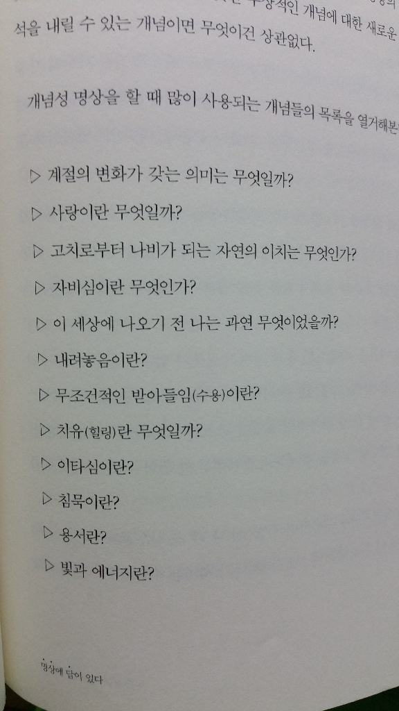

명상

좋은 생각에 몰입하라

마음의 평화를 누리는 삶은 물론, 일에 대한 열정을 불러일으키고 탁월한 판단능력을 발휘하며 창조적인 아이디어를 내는 모든 일이 명상을 통해 가능하다. 하지만 결국 중요한 것은 명상을 일상생활에서 실천하는 일이다. 그러면 바쁜 일과를 보내는 직장인이 실천할 수 있는 가장 좋은 명상법은 무엇일까? 명상의 본질은 좋은 생각에 몰입하는 것이다. 습관적인 생각에 따라 좀비처럼 반응하는 것이 아니라 가장 바람직한 생각을 선택하여 좋은 느낌을 불러일으키고 자기에게 주어진 역할을 즐겁게 하는 것이다. 그러나 그렇게 좋은 생각과 느낌을 계속 유지하려면 규칙적이고 꾸준한 명상이 뒷받침되어야 한다. 여기에서는 필자가 9년 동안 실천하면서 놀라운 변화를 체험하고, 여러 기업과 단체에서 교육으로 실행하여 탁월한 효과를 낸 방법을 소개하려고 한다.&#160;

2003년 &lt;타임&gt;지에서 소개한 가장 간단한 명상의 방법은 다음과 같다.&#160;&#160;

1) 조용한 곳을 찾아간다. 필요하다면 불도 끈다.&#160;

2) 눈을 감는다.&#160;

3) 소리나 리듬을 반복하며 위안을 찾게 되는, 자신에게 의미 있는 단어나&#160;구절을 고른다.&#160;

4) 그 말을 되풀이한다.&#160;

이것을 단계별로 좀 더 자세히 설명해 보자.&#160;&#160;

1) 에서 가장 효과적인 명상시간은 잠자리에 들기 직전과 아침에 일어난 직후다. 이때 하는 명상이 무의식에 가장 잘 녹아들 뿐 아니라, 잠들어 있는 시간과 그날 하루 동안의 정서를 결정하기 때문이다. 가장 좋은 명상의 자세는 오랫동안 할 수 있는 단정하고 편안한 자세이다. 책상다리하고 앉아서 허리는 똑바로 펴고, 두 손은 양쪽 무릎 위에 각각 올려놓고 손바닥이 자연스럽게 위를 향하도록 한다. 방석을 이용하는 경우에는 방석이 엉덩이 부분에만 닿게 하고 다리는 방석 앞에 내려놓아서 오래 유지할 수 있는 편안한 자세가 되게 한다. 책상다리를 하는 대신 의자에 앉아서 해도 좋다.&#160;&#160;

2) 명상을 처음 하는 사람이라면 외부 상황에 자꾸 마음이 쓰여 명상에 집중되지 않을 수도 있다. 이때 눈을 감는 것은 시각을 차단하여 눈에 보이는 주변 환경에 영향을 받지 않고 명상에 몰입할 수 있도록 돕는다. 명상이 익숙해진 다음에는 반쯤 눈을 뜨고 해도 좋다.&#160;&#160;

3) 뜻도 모르는 주문을 외우는 것보다는 자신이 그 내용을 이해하고 일상적인 정서보다 고양된 느낌을 느낄 수 있게 해 주는 글이나 문구를 암송하는 것이 좋다.&#160;&#160;

4) 처음 명상을 시작하는 사람이라면 명상문의 내용에 일치하는 깊은 느낌을 일으키면서 천천히 소리 내어 두 번 이상 읽는다. 명상문의 전부나 일부를 암기하게 되면 눈을 감고 명상을 할 수 있기 때문에 더욱 깊은 느낌을 일으킬 수 있다. 명상을 시작한 지 얼마 되지 않은 상태에서는 수많은 생각이 한꺼번에 휘몰아치는 바람에 놀라거나 잡다한 생각들의 미로를 방황하게 되는 수도 있다. 그러나 명상을 꾸준히 반복하다 보면 무의식이 정화되면서 고요하게 집중하여 탁월한 정서에 몰입하게 되고 생활이 근본적으로 변화되기 시작한다.&#160;&#160;

&#160;명상문&gt;&#160;

&#39;참 나&#39;에 관한 선언

육체는 공간적으로나 시간적으로나 유한하다.&#160;

그러나 이제 감각적 판단을 떠나 영원한 진실의 세계를 본다.&#160;

‘참 나’는 영원한 존재이며 영적인 실재이다.&#160;

언제나 기쁘고 평화롭게 존속한다.

깨달은 자가 자기의 무한한 능력을 인지했듯이,&#160;

깨닫든 깨닫지 못하든, 이미 내게는 무한한 능력이 구비되어 있다.&#160;

‘참 나’는 한없는 사랑이기에&#160;

모든 존재에게 무한한 사랑을 베풀고,&#160;

또한 모든 존재가 나를 한없이 사랑한다.&#160;

본래 나는 지혜 자체이기 때문에&#160;

나는 모든 것이 ‘참 나’임을 통찰하고 모든 것이 ‘참 나’를 안다.&#160;

나는 무한한 우주의 모든 존재와 일체이다.&#160;

그러므로 모든 존재와 나는 조화롭게 살아가며 즐거워한다.&#160;

나는 생명 자체이므로,&#160;

나에게 피곤이나 질병이나 나약함이란 있을 수 없다.&#160;

일할수록 싱싱하고 힘찬 생명이 약동하고,&#160;

남을 도울수록 즐거움이 용솟음친다.&#160;

내가 다가설수록 모든 존재가 한없는 생명력을 회복하며&#160;

모든 존재는 나를 언제나 생동케 한다.&#160;

아! 내가 이처럼 영원한 존재이며&#160;

무한능력의 존재임을 알게 된 것이 감사하다.&#160;

‘참 나’는 감사함 자체이다.&#160;

나사(NASA)의 우주 비행사 에드가 미첼(Edgar Dean Mitchell)은 “의식 그 자체는 가장 근원적인 것이며 에너지와 물질은 의식의 산물이다. 만일 우리가 진짜 모습에 고개를 돌린다면 그리고 스스로를 물질적인 경험을 창조하는 불멸의 존재로 바라보고 의식이라고 부르는 존재의 차원과 하나가 된다면 우리는 세상을 아주 다른 방향으로 바라보고 창조하기 시작할 것이다.”라고 말한다. 그리고 오레곤 대학의 명예 물리학교수인 아밋 고스와미는 “현실의 창조자가 되기 위해서 우리는 명상을 통해 특별한 의식 상태에 이르러야 한다.”고 주장한다.&#160;

명상의 종류

-
집중명상

- 소리명상

- 시각명상

- 특정활동

- 읊조림 - 옴(ohm), 만트라(mantra), 진언

-
하나의 명제나 개념에 마음 모으기 - 간화선

- 사랑이란? 용서란? 왜 사는가?

- 마음챙김명상 - 왓칭, 목도, 제 3자의 입장에서 상황과 그 안의 나를 관조

-
파생 명상기법

-
활동성 명상 - 단순하고 반복적인 행위들 속의 명상

- 걷기, 설걷이, 자전거타기, 달리기, 수영, 하이킹, 청소

-
개념성 명상

-

- 기본호홉명상 - 날숨과 들숨의 감각을 느껴라

- 만트라 명상 - 자신에게 특별한 의미있는 구절이나 단어를 반복 암송

- 선명상 - 지금 이 순간에 깨어있는 것을 자각하는 것이 선명상의 핵심

호홉과 마음이 하나라는 생각으로 집중

허리를 꼿꼿이 펴고

수식관 - 숨쉬는 것을 헤아리는 것
