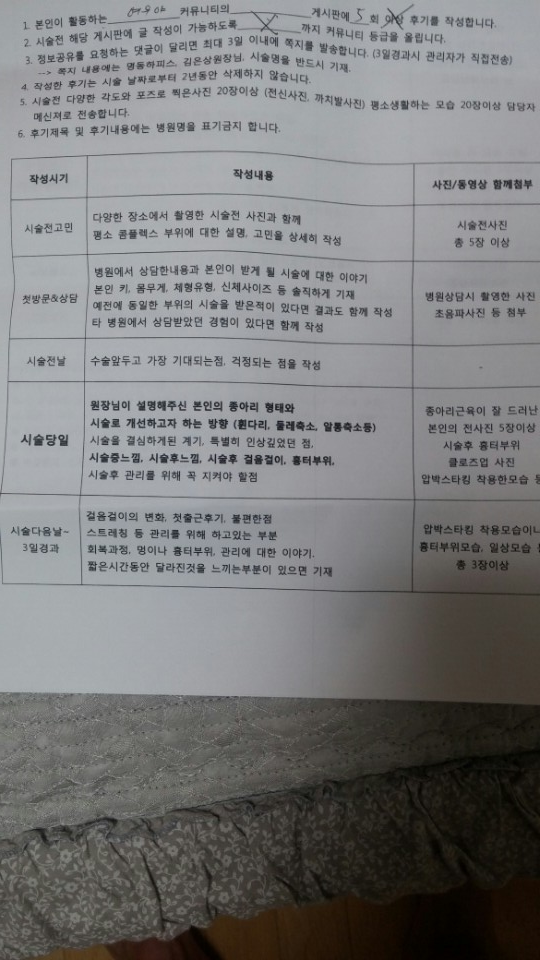
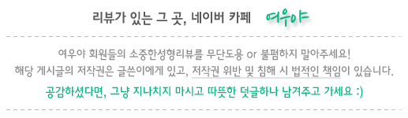
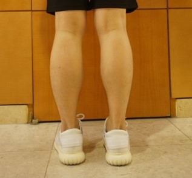
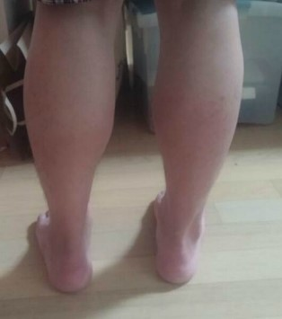
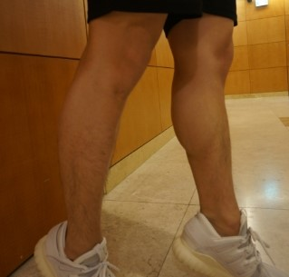
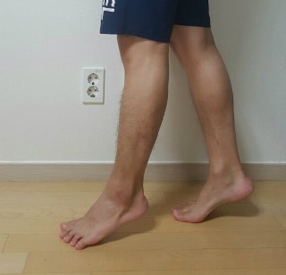
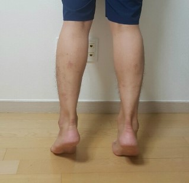
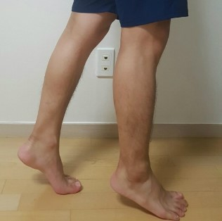

하피스

1. 시술전 고민 : 다양한 장소에서 촬영한 시술전 사진과 함께 평소 콤플렉스 부위에 대한 설명, 고민을 상세히 작성. 사진 5장 이상

보시다시피 제가 한 다리 합니다. 남자라는걸 감안해도 두꺼운 편이구요. 체질적으로 하체가 발달한 타입이기도 하지만, 어릴 때 부터 자전거를 즐겨타고, 성인이 되고 나서부터는 마라톤 풀코스까지 완주한 다리이니 뭐 할말이 없긴 합니다….

튼튼한 다리로 사는 것이 크게 불편하지는 않았었는데요, 요즘에는 바지슬 사더라도 슬림핏이 대부분이어서 바지를 고르는데 제약도 좀 있구요, 실제로 타이트한걸 입더라도 다리가 끼여서 좀 불편하기도하고 심미적으로도 그렇게 바람직 하지는 않은 것 같네요. 게다가 여름되면 반바지도 많이 입는데, 저는 반바지를 거의 안입거든요…

그래서 오래 고민하다가 상담을 받게 되었는데요, 몇 개월간 활동에 제약이 있기는 하지만 영구적인 것은 아니라서 결심하게 되었어요.

다행히 회사 가까운 곳에 위치해 있어서 저녁에 방문해서 시술 받았는데요. 뭐 큰 걱정이나 두려움은 없었지만, 막상 시술을 시작하니 신경을 건드리는 부분이라서 한 두 번이긴 하지만 쥐어짜는 것처럼 쥐가 나기도 했는데요. 그래도 수 초에서 수십초 정도라 참을만 했네요.

다리 바깥쪽에는 보톡스를 주사했는데, 따끔따끔 할뿐이고 뭐 ㅎㅎ

시술을 마치고 내려오는데 안내 받기도 했고 어느 정도 예상은 했지만 순식간에 노약자가 되었더라구요 ㅎㅎ 효과에 대한 방증이기도 하겠지만요~

당일 밤부터 한 일주 정도는 의식될 정도의 통증이 있긴 했는데요, 스트레칭 잘하고 시간이 지나다 보니 하루하루 나아 지더라구요. 그리고 한 2주차 되었을 즈음부터는 가시적인 효과가 보여서 아래처럼 갈수록 얇아지고 있어요.

여름이 다가오니 압박스타킹을 착용하는게 좀 부담이긴 한데~ 스타킹이 통증도 완화해주고, 부종 등 여러모로 도움을 주는 것 같네요.

운동을 계속 하는편이라 러닝머신 그만두고 스텝퍼로 바꿔서하고 있는데, 다행히 큰 자극은 안되는 것 같아서 지속적으로 관리하고 있구요. 체중도 줄어서 더 얇아진 것 같네요.

장점일지는 모르겠지만, 종아리 근육을 대신하느라 허벅지 근육이 강화되는 것 같네요 ㅎㅎ

[http://cafe.naver.com/feko](http://cafe.naver.com/feko)

xxjunexx00/ 123123123..

[명동하피스] [오후 6:03] 명동하피스 김은상 원장님께 받았다느 ㄴ내용과

[명동하피스] [오후 6:03] 가격 보내주시면 됩니다~

[준영,] [오후 6:03] 넵

[명동하피스] [오후 6:04] 금액은 옴므가 250+vat입니다~

하피스 - ( xxjunexx00/ 123123123..) [http://cafe.naver.com/feko](http://cafe.naver.com/feko)

내용에 명동 김은상 원장님게 받으셨고 3D옴므 시술로 250만원 부과세 별도다. 이 내용이 꼭 들어가야하시고요.

[종아리]
남자-종아리 신경차단시술 한달차
|
[쁘띠성형,기타성형](http://cafe.naver.com/ArticleList.nhn?search.clubid=10912875&amp;search.menuid=403&amp;search.boardtype=&amp;userDisplay=)

수&#160; 술 &#160;부&#160; 위&#160;: 종아리

&#160;&#160; 수술상세정보 : 신경차단시술

보시다시피&#160;제가&#160;한&#160;다리&#160;합니다.&#160;남자라는걸&#160;감안해도&#160;두꺼운&#160;편이구요.&#160;체질적으로&#160;하체가&#160;발달한&#160;타입이기도&#160;하지만,&#160;어릴때&#160;부터&#160;자전거를&#160;즐겨타고,&#160;성인이&#160;되고&#160;나서부터는&#160;마라톤&#160;풀코스까지&#160;완주한&#160;다리이니&#160;뭐&#160;할말이&#160;없긴&#160;합니다만….

&#160;

튼튼한&#160;다리로&#160;사는&#160;것이&#160;크게&#160;불편하지는&#160;않았었는데요,&#160;요즘에는&#160;바지슬&#160;사더라도&#160;슬림핏이&#160;대부분이어서&#160;바지를&#160;고르는데&#160;제약도&#160;좀&#160;있구요,&#160;실제로&#160;타이트한걸&#160;입더라도&#160;다리가&#160;끼여서&#160;좀&#160;불편하기도하고&#160;심미적으로도&#160;그렇게&#160;바람직&#160;하지는&#160;않은&#160;것&#160;같네요.&#160;게다가&#160;여름되면&#160;반바지도&#160;많이&#160;입는데,&#160;저는&#160;반바지를&#160;거의&#160;안입거든요....

&#160;

그래서&#160;오래&#160;고민하다가&#160;상담을&#160;받게&#160;되었는데요,&#160;몇&#160;개월간&#160;활동에&#160;제약이&#160;있기는&#160;하지만&#160;영구적인&#160;것은&#160;아니라서&#160;결심하게되었어요.

&#160;

다행히&#160;회사&#160;가까운&#160;곳에&#160;위치해&#160;있어서&#160;저녁에&#160;방문해서&#160;시술&#160;받았는데요.&#160;뭐&#160;큰&#160;걱정이나&#160;두려움은&#160;없었지만,&#160;막상&#160;시술을시작하니&#160;신경을&#160;건드리는&#160;부분이라서&#160;한&#160;두&#160;번이긴&#160;하지만&#160;쥐어짜는&#160;것처럼&#160;쥐가&#160;나기도&#160;했는데요.&#160;그래도&#160;수십초&#160;정도라참을만&#160;했네요.

다리&#160;바깥쪽에는&#160;보톡스를&#160;주사했는데,&#160;따끔따끔&#160;할뿐이고&#160;뭐&#160;ㅎㅎ

시술을&#160;마치고&#160;내려오는데&#160;안내&#160;받기도&#160;했고&#160;어느&#160;정도&#160;예상은&#160;했지만&#160;순식간에&#160;노약자가&#160;되었더라구요&#160;ㅎㅎ&#160;효과에&#160;대한&#160;방증이기도&#160;하겠지만요~

당일&#160;밤부터&#160;한&#160;일주&#160;정도는&#160;의식될&#160;정도의&#160;통증이&#160;있긴&#160;했는데요,&#160;스트레칭&#160;잘하고&#160;시간이&#160;지나다&#160;보니&#160;하루하루&#160;나아&#160;지더라구요.&#160;그리고&#160;한&#160;2주차&#160;되었을&#160;즈음부터는&#160;가시적인&#160;효과가 보여서&#160;갈수록&#160;얇아지고&#160;있어요

여름이&#160;다가오니&#160;압박스타킹을&#160;착용하는게&#160;좀&#160;부담이긴&#160;한데~&#160;스타킹이&#160;통증도&#160;완화해주고,&#160;부종&#160;등&#160;여러모로&#160;도움을&#160;주는것&#160;같네요.

운동을&#160;계속&#160;하는편이라&#160;러닝머신&#160;그만두고&#160;스텝퍼로&#160;바꿔서하고&#160;있는데,&#160;다행히&#160;큰&#160;자극은&#160;안되는&#160;것&#160;같아서&#160;지속적으로&#160;관리하고&#160;있구요.&#160;체중도&#160;줄어서&#160;더&#160;얇아진&#160;것&#160;같네요.

장점일지는&#160;모르겠지만,&#160;종아리&#160;근육을&#160;대신하느라&#160;허벅지&#160;근육이&#160;강화되는&#160;것&#160;같네요&#160;ㅎㅎ

ㅇ 시술전 고민 - 하게된 사유

어릴 적부터 자전거도 즐겨타고, 집도 가파른 비탈길 위에 있었고, 축구는 물론 마라톤까지…. 운동선수에 필적하는 다리를 갖게 될 운명이었습니다. 세월이 흐르다 보니 슬림핏이니 스키니 진이니 바지사러 가면 한번에 맞는 바지를 찾기도 쉽지 않고, 이래저래 불편하더라구요. 반바지도 왠만하면 피하게 되구요. 그래도 의학 기술을 빌리는 건 여자분들에게만 해당되는 이야기로 생각해서, 시술까지는 진지하게 고민하지 않았었는데, 우연히 남성에게 특화된 시술을 하는 병원을 알게 되었고 머리속에 생각만 하고 있었습니다.

그러던 차에 10년 넘게 매일아침 30~40분 정도 러닝머신을 뛰었는데, 이게 무릎이나 관절 건강에 좋지 않을 수 있으니 다른 운동으로 대체하라는 권고를 받고, 이 참에 종아리 시술도 하면 어떨까 해서 한번 상담을 받아봤어요.

ㅇ 상담 내용

다른 시술을 받아본 경험이 있는 것은 아니었지만, 비대한 종아리 근육을 축소하되 다른 부위가 보상발달하는 것을 방지하도록 균형있게 시술해주신다는 말씀에 신뢰가 가더라구요. 그래서 뭐 큰 고민 없이 결정했구요.

ㅇ 시술 당일 - 시술 당시 느낌

남자답게 뽝. 침에 위에 엎드러누웠지만 보이지 않는 뒤에서 무슨 일이 벌어지고 있는지 초조하긴 했습니다. 하지만 원장님이 지속적으로 상태와 어떤 방식으로 진행을 할 건지 말씀을 해주셔서 긴장도 덜고 고통…..도 덜어졌었겠죠? ㅎㅎ 사실 엄청 아픈건 아니고 심하게 쥐가 나는 정도가 몇 번 반복되었었는데, 뭐 여자분들은 뼈도 깎는다는데 이게 별거겠습니까마는… 암튼 충분히 버틸만 한 정도에요. (재갈 꼭 챙기시구요.. 껄껄)

시술 이후 부터 몇일 간은 의식하면서 천천히 걸으면 다른 사람이 보기에 크게 이상한 걸음걸이는 아니에요, 다만 횡단보도에서 신호가 깜박일 때 &quot;저건 내 신호가 아니다.&quot;라고 스스로를 다독이면서 마음의 평정까지 찾게 되는 부가적인 효과까지 있습니다.

일주일 정도 지속되는 통증이 있지만 으쌰으샤 스트레칭으로 충분히 이겨낼 수 있습니다. 민감하신 분들은 병원에서 처방해주는 진통제를 드시면 되겠네요. 전 그냥 안먹었어요 ㅎㅎ

ㅇ 시술 받고 난 후 경과

매일 습관처럼 압박 스타킹을 착용하다 보니 시간이 꽤 흐른 것 같았는데 아직 두 달 정도 밖에 안지났더라구요. 저도 사진을 찍고나서야 그 사이 사이즈가 많이 줄어든걸 알았네요. 사실 매일 보는 제 다리고, 위에서 보면 큰 차이를 느끼기 힘들거든요 ㅎ 자 그럼 비교샷을 보시죠.

[종아리]
남자-종아리 신경차단시술 한달차
|
[쁘띠성형,기타성형](http://cafe.naver.com/ArticleList.nhn?search.clubid=10912875&amp;search.menuid=403&amp;search.boardtype=&amp;userDisplay=)

수&#160; 술 &#160;부&#160; 위&#160;: 종아리

시술상세정보 : 신경차단시술

ㅇ 시술전 고민 - 하게된 사유

ㅇ 상담 내용

ㅇ 시술 당일 - 시술 당시 느낌

ㅇ 시술 받고 난 후 경과

------------------------------------------------------------------------------------------------------------------

ㅇ 수 술 부 위 : 종아리

ㅇ 수술상세정보 : 신경차단시술

------------------------------------------------------------------------------------------------------------------

ㅇ 시술전 고민

한여름 타이츠 신고 3달이나 어떻게 버틸까 했는데, 어떻게 벌써 세달이 훌쩍 지나가 버렸네요. 그리고 타이츠 착용이 습관이 되다보니 이젠 착용을 안하는게 더 어색하기도 하구요. 시술 전에 걱정했던 것은 모두가 그렇지만 부작용이나 혹시나 잘 못되면 어쩌나 하는 것들일 거에요. 하지만 원장님의 상세한 설명을 듣고 부작용의 여지가 적고, 만에 하나 다시 두꺼워지더라도 얼마든지 교정의 여지가 있다는 걸 알고 안심하게 되었습니다. 그리고 무엇보다 휴가를 쓰지 않고도 간단히 받을 수 있다는 점이 좋았네요.

ㅇ 상담 내용

어릴 적부터 다른 사람들보다 두꺼운 종아리를 가지고 있던 터라, 시술 한번에 쉽게 해결이 될 수 있을지 사실 의문이었습니다. 하지만 다른 시술 사례와 각 근육별로 적절한 솔루션을 제시 해주셔서 효과에 대한 믿음을 가지게 되었어요. 보상발달 등 주의해야 될 사항과 당분간 운동에 제약을 받기는 하겠지만, 시술 후에 자유롭게 바지도 고르고 반바지도 입을 생각을 하니 큰 부담이 되지는 않았습니다.

ㅇ 시술 당일

시술 자체가 크게 부담이 되는 것은 아닌지라, 퇴근 후에 가서 받고 다시 돌아와 야근까지 했습니다. 중간중간 큰 근육다발(?)을 건드릴 때에는 쥐어짜는듯한 통증 (쥐나는 정도?)가 간혹 느껴지긴 하지만 참을만한 수준이었습니다. 기본적으로 마취를 하고 진행하기 때문에 지속적으로 통증이 있지는 않고, 주요 신경을 자극할 때에만 간헐적인 통증이 있습니다. 그리고 저는 추가로 바깥쪽에 보톡스를 맞았는데, 뭐 이건 그냥 따끔거릴 뿐이구요 ㅎ

ㅇ 시술 받고 난 후 경과

워낙 운동을 좋아하고 달리기를 거르지 않는 편이었는데, 이걸 스텝퍼 운동으로 바꾸고 달리는 운동은 거의 하지 않았어요. (어짜피 못하긴 합니다만;;) 타이츠도 꼬박꼬박 챙겨서 신고 다니구요. 사실 위에서 내려다보면 조금 줄긴 줄었네 정도이지만 사진을 찍어서 보면 현격한 차이가 납니다. 그리고 일단 바지를 입어보면 예전과는 핏이 다르구요. 그래서 바지를 몇벌이나 더 산지 모릅니다 ㅎㅎ

자 그럼 시술 전후의 변화를 보실까요?

[시술전]

[시술 후 4개월]

명동 하피스 김은상 원장님께 받았구요,

3D옴므 시술로 250만원(부과세 별도)였어요~

ㅇ 시술전 고민 - 하게된 사유

타고난 집안 내력과 어릴 적부터 꾸준히 타온 자전거, 그리고 20대 부터 꾸준히 해온 하루 30~40분 가량의 러닝, 그리고 일년에 두 번 정도 참가하는 마라톤 덕에 종아리가 특히 발달된 체형을 가지고 있었습니다. 뭐 남자답고 좋을 수도 있는데, 가끔 타이트한 바지를 입게되면 불편하고, 반바지를 입는걸 꺼리게 되더라구요. 그럼에도 워낙 운동을 좋아하고, 다리를 안쓰고 살 수는 없는지라 별다른 방법이 없을 것 같아 체념하고 살았던 터였습니다.

게다가 종아리 시술은 여성들에게만 국한된 것이라는 선입견을 가지고 있었는데요, 남자에게 특화된 종아리 시술이 있다고 해서 관심을 가지게 되었습니다. 게다가 운동을 즐겨하는편이라 정상적인 기능을 최대한 보전하면서 다리 모양을 잡아준다는 점이 매력적이어서 시술을 결심하게 되었습니다.

ㅇ 상담 내용

먼저 어떤 방법으로 어느 부위를 시술하게 되는지와 각 방법에 따른 효과의 차이 등을 상세히 설명해 주셨어요. 그리고 제가 궁금해하던 부분은 얼마나 줄어들게 되며, 근육이 다시 생성되는 것 혹은 보상발달이 과도하게 되지는 않을 런지 등을 질문했고 상세한 설명을 들을 수 있었습니다. 무엇보다도 이전에 시술받은 분들의 전후 사진을 보니 그 효과에 대해서 믿음이 가기도 했구요.

ㅇ 시술 당일 - 시술 당시 느낌

시술 시간은 20분 남짓? 그리 길지 않았던 것 같습니다. 특히 &#39;알&#39;이 많이 뭉친 부위를 집중적으로 시술할 때는 쥐나는 것 같은 통증을 동반하기는 하지만, 뭐 입에 재갈을 물려야 할 수준은 아니구요. 쥐 한번 났다가 풀리는 걸로 생각하시면 됩니다. 그렇게 크게 한 두번 쥐나는 것 같은 느낌 받는 것 이외에 나머지는 너무 순탄하게 끝이 났구요, 저는 종아리 측면에 보톡스도 맞았는데 근야 잠깐 따끔거릴 뿐입니다.

일단 시술을 받고 내려오자, 정말 신기하게 다리에 힘이 거의 들어가지 않더군요. 효과에 대한 방증이겠죠. 허벅지 근육에 최대한 의존해서 약간 이상한 걸음으로 몇 일을 걸었는데, 한 3일이면 적응이 되는 것 같습니다.

ㅇ 시술 받고 난 후 경과

현재 시술 받은지 5개월 되었는데요, 계절이 바뀌고 봄에 입던 바지를 다시 입다 보니 일단 확연히 다리 둘레가 줄어든게 느껴져요. 예전에는 딱 타이트하게 달라붙던 바지가 이제 손으로 잡을 수 있을 정도로 남거든요.

물론 보상발달에 대한 우려나 다시 두꺼워질 수도 있기 때문에 종아리를 사용하는 운동은 최대한 자체하고 있습니다. 그리고 점점 일상생활에서도 의식할 수 있을만한 불편 없을 정도로 다리의 기능도 돌아왔구요, 아직 빠르게 달려본적은 없지만 충분히 가능한 수준인 것 같습니다.

결과는 일단 만족하구요. 앞으로 관리 잘 할 일만 남은 것 같습니다 ^^
