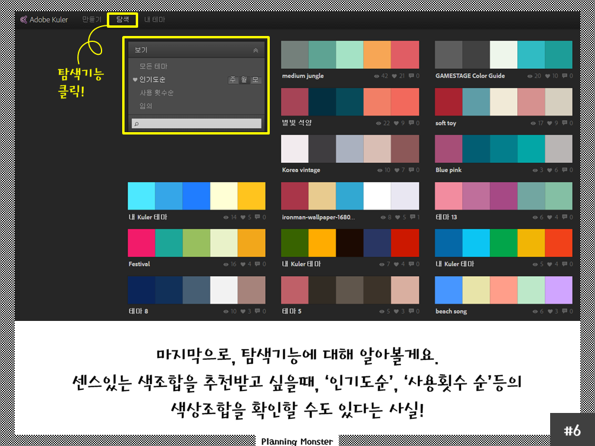
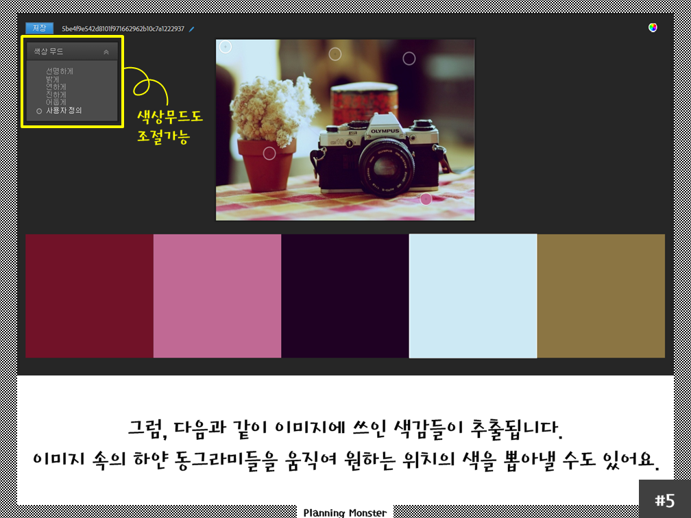
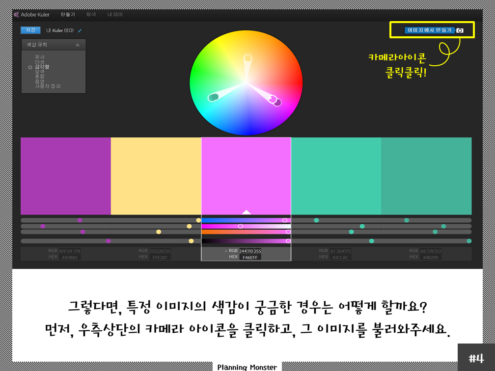
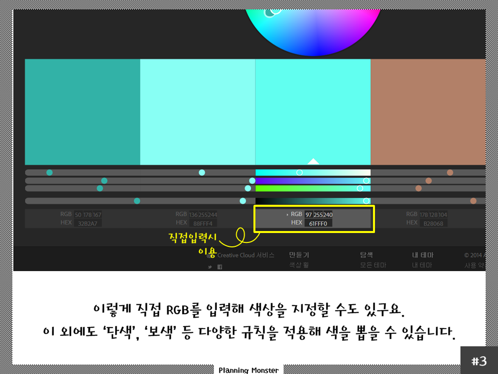
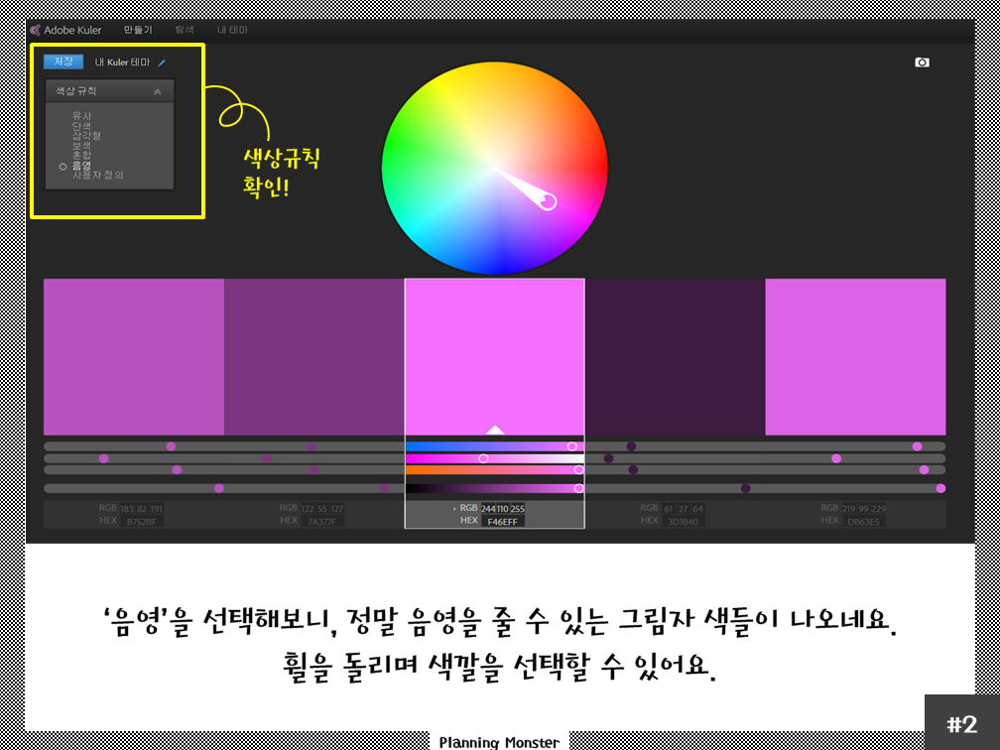
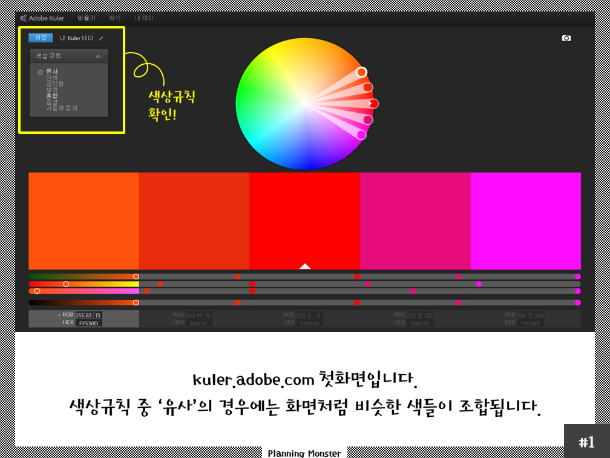
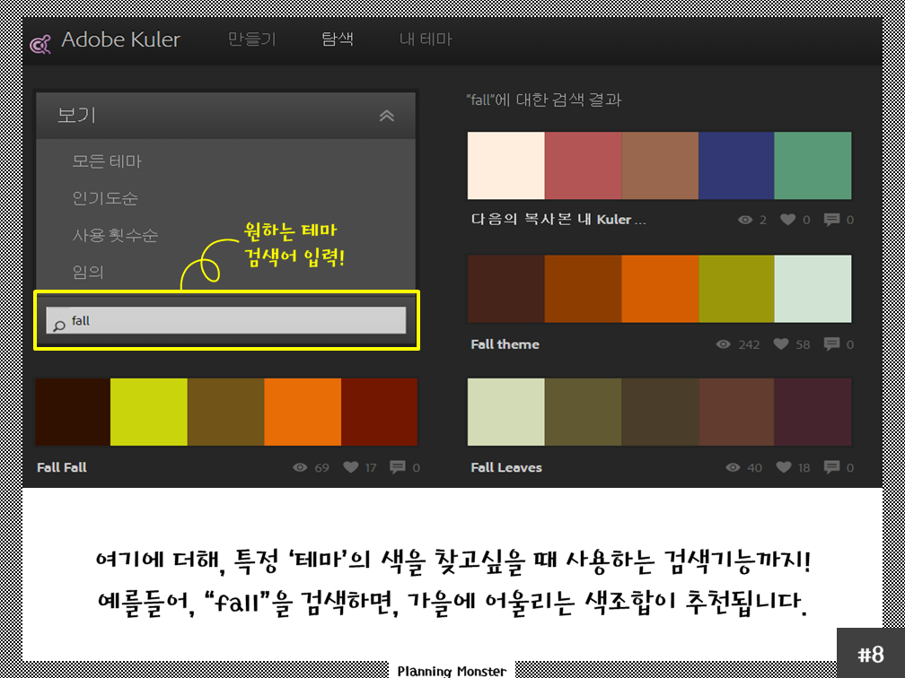
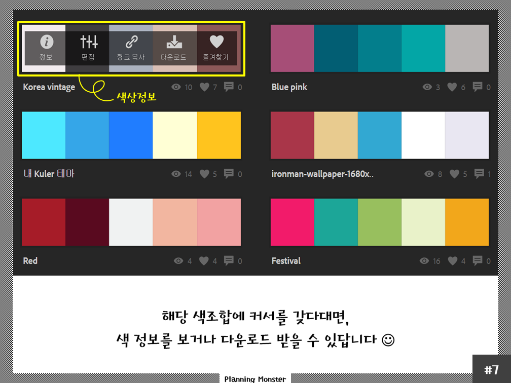

Adobe color CC

색상 조합 정보

Adobe Kuler

Dribbble

[https://colorkoala.xyz/](https://colorkoala.xyz/) 클릭 한 번으로 다섯개의 컬러 조합을 확인, 복사해 바로 활용할 수 있는 ‘ColorKoala’

[https://color.adobe.com/ko/create/color-wheel/](https://color.adobe.com/ko/create/color-wheel/)

