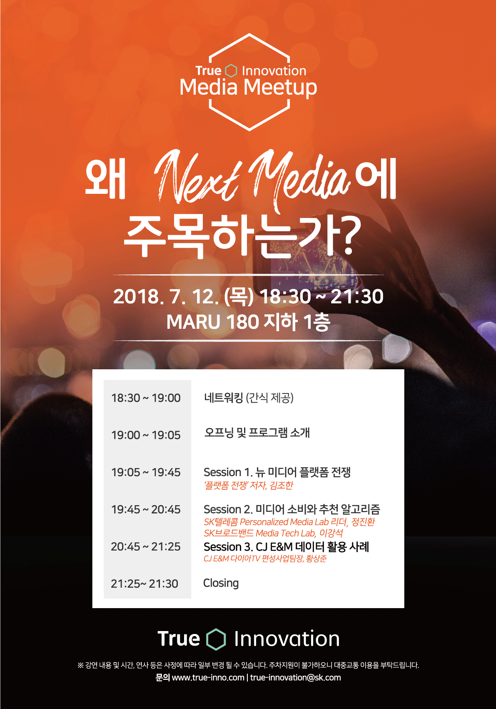
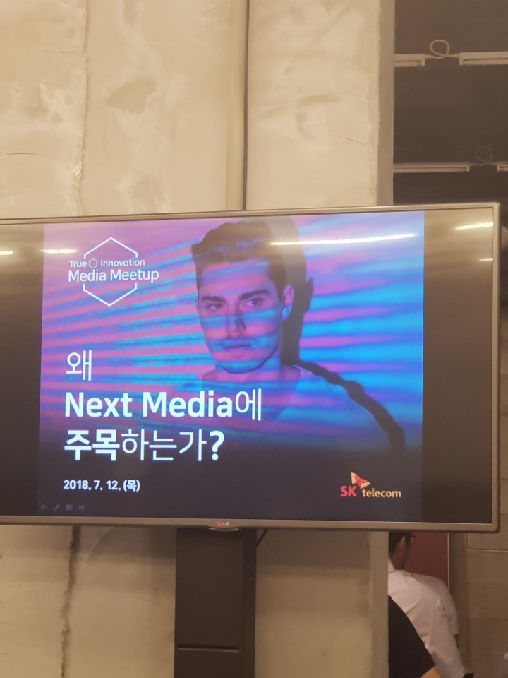
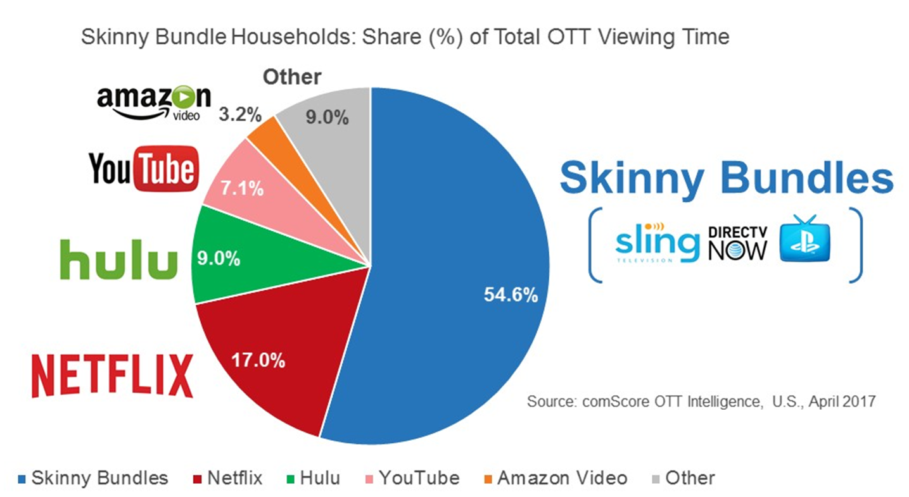
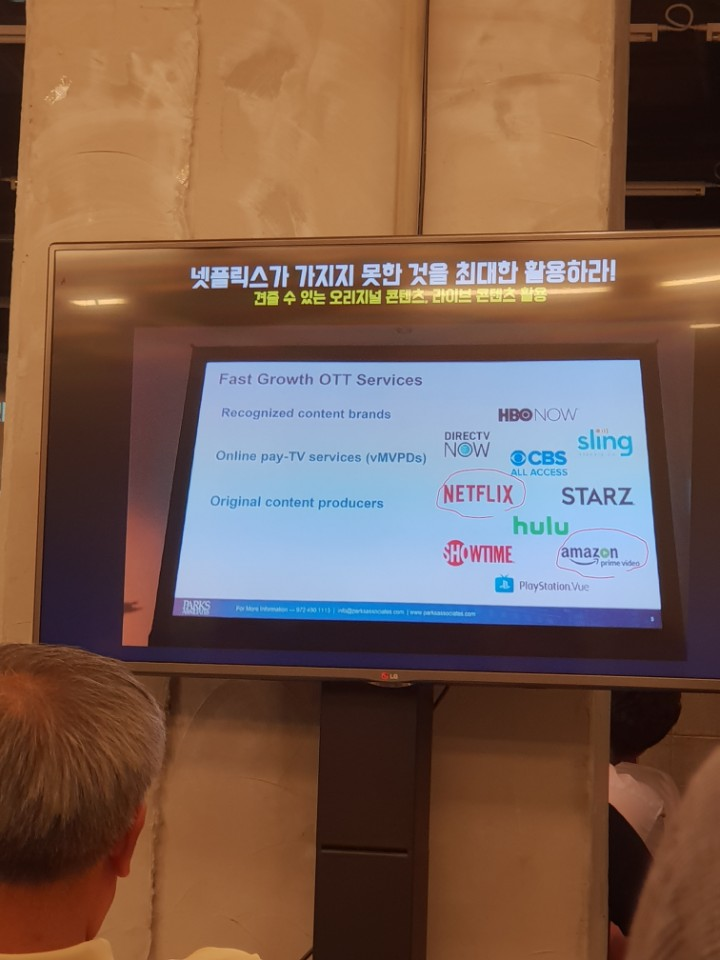
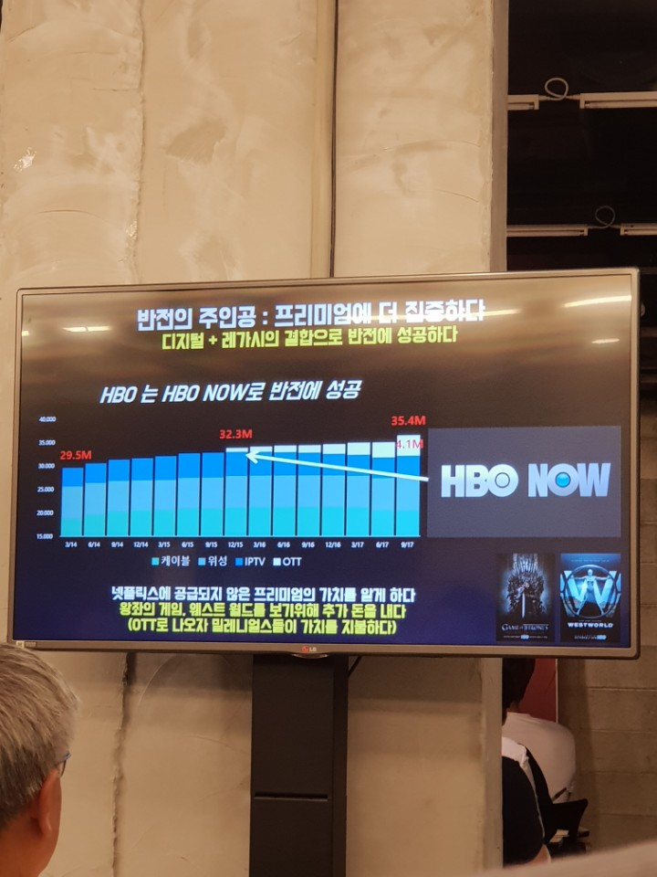
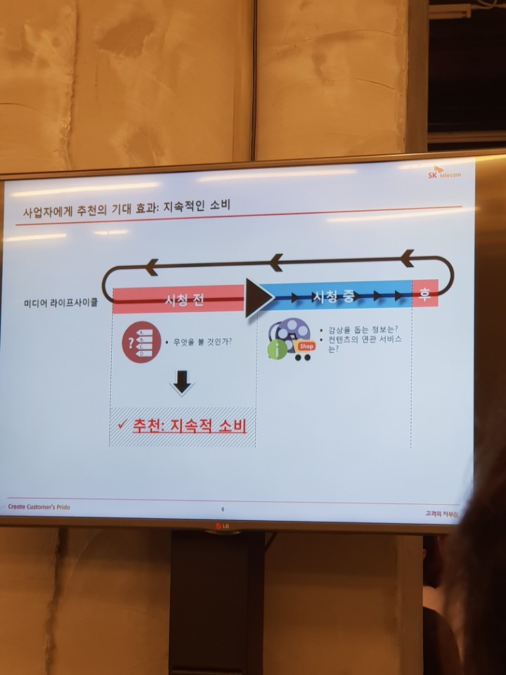
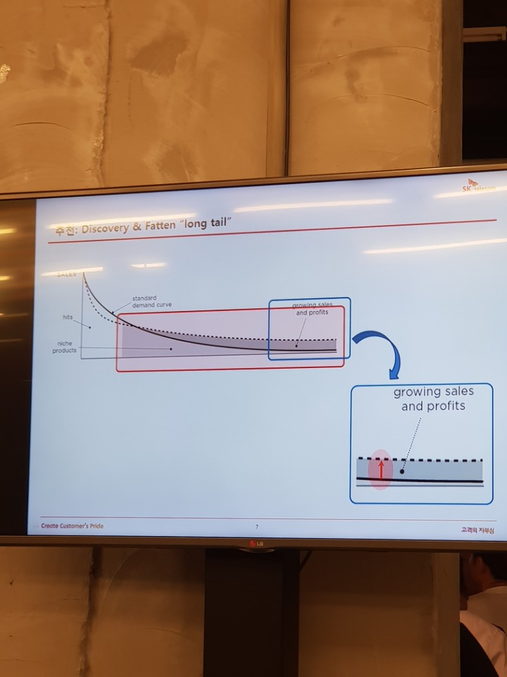
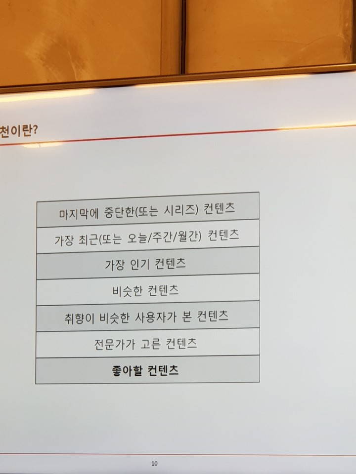
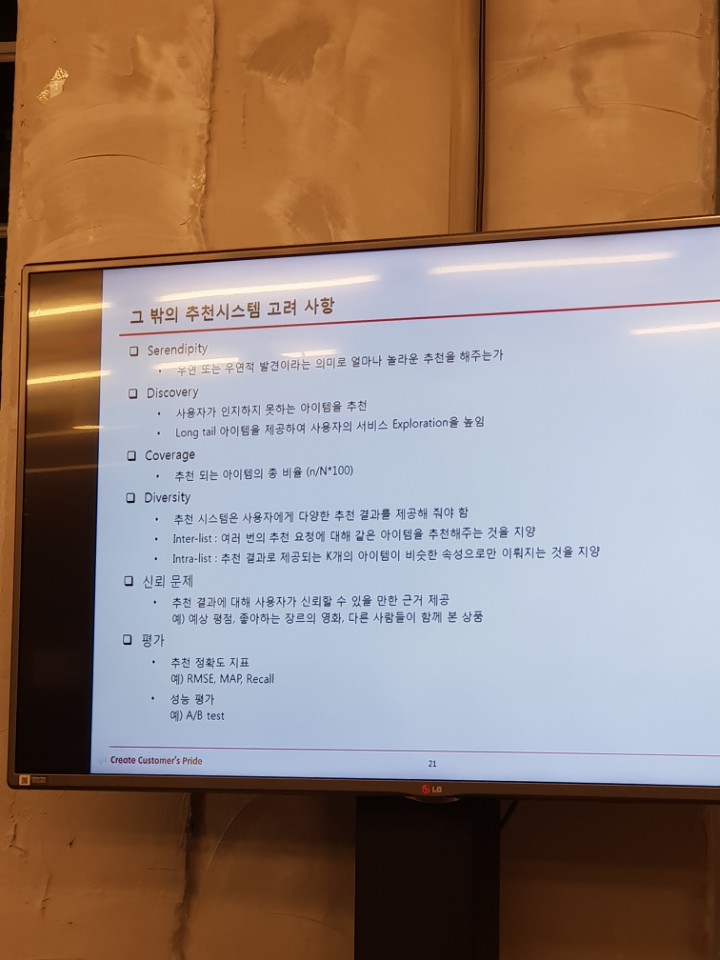

Media Meetup

○ 일시 : 2018.07.12(목) 18:30~21:30

○ 장소 : 역삼 MARU 180

Session 1. 곰앤컴퍼니 김조한 이사

실시간 방송의 힘이 약화되고 있다.

① 컨텐츠를 동시에 소비하는 경향이 약해지고 있으며

② SVOD로 인해 광고를 보지 않게 된다.

vMVPD(virtual multichannel video programming distributor)

인터넷 실시간 유료방송 사업자 또는 서비스

*Skinny Bundles : [https://www.linkedin.com/pulse/what-skinny-bundle-shane-cannon](https://www.linkedin.com/pulse/what-skinny-bundle-shane-cannon)

인기 있는 채널만 최소한으로 구성된 저렴한 패키지 상품

HBO의 반격, 프리미엄 컨텐츠에 몰빵. 100가지 컨텐츠를 난사하기보다 제대로 만든 프리미엄 컨텐츠 하나가 가입자들을 끌어온다. ▶ One of channel로 HBO가 편성.

인도 HOTSTAR - 인도 #1 vMVPD [https://www.hotstar.com/](https://www.hotstar.com/)

넷플릭스의 통점은 Live 컨텐츠다?

JTBC는 넷플릭스를 통해 해외시장 공략을 태핑하고 있따.

넷플릭의 첫 M&amp;A, 밀러월드 인수(2017년 8월 7일) - [https://media.netflix.com/ko/press-releases/netflix-acquires-millarworld-1](https://media.netflix.com/ko/press-releases/netflix-acquires-millarworld-1)

[Amazon Rekognition Video](https://aws.amazon.com/ko/blogs/korea/launch-welcoming-amazon-rekognition-video-service/) -

딥 러닝 기반 동영상 장면 인식 기능

2. 추천로직

Long tail을 잡아야 하는이유 ① 요금제Up  ② 영화의 특성 - 반복소비가 다른 컨텐츠 대비 두드러지지 않는다.

