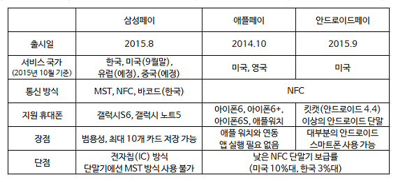
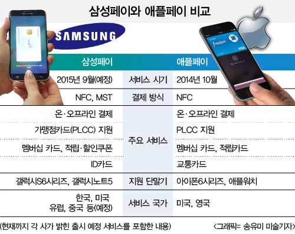
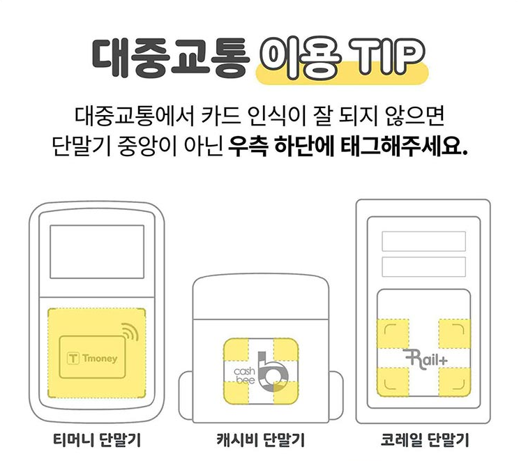
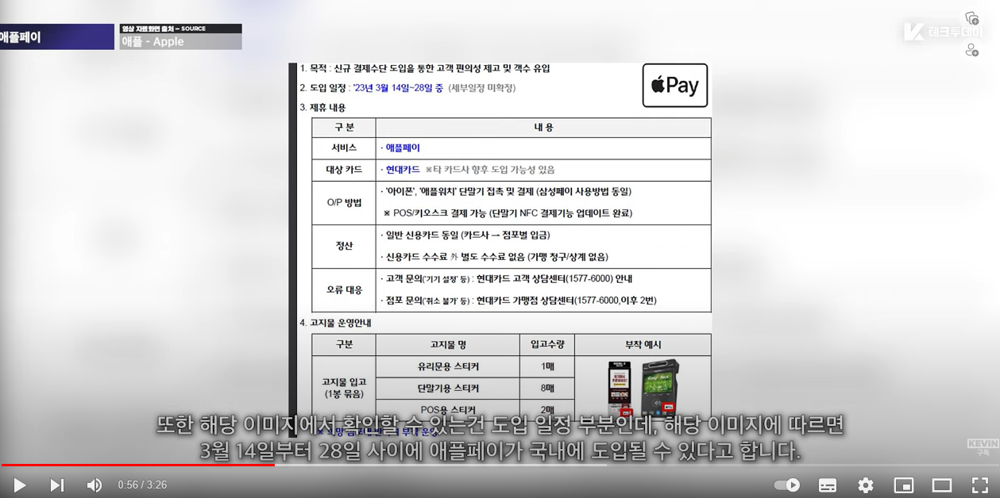
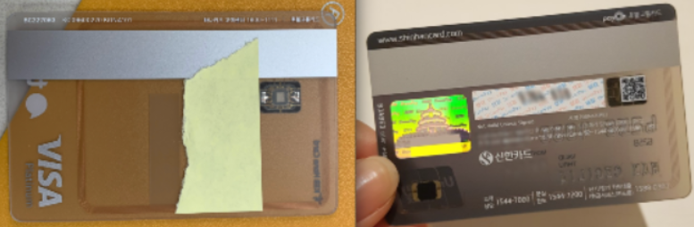

Project Apple pie

- Background

- 애플페이 3월 14~28일 한국 내 출시 예정

Pain point = 기회 요인

- 현재 T머니(한국스마트카드), 캐시비, 코레일(레일플러스)과 계약이 진행되고 있지 않다고 알려져, 애플페이가 출시되어도 아이폰 사용자들은 대중교통에서의 이용은 불가하므로 별도의 결제 수단 휴대 필요

- 현재 애플은 NFC 칩을 외부 앱이 쓸 수 있는 권한을 개방하지 않고 있으며, 애플이 티머니&#183;캐시비와 같

- 은 교통카드 사업자와 별도의 계약을 체결해야 지원 가능함

- [애플페이 출시국 75개](https://support.apple.com/en-us/HT207957) 국가중 교통카드까지 활용할 수 있는 곳은 15개국에 불과

- (미국의 뉴욕&#183;LA&#183;샌프란시스코&#183;시카고, 일본의 도쿄, 중국의 베이징&#183;상하이&#183;홍콩, 싱가포르, 영국의 런던)

-

- 애플이 교통카드 사업자(T머니, 코레일)와 계약을 체결해 서비스 제휴를 맺었다고 해도 인증 과정 등에 시간이 소요되기 때문에 당장은 도입이 불가능

- 애플페이가 출시되더라도 티머니가 인프라 구축을 위해 버스 단말기 뿐만 아니라 지하철 단말기와도 연동이 필요하며, 인프라 투자에 부담을 느낀다면 지금처럼 스티커형 교통카드 판매 지원이 이어질 것으로 예상됨

- 교통카드 연계 협상이 난항을 겪는 이유는, 애플은 카드를 대체하는 토큰을 애플만 접근 가능한 ‘eSE’에 저장하고, 필요할 때 저장된 토큰을 불러 처리하는 방식을 고수하고 있기 때문

- 국내 대중교통 인프라는 주로 신용카드나 선불형 교통카드에 내장된 RF 칩을 통해 카드번호를 읽어오는데, 삼성페이는 티머니와 캐시비 등의 교통카드 사업자가 카드 정보, 결제 등을 유심과 같은 심에 등록하고, 결제 때 이를 불러오는 SIM-SE 기반 시스템을 이용 중

- 애플이 eSE 방식을 고수할 경우 대중교통에 설치된 단말기를 EMV 규격 단말기로 교체해야 한다. 다만, 이 경우 많은 비용이 드는 만큼 실제 도입 여부는 불투명함

- Apple Pay가 대한민국 국내 대중교통 교통카드 시장에 진출하기 위해서는

1/ (개방형&#183;오픈 루프 방식) 대중교통에 설치된 결제 단말기의 카드사 비(非)실물 NFC[3] 결제를 지원.

/2 (폐쇄형&#183;클로즈드루프 방식) 티머니, 캐시비, 레일플러스 같은 기존 전자화폐 업체의 토큰화 기술을 이용하여 결제.

첫 번째의 경우, 오픈 루프가 도입된다면 바로 시행될 수 있는 방법이다. 자세한 내용은 해당 문서 참고.

두 번째의 경우, 티머니, 캐시비 등등 교통카드사가 Apple의 eSE를 지원하도록 Apple과 협상하여 교통카드가 아이폰에 탑재될 수 있도록 전산 개발을 해야 한다.[4] 문제는 Apple의 eSE 규격에 맞춰 전산 개발 비용까지 감내해야 하는데, 사용하는 대가로 수수료까지 지급해야 한다. 또 원래대로라면 교통단말기를 따로 건드릴 필요가 없지만, 이 기사에 따르면 아이폰의 토큰 방식[5]과 기존 티머니 등 교통카드 사업자의 토큰 방식이 달라서 교통단말기 S/W를 업그레이드 하거나 교체까지 해야할 수도 있는 것으로 보인다는 분석이 있다.[6] 티머니를 비롯한 선불교통카드사 입장에서는 후불교통카드 보급 등의 이유로 수수료 수입이 갈수록 줄어들고 있는 상황에서 쉽게 받아들일 수 있는 문제가 아니다. # 그렇지만 아이폰에 선불교통카드를 도입하게 되면 기존 payOn 협의체의 후불교통카드에 빼앗긴 수요를 되찾을 기회가 될 수도 있으므로, 계속해서 협의를 진행하고 있는 것으로 보인다.

[https://namu.wiki/w/Apple%20Pay/%EB%8C%80%ED%95%9C%EB%AF%BC%EA%B5%AD](https://namu.wiki/w/Apple%20Pay/%EB%8C%80%ED%95%9C%EB%AF%BC%EA%B5%AD)

애플 페이는 EMV 지불 토큰화 사양(EMV Payment Tokenisation Specification)[[4]](https://ko.wikipedia.org/wiki/Apple_Pay#cite_note-emvpaytok-4)을 사용한다.[[5]](https://ko.wikipedia.org/wiki/Apple_Pay#cite_note-5)

이 서비스는 고객의 신용 카드 또는 직불 카드 FPAN(Funding Primary Account Number)을 토큰화된 장치 기본 계정 번호(DPAN)로 대체하여 소매업체로부터 고객 결제 정보를 비공개로 유지하고 &quot;각 거래에 대해 생성된 동적 보안 코드 [...]&quot;를 생성한다.[[6]](https://ko.wikipedia.org/wiki/Apple_Pay#cite_note-The_Verge:_allows_you-6)&#160;&#39;동적 보안 코드&#39;는 EMV 모드 트랜잭션의 암호문이며, 자기 스트라이프 데이터 에뮬레이션 모드 트랜잭션의 동적 카드 검증 값(Dynamic Card Verification Value, dCVV)입니다. 애플은 고객, 판매자, 은행 사이에 머무르는 사용량을 추적하지 않을 것이라고 덧붙였다. 사용자는 또한 분실된 전화기에서&#160;[나의 아이폰 찾기](https://ko.wikipedia.org/wiki/%EB%82%98%EC%9D%98_%EC%95%84%EC%9D%B4%ED%8F%B0_%EC%B0%BE%EA%B8%B0)&#160;서비스를 통해 서비스를 원격으로 중지할 수 있다.[[6]](https://ko.wikipedia.org/wiki/Apple_Pay#cite_note-The_Verge:_allows_you-6)
출처: &lt;[https://ko.wikipedia.org/wiki/Apple_Pay](https://ko.wikipedia.org/wiki/Apple_Pay)&gt;

애플페이는 EMV contactless(EMV 비접촉 결제)* 규격을 따르고 있어요. 해외에서 마련한 결제 방식을 따르다 보니 고객 개인정보가 해외 인증사로 넘어가게 되는데요. 이 과정에서 개인정보유출 문제가 발생할 수 있다는 우려가 있었어요.

*Europay, Mastercard, Visa 이니셜을 따서 만든 이름이에요. 해외의 많은 결제가 EMV에서 만든 규격을 따르고 있어요.&#160;&#160;&#160;하지만 애플페이 결제시스템에 암호화 장치가 있기 때문에 해외 인증사로 전달되는 정보는 개인식별이 어려워 보안에 큰 문제가 없을 것이란 결론이 났어요.

여기서 사장님이 알아야 할 부분은 EMV규격을 사용하는 애플페이의 수수료 문제에요.&#160;사장님들은 이미 매출의 일정 부분(최소 0.5%)을 카드사 수수료로 내고 있어요. 애플페이를 결제할 때마다 추가 수수료(결제금액의 0.15%)를 내야 한다면 부담이 커질 수밖에 없어요.

eSE규격을 고수하더라도, 애플페이에 T머니와 캐시비가 탑재되면 가능하다.

애플월렛 앱에서 NFC로 결제. -&gt; 단말기들이 NFC가 되나?

[https://www.clien.net/service/board/lecture/17931302](https://www.clien.net/service/board/lecture/17931302)

[양동선_(현대카드)] [오후 5:02] 그냥 제가 아는 바로는 구조적으로 연동이 쉽지않다..정도만 알고 있습니다

[양동선_(현대카드)] [오후 5:02] 어느 한쪽이 크게 양보를 해서 수정을 해야하는데

[양동선_(현대카드)] [오후 5:02] 양쪽 다 그럴 유인이 없는

[양동선_(현대카드)] [오후 5:03] 타국가도 교통카드 연동한 국가는 구조적 제약때문에 별로 없는 것으로 알고 있어요

[양동선_(현대카드)] 티머니 입장에서 기존의 서비스에 영향을 미치지 않으면서 애플페이를 지원할 방법을 찾기가 어려울거고, 애플은 수정할 생각이 없는 정도로 이해하고 있어요

[티머니](https://zdnet.co.kr/view/?no=20230220083220), 애플페이 교통카드 지원 기술 확보?

Pain point 예시 이미지

[https://www.clien.net/service/board/cm_iphonien/15815173](https://www.clien.net/service/board/cm_iphonien/15815173)

[https://www.clien.net/service/board/cm_iphonien/15777584](https://www.clien.net/service/board/cm_iphonien/15777584)

[https://m.blog.naver.com/sri04286/222049151820](https://m.blog.naver.com/sri04286/222049151820)

[https://coolenjoy.net/bbs/36/2830](https://coolenjoy.net/bbs/36/2830)

레일플러스

[스토리웨이](https://namu.wiki/w/%EC%8A%A4%ED%86%A0%EB%A6%AC%EC%9B%A8%EC%9D%B4)를 제외한 다른&#160;[편의점](https://namu.wiki/w/%ED%8E%B8%EC%9D%98%EC%A0%90)에서는&#160;[이마트24](https://namu.wiki/w/%EC%9D%B4%EB%A7%88%ED%8A%B824)와 CU에서 충전할 수 있으며, 전철역에서 충전이 가능한 수도권 외에는 충전소가 철도역,&#160;[이마트24](https://namu.wiki/w/%EC%9D%B4%EB%A7%88%ED%8A%B824), CU,&#160;[스토리웨이](https://namu.wiki/w/%EC%8A%A4%ED%86%A0%EB%A6%AC%EC%9B%A8%EC%9D%B4),&#160;[NH농협은행](https://namu.wiki/w/NH%EB%86%8D%ED%98%91%EC%9D%80%ED%96%89),&#160;[우리은행](https://namu.wiki/w/%EC%9A%B0%EB%A6%AC%EC%9D%80%ED%96%89)에 한정되어 있다는 게 큰 단점이다. 그래도 2015년 3월 23일 레일머니 어플의 출시로 모바일 충전이 지원되어서 충전소 문제는 조금씩 줄어들고 있으나, 충전 수수료가 걸린다.&#160;[캐시비](https://namu.wiki/w/%EC%BA%90%EC%8B%9C%EB%B9%84)나&#160;[티머니](https://namu.wiki/w/%ED%8B%B0%EB%A8%B8%EB%8B%88)처럼&#160;[SIM](https://namu.wiki/w/SIM)에 충전액을 직접 저장하는 방식이 아니고,&#160;[NFC](https://namu.wiki/w/NFC)&#160;안테나가 있는 스마트폰 뒷쪽에 실물 카드를 갖다 대는 방식이다. 따라서 레일머니 어플에서 충전하러면&#160;[NFC](https://namu.wiki/w/NFC)는 꼭 읽기/쓰기 모드로 세팅해야 한다. 충전시 결제수단으로는 휴대폰 소액결제, 신용/체크카드, 계좌이체,&#160;[신한앱카드](https://namu.wiki/w/%EC%8B%A0%ED%95%9C%EC%B9%B4%EB%93%9C), 모아카드가 있으며

애플페이 교통카드 도입 소식

[https://blog.naver.com/yeux1122/223066496239](https://blog.naver.com/yeux1122/223066496239)

출처: &lt;[https://ko.wikipedia.org/wiki/Apple_Pay](https://ko.wikipedia.org/wiki/Apple_Pay)&gt;

[https://zdnet.co.kr/view/?no=20230420110943](https://zdnet.co.kr/view/?no=20230420110943)

애플페이 확산 huddle: 단말기 보급률과 카드사 수수료

- 국내 NFC 단말기 보급률은 2% 수준

- 수천억 원대로 추정되는 NFC 단말기 설치 보상금 비용

- 삼성페이와 달리 애플페이는 별도 결제 수수료를 수취하여 카드사에 불리

- 국내 카드 결제 수수료는 연매출 3억 원 이하 영세 가맹점에 한해 0.5%가 적용전체 가맹점 중 영세 가맹점 비중은 75%여기서 애플페이가 도입되면 카드사가 가져갈 0.5%에서 일부를 또 애플에 지급

- Solution: &lt;Finware&gt; 부착형 NFC 아이폰 카메라 모듈

전략

- 아이폰 카메라 모듈 부착형 교통카드를 SKT 고객 단독으로 제공하여, 별도의 교통카드나 결제 수단을 추가로 휴대 하지 않아도. 아이폰만으로 대중교통 결제가 가능하도록 지원

- 카메라 모듈 부착형 폼팩터는 아이폰 고유의 디자인을 훼손하거나 가리지 않으면서, 높은 휴대성을 가지고 있어 고객 선호도가 높을 것으로 판단됨

- 해당 폼팩터는 이미 2021년 (주)위드에서 finware라는 상품(아이폰13 ver.)으로 개발하였으며,1건의 등록특허와 3건의 등록디자인이 대표자 문영빈 명의로 등록 되어 있음

[Finware](https://www.youtube.com/watch?v=pv-Esb8ltZU&amp;ab_channel=Finwear) 소개영상 / [Finware ](https://m.post.naver.com/viewer/postView.naver?volumeNo=33196516&amp;memberNo=815069)소개 블로그 / [유튜버 주연](https://www.youtube.com/watch?v=6RDEg4tQVj0&amp;ab_channel=%EC%A3%BC%EC%97%B0ZUYONI) finware 소개영상 / [finware ](https://zepeto.tistory.com/entry/%ED%95%80%EC%9B%A8%EC%96%B4-Finwear-%EC%95%A0%ED%94%8C%ED%8E%98%EC%9D%B4-%EB%8C%80%EC%B2%B4-%EC%83%81%ED%92%88-%EC%95%84%EC%9D%B4%ED%8F%B0-%EC%A0%84%EC%9A%A9-%EC%9B%A8%EC%96%B4%EB%9F%AC%EB%B8%94-%ED%8F%BC%ED%8C%A9%ED%84%B0)소개글 / [Finware](https://blog.naver.com/PostView.naver?blogId=mit5110&amp;logNo=222615988942)

- 단순한, 애플페이를 보완하는 교통카드가 아니라 아이폰 사용자들의 페이먼트 폼펙터로 포지셔닝,

애플페이가 아니어도 교통카드는 물론, 일반결제 가능하도록 구현

(주)위드 회사정보

&lt;finwear&gt; 개발사 위드 문영빈 대표 010-9611-3072

[https://weseb.com/SJB/board.php?board=onsbs&amp;command=body&amp;no=37072](https://weseb.com/SJB/board.php?board=onsbs&amp;command=body&amp;no=37072)

[https://www.saramin.co.kr/zf_user/company-info/view/csn/MnhwdTI5WUhpVG1RL0h6S01qSXo0Zz09/company_nm/%EC%9C%84%EB%93%9C](https://www.saramin.co.kr/zf_user/company-info/view/csn/MnhwdTI5WUhpVG1RL0h6S01qSXo0Zz09/company_nm/%EC%9C%84%EB%93%9C)

추진 방안

- 아이폰 금형은 최소 출시 1개월 이전에 유출되므로, 아이폰 15 출시를 기다리기보다

우선 아이폰14용 제품을 고객들에게 공급 [아이폰](https://hypebeast.kr/2023/2/apple-iphone-15-pro-max-rendering-images)15 디자인 유출

- 위드와 독점 계약 체결, 혹은 라이선스 구매

- 해당 카드 생산 가능한 모든 생산업체 한시적 독점 계약???

- T머니에 애플페이 지원 지연시키도록 협의 혹은 계약 체결

- 아이폰14용: 장기고객? YT? Comm. 메시지는?

- 아이폰15 국내 출시에 맞춰, 사전예약 고객 - 구매고객 - MZ고객 - 장기고객 순으로 배포

- T머니, 캐시비, 현대카드와 카드 제작 비용분담 추진

- 케이스티티파이와 협업

- 기대효과

장점

갬성의 애플 - 애플 로고와 디자인을 해치지 않음

케이스 교체시에도 지속 활용 가능

무선충전 가능

카메라 보호기능(강화 유리)

신속한 결제

카드로 인한 발열 없음

가벼움

단점

- 아이폰 SE와 같이 작은 카메라 모듈을 가지고 있는 경우 해당 폼펙터 적용이 어려움

     → 다른 아이폰 카메라 처럼 둥근 모서리 정사각형 형태로 제작

- 사전 제작이 불가능하여, 단말 출시 이후 3~5개월 이내 배포 가능 할 것으로 예상됨

내부 검토

- 특허 : IPR 박철웅님

- 개발 구매: SCM 기획팀 한태호 팀장

서비스구매팀 물품 담당 &quot;개발 구매&quot;요청 - 제품 기획으로부터 양산에 이르 는 일련의 연구개발 프로세스에 구매 부서가 조기 참여함으로써 개발의 궁극적인 목표 달 성을 효과적으로 지원하는 체제

- 페이먼트: ???

- 법무:

- 아이폰 액세서리 문의: SKN 이건 파트장 (슈피겐, 벨킨, 케이스티파이, 프레임바이 등)

- SD 마케팅팀: 애플 담당 - 김현희/도진석

- 제휴카드: 영업상품팀 윤세호/하우찬 - 제휴카드 담당

[세상에서](https://www.youtube.com/watch?v=l2Lt4ucuGZc&amp;ab_channel=%EC%95%84%EB%9D%BC%EC%B1%84%EB%84%90NAILARA) 가장 작은 티머니 / NFC NAILS / T MONEY / 교통카드 / 티머니 분해 / 폴리젤/  iPhone

[초소형](https://ko.aliexpress.com/item/1005001988656858.html?pdp_npi=2%40dis%21KRW%21%E2%82%A9%2017%2C940%21%E2%82%A9%2017%2C940%21%21%21%21%21%402101c84a16774976913493067ecbf6%2112000026687077862%21btf&amp;_t=pvid%3A89edc69b-ecf1-4835-bfab-f946da07fa86&amp;afTraceInfo=1005001988656858__pc__pcBridgePPC__xxxxxx__1677497691&amp;spm=a2g0o.ppclist.product.mainProduct&amp;gatewayAdapt=glo2kor) IC칩

특허권을 우리가, 내가 가져야겠다. - 하이닉스? 그룹연수 애들한테 물어보고

특허 등록을 하자.

특허 검토 신청

[T legalnet] 법률검토결과가 의뢰부서에 회신되었습니다.

제목: 특허 보유 여부 검토 의뢰

검토 당당자: 황철웅/IPR팀

검토결과:

안녕하세요.

보내주신 회사(위드)의 정보 확인이 불가능(판매자의 사정에 따라 운영 중지 noti.)한 상태입니다.

다만, 특허검색사이트를 통해 검색한 결과 발명자 &amp; 권리자 &quot;문영빈&quot;의 등록특허 1건, 등록디자인 4건이 확인되었습니다.

등록특허의 청구항(특허권의 범위를 확정)은 본체부 회로부로 구성되면서, 각 기능부에 세부사항(전자파차단시트, 커패시터, RFID칩, 유도전류를 통해 무선 인식 등)이 포함되어 finware 제품을 상세하게 구현한 것으로 판단되며, 등록디자인(4건)은 아이폰 12 및 13 버전용 finware 관련 디자인입니다. (특허, 디자인 관련 세부 내용을 확인할 수 있는 문서는 업무연락을 통해 전달 완료)

상기와 같이 finware 관련 지식재산권이 특허권, 디자인권으로 확보된 상태이므로, 유사한 제품을 BP의 외부업체에 의뢰하여 생산할 경우 권리 침해 이슈 발생 가능성이 지극히 높은 상태입니다.

그리고 알려주신 finware 제품 소개 유튜브 사이트의 댓글에도 다수 확인된 바 있듯이, 아이디어 도용 등의 노이즈 발생 가능성도 매우 크다는 판단입니다.

TDL

1/ 개발 일정이 꽉차서 올해는 할 수가 없음

2/ 무기명. 기명화가 어려움. 삼성페이는 되는데, 어렵고 큰 일임.

회사대 회사로 이야기, NDA

T기프트 - 조윤지님 담당: TDS 아이폰 판매량 중 온라인 판매, 그 중에서도 이거 선택. 다른거 뺄 수 없나?

현카+애플 연계 마케팅 방안: 김현희

애플월렛에 T머니/캐시비 애플릿 탑재 후 NFC로 쏘면 단말기에서 NFC로 결제 가능한가?

교통카드 단말기 중에 EMV 지원 단말 수나 점유율? - T머니 이우리 선임

NDA - 개인사업자등록증상 업체명 확인후, 법무검토

테스트베드 - TDS에서만? 수도권에서만? - 고객 피드백을 잘 확인 가능한 채널? TDS 판매량 통계?

통신사별 아이폰 판매 점유비 - SD에 요청

페이먼트 사업팀 만나서 물어보고 도움 요청

T전화 통화녹음 출시 일정 및 마케팅 플랜 - 류인선

캐시비-카카오페이는 신용카드 처럼 배포 했는데, 무기명 배포는 안됨??

T머니 앱 개발 계약 체결 밀어붙이면서 확인?

교통카드 지원 계획 없는지 T머니랑, 캐시비 모두에 확인해야함 - 서울교통공사? 코레일

NFC로 기기랑 통신하지 않고도 충전이 가능한 방법이 있긴 있나?

NFC-아이폰간 통신해서 그 때 그때 충전하는 방식은 어떤 정보를 주고 받는거지?

모바일 자동 충전이랑 실물카드 충전의 차이가 뭐지?

실물카드에 잔액 정보를 NFC로 전송을 해줘야 하는건가? 이걸 그냥 T머니가 가지고 있으면 안되나?

- TDS 월별 아이폰14 기종/색상별 판매량 파악

IPR팀 검토 요청: 특허로 보호 가능하겠나?

교통단말기들의 NFC 탑재/보급률은 얼마나 될까?

이건 나중에 고민. 결제기능을 넣는다면, 멤버십 결제+할인 기능 넣을 수 없나?

1/ 자동충전: NFC 안쓰고 자동충전이 가능하게 할 수 있나?

모바일 T머니처럼 후불형은 아니더라도, 앱에 계좌 등록해서 자동충전 가능하게 할 수 있나?

2/ SKT 고객만 쓸 수 있게 할 수 있나?

3/ 반응시간이 길다 0.5초 이상인가?

티머니 스티커카드&#160;9월에 와디즈 펀딩 실적 물어보기

[티머니](https://namu.wiki/w/%ED%8B%B0%EB%A8%B8%EB%8B%88) 나무위키

[T](https://shop.tworld.co.kr/shopguide/bnft-tgift)기프트 어디에 확인하지? SD 담당? - 패키지가 어떻게 생겼지? 안에 넣을 수 있나?

위드에서 제공한 자료 반영해서 자료 만들기

캐시비향 제작을 위해 칩 공급을 캐시비로 부터 받는 것은?

라이센싱으로 진행하는 것도 같이 검토

T머니, 캐시비 교통카드 출시 이후 기간별 판매량 문의

캐시비 카드 지난 2년간 스티커/부착형 카드 1만장 판매

레일플러스 Bbik 판매수량관련하여 답변드립니다. 20년도 카페공동구매수량 15000-20000개 추가로 (네이버스토어판매 또는 오픈몰판매)1000-2000개씩 부정기적으로나갔고, 21년도 농협올원뱅크bbik으로 2회 10000개,5000개해서 나갔고 추가적으로 1000개단위로 조금더 나갔답니다. 22년도 미래에셋증권 bbik계약물량 9만장인데 주관업체가 교통요금정산대금 미납으로 도산하여10000~15000개 정도 나가고 못나갔답니다.

SKT 독점 제공 방안 확인 - 앱 가입/충전 시

NDA 체결 - 초안 공유/황수진님

독점적으로 제공하기 위해 캐시비향도 내야하지 않나? 위드 대표랑 이야기 해보고 캐시비도

MoQ, 개당 단가 확인

T머니도 NDA 체결

티머니 - 인증 방식 확정, 카드번호 꼭 넣어야 하는지 확인

신용카드 기능까지 탑재?

패키징 - T기프트?

1/ 착수금/선수금 - 지급보증(보증보험):

결제는?

2/ 계약이행보증

물품 구매 계약 - 일반 계약서: 계약 규모

아이폰 14 대여해서 제공 - SD QI 최지윤

ㅇ 프로세스: 벤더 등록 - 한시등록

서비스구매팀 정승모님에게 계약 협의하기

SKT 단독 유통 - T머니 &amp; 페이앤택 확인

1/ 금액 충전 과정에서 SKT 고객만 가능하도록 - T머니 앱에서 전문으로 식별 or 가상 계좌

2/ NFC 통신 안하면 인증 안받겠다 → 페이앤텍 확인 필요

3/ 캐시비/코레일이 타 통신사랑 같이 하면? → 인증을 받아버리고 안팔면 가능

14버전 개발 - 5주 후에 간이 나올 듯

GTM  - 14버전 개발에 5주, 양산 및 인증에 2~3개월 소요 7월~8월에나 공급 가능.

- 아이폰14 신규/기변 고객(약 2만 이하/월)에게 제공

- 아이폰14 기존 구매고객에게 제공 or 판매하는 방안: 무슨 모멘텀으로??

Value chine상 이해관계자_______________________________________________________________

IC칩 제조사 - 전부 파악해서 단독으로 공급 가능한 구조로 계약 체결 필요

교통 카드제조사 - Finware 위드

T머니 - 영준 시스템, 에이텍티앤, 이씨글로벌 - [티머니 ‘티페리[T-fairy]](https://www.tmoney.co.kr/aeb/cmnctn/news/readNewsView.dev;;jsessionid=fmo9zM5qr0oqAa4WtkImxIBbCifgQF3clmgSCcfRcRlJTOlEU21xzzhaa1JvKSOy.czzw02ip_servlet_ksccweb?bdSeqNo=472)’ ???

캐시비 - 2개 업체. 근데 캐시비는 후불결제가 지원이 x???

코레일 - T머니/캐시비 연동하면

교통카드 플랫폼사 - T머니, 캐시비, 코레일, 택시는?

카드사 - 후불결제, [애플페이의 출격](https://www.asiatime.co.kr/article/20230303500230#_enliple)…카드사 점유율 경쟁 다시 불붙나

카드사들은 애플에 수수료 줘야해서 마뜩치 않음, 카드사 다 끌어들여서 애플페이 대신 쓰도록

카드 유통 - 온/오프라인 매장

고객 - &quot;넌 아직도. 카드를. 들고다녀?&quot;

Check-list_____________________________________________________

선불/충전형(후불청구형) - 편의점 결제도 가능한가? 되면 애플페이 쓸 필요가 없네

T머니, 캐시비 둘다 인증하고, 둘다 애플릿을 탑재하는 것의 난이도나 공수/기간은 얼마나 소요되나?

해당 카드 제작 가능업체 모두 확인

애플 페이 - T머니 논의 중인가? - YES

애플은 교통카드 지원 시점은 언제로 예상되는가?

→ 애플이 일단 T머니에 제안 했으나, 인프라 구축이 필요한데다 그럴 동인이 없어 지지부진 할 것

우리 애플 담당자, 현대카드, T머니 통해서 애플-T머니간 교통카드 인증 논의/협업 진행 여부 확인

SKT 독점 공급 방법 - 모바일 T머니 앱에서,

① 본인 카드/계좌로만 결제  ② 단말기 정보 = 카드 정보 매핑 ③ SKT신규 제휴 카드 발급(Worst)

제휴카드를 모카드로 해서, 해당 제휴카드 가입한 SKT고객만 사용 가능하도록?

실제 개발 가능한지 - OK

코레일은 따로 이야기 해야 하나? - NO

14는 제작 3개월 인증 3개월, 총 6개월 걸린다는 건가? - YES

개방형과 폐쇄형의 차이 정확히?

추가 검토 사항___________________________________________________________________

소액결제 연동하고 수수료 0으로 하면 어때?

e.g. &lt;[010PAY 체크카드](https://www.card-gorilla.com/card/detail/765)&gt; 우리카드 - 휴대폰 소액결제로 최대 20만원충전가능

SKT와 페이먼트 측면에서 연계 할 수 있는 포인트?

현대카드 등 카드사에게 카드 제작 비용 분담시킬 방안은? - 카드사는 애플에 수수료 안뜯기는 이점이 있음,

수수료를 우리가 먹을 수는 없나?

T머니 고위급 임원진과 우리 임원진 커넥션 없나?

Fact finding__________________________________________________________________

선불 = 후불청구형, 기존에 사용하던 카드 등록 가능

후불 = 신용카드, 카드사에서 교통카드가 되는 신용카드를 새로 카드를 발급받는 개념

개방형 - 선불형/충전식(후불청구형 자동결제)

폐쇄형 - 칩에 T머니 or 캐시비 애플릿* 탑재해서 공급

*애플릿 - 칩이 교통카드로 구동되게하는 프로그램이라고 생각하면 됨

[태그](https://smartstore.naver.com/linkpluson?gclid=Cj0KCQiAgaGgBhC8ARIsAAAyLfHmUhC_LhO0v7d-7rKVnSTEm3PheD7CHT8KtJa2s30uGvnp7N-YNCoaAiA2EALw_wcB) 그립 - 그립톡 교통카드, COB 패키지 형태의 칩, 인피니온칩

아이폰14 제작 시,

제품 설계, 강화유리 설계 및 제작 포함하여 1-2개월이 소요되고 금형은 따로 제작 1개월 소요, 총 2-3개월 정도 예상

Process
??? 협업 카드사 선정
롯데카드, 현대카드, 하나카드 등

RF칩 확보 (공급처 Mifare)
공급처 Mifare

아이폰14용 finware 설계 및 개발
위드

chip, cos, 2차 가공, 1차 발급 및 카드사 납품

전자카드제조사

유비벨록스, 코나아이, 바이오스마트, ick

교통 인증 진행 (1~3개월 소요) 1개월로 단축!!

- 사전시험 2일 → 본시험 2주: 총 한달

신용카드사 &amp; T머니/캐시비

위드

해당 RF칩 제조사는 Mifare 하나인가요? 독점적으로 공급 받을 수 있는지와 다른 제조사도 있는지요.

칩이 발주 가능한 것으로 확인되시면 알려주시면 감사하겠습니다.

해당 RF칩만으로 교통카드 + 후불결제 + 도어락 기능까지 포괄적으로 담는 것도 가능할까요?

전문카드제조사는 어느 업체와 거래 하시는지 문의드립니다. T머니나 캐시비의 제조사와 협업하는게 더 나은 대안이면 추진해보겠습니다.

만약 중국업체 에서 finware를 도용해서 찍어내서 국내 유통시키고, 계약관계가 없는 타 카드사에서 발급을 한다면

이에 대한 보호나 방어조치는 가능할까요?

아이폰14용으로 제작한다고 가정할 경우, MOQ와 개당 단가는 어느 정도로 예상 하시는지요.

범용적으로 사용 가능하려면, 제휴 카드사가 최대한 많아야 할 것 같은데요. 이에 대해서는 어떻게 생각하시는지요.

카드 발급 이후, 유통은 SKT 유통망과 온라인 모두 가능하다고 보면 될까요?

모카드가 필수적이라면 저희 제휴 쪽에서 제휴카드를 같이 출시하면 될 것 같습니다.

차주에 로카모바일에서 연구소에서 2분과 제휴담당자 1분이 오셔서 미팅하기로 했는데 대표님도 화상으로라도 참석하시는게 나을 것 같은데 어떠신지?

아이폰 13 샘플을 우편으로 공유 가능 하실까요?

아이폰 14용 개발 예상 소요 시간은 어느정도 걸릴 것으로 예상하시나요?

1/ 후불 교통카드 출시 및 유통

- 후불 교통카드의 경우에는 엄연히 개인 소액 신용을 사용하는 카드이기 때문에

판촉물로 바로 구매하실 수 있는 제품이 아니며, 신용카드사를 통하여 발급이 되어야함

- 카드사와 협의가 이루어 져야 하며

카드사 입장에서는 아무런 이점없이 후불 교통카드만 단독으로 발급해주지는 않을 것

- 모(母)카드,자(子)카드로 실적을 공유하는 2가지 카드로 진행될 가능성이 높습니다.

예를 들자면 모카드는 SKT 아이폰 전용혜택 신용카드, 자카드는 SKT 핀웨어 후불교통카드

- 신용카드사와 함께 카드 상품에 대해 논의 후 카드혜택을 결정하는 등 카드상품 기획이 필요

2/ 교통카드 인증 주체 및 방식, 기간

후불 교통카드의 경우 최종 발급처가 신용카드사가 되기 때문에 카드사에서 교통 인증을 받아야 합니다. 그렇기에 인증 조건을 자사에서 전달받은 후 조건 완비 후 카드사로 전달하여 인증을 진행하도록 합니다.

인증은 교통카드 사내단말기에 1차로 테스트 하고,

2차로 전국 필드 테스트를 진행하기 때문에 1~3개월 정도 소요됩니다. -&gt; 돈쓰면 앞당길 수 있는거 아님?

방식은 &#39;Payon 인증&#39; 과 &#39;티머니, 캐시비, 코레일 의 인증&#39;을 받는 방식이 있습니다.

SKT에서 어떤 카드사와 함께 진행하느냐에 따라 인증 방식이 다를 것 이기 때문에

우선 카드사 선정이 필요합니다.

3/ 핀웨어 발급이 가능한 카드사 선정

핀웨어는 기존플레이트와는 다른 액세서리형 카드 폼팩터입니다.

카드사 발급공정과 발급기기는 각 카드사마다 상이하며 일반적인 카드플레이트 형태만 발급되는 곳이 많습니다.

또한 핀웨어 폼팩터는 일반적인 카드플레이트가 아니기 때문에 카드사 카드발급부서에서 난색을 표할 가능성이 높습니다. 자사에서는 발급 과정에서 생기는 이슈를 찾아 제품에 반영하고 해결할 수 있도록 폼팩터 수정과 가이드들을 제공합니다.

무엇보다 &#39;액세서리형 카드상품&#39;을 출시하였었던 카드사가 핀웨어 발급에 유리할 것 입니다.

자사 판단으로는 핀웨어 발급이 가능하고 협의 가능성이 높은 곳은 ‘롯데카드사’ 입니다.

롯데카드사의 역대 행보를 보면 액세서리형 후불교통카드(자카드)가 수차례 출시 됬었고 작년말에도 출시 했었습니다.

액세서리형 카드가 낯설지 않을 것이며 RF발급 공정도 따로 구비 되어있을 것으로 예상됩니다.

4/ 카드사로의 카드자재 공급

카드사에서 핀웨어 제품을 발급하려면 최종 발급만 남겨둔 카드자재(핀웨어)를 카드사로 공급해야합니다.

그러기 위해서는 전문 전자카드제조사와 자사가 협업하여 카드 자재를 제작해야합니다.

자사에서 제품 개발과 1차 생산, 발급과정 이슈 해결, 교통 인증조건 구비, 인레이, 강화유리 등 각 레이어, 파츠들의 설계 개발 등을 맡으며

전문 전자카드제조사는 chip, cos*, 2차 가공, 1차 발급을 한 후 공 카드자재를 카드사로 납품합니다.

*Carrier Operated Switch

또한 일반 플레이트 카드자재 관련해서 현재 combi card가 많습니다.

ic(접촉결제방식) + RF(비접촉결제방식)가 ic에 함께 있는 형태로 하나의 칩이 내장되어 있습니다.

hybrid card는 칩이 두개가 내장되어 있으며 각각 동작하며.

ic(접촉결제방식)칩과 RF(비접촉결제방식)칩이 각각 다른 위치에 내장되어 있습니다.

좌측이 콤비카드 우측이 하이브리드 카드입니다.

핀웨어는 우측 하이브리드 카드의 좌측하단의 RF칩(mifare cob type RF only)을 사용합니다.

현재도 해당 칩 자재가 있는지 협력사에 문의해보겠습니다.

5/ 아이폰 후속 모델 개발

현재 당사에서는 아이폰12, 13 시리즈 폼팩터가 개발되어 있으며

14 시리즈 및 추후 15시리즈 개발도 가능합니다.

-------------------------

1. 해당 RF제조사는 mifare 하나인가요? 독점적으로 공급받을 수 있는지와 다른 제조사도 있는지 궁금합니다.

mifare는 nxp사의 칩입니다.

칩 회사(반도체회사)는 한 회사에 독점적으로는 공급하지 않고 여러 나라, 여러 회사에 판매합니다.

어느 곳이든 독점 공급은 없을 듯 합니다.

칩사는 nxp, 인피니온, 삼성 등 여러 회사가 있지만 보통 신용카드에는 nxp, 인피니온칩을 사용합니다.

카드에 따라 다르지만 보통 ic+RF 같이 포함된 칩(콤비카드ic칩)의 경우

보통 전문 전자카드제조사에서 반도체,칩을 구매하거나 2차 제조합니다.

하이브리드카드의 RF칩도 전자카드제조사에서 구매해서 cos등을 탑재한 후(코딩이라고 생각하시면될 듯 합니다)

일반카드플레이트와 함께 제조, 부착 후에 공카드로 카드사에 공급합니다.

칩이 변경될 수도 있으니 관련해서는 문의해보겠습니다.

2. RF칩만으로 교통카드, 후불결제, 도어락 기능까지 포괄적으로 가능 할까요?

일단 교통카드, 후불결제를 탑재할 수 있습니다.

도어락 기능은 신용카드 보안문제로 어려울 수 있습니다.

후불결제 말씀하셨는데, 신용결제, 후불 결제라고 말씀하시는거면 visa contactless처럼 비접촉 결제를 말씀하시는 것 같습니다.

이 부분이 실현되면 애플 페이+후불교통카드와 동일한 상태라고 보시면 됩니다.

다만 이 부분은 visa나 mastercard 인증을 받아야하며 비용도 많이 들고 시간이 많이 걸립니다.

아이폰 14시리즈의 경우 총 4종의 기기가 있으며 개발을 한다면 2종씩 묶어서 개발 진행될 듯 합니다.

총 2종이 인증비가 들어갈 것이고, 각각 인증 기준을 맞추는데 시간이 걸립니다.

임시 인증도 있는 것으로 알고 있으나 카드사에서 도와줘야 잘 되는 것으로 알고 있습니다.

임시 인증(비자 웨이버)에 대해서는 정확지 않아 한번 문의해보겠습니다.

후불교통카드, 카드번호로 온라인 결제만 되는 경우에는 국내용으로 발급하면 오래걸리지 않을 것 같습니다.

3. 전문 카드제조사는 어느 업체와 거래하시는지 문의드립니다.

티머니나 캐시비의 제조사와 협업하는게 더 나은 대안이라면 추진해보겠습니다.

전문 전자카드제조사는 보통 4군데가 있습니다. 유비벨록스, 코나아이, 바이오스마트, ick가 있습니다.

자사는 코나아이관계자, ick관계자 알고 있고 있습니다.

이전 영상 올라갔을 때 OO카드사 납품 요청이 있어서

업무를 같이 진행해본 적이 있습니다. 티머니, 캐시비 제조사(일반플레이트카드)의 경우 다양할텐데

일반 카드플레이트를 아마 저 4곳에서 공급하고 있는 것으로 알고 있습니다.

코나아이나 ick 관계자에게 일단 문의해보겠습니다.

 4. 중국업체에서 finwear를 도용하여 찍어내서 국내 유통시키고, 계약관계가 없는 타 카드사에 발급을 한다면 이에 대한 보호나 방어조치는 가능할까요?

중국에서 들여올 일은 없을 듯 합니다.

신용카드가 일반 공산품이 아니기 때문에(신용보안 등) 보통 전부 국내 생산으로 알고 있습니다.(일반 선불교통카드도 국내생산)

일단 무엇보다 카드사에서 RF 발급기가 있냐 없냐 문제로 보이는데

각 카드사가 하루 발급량이 어마어마한데 설비를 다시 하는게 힘들 것이고 오래 걸릴 겁니다.

일반 카드 플레이트가 아니기 때문에 개발이 쉽지 않을 겁니다.

인증 기준도 맞춰야하니 힘든 일이라고 봅니다.

특허권과 디자인권도 가지고 있습니다. 공급 결정이 되면 보완하겠습니다.

중국도용문제는 걱정 안하셔도 될 듯 합니다.

5.아이폰 14용으로 제작한다고 가정할 경우, moq와 개당 단가는 어느 정도 예상하는지요?

아직 정해진 것이 없고 여러 관계사가 섞여있으니 정확히 말씀드릴수가 없어서

자사가 전자카드제조사 담당자와 협의를 해보겠습니다.

6. 범용적으로 사용가능하려면, 제휴 카드사가 최대한 많아야 할 것 같은데요. 이에 대해서는 어떻게 생각하시는지요.

SKT 고객만 사용하도록 제한을 할 수 있다면 아이폰 이용객이 SKT로 몰리니 다다익선일것 같은데,

SKT 고객만 선별해서 발급하는 방향을 내부적으로, 카드사와 협의해보심이 좋을 듯 합니다.

여러 카드사랑 제휴하시고 카드사에서 발급이 가능하다고 한다면 저희는 제휴 카드사마다 공카드를 공급하면 됩니다.

일반 플레이트 발급기에 넣을수 있도록 일반 플레이트식으로 제작도 가능한데 DIY식으로 고객이 간단한 조립을 하셔야합니다.

이 부분은 발급실 들어가서 실험해야하고 세팅도 해야하니 여러모로 복잡할 수 있습니다.

결론은 진행이 된다면 카드사가 독점을 원할 것 같습니다.

7. 카드 발급 이후, 유통은 SKT 유통망과 온라인 모두 가능하다고 보면 될까요?

귀사의 경우 금융상품판매대리, 중개업자로 알고 있습니다.

https://shop.tworld.co.kr/exhibition/view?exhibitionId=P00000317

온라인의 경우 귀사 홈페이지 T다이렉트샵 – 기획전 – Galaxy S23을 위한 비장의카드 – 2번 ‘제휴카드로 알뜰하게’ 부분을 보시면 제휴된 삼성카드와 신한카드가 있습니다.

해당 부분을 본다면 온라인에서 프로모션, 광고 가능할 듯 합니다.

해당부서에 문의해보시는 것이 정확할 것 같습니다.

SKT 유통망이라 하시면 오프라인 T월드 매장 말씀하시는 것 같습니다.

후불교통카드나 후불 결제가 되는 신용카드(체크카드포함)는 금융상품이기 때문에

제품을 가져다 두고 일반 매장에서 유통될 수 없습니다(은행 제외).

배송도 일반택배가 아니라 카드배송업체가 따로 있습니다.

다만 선불교통카드는 무기명 카드이기 때문에 시중 일반 매장에서 유통이 가능합니다(티머니,캐시비 교통카드- 편의점등 소매점판매).

제가 알고 있는 예외사항은 대학교 학생증 겸용 금융카드로

신청도 대학교에서 받을 수 있고 대학교로 배송되어 학생이 찾아가거나 직접 전달할 수 있다고 알고 있습니다.

제가 홈페이지를 살펴보기로는 [https://www.tworld.co.kr/poc/html/product/TS3.3.3T.html](https://www.tworld.co.kr/poc/html/product/TS3.3.3T.html)

제휴카드 부분 ‘라이트 할부형카드’ 가입하는 방법을 보면 ‘대리점을 방문’ 또는 카드 신청을 누르셔서 신청하실 수 있습니다. 라고 나와있는 것을 보니

&#39;오프라인 대리점&#39;에서 카드신청도 받을 수 있을 듯 합니다.

정리하자면 SKT에서는 온/오프라인 카드 신청을 받으니 마케팅용으로 활용가능할것이며 배송은 카드사에서 하는 것으로 알아주시면 될듯 합니다.

다만 강화유리 파손시 교체용 강화유리의 경우 소모품, 공산품이기에 온오프라인 자유롭게 유통이 가능합니다.

8. 모카드가 필수적이라면 저희 제휴 쪽에서 제휴카드를 같이 출시하면 될 것 같습니다.

모카드가 필수적인 것은 아니지만

이전메일에서 롯데카드의 모카드,자카드를 예시로 설명을 드렸습니다.

https://www.lottecard.co.kr/app/LPCDADB_V100.lc?vtCdKndC=P14083-A14083

링크는 롯데카드 태그그립 카드로 롯데카드에서 가장 최근에 출시된 후불교통카드(자카드)입니다.

해당 제품의 ‘발급, 유의사항’ 항목을 살펴보시면

LOCA LIKIT 1.2 또는 LOCA LIKIT 카드를 소지한 경우에만 LOCA 태그그립 카드를 발급 받으실 수 있습니다.  라고 나와있습니다.

즉 해당 모카드 발급 유도를 위한 자카드라고 보시면 됩니다.

모,자카드 필수는 아니지만 보통 카드사에서는 모카드발급 유도를 위해 프로모션 상품으로 자카드를 내놓습니다.

협의에 따라 단일카드 하나의 신용카드로 발급할 수도 있겠으나 핀웨어는 NFC(RF,교통)단말기에서 사용가능하기에

어디든 사용할 수 있는 일반플레이트 카드가 아니므로 카드사 수익성 문제로 단일카드 발급이 어려울 수 있습니다.

그래서 모카드(어디든 사용할 수 있는 일반플레이트)발급도 같이 나간다면 카드사도 받아드릴 가능성이 높습니다.

VISA contactless 또는 Master tap &amp; go 인증, 교통 인증 후 단독카드로 발급이 된다면 애플 페이와 사용성이 동일하기 때문에 현대카드- 애플페이 독점 문제로 카드사에서도 고민이 많을텐데 하나의 해결법이 될 수 있을 듯 합니다.

모카드가 들어간다면 협의가 더 쉬울 것 같다는게 제 생각입니다.

9. 차주에 로카모바일에서 연구소에서 2분과 제휴담당자 1분이 오셔서 미팅하기로 했는데 대표님도 화상으로라도 참석하시는게 나을 것 같은데 어떠신지요?

미팅일자와 미팅안건을 알려주시면 문자메시지로 가/부 답변 드리겠습니다^^

10. 아이폰 13샘플을 공유가능하실까요?

샘플 공유 가능합니다. 원하시는 후불교통카드의 기능이 아니며, 교통 인증받은 정식 제품이 아닌 점 말씀드립니다.

선불교통카드 제품으로 보내드립니다. 시제품이라고 보시면 됩니다. 카드사, 전자카드제조사로의 샘플 제공이 필요하면 자사에서 하겠습니다. 샘플 공유 관련해서 다시 말씀나누시죠.

11. 아이폰 14용 개발 예상 소요 시간은 어느정도 걸릴 것으로 예상하시나요?

제품 설계, 강화유리 설계 및 제작 포함하여 1-2개월이 소요되고 금형은 따로 제작 1개월 소요, 총 2-3개월 정도 예상됩니다.

Feasibility study

항목
검토 내용

기술

비용

일정

인력

운영

수요

ESG

정치

Issue &amp; risk

애플페이가 교통카드를 지원할 경우 본 교통카드에 대한 니즈가 현저히 하락할 가능성 존재

법무

규제

재무

6R
PR, IR, GR, CR, ER, BR

1/ 전체 신규/기변 고객 사은품으로 지급   2/ TDS 신규/기변 지급   3/ 전체 SKT 고객 대상 판매

&quot;넌 아직도. 카드를. 들고다녀?&quot;
