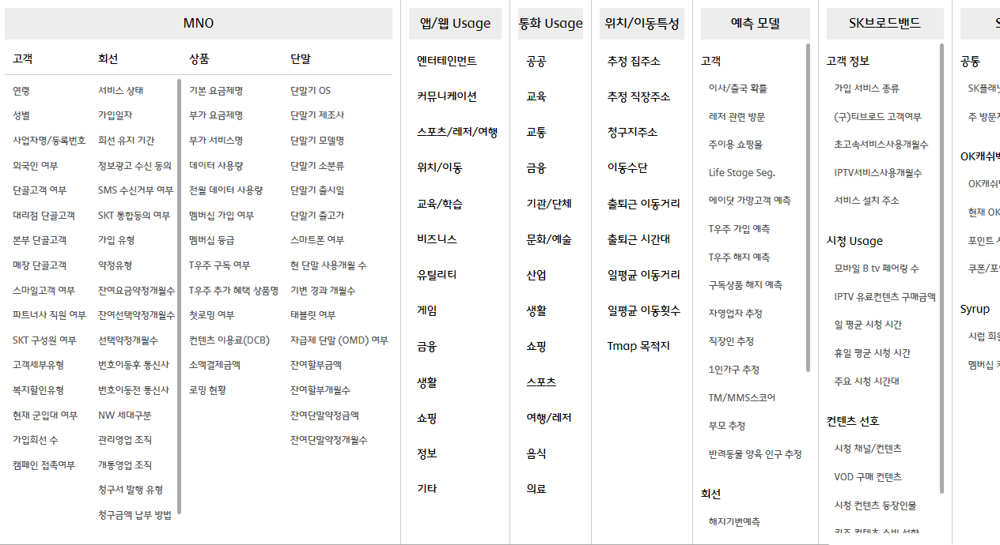
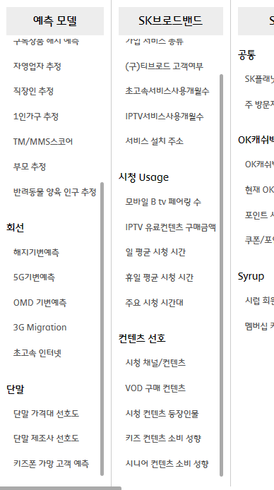
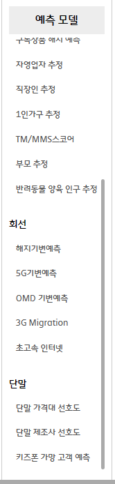
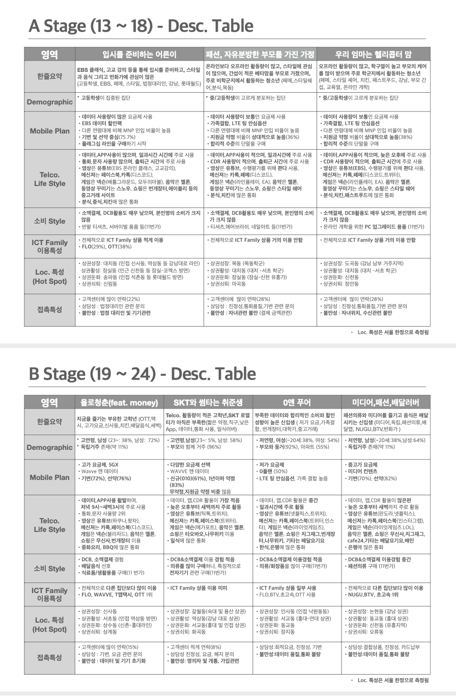
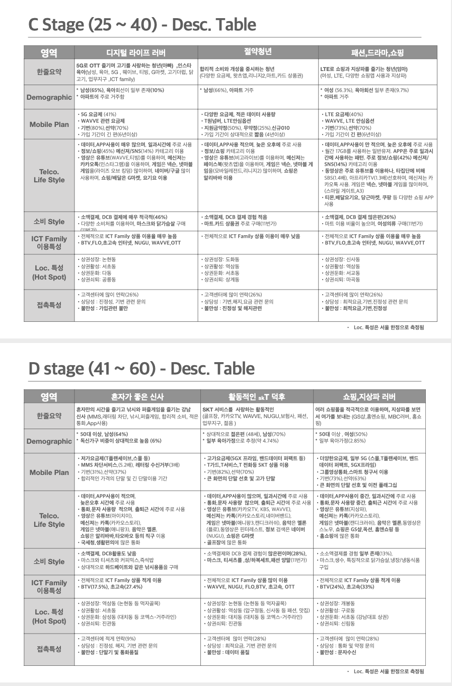
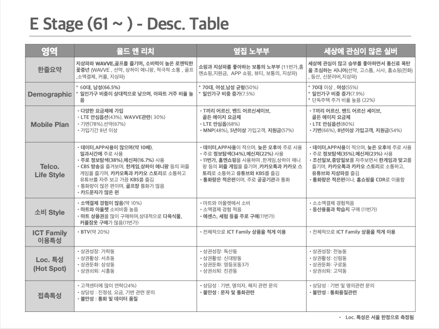

SKT 데이터 필터

다음의 고객 행동을 예측해서, 생성

텍스트 - 정보

소리 - 음악, 음성,

이미지 -

영상 -

Dynamic A   Writing N

하루 중 가장 많이 하는 것. 기록, 소통, 컨디션 유지

sLMM, Priva LMM

쓰지 않는 일기,

&quot;지난주 토요일 오후에 뭐 했더라?&quot;

&quot;11월 28일에 뭐 했지?&quot;

통화, ai 음성 필터
