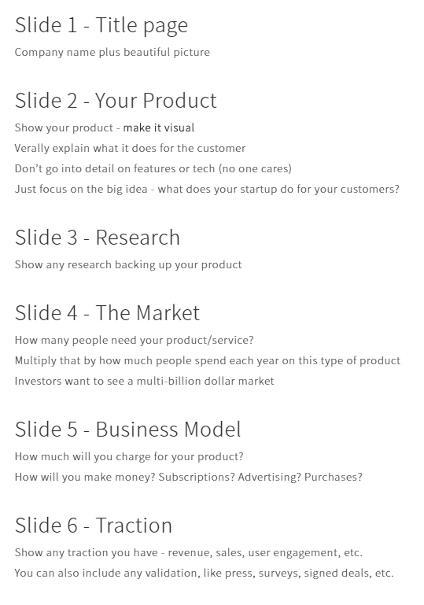
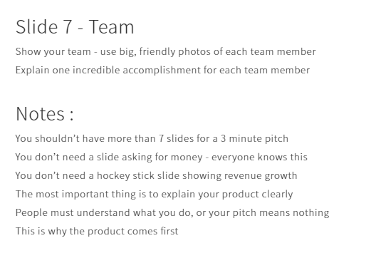
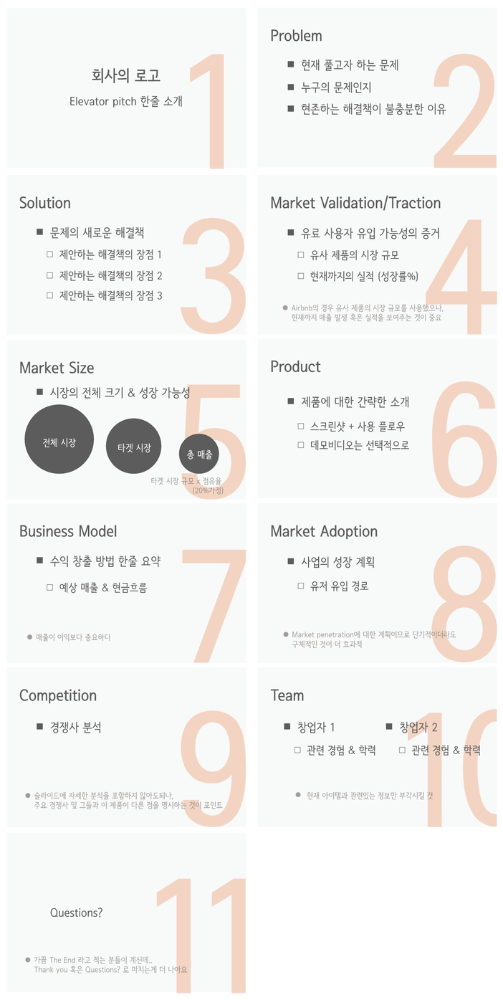

Slidebean : 참고할만한 플로우와 서식 다량 보유 [https://app.slidebean.com/dashboard/mine](https://app.slidebean.com/dashboard/mine)

1. 피칭을 할 때는 가장 중요하고 임팩트 있는 내용을 앞부분에 말하라. 기승전결을 다 말하려고 하면 결론이 나오기 전에 상대방은 이미 흥미를 잃을 가능성이 높다.

2. 핵심 비즈니스 아이디어는 누가 언제 물어보던지 1분 이내에 대답하라. 한 문장으로 말할 수 있다면 더 좋다.

3. 피칭 자료에 불필요한 근거자료는 모두 빼라. 정말 훌륭한 아이템으로 제대로 된 피칭을 했다면 상대방이 먼저 디테일한 부분을 물어올 것이다. 디테일한 부분은 그때 말하면 된다. 그럼 성공이다.

4. 자신감 있게 피칭하라. 초창기 스타트업 일수록 투자자는 사람을 보고 투자 한다. 내 아이템에 대한 자신감과 열정을 보여줘라. 실제로 제품 론칭도 전에 사람만 보고 좋은 투자를 받아 성공한 기업도 많다.

===================================

이것만은 지키자:

- 정말 중요한 정보만 보주자: 피치덱은 제품사양을 설명해주는 서류가 아니다. 제품의 핵심과 성장가능성만 보여주면, 투자에 관심있어하는 투자자는 따로 연락을 해올테니 그 때 더 자세히 설명해주면 된다.

- 정보는 선택적으로 보여줄 것: 절대적 유저수과 성장률 (%)에서 유리한 숫자를 선택하자 (대게는 성장률이 더 매력적일듯). 한국의 유명대라도 미국투자자를 대상으로 만든 피치덱이면 학교보다는 학과, 관련 경력 등을 부각시키는 것이 더 매력적이다.

- 화려한 이미지, 관련없는 미사여구는 절대 뺄 것: 최소한의 단어수로 메세지를 명확히 전달하는 것이 중요하다. 에뛰드하우스가 신의 한 수 감성적인 이름짓기로 성공했다고 하지만, 미국인은 그저 신기해할 뿐이니 최대한 감성적인 마케팅은 자제하자.

한줄소개 (One-liner)

피치덱은 슬라이드라도 준비할 수 있지만 한줄 소개는 더 짧고, 그렇기에 더 어렵습니다. 원라이너의 예제도 찾아보도록 하죠. 엔젤리스트 ([AngelList](http://angel.co/)) 나 크런치베이스 ([Crunchbase](http://crunchbase.com/))에서 회사를 찾아보면 대게 원라이너는 5-10 단어로 구성되어있습니다. 너무 길게 적는 것은 피해주시길!

- Airbnb/Uber for X: Uber for remodeling (BuildZoom)공유 경제를 기반으로 둔 스타트업이 많이 생기면서 이런 원라이너가 한 때 유행이었는데, 그만큼 풍자도 많이 됐죠.

- X for User type: The on-demand marketplace for business gigs (Jobble)

- 명령형: Organize anything you can imagine (Airtable)

- 현재 진행형: Making Bitcoin accessible to consumer, merchants, and developers (Coinbase)

