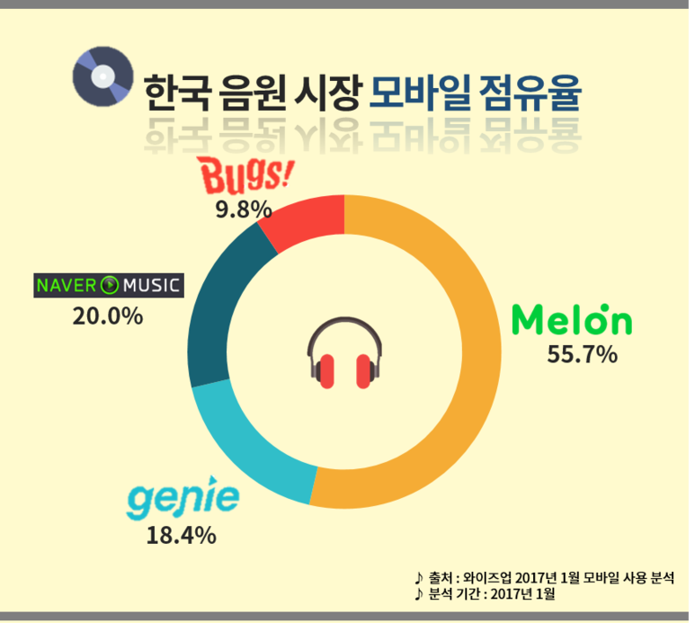
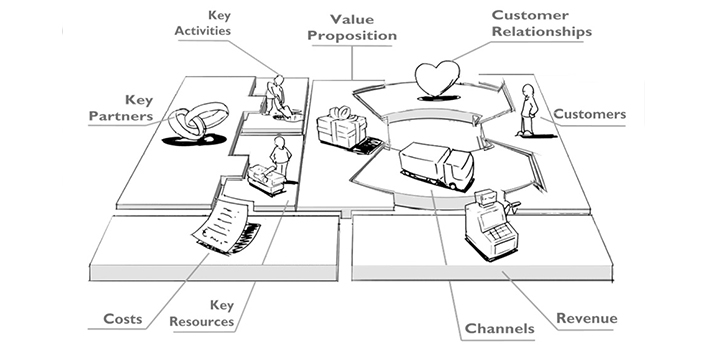
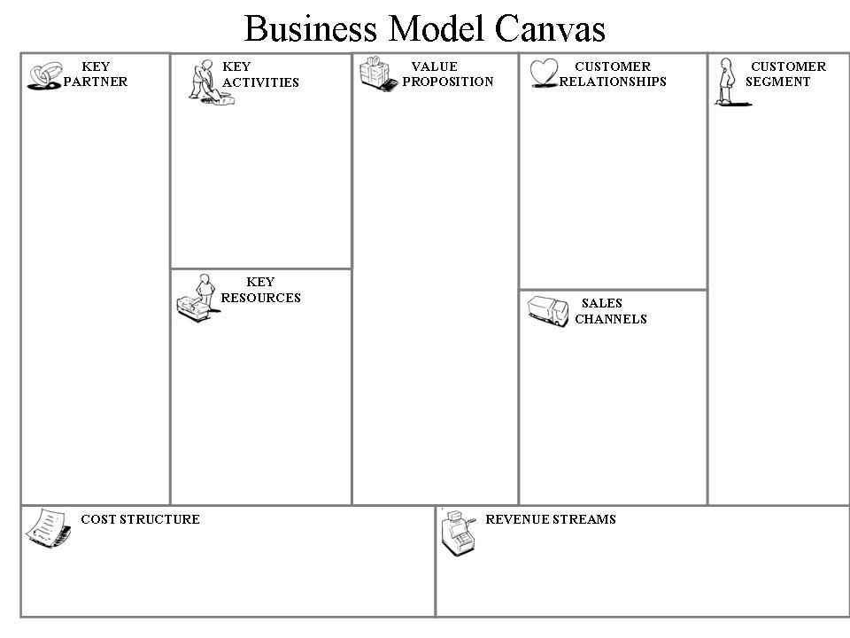

Tatoo

ㅇ [TO MAJOR TOM](https://m.blog.naver.com/PostView.nhn?blogId=afrodrone&amp;logNo=220551355724&amp;proxyReferer=http%3A%2F%2Fwww.google.co.kr%2Furl%3Fsa%3Dt%26rct%3Dj%26q%3D%26esrc%3Ds%26source%3Dweb%26cd%3D3%26ved%3D0ahUKEwjT1P-IjPDYAhUKGpQKHbBzA9AQFggwMAI%26url%3Dhttp%253A%252F%252Fm.blog.naver.com%252Fafrodrone%252F220551355724%26usg%3DAOvVaw1VdLhx5KSyAsT6QZ4sUpCL), TOM AT OO(무한의 우주) _ 데이빗보위 - 스페이스 오디티, starman,

판도라 말고 가둔것을 해방한 고사가 뭐가 있지?

To at M Tom/ To major tom/ For major Tom/  TUNE, 바이닐, DJ, 음악을 사랑하는 모두를 위한. 타투, 회전하는 것, 레코드의 골, 내 뮤지션과 하이파이브, 지원하고 백업하고, 손바닥을 보인다. 애플뮤직 소개동영상에 등장한 트렌트 레즈너 Trent Reznor(록그룹 나인 인치 네일스 Nine inch Nails의 리더)가 언급한 &#39;존중과 발견&#39;, 뮤지션과 음악, 그리고 예술에 대한 존중을 뜻한다.

전략의 근원적 의미&#160;– 전략은 당신의 기업이 앞으로 무엇이 될 것인지에 대한 선택에서 시작된다.

 &quot;Life for my artist&quot; 고객들은 muze라 칭한다.

ㅇ SKT의 새로운 음악 서비스

Why

What

- 국내외 음악시장 분석 및 사업기회 발굴

- 음악사업에 필요한 당사 Resource 발굴 - 아이리버, 뮤직메이트

- 외부역량 scouting - 블록체인 음원 서비스

========================================================

음악 하는 방법 : 앨범발매, 공연

음악 플레이어는 TV보다도 오랬 동안 함께해 온 디바이스/서비스

---------------------------------------------

[http://news.naver.com/main/read.nhn?mode=LSD&amp;mid=shm&amp;sid1=105&amp;oid=001&amp;aid=0009848524](http://news.naver.com/main/read.nhn?mode=LSD&amp;mid=shm&amp;sid1=105&amp;oid=001&amp;aid=0009848524)

섹시한거 빼고는 다 빼버려

ㅇ SKT가 음악 서비스를 만든다?

    SKT가 음악 서비스를 다시 만든다?

ㅇ 왜 다시, 음악인가? 음악 사업인가? (SKT 음악 사업의 목적은 무엇이어야 하나?)

 MNO Biz 강화? 새로운 수익 사업? AI스피커의  가져오기 위해?

음악은 다른 콘텐츠와 다르다.

미디어란 개념이 정립되기도 전부터 존재해온 인류의 킬러 컨텐츠다. 음악을 듣는 일은 사람들이 즐기는 두 번째로 흔한 취미이며, 차 안에서 운전 이외에 가장 많이 하는 활동이다.

음악은 내러티브가 중요하지 않다. 이해가 어려운 텍스트, 집중할 수 없는 영상은 콘텐츠로써 &#39;멀티&#39;가 안 된다. 영화나 넷플릭스를 볼 때 온전히 몰입하지만 음악은 그렇지 않다. 흘려 들어도 되고, 공부하다가 들어도 된다. 집중필요도가 낮아서 거리를 걷거나, 드라이브를 할 때나, 심지어 공부를 하거나 업무중에도 들을 수 있다.

그래서 다른 컨텐츠와 결합하기 좋은 컨텐츠다. 음악은 가볍고 보편적이다. 그 고유의 특성 때문에 다른 컨텐츠와도 쉽게 섞일 수 있다. 언제나 어디에서나 우리 삶 모든 곳에 스며들 수 있다는 뛰어난 화학적 결합력을 가지고 있다. 연인에게 사랑 고백을 할 때에도, 중요한 경기의 식전 행사에서도, 심지어 장례식장에도 음악은 필요하다. 영화, 만화, 에니메이션, 광고, 그림, 음식, 공연 등 모든 컨텐츠와 결합 혹은 병행해서 제공/소비가 가능하고, 음원, 앨범, 공연, 악기연주, 노래방 등 다양한 포맷으로 확장이 가능하며, 심지어 콘텐츠 하나가 요즘 유행하는 스낵 콘텐츠의 길이와 같은 3분 가량이다.

그래서 음악이다.

SK텔레콤이 사람들의 생활 깊숙히, 하루 종일 손에 쥐고 있는 폰은 물론, 거실(Home), 매장, 자동차 그 어디든 스며드는 촉매가 될 수 있다. AI 스피커에서부터 시작해서, 자율주행으로 운전자들이 &#39;손에서 핸들을 놓았을 때&#39;를 위한 Car 인포테인먼트로까지 확장하며 각종 플랫폼에 유연하게 적용이 가능하다.

ㅇ SKT 새로운 음악 비즈니스는 무엇이어야 하나?

제 2의 멜론, 혹은 근소한 차이를 가진 음원 플랫폼으로 충분한가?

당장 내일 우리에게 멜론과 동일한 서비스가 생긴다고 하면 멜론을 넘을 수 있을까?

이용자 입장에서 음원 서비스를 교체하기 위해서는

1. 서비스 탈퇴와 신규 가입의 번거로움

2. 기존 음악 라이브러리의 소멸

3. 새로운 UX/UI로의 적응이

요구된다. 다른 경쟁사가 때때로 제공하는 몇 천원 정도의 할인 혜택치고는 전환비용이 너무 높다.

그리고 지난 몇 년간 공세적인 가격할인과 끊임없는 UX/UI 개선에도 불구하고

멜론과 경쟁 서비스의 고착화된 구도는 이를 여실히 보여주고 있다.

단순히 음악을 편리하게, 혹은 저렴하게 듣기 위해서라는 이유로는 우리 플랫폼으로 churn-in이 어렵다.

멜론을 공존이나 병행사용이 가능할 정도로 &#39;다른&#39;가치를 제공해야 한다.

ㅇ 누가 음악을 만들어, 유통하고, 소비하며 그 과정에서 그들이 원하는 것과 통점은 무엇인가?

[음악 산업을 구성하는 이해관계자 = 음악 플랫폼의 고객]

음악 플랫폼 입장에서는 팬 뿐만 아니라 아티스트, 기획사, 제작자 등 음악산업을 구성하는 대부분의 이해관계자가 음악 생산자(공급자)임과 동시에 마케팅/유통 채널에 대한 고객(수요자)이다. 이들이 음악을 만들고 유통하며 소비하는데 겪는 어려움 혹은 충족되지 않은 니즈는 무엇인가.

구분
Pain point
Un-met needs

(컨텐츠 가격) 복잡한 유통구조로 뮤지션의 수익이 보장되지 않고, 뮤지션의 가격 결정권이 없다.

(컨텐츠 유형) 음악과 관련된 다양한 컨텐츠가 존재함에도 한정된 포맷으로만 제공된다.

(큐레이션) 차트와 추천곡 등 편향된 큐레이션으로 인해 컨텐츠 소비 구조가 제한적이다.

페인 포인트

[수익 구조] 뮤지션/제작자의 수익이 충분히 보장되지 않는다.

디지털 컨텐츠에 대한 낮은 지불의향과 가격

창작자에게 가혹한 음원 수익 분배구조

복잡다단하고 비효율적 유통구조

[컨텐츠/포맷] 다양한 컨텐츠와 포멧이 존재함에도 제한적으로 제공/소비되고 있다.

2차 창작음원의 저작권 문제

아이돌 의존도가 높은 기획사의 Biz 포트폴리오와 고객들의 컨텐츠 소비구조

[마케팅/큐레이션] 순위 차트와 추천곡 등 편향된 큐레이션으로 인해 컨텐츠 소비 구조 양극화가 심화된다.

현행 추천곡의 TPO에 따른 정밀도가 낮음

무제한 스트리밍으로 인한 선택항의 범람, 그에 따른 피로도 증가

음원 진열 방식과 추천곡에 의한 차트 왜곡

언멧니즈

[수익] 경제적 보상구조 정상화를 통한 창작의욕 활성화

창작자의 음원 가격 결정권 보장

클라우드 펀딩 중개를 통해 영세 뮤지션의 창작 활동 지원

[컨텐츠/포맷] 음원을 넘어 제공하는 컨텐츠와 포맷의 외연을 확장할 필요가 있다.

음원이라는 제한된 컨텐츠를 넘어 모든 음향의 컨텐츠화

음악에서 미디어로 서비스 개념의 확장

오디션 프로그램과 클라우드 펀딩 등을 통한 다양한 컨텐츠 확보

음원 이외에 영상, 텍스트, SNS, 사진 등 다양한 포맷 유통 지원

온라인으로 제공되는 디지털 컨텐츠는 판매 이후에도 지속적 업데이트 가능

[큐레이션/마케팅] 데이터 기반의 마케팅, 검색, 컨텐츠 공유 시스템 지원이 필요하다.

뮤직비디오 감독, 작사가, 작곡가, 디자이너 등 앨범에 기여한 크리에이터들을 위한 플랫폼 역할

스타 중심의 마케팅을 넘어 컨텐츠 중심의 마케팅이 가능한 마케팅 데이터와 툴 지원

음원 관련 메타데이터를 활용한 다차원 음악 검색

컨텐츠의 일부를 SNS를 통해 공유 가능하도록 하는 기능 구축

기존 물리적인 앨범과 동일하게 디지털 앨범 또한 소유, 대여, 재판매가 가능하도록 지원

ㅇ 어떻게 해소할 것인가?

I. 컨텐츠의 외연 확장을 통한 음악경험 혁신

II. 음악 컨텐츠 cloud Sourcing

III. 큐레이션 고도화

IV. Social viral을 통한 플랫폼 마케팅

-----------------------------------------------------------------------------------------------

I. 컨텐츠의 외연 확장을 통한 음악경험 혁신

1. &#39;음원에서 음향&#39;으로 음원의 외연 확장

ㅇ Sound monetization _ 창작된 모든 소리는 재화로 거래 될 수 있다

  - 음원은 물론 음원의 형태로 유통할 수 있고, 컨텐츠로서의 가치가 있는 모든 소리를 포괄적으로 유통한다.

  - 오디오북, 라디오, 팟캐스트, 가수의 인터뷰, ASMR, 노래방에서 부른 노래 등

ㅇ 우리 플랫폼이 직접 육성하는 오리지널 음원, 오리지널 아티스트 육성

우리 플랫폼에서만 독점 혹은 선공개

2. &#39;듣는 음원에서 보는 음악&#39;으로 음악감상 경험 확장

음악은 원래 &quot;보고, 듣는 것&quot;이었다. &#39;음악&#39;과 &#39;영상&#39;은 원래 하나다. 기술적 한계로 인해 제한되었던 음악 제작과 음악 감상 경험을 해방 해야한다. 뮤직비디오와 함께 &#39;본&#39; 음악, 영화의 OST가 뇌리에 각인되는 것은 그 음악이 단지 더 인상적이었기 때문만은 아니다. 물리학자들이 &#39;시간&#39;과 &#39;공간&#39;이 서로 분절된 실체가 아닌 &#39;시공간&#39;임을 밝혀냈듯, 이제 팬들에게 시각와 청각의 공감각을 되돌려줄 때이다.

ㅇ 시각 컨텐츠 중심의 차트, 리스트 구성

 - 플레이 리스트 자체를 영상과 함께 노출(e.g. 유튜브)

ㅇ 지속적으로 업데이트 되는 앨범

 - 오늘날의 음악가들은 단지 소리로만 자신을 표현하지 않는다. 뮤직비디오, 라이브 영상, 퍼포먼스, 설치미술, 춤, 사진

 - 영상, 텍스트, 사진, 소리 등 다양한 포맷으로 자신의 앨점/음원에 컨텐츠를 지속적으로 추가 가능하도록 지원

ㅇ 온라인 버스킹 플랫폼, 가수의 온라인 즉석 라이브

 - 라이브 공연에 모자에 동전 던져넣는 것처럼 좋아요 혹은 경제적인 보상이 가능하도록 구현

ㅇ 공연 전용관 운영 : 콘서트, 공연실황, VR전용 컨텐츠로 구성

 - 내한하지 않은 가수의 음악을, 티켓을 구하지 못해 &#39;보지&#39; 못한 공연을, 콘서트 현장의 감동을 다시 느끼고 싶은 팬들을 위해 영상 제공 - 주요 콘서트 및 축제 생중계 리포팅, 현장 리뷰 제공

ㅇ EDM 음악 페스티벌 주최 및 5G 기반 전국 동시 이원 생중계

 - EDM은 공연실황 이원 생중계가 유효한 거의 유일한 장르다. 잠실에서 하는 EDM공연을 전국, 전 세계에 무대만 설치하면 거의 현장감 손실 없이 원격지에서도 공연을 즐길 수 있다. 공연의 핵심요소가 보컬이나 연주가 아닌 녹음된 음악을 믹싱하는 것이라는 점과 화려한 조명과 무대효과로 구성되어 있다는 특성 때문이다. 현장에서도 아주 멀리서 조그맣게 보이는 DJ가 아주 먼 곳에 있다는 것이 공연을 즐기는데 크게 중요한 요소가 아니다. 또한, 멀티 플레이가 가능하다. DJ들이 각지에 흩어져서 서로 주고 받으며 원격으로 디제잉을 하는 것도 가능하다. 이 경우 각지에 흩어져있는 모든 공연장에서 공연실황을 보게 되는 셈이다.

II. 음악 컨텐츠 cloud Sourcing

1. 음악 컨텐츠 오픈마켓

ㅇ 블록체인 기반의 P2P, 직거래 방식의 음원/컨텐츠, 굿즈, 공연 판매 오픈마켓

  - 오픈마켓의 판매자 혹은 인스타그램 계정처럼 뮤지션 등록

  - 아티스트가 직접 음원을 등록하고 직접 가격 및 서비스 방식(다운로드, 스트리밍, 앨범단위 판매 등)을 결정

    (무료/유료 음원, 스폰서 음원, PPL 음원 등)

  - 퍼블리셔에 지급되던 몫의 수수료를 아티스트에게 배분

  - 기존 스트리밍 방식과 병행하며, 점진적으로 비중 확대

2. 2차 창작물 제작과 유통을 통한 풍부한 컨텐츠 확보

Prosumer, 모든 아티스트는 누군가의 팬이기도 하다. 모든 음악은 다른 창작물의 영감이나 재료가 되기도 한다. 하지만 지금까지는 저작권이 있는 음원을 활용하는데 시간적, 경제적, 기술적 제약이 심하고 따라서 분쟁도 잦았다. 완전히 Tracking이 어렵다는 문제 때문이었다.

ㅇ 블록체인을 통한 2차 창작음원 저작권료 정산문제 해결

 - Djing의 믹싱/샘플링에 사용되거나, 영상에 BGM으로 삽입된 음악 등 영리목 사용된 음악에 대해저작권 사용료가 배분이슈 해소

 - 누가, 어디에, 얼마나 원곡을 사용했는지를 블록에 기록해서 관리하고 저작권 정산을 투명하고 빠르게 처리

 - DJ도 1차 음원에 대한 정상적인 저작권료를 지불 조건으로 앨범과 음원 발매 가능

ㅇ UCC

 - 일반 팬이 아티스트의 음원을 활용해서 만든 컨텐츠에도 블록체인 기술을 활용해서 정당한 대가를 지불하고 사용하도록 할 수 있으며, 팬의 입장에서도 저작권법 위반에 따른 위험 회피할 가능

3. 오디션 &amp; 클라우드 펀딩

현재의 음원 서비스들은 음원 자판기에 가깝다. 복잡다단한 밸류체인을 거친 상품들을 다양한 방식으로 진열해준다. 아티스트와 팬을 직접 연결하는 창구가 필요하다.

ㅇ 신인 발굴 오디션

 - 기존에 TV에서 진행해온 프로듀스101과 같은 아이돌 발굴 오디션 프로그램을 플랫폼 내에서 진행

ㅇ 전국민 커버곡 오디션

 - 일별 혹은 주별로 커버할 특정 곡을 지정하고, 이용자들이 해당 곡을 커버한 영상을 플랫폼에 업로드

 - 해당 커버영상을 본 다른 이용자들이 평가

 - 차트 형태로 순위를 공개하고 최종 우승자에게는 데뷔 등의 베네핏이나 리워드 지급

ㅇ 클라우드 펀딩

 - 블록체인을 활용해서 음밤 제작, 공연, 굿즈 수익을 펀딩에 참여한 팬(투자자)들에게 쉐어

 - 블록체인 기술을 활용해서 투자에 대한 수익 배분 과정이 간소화 가능

ㅇ 블록체인 기반 재능 펀딩

 - 재정적 여유가 없는 뮤지션의 경우, 음반제작에 필요한 크리이에터들(뮤직비디오 감독, 작사가, 작곡가, 디자이너 등)의 도움을 받고, 나중에 음원의 판매수익을 공유하는 형태의 계약 가능

 - 이런 크리에이터들을 플랫폼 내에서 중개함으로써, 일종의 Task force 형태로 프로젝트에 따라 모여서 음반을 만드는 것을 용이하게 해줄 수 있음.

III. 큐레이션

스트리밍으로 인해 막대한 선택항이 범람하고 있다. 시간이 지날 수록 음악 플랫폼의 핵심 역할은 큐레이션이 될 것이다. 음악을 큐레이션하는 방법은 차트, 추천곡 제도, 알고리즘, DJ 등이다. 이들 각각은 차트는 &#39;대중적 선호도&#39;를 알고리즘 나의 취향(과거 데이터)를 DJ와 라디오는 공신력 있는 다른 사람의 추천이라는 각기 다른 속성을 지닌다. 각각의 방식을 도입하여 운영하되 차트의 폐단과 각 큐레이션 방식의 장단점을 상호 보완할 수 있어야 한다.

1. 순위 차트

차트란 &#39;대중적 선호&#39;라는 공신력을 의미한다. 멜론 등 지배적인 기존 서비스의 실시간 차트에 대응하기 위해서는 그만큼 영향력 있는 차트 집계 기준이 필요하다.

ㅇ 아티스트 차트 : 아티스트들이 플랫폼 내에서 듣는 음악의 순위

 - SNS 연동 등으로 공인임을 인증한 아티스트들이 재생한 음악의 순위를 차트로 제공

 - SNS 친구의 좋아요 여부 노출 (e.g Instargram)

ㅇ 소셜차트

 - SNS친구들, 혹은 이동전화 기반의 지인들이 즐겨듣는 음악의 순위를 제공

ㅇ 차트 기준 다양화

 - 세대별, 지역별, 평가/리뷰, 누적 재생 수, 좋아요 개수에 따른 차트

*사재기/어뷰징으로 인한 차트 왜곡 방지 : 재생 수가 아닌 유니크한 유저의 선호도 기준 적용

2. 알고리즘 추천

ㅇ T.P.O에 맞춰 추천 음악 리스트 제시

 - 출근길, 운동할 때, 휴식 시간, 차량 이동 중 등의 음악생활 패턴을 평소 음악을 듣는 시간과 위치정보에 따른 선호곡 정보 활용하여 추정

 - 최근에 듣고 있던 선호곡 포함

ㅇ 뮤직 레이크

 - 선호도가 높을 것으로 예상되는 추천곡을 시간대별로 5~10곡 씩 리스트로 제공

 - 리스트에서 맘에드는 곡을 체크하면 메인 플레이리스트로 편입

3. DJ와 라디오

스트리밍은 앨범의 파편화를 가져왔다. 하나의 앨범이 가진 온전한 플롯이 해체되어, 각자의 플레이 리스트로 섞여 들어간다. 그것은 또 그대로 개개인의 플레이 리스트 안에서 또 하나의 &#39;맥락&#39;과 &#39;서사&#39;를 만들어 낸다. 과거에 믹스 테이프가 있었다면 오늘날 플레이리스트가 그와 같은 기능을 한다. 그래서 DJ가, 사람이 필요하다. 각각의 음원이 가진 내러티브를 꿰어내는 DJ를 역할이 다시금 커졌다고 볼 수 있다. Serendipity의 즐거움을 위해, &#39;죽여주는 곡&#39;을 추천해줄 형, 오빠, 친구가 필요하다. 서태지가 알고리즘이 추천한 곡만 들을 수 있었다면, &#39;컴백홈&#39;은 나올 수 없었을 것이다. DJ란 아티스트들과 팬들에게 매일 사건과도 같은 &#39;뉴스&#39;를 들려주는 앵커이자 아나운서다.

물론, 알고리즘을 통해 구현할 수도 있으나 알고리즘의 추천과 사람의 추천이 다른 이유는 인간의 인식이 불완전한 까닭이다. 사람의 인식은 굉장히 유연하다. 같은 커피를 유명 바리스타가 건네 줄 때와 동료가 건네줄 때, 같은 와인을 소물리에가 소개할 때와 친구가 선물할 때. 우리는 같은 대상과 같은 풍미를 전혀 다르게 인식한다. DJ의 추천은 다른 사람의 시야와 귀를 빌려, 음악적 시야를 넓혀주는 여정이 될 것이다.

ㅇ 현재 멜론100으로 대변되는 획일화된 방식의 음원 큐레이션보다 인적요소(DJ) 도입 비중을 늘린다.

ㅇ 스타급 DJ를 섭외해서 직접 운영하거나, 기존 라디오 채널과 제휴를 통해 스트리밍으로 제공

4. 메타데이터를 통한 다차원 음악 검색 제공

ㅇ 영향 받은 아티스트, 계보, 사조, 함께한 아티스트, 사용된 악기, 피처링 등 해당 음원과 아티스트에 관한 정보와 뮤직비디오 감독, 작사가, 작곡가, 디자이너 등 관련된 크리에이터들의 메타데이터를 블록체인에 저장

ㅇ 하이퍼링크로 연관된 음원/앨범으로 이동하며 새로운 음악 탐색

*뮤지션 이외의 크리에터들의 저작물들도 아티스트처럼 포트폴리오화 해서 정리해주는 섹션 마련

5. 음원/아티스트 추천 및 보상 시스템

 - 좋아요, 댓글, 음원 구매, 다운로드 등 해당 음원과 아티스트를 지지하고 홍보하는 활동에 따른 보상지급

 - 이를 플랫폼상에서 공연, 굿즈, 음원 등을 구매 시 활용 가능하도록 구현 (이를 환금성 있는 비트코인/알트코인으로 지급하는 것도 검토 가능)

IV. 공유를 통한 플랫폼 마케팅

사실 P2P 방식의 음악 전송을 통해 음원 유통체인 상에서 중개자들을 배제하려는 시도는, 대부분의 음악 블록체인 스타트업들이 시도하는 방향이다. 그리고 그러한 시도에 블록체인 기술이 &#39;효율적&#39;인 것은 맞지만 꼭 블록체인이어야만 하는 것은 아니다.

음악이 블록체인을 만났을 때 할 수 있는 가장 멋진 일중에 하나는 이제 누구에게도 아픔을 주지 않고 음악을 &#39;공유&#39;할 수 있게 된다는 것이다. 누가 누구의 음악의 일부를 얼마나 사용했던 간에 이를 정확하게 Tracking하고 정당한 대가를 정산할 수 있게 해줄 수 있다.

1. Instagramable - 인스타 업로드가 가능하거나 아님 망하거나

역주행 했던 모든 음원은 페이스북에서 출발했고, Soundcloud를 띄운 것은 래퍼들의 디스전이었다. (서로를 디스하는 곡을 실시간으로 사운드클라우드에 업로드하고 이를 SNS에 링크하자 사운드클라우드로 엄청난 트래픽이 몰리기 시작했다.) SNS를 통해서 컨텐츠가 쉽게 공유될 수 있다면, 음원 마케팅의 판을 바꾸고, 새로운 수익구조를 창출하며, 서비스 플랫폼 자체의 바이럴 효과를 기대할 수 있다.

ㅇ 음원, 뮤직비디오, 가사 캡쳐본 에디터 지원

  - 사전에 저작권자의 동의를 득한 컨텐츠에 대해서 음원의 일부나 가사를 아름답게 편집해서 SNS에 업로드 할 수 있는 에디터 지원

      (길이 편집, 텍스트/사진 추가, 필터 기능 등 제공)

  - 영리추구를 위해 개설된 비즈니스 계정에 공유된 경우 이에 대한 사용료 지불

ㅇ SNS 바이럴용 스냅 뮤직비디오 제작 지원

  - 7~10초 정도의 분량으로 뮤직비디오의 일부를 편집하거나 사진으로 대체

  - SNS 사용 시, 소리를 재생하지 않는 경우도 많으므로 영상에 텍스트 활용

ㅇ SNS연동 댓글 기능

SNS에 음원을 공유한 경우 해당 포스팅을 음원의 댓글에 연동시킬 수 있도록 구현 (공개/비공개로 설정 할 수 있도록)

o 해외팬 거주 외국인팬이 우리 플랫폼을 SNS에 올리는 경우 K-POP 앨범/음원 다운로드 쿠폰 제공

*K-POP 연회비 멤버십 - 공연 할인, 각종 굿즈 할인권, 팬미팅 추첨권 등의 혜택과 연간 스트리밍 요금제 번들 판매

 ㅇ 무엇이 될 것인가?

▶ Block chain 기반의 음악 컨텐츠(음원/영상) P2P 오픈마켓

  ㅇ value proposition :

   - 뮤지션 : 창작물을 직접 팬들과 공유하고, 정당한 가치를 돌려받으세요.

   - 팬 : 매일의 발견, 멜론 100

※ 기존 Legacy 활용 방안

ㅇ T맵 X 뮤직 : 드라이브에 특화된 음악 추천과 UX 제공을 통해 T맵을 통한 초기 가입자 레버리지

ㅇ 아이리버 : 지향성 스피커 개발

  - 업무 중이어서 이어폰을 착용할 수 없거나, 열린 공간에서 혼자서만 음악을 들어야 할 때

  - 원래라면 음악을 들을 수 없는 상황에서도 음악을 들을 수 있는 인프라를 제공하여 이용자의 Time of share 확보

ㅇ T벨링 - 음악 플랫폼에서 사용자가 원하는대로 음원을 편집해서 컬러링, 벨소리로 사용 가능하도록 계약 검토

============================================================================

ㅇ 로드맵

1단계 : 기존 유통 구조를 유지하면서 블록체인 기반의 트래킹 기술 얹은 음원 스트리밍 서비스 구축

2단계 : 음원 유통사를 배제한 다이렉트 플랫폼으로 이행

3단계 : 플랫폼 BM 가동 - 막대한 트래픽에 굳즈, 공연,

4단계 : KPOP 글로벌 진출

단, 한국의 &#39;기획사&#39;라는 시스템 특성상 케이팝은

아직 레이블이 헤게모니를 쥐고 있다. 이들은 다르게 접근해야 한다.

그걸 역 이용할수는 없나? 레이블/기획사가 어떻게 힘을 가지지? 기획한 아이돌의 성공?

ㅇ 인수고려 대상 기업 - 애플 뮤직 참고 : 직원수, 연혁, 보유기술 등등

ㅇ 클로징 - 멘트. 결자해지. SK텔레콤은 멜론이라는 서비스로 사랑받았으나, 창작자들이 고통을 외면했다는 &#39;부채&#39;를 가지고 있습니다.

    SK텔레콤은 한국 음악산업을 정상화 하고 창작자들의 고통을 경감 할 사회적 책무가 있습니다.

이제 이를 되갚고 음원 시장구조를 건전화해야 합니다. 애플뮤직 등 글로벌 서비스로부터 언제까지 국내시장을 지킬 수 있을지 모름.

블루오션 캔버스

&#173;

========================================================================

Qick-win : Beat Melon, Bite Melon

ㅇ 목적 : NUGU 고객 대상으로 멜론이 서비스되고 있는데, 우리 음악 서비스 제공해서 자본 유출을 막아야 한다.

- 목표 : NUGU 고객 및 잠재고객 중 멜론 가입자를 빠른 속도로 가져올 방법이 필요하다.

- 전략 : 바이럴과 네트워크 효과를 만들어야 한다. 카카오가 우리 가입자를 잠식했듯이, UN-SP전략

        멜론/카카오톡이 절대 할 수 없는 선택을 해야 한다. 돈을 받지 않는다던가

Action plan : 멜론부수기 - 아전인수

수요자와의 협상력 [우호적]: 이용자 입장에서 음원 서비스를 교체하기 위해서는 1) 서비스 탈퇴

와 신규 가입이라는 수고로움, 2) 기존 음악 라이브러리의 소멸, 3) 새로운 UX/UI로의 적응이

요구된다. 다른 경쟁사가 때때로 제공하는 몇 천원 정도의 할인 혜택치고는 전환비용(switching

cost)이 너무 높다.

- 추천인 제도

- 음원 서비스 결합 요금제

- 음원 서비스 가족 요금제

- SKT고객에 대해 무료 이용 3개월

- 한류 팬덤 활용 - 내 가수때문에 어쩔 수 없이 이용하게 한다.

   - 아이돌들만의 음원 순위 및 차트 만들기

   - 팬덤 차트 : 스타의 인스타 영상이나, 활동 내역으로 차트를 만든다. 팬덤간 게임/경쟁 요소 도입

   - 오리지널 음원 독점공개

   - 공연예약 독점, 독점 굳즈 판매

- 새로운 앱을 런칭할수도 있다. 아니면 기존 우리 앱/다른 앱에 올라타서(멤버십) 위젯형태로 서비스? 티월드 모바일? - 침투전략

초창기 DVD대여 골리앗 기업인 블록버스터와 경쟁하기위해 연체료없는 DVD 대여

- 모든 요금제에 엮어버리기

- 멜론 스트리밍에서 멜론만 빼고, 스트리밍 요금제로 전환 ▶ 그리고 우리 서비스와 연동

- 모든 AI 서비스에 우리 서비스 무료제공

- 높은 브랜드 인지도와 서비스 전환비용의 존재

- 유통망을 통한 push  2. 요금제  3. 통신  4. 컬러링

선약통신비 인하처럼, 카카오톡 텍스트 복붙을 통해서 급속도로 확산되게끔 바이럴 마케팅

창작자 약탈적인 구조, 내 가수에게 생활을! 캠페인.

장기고객 혜택으로 우리 서비스 무료 제공(선택 옵션 중의 하나로)

통신사 기본혜택처럼 공짜음악 약정 퍼뜨리기

가족 스트리밍 요금제

멜론 사용 데이터(마이로그) 분석으로 최적요금제 제안

가입자. 네트워크 효과 측면에서, 요금제로 만들어야.

플랫폼 마케팅

- 현카처럼 주최사가 되고, 대대적 홍보, 전국 주요도시 거점에서 일렉트로닉 콘서트 이원화 중계 5G 기술 활용 + 홀로그램 DJ, DJ가 전국 각지 호출해서 동시 대한민국 전역을 동시에 클러빙

-  아날로그 엘피판 제작 서비스

- 가입 이벤트 : [https://ridibooks.com/event/8003](https://ridibooks.com/event/8003)

ㅇ 오디션 : 프로듀스101을 우리 플랫폼에서 한다면 우리와 팬들이 곧 기획사가 된다.

ㅇ 카톡으로 음악선물보내면 쿠폰지급 MGM

블록체인 활용 - 자기가 구입한 앨범을 친구에게 빌려주면 경제적 이익이 저작권자와 개인에게 돌아가도록?

처음에만 한시적으로 마케팅용으로 할 수 있는거잖아?

노래방기능 콰이같이 목소리 더빙 혹은 변조기능

게임 첫음듣고 노래 맞추기

초성으로 노래 맞추기

손가락 펌프, 손라락으로 막 치는 게임

(기타 아이디어)

아티스트별 굿즈 판매, 아티스트 후원

라디오앱 스푼,

매장음악 수요 충족시키기 위해서 PC버전도 빠르게 만들어야함.

아날로그적, 물리적인 촉감을 가진 것들에 대한 향수

LP거래 플랫폼이 될 수는 없나? 이 것들을 디지털화 혹은, 디지털 음원을 LP나 CD로 만들어주는 서비스.

음악경연대회 주최 및 운영

아마추어 뮤지션들을 위한 스튜디오 운영

아이리버에서 LG에서 만든 하이파이 그거 만들 수 없나?

바른음악협동조합처럼 창작자들 스스로 조직화해 독점 구조에 맞선 유통 구조를 마련해야 한다.

전화를 걸면 음악/ 공연에 연결되게? 우리의 지배력을 일시에 확산할 방법은? 앱을 켜는게 아니라 전화를 걸면

다양한 기기에서 재생되는 확장성, TV, 크롬캐스트, 사운드 링크,

구간반복 재생 기능

음원에서 바로 벨소리/컬러링 만드는 기능 - T벨링 연동

음악에 조예가 깊지 않지만, 음악을 즐기는 사람들에게

음악에 대한 정보를 제공?

음악을 보고, 듣고, 맛보고, 만지고, 맡는 경험 모두를 혁신해야 한다. 보는 소비하는 사용하는 공유하는 들려주는 만드는 작곡하는

소리를 음원 오디오북 라디오 팟캐스트 인터뷰 Smr 통화내용 먼곳의 실시간 소리.  결국 멜론의 시간점유율을 앗아오면된다. 노이즈 캔슬링 기능

모바일에 끼우면 이어폰 없이도 소리 들을 수 있는 지향성 미니 스피커 개발

아이리버의 휴대용 초지향성 스피커와 전용관

엠씨스퀘어 기능과 노캔

음악취향 비슷한 사람들 네트워킹 주선

재즈펍 등 음악공간 소개

=======================================

ㅇ 우리 레거시

네트웍 기술

   - 막대한 가입자 기반

   - 결합 요금제

   - SM, 아이리버, 뮤직메이트,

아티스트(연주가, 가수, 밴드, 작곡가, DJ), , 음원유통사

음원권리사(작곡가, 작사가, 편곡자, 기획사, 음반제작업체, 제작자/기획사) - SM, YG, JYP음원 유통사(CP) -  로엔엔터테인먼트, KT 뮤직, CJ E&amp;M, 벅스,  론뮤직, 핑크에이드, 미러볼뮤직, 디지털레코드음악 플랫폼(SP) - 로엔의 멜론, KT뮤직의 지니, CJ E&amp;M의 엠넷뮤직, NHN엔터의 벅스, 소리바다, 다음뮤직, 아이튠즈, 아마존공연 관련뮤직비디오 제작 한국음악저작권협회 - 작곡/작사가 권리 위탁 단체한국실연자협회 - 가수/연주자 권리 위탁 단체한국음반산업협회 - 음악 제작자 권리 위탁 단체

ㅇ (과금방식) 그래서 돈은 어떻게 벌건데?

우리는 어떻게 돈벌어?? 1. 수수료  2. 기획사?  3. 가수에게 플랫폼 사용료  4. 음원/공연예술 광고?

판매 수수료 수익이 아니라, 다른 걸로 수익을 얻어야함.

광고? 다른 컨텐츠 판매 수익?

ㅇ 수익구조의 다변화

블록체인 자체는 기술적으로 &#39;탈중앙화&#39;가 가능하다. 그러나 이는 데이터를 처리하는 방식의 탈중앙화에 국한된다. 비즈니스적 관점에서 보면 수수료 BM을 유지하는 플랫폼 사업자의 존재는 온전한 의미의 탈중앙화를 보장할 수 없다. 즉, 아티스트와의 밥그릇 싸움에서 자유로워질 수 없다는 의미이다.

불공정한 수익 배분을 블록체인 기술을 통해 해결하겠다는 다수의 스타트업들도 결국 VC의 지원을 받는 입장에서 수익성에서 자유로울 수 없고, 다시금 기존 플레이어들과는 달리 창작자의 권리를 얼마나 보장해줄 수 있을지에 대한 문제로 회귀한다.

플랫폼 사업자가 거두는 수수료 - 우리에게도 필요한가?(=우리가 음악사업을 다시 시작하려는 목적에 부합하는가?)

LP나 CD형태로 만들어주고, 아이리버는 이 플레이어를 만들어 파는게 어때

VR 카드보드 배포

SNS와 함께 일반인들이 제작한 영상이 폭발적으로 증가 - 영상에 음원을 넣을 수 있도록하는 편집기능 마련

뮤직캠. 음악을 틀어두고 영상이나 사진을 찍으면 자동으로 입혀주는.

큐레이션 서비스 네이밍 - 스펙트럼

ㅇ 디지털 앨범의 소유, 대여, 재판매

리셀가 될 수 있다. 블록체인을 통해 소유권 변화를 실시간으로 기록할 수 있기 때문에, CD나 LP판을 중고거래 하듯, 콘텐츠를 재판매 하는 것도 가능하다. 음원의 수집, 구매, 대여, 재판매 등 기존의 물리적인 앨범을 통해 가능했던 것을 재현할 수 있다.

블록체인 활용 - 자기가 구입한 앨범을 친구에게 빌려주면 경제적 이익이 저작권자와 개인에게 돌아가도록? 아니면 메타데이터라도 제공

음악MD, 에디터 조직 운영

ㅇ 스폰서 스트리밍

  요청하는 액션에 대한 대가로 사용자들의 음원 사용료를 대신 납부하거나, 보조금 지급

  이에 대한 모든 트랜젝션 데이터를 블록체인에 저장하고

ㅇ 음원 단위 마케팅 데이터 및 마케팅 Tool 제공

ㅇ 음악을 찾고 공유하며, 뮤지션과 팬을 연결하고, 팬과 팬을, 플레이리스트와 다른 플레이리스트가 연결될 수 있도록 해야 한다.

     - 휴대폰 약정과 엮는 요금제

▶ 비디오 스트리밍, 음원 스트리밍….. 돈 안드는 음악감상.

카카오, 멜론은 못하지만 우리는 할 수 있는 것, 우리만 가지고 있는 것.

Tom at the ∞OO(무한의 우주)

손바닥을 보이고 친다. 손뼉칠 타 너 역시 투 타투 [http://m.cndic.naver.com/search/word?q=](http://m.cndic.naver.com/search/word?q=타&amp;direct=false&amp;sLn=ko영감을)타&amp;direct=false&amp;sLn=ko영감을 주는 뮤즈 타투로 새긴다

블록체인에 비가역적인 정보를 남긴다.   [https://brunch.co.kr/@ken1224](https://brunch.co.kr/@ken1224)

[https://brunch.co.kr/@zohani/74](https://brunch.co.kr/@zohani/74)

[타](http://endic.naver.com/krenEntry.nhn?entryId=18019575c2f0466ea5797905bb062d4a)1&#160;(他)

1. (다른 사람) (the)&#160;[others](http://javascript:endicAutoLink(&#39;others&#39;);)

2. (다른) (the) other

좋은 사람들은

이따금 내게 좋은 음악을 소개했다.

그 음악들을 들을 때면,

그 사람이 생각난다.

이미지.비디오태그
