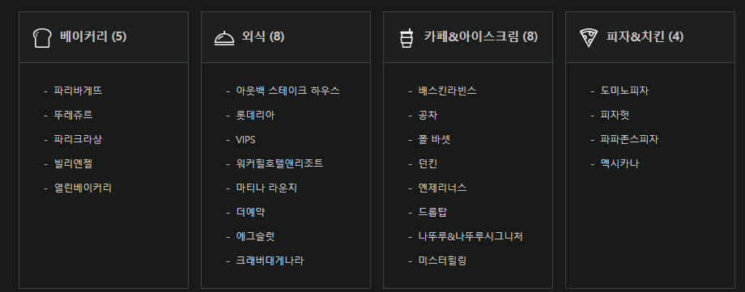
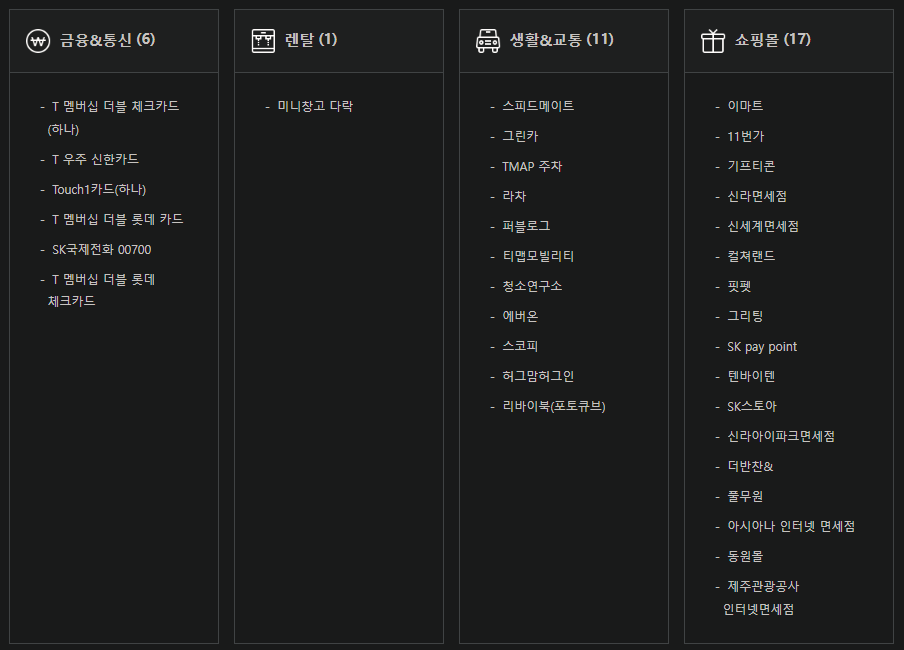
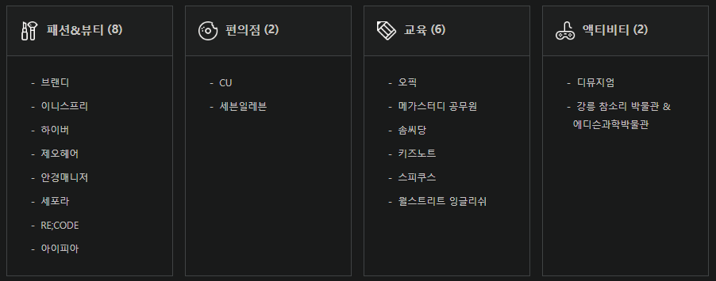
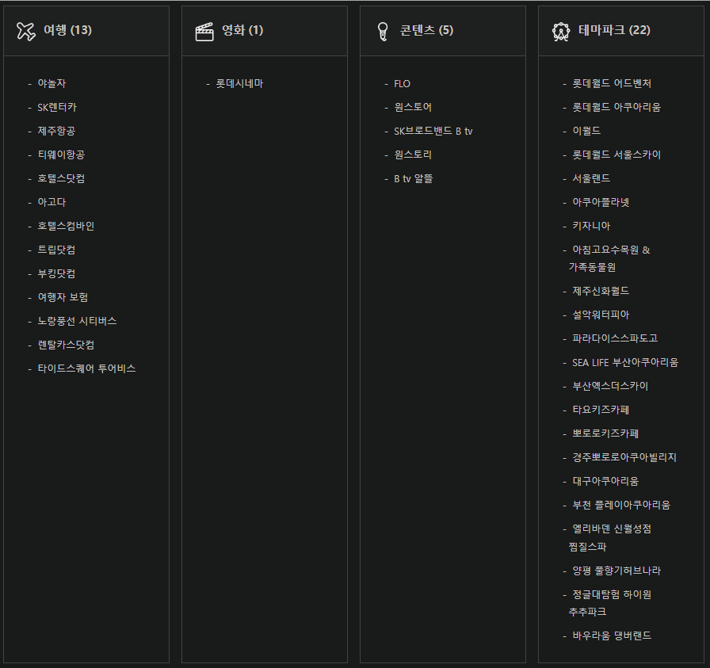

[사전 인지]

① 사전 인지: 고객이 사용처를 인지(암기)하고 있다가 사용

② 사전 탐색: T멤버십을 통해 사용처를 찾아서 사용

[알랴쥼] TPO

1/ T

- 사용 가능한 시기를 알랴줌 - T데이

- 실시간 인기 혜택 노출 - 위젯

2/ P

- 해당 POC에 방문했을 때 sign(팻말/스티커)으로 사용처임을 안내

- 고객이 위치한 지역의 사용처 noti.

① (GPS를 사용하지 않고) 기지국 셀단위로, 특정 지역에 30분 이상 머무르는 경우 해당 지역 관심 혜택 Push 알림

② 배달앱 + 네이버 지도 형태의 멤버십 지도 제공

3/ O

- 업태별이 아닌, 고객 니즈별 카테고리 재편: 식료품 구매, 외식/카페, 이동/여행 계획, 오프라인 쇼핑, 온라인 쇼핑, 학습, 주말 계획, 콘텐츠

- MNO 데이터 + 멤버십 사용 패턴 기반 App push

전파랑 + 멤버십?

위젯 - 한 화면을 다 덮는 T멤버십 위젯

T멤버십 바코드 스티커 인쇄 -&gt; 휴대폰에 부착

커스터마이징 가능하게.
