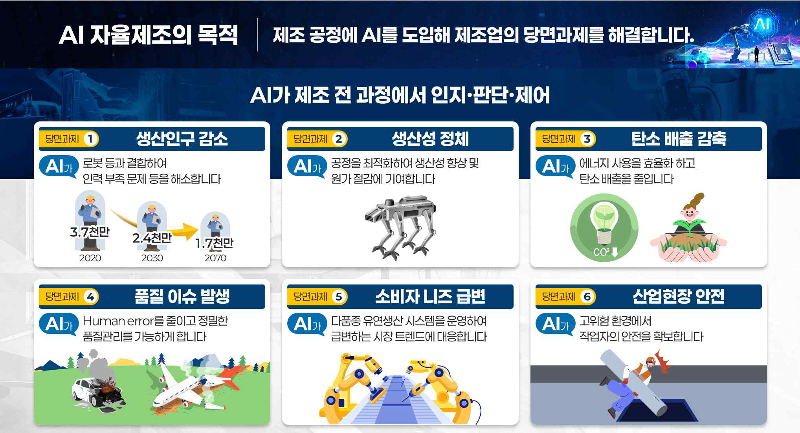
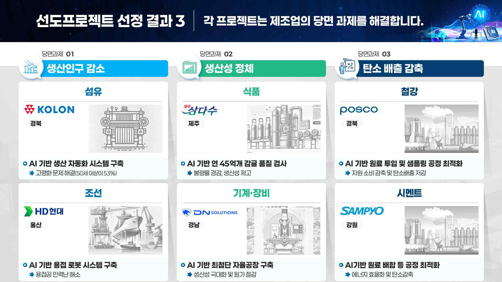
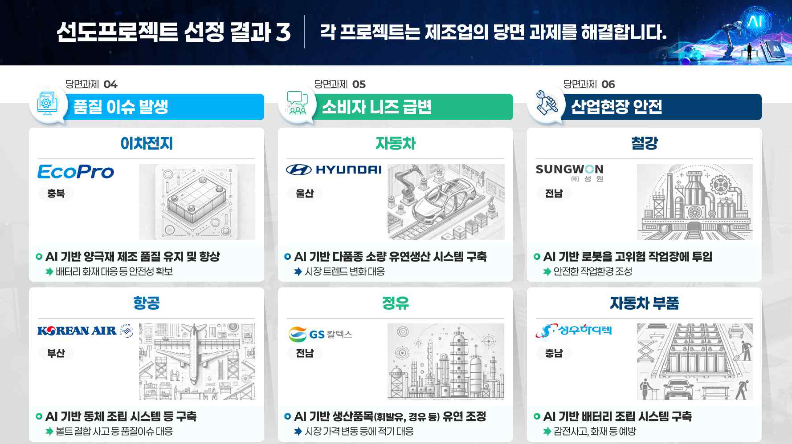
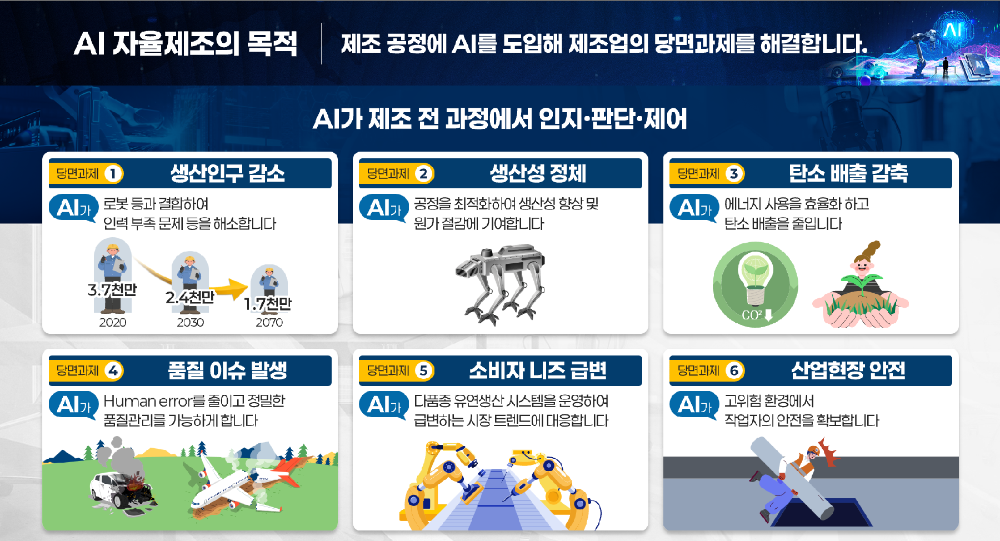
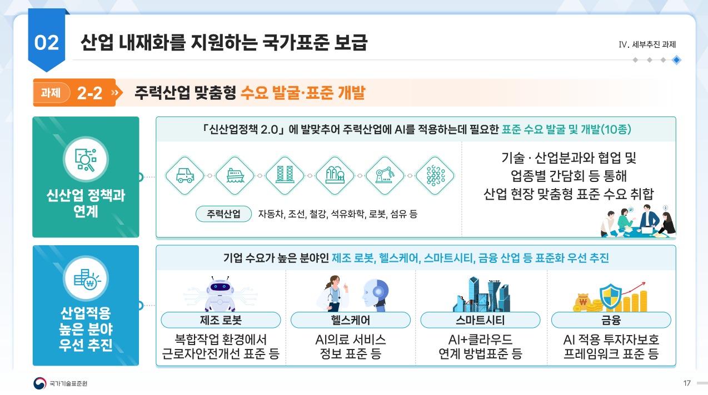
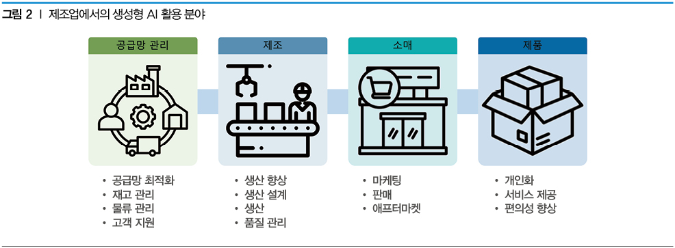

제조 AI

WHAT

제조?

제조 AI?

- AI 기술을 제조업에 적용하여 생산 효율성 증대, 품질 개선, 공정 자동화, 설계 최적화, 예지 보전 등을 실현하는 기술

- 벤츠, 삼성전자, 지멘스 등 여러 기업에서 자율제조 실현을 위한 핵심 수단으로 도입

- AI 기술은 단기적으로 생성형 AI, 온디바이스 AI를 위주로 각 산업 분야에 맞춰 우선 적용될 것이며, 장기적으로는 범용인공지능(AGI)으로 서서히 발전할 것으로 전망

정부에서 정의하는 제조 AI(AI 대전환)

1/ 新산업정책 2.0 (2024년 2월 발표)4번이 AI시대의 新산업정책 - AI 시대의 新산업정책 위원회 (2024년 5월 출범), 자율제조, 디자인, 연구개발, 에너지, 유통, AI반도체 등 6대 분야별 전략을 마련해 AI산업정책위원회를 통해 매월 발표할 예정&#39;25년 1월 &#39;[산업](file:///C:\Users\SKTelecom\Desktop\제조%20AI\산업통상자원부\【별첨2】%20｢산업%20AI%20확산을%20위한%2010대%20과제｣%20발표%20자료.pdf) AI 확산을 위한 10대 과제&#39; 발표

- (산업 AI 10대 과제)

① AI 선도 프로젝트

② AI 에이전트와 피지컬 AI

③ 산업 AI 컴퓨팅인프라

④ 산업 데이터

⑤ AI 반도체

⑥ AI 인재

⑦ 전력 인프라

⑧ 산업 AI 자본

⑨ AI 생태계

⑩ 산업 AI 제도

▶ ① AI 선도 프로젝트 - 자율제조(AI 팩토리) &#39;27년까지 200개/ 제조지원(디자인, R&amp;D, 에너지, 유통, 공급망/안전 등 추가)

2/ AI 자율제조 전략 1.0 (2024년 5월 발표)

AI신산업정책 6대 분야의 첫번째 과제 첫째 과제인 &#39;AI 자율제조 전략 1.0&#39;을 발표 - ①AI 자율제조 도입 확산, ②AI 자율제조 핵심역량 확보, ③생태계 진흥의 3개 전략을 축으로 올해(2024년)만 1000억원 이상을 투입, 2030년 AI 자율제조확산률을 30% 이상(현재 9% 수준), 제조 생산성을 20% 이상 높이는 것을 목표

AI 팩토리 (舊 AI 자율제조)

AI&#160;자율제조란,&#160;AI(인지&#183;판단&#183;제어) 기반 로봇&#183;장비등을 제조 전과정에 결합시켜&#160; 실제 제조환경의 생산 고도화&#183;자율화를 구현 하는 사업(1) 자율제조의 개념

‘자율제조(Autonomous Manufacturing)’란3) 공정자동화를 넘어 AI 기반의 로봇, 빅데이터 등 첨단기술을 활용하여 최소한의 인간 개입 하에 독립적으로 의사결정을 하여 제품을 생산하는 것을 의미한다.

제조 전 과정에서 발생하는 데이터를 기반으로 재고관리, 불량 최소화, 품질개선, 원가절감, 공급망 관리를 목적으로 한다. 자율 제조의 핵심은 의사결정 역량과 질의 획기적인 향상에 있다.

3/ AI&#160;자율제조&#160;선도&#160;프로젝트(2024년 10월 발표) - 선도프로젝트들은 ‘AI 자율제조 얼라언스’를 중심으로 추진

- 우리&#160;제조업의&#160;지능화&#160;수준은&#160;대부분(76%)&#160;기초&#160;단계에&#160;머물러&#160;있어,&#160;이번&#160;선도&#160;프로젝트를&#160;통해&#160;제조&#160;현장의&#160;디지털&#160;전환&#160;수준을&#160;고도화&#160;단계까지&#160;끌어올릴&#160;계획.

- 즉, 상세 공정분석을 통해 AI 적용 가능성과 효과성 등을 면밀히 검토한 후 해당 프로젝트에 소프트웨어(SW)&#183;로봇&#183;시스템 구축 등을 지원할 예정

추진경과□&#160;AI&#160;자율제조 선도프로젝트&#160;추진계획 발표&#160;(’24.5,&#160;｢AI&#160;자율제조 전략&#160;1.0｣)

□ ’24년도&#160;26개 선도프로젝트 선정&#160;(’24.10)

□ ’25년도&#160;기술 수요조사 실시&#160;(’25.3)

업종별 적용 사례

섬유: 코오롱글로텍 앵커기업으로 AI 기반 설비상태&#183;품질 실시간 감지

조선: 삼성중공업 배관 절단부터 용접까지 전공정 자동화

자동차: 현대자동차 생산 최적화 시스템 구축

현대자동차는 AI와 로봇을 활용해 공정 계획과 스케줄을 최적화하고 수요에 맞게 물류와 생산경로를 실시간 조정해 하나의 생산라인에서 여러 차종을 생산하는 다품종 유연생산 시스템을 구축할 계획이다.

GS칼텍스는 AI를 통해 공정의 온도&#183;압력&#183;유량 등 주요 변수를 실시간으로 분석하고 제어하여, 휘발유&#183;경유&#183;등유 등의 시장가격에 맞춰 생산 비율을 조정해 수익성을 극대화하고&#160;탄소 배출도 저감할 계획이다.

AI는 탄소감축에 효과적으로 기여한다. 특히 에너지 다소비업종인 정유&#183; 철강&#183;시멘트 등에서 AI 도입은 필수적이다. 삼표시멘트는 AI를 통해 공정을 실시간 모니터링, 분석하여 에너지 효율을 높이고 탄소를 저감하는 방안을 찾아 탄소중립 목표를 달성하고, 운영비용도 절감할 계획이다.

AI로 작업장 안전을 확보할 수도 있다. 특히 철강은 2,000℃ 이상 고온과 고압에서 작업이 이루어지며, 가스발생 등의 위험으로 작업장 안전 확보가 중요한 산업이다. 포스코는 제선&#183;전로&#183;압연공정 등 고위험 설비에 AI 자율제조를 도입해&#160;작업자 안전을 확보하는 동시에 제품 품질도 제고할 계획이다.

AI는 전 업종의 생산성 향상과 원가 절감에 기여할 수 있다. 제주삼다수는 1년에 45억 개의 감귤을 검사해&#160;이 중 8억 개 이상 ‘못난이 농산물(과일음료용)’을 선별하는데 작업자의 육안 검사에 의존하다 보니 효율이 낮고 오류가 많이 발생하였다. 삼다수는 머신비전 AI를 통해 구분한 저품질상품을 로봇을 이용해 선별한 후, 농축액을 자동 패키징하는 시스템까지 구축한다.

한편, 산업부가 선정한 26개 프로젝트는 반도체, 자동차, 조선 등 총 12개 업종에서 26개 기업이 과제 주관사로 참여하였다. 26개 기업은 대기업 9개, 중견&#183;중소기업 17개로 구성돼 있다.

26개 선도프로젝트의 총투자비는 3.7조원 수준이며, 이 중 정부와 지자체는 4년간 총 1,900억 원을 지원하게 된다. 특히 지방비 매칭은 의무가 아닌 선택사항이었으나, 지자체들은 긴급 예산을 편성해 26개 모든 프로젝트에 지방비를 매칭하였다.

➊우선 AI는 생산인구 감소와 인구구조 변화 등 대응에 효율적인 수단이다

코오롱이 속한 섬유산업은 고령화가 심화된 업종으로(50세 이상 53%), 숙련 기술자의 은퇴로 인력난과 생산기술 단절이 가속화되고 있었다. 코오롱은

AI를 통해 설비상태와 품질을 실시간 감지하고 제어하는 한편, 무인 물류 시스템 등을 통해 공정 자동화를 추진한다는 계획이다.

조선업의 경우에도 선박용 배관 공정은 숙련 용접공의 은퇴 등으로 어려움을 겪고 있고, 대부분 공정을 수작업에 의존하고 있었다. 삼성중공업은 AI를 통해 배관 절단부터 용접까지 전 공정을 자동화하고, AI 기반의 가변 용접 조건이 탑재된 로봇 시스템을 구축할 계획

➋.AI를 도입하면 Human Error를 줄이고 정밀한 품질관리가 가능해진다.

특히 배터리, 항공, 방산, 반도체 등 첨단 테크 분야에서 필요성이 크다. 이차전지는 전기차 화재로 품질확보가 더욱 중요해졌다. 세계 1위 양극재

기업인 에코프로는 AI를 통해 공정 데이터를 실시간 분석해 공정상 오류를 미리 예방하고 설비를 자동 제어해 최상의 품질을 확보할 계획이다. 한편 올해 초 보잉기의 볼트 결합불량 사고로 항공기 분야에서도 품질확보가 이슈가 되고 있다. 대한한공은 AI를 통해 항공기 동체 조립공정에 산업용 로봇을 도입하고 작업지시&#183;품질 검사 등을 모두 자동화할 예정이다.

➌.AI를 활용해 소비자 니즈 등 빠르게 변화하는 시장트렌드에 대응할 수 있다.

현대자동차는 AI와 로봇을 활용해 공정 계획과 스케줄을 최적화하고 수요에 맞게 물류와 생산경로를 실시간 조정해 하나의 생산라인에서 여러

차종을 생산하는 다품종 유연생산 시스템을 구축할 계획이다. GS 칼텍스는 AI를 통해 공정의 온도&#183;압력&#183;유량 등 주요변수를 실시간으로 분석하고 제어

하여, 휘발유&#183;경유&#183;등유 등의 시장가격에 맞춰 생산 비율을 조정해 수익성도극대화하고, 탄소 배출도 저감할 계획

➍AI는 탄소감축에 효과적으로 기여한다.

특히 에너지 다소비업종인 정유&#183;철강&#183;시멘트 등에서 AI 도입은 필수적이다. 삼표시멘트는 AI를 통해 공정을 실시간 모니터링, 분석하여 에너지 효율을 높이고 탄소를 저감하는 방안을 찾아 탄소중립 목표도 달성하고, 운영비용도 절감할 계획이다

❺.AI로 작업장 안전을 확보할 수도 있다.

특히 철강은 2000&#176;C이상 고온과 고압에서 작업이 이루어지며, 가스발생 등의 위험으로 작업장 안전 확보가

중요한 산업이다. 포스코는 제선&#183;전로&#183;압연공정 등 고위험 설비에 AI 자율 제조를 도입해, 작업자 안전을 확보하는 동시에 제품 품질도 제고할 계획이다.

❻AI는 전 업종의 생산성 향상과 원가 절감에 기여할 수 있다.

제주 삼다수(JPDC)는 1년에 45억개의 감귤을 검사해, 이중 8억개 이상 ‘못난이 농산물(과일음료용)’을 선별하는데 작업자의 육안 검사에 의존하다 보니 효율이 낮고 오류가 많이 발생하였다. 삼다수는 머신비전 AI를 통해 구분한 저품질상품을 로봇을 이용해 선별한 후, 농축액을 자동 패키징하는 시스템까지 구축한다.

제조공정 및 생산시스템 혁신을 위한 .자율 제조 변혁지도. 수립

- 업종별 제조공정 분석을 통해 생산 전 과정에 대한 지능화&#183;자율화 방향성을 제시하고 기계&#183;장비&#183;로봇과 AI의 융합 추진

- 지역별 1~2개 업종 대상 시범프로젝트를 추진(’24.上)하고 국내 제조업 특성에 맞는 기계&#183;장비 도입, AI&#183;SW 솔루션 개발 등 추진

핵심기술 분석 및 기술 개발을 위한 .AI 자율 제조 기술 로드맵. 수립

- .AI, .SW, .로봇&#183;기계&#183;장비 등 3대 분야 핵심기술* 선별

* AI 인지&#183;제어, SW 기술, AI 자율 제조데이터 표준, 데이터 플랫폼 구축 등

글로벌 제조업 AI 시장 동향

- [마켓앤마켓 &#39;Artificial Intelligence in&#160;Manufacturing Market – Forecast to 2028’에 따르면, 제조 분야에서의 AI 시장 규모는 2023년 32억&#160;달러에서 2028년 208억 달러로 증가하는 등 연간 45.6%의 성장률을 보일 것으로 전망](http://webzine.koita.or.kr/202403-specialissue/%EC%A0%9C%EC%A1%B0%EC%97%85-AI-%ED%99%9C%EC%9A%A9-%EC%A0%84%EB%A7%9D)

WHY?

왜 제조 AI? _ 제조 AI의 가치

[프로스트&amp;설리번 보고서 ‘The Rise of Generative Artificial Intelligence in Manufacturing’은 생성형 AI가 제조업에 주는 세 가지 핵심 가치로 △데이터의&#160;양적&#183;질적 향상 △인력 및 비용의 부족 문제 해결 △창의적&#160;문제 해결을 제시](http://webzine.koita.or.kr/202403-specialissue/%EC%A0%9C%EC%A1%B0%EC%97%85-AI-%ED%99%9C%EC%9A%A9-%EC%A0%84%EB%A7%9D)

- 첫째, 생성형 AI는 데이터 품질에 대한 문제를 해결하거나 새로운 데이터 생성을 통해 학습 데이터를 증강하는 데 활용될 수 있다.&#160;현재 보유한 데이터가 제한적이고 편향된 경우 이러한 방법이 특히 유용하다.

- 둘째, 전통적으로 숙련된 노동자를 필요로 하는 복잡한 작업을 자동화하는 데 활용할 수 있다. 또한 생성형 AI는 제조전략 및 설비 구성을 빠르게 최적화하고, 작업자의&#160;기술을 향상할 수 있는 다양한 교육에 활용될 수 있다.

- 셋째, 복잡하고 방대한 설계안을 검토하거나 학습 데이터로부터 도출된 특정 패턴 또는 관계로부터&#160;새로운 아이디어를 도출하는, 가치사슬(제품 설계/공정 최적화/생산 전략) 전반에 걸쳐 혁신성을 발휘하는 데 도움을 줄 수 있다.&#160;

- 생산성 향상: 공정 최적화와 자동화를 통해 생산성 향상

- 비용 절감: 불량률 감소, 설비 유지보수 효율화로 비용을 절감

- 맞춤형 생산: 대량 맞춤 생산을 가능하게 하여 고객 요구에 더욱 빠르게 대응 가능

- 혁신: 데이터 기반의 의사결정을 통해 창의적 문제 해결과 새로운 기술 개발을 촉진

대한민국 제조 AI

&lt; 제조업의 당면과제와 AI 자율제조의 역할 &gt;

SK그룹, SKT의 제조 AI

- 그룹 주요 포트폴리오인 에너지/전력, 반도체/전자부품에서 AI 시장 규모 증가 추세

- 정부 신산업정책의 주력 산업: 자동차, 조선, 철강, 석유화학, 로봇, 섬유 등

-

- AI 자율제조 10대 선도프로젝트의 후보 사업에는 반도체, 자동차, 조선, 이차전지, 기계, 디스플레이, 철강, 섬유, 가전 등 우리나라를 대표하는 첨단 및주력업종이 모두 포함, 선정된 사업에 대해서, 기업별로 최적화된 ▲소프트웨어(산업 AI), ▲하드웨어(로봇), ▲통합시스템(SI) 등의 개발과 구축을 맞춤형으로 지원할 예정

HOW

주요 활용 분야

- 품질 관리 및 검사: 딥러닝과 비전 시스템을 통해 불량품을 검사하고 제품 품질을 개선

- 예지 보전: 센서 데이터를 분석하여 기계 설비의 고장 시점을 예측하고 유지보수 효율 제고

- 생산 계획 및 자동화: 수요 예측, 재고 최적화 등을 통해 생산 계획을 수립하고, 로봇 등을 활용한 공정 자동화를 구현

- 설계 및 디자인: 생성형 AI를 활용하여 신제품 디자인을 생성하거나 기존 디자인을 개선

- 현장 지원 및 작업 관리: 현장 작업자의 의사결정을 지원하고, 일상적인 업무를 돕는 AI 도구로 활용

- 공급망 관리 업무에서는 대규모 데이터 처리, 패턴 식별, 적용 가능한 아이디어 생성, 재고 모니터링 및&#160;실시간 재고 업데이트, 직관 예측, 출고 감시, 중단지점 확인, 경로 최적화, 고객 및 공급처 관리, 공급망 관련 질의 등에 활용

- 제품의 제조 단계에서는 설계 아이디어 생성, 재료 선정, 고객 선호도에 따른 전략 수립, 기술 문서 자동 생성에 활용할 수 있다.

- 제품 생산 시에는 조립 라인의 병목 지점 식별, 기계의 잠재적 고장 분석,&#160;실시간 제조 정보 처리에 활용할 수 있고, 제품 품질&#160;관리 단계에서는 생산된 제품의 편차 식별과 제조 파라미터 분석에 활용할 수 있다.

- 제품 판매 단계에서는 고객의 요구사항, 시장 동향, 경쟁사 분석 등을 반영하여 마케팅이나 판매 전략을 수립하고, 애프터마켓의 활성화 방안을 도출하는 등에 활용할 수&#160;있다.&#160;

- 마지막으로 고객의 취향, 행동, 피드백 등을 분석하여 맞춤형 제품이나 서비스를 제공하거나, 고객과의 상호작용을 강화하기 위해 텍스트, 음성, 이미지&#160;등의 콘텐츠를 생성하는 데 활용

도입 전략&#160;

데이터 품질 확보:성공적인 AI 확장을 위해서는 양질의 데이터를 확보하는 것이 중요합니다.

시스템 통합:기존 시스템과의 원활한 통합을 통해 AI 기술을 효과적으로 활용할 수 있습니다.

점진적 접근:AI 도입을 단계적으로 진행하며, 자사에 맞는 AI 시스템을 도입하는 것이 중요합니다.&gt;

한계와 극복해야 할 과제

- 제조업의 경우 제품의 형태와 종류가 매우 다양하고 생산 환경도 현장마다 다르기에, 범용적인 플랫폼으로는 사용자의 요구를 모두 충족시키기 어렵다.

- [신뢰성] 또한 현재 생성형 AI 기술은 정보 정확성에 대한 불안, 결과의 차별성, 시스템의 불안정성 등으로 인해 충분한 신뢰성을 확보하지 못했다. 이 때문에 AI 시스템은 빠른 효과를 볼 수 있고 높은 신뢰도가 요구되지 않는 업무에 개별적으로 적용되고 있다. 높은 신뢰도가 요구되는 업무에는 작업자의 확인이 필수적이다.

- [보안] AI 기술 도입 시 데이터 유출과 저작권 및 개인정보보호 등 규제에 대한 고려와 대응도 필요하다. 일부 기업에서는 데이터 유출 문제로 외부 생성형 AI 도구의 사용을 금지하고 있으며, 민감한 데이터는 사내 플랫폼에 구축하는 것도 고려해야 한다.

[제조업](http://webzine.koita.or.kr/202403-specialissue/%EC%A0%9C%EC%A1%B0%EC%97%85-AI-%ED%99%9C%EC%9A%A9-%EC%A0%84%EB%A7%9D) AI 활용 전망

SKT가 제조 AI의 어떤 영역을 왜, 어떻게 접근해야 하는가?
