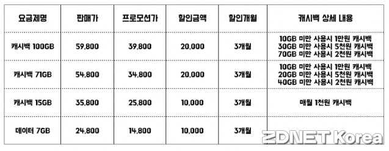

토스

비바퍼블리카, 이하 토스라 하겠다.

/기업 가치

&#39;21년 11월 비상장 시장에서 토스의 시총은 28조8400억원

&#39;22년 신규 투자를 진행하면서 기업 가치가&#160;8조5천억원으로 1/3 수준으로 조정

/ 토스는 은행인가?

토스가 은행이라면 예대마진으로 승부를 보는 것이 옳다.

토스 매출의 95%는

매출의 95%를 은행 등 금융회사에서 벌어들이는 B2B사업 모델을 운영하고 있다. 각 금융사들은 자사의 신용대출, 카드모집 등을 토스 플랫폼을 통해 더 많은 고객에 노출하고, 고객은 금융사간 경쟁을 통해 더 유리한 선택을 하는 구조

/3Q22

충당금적립전이익 185억원으로 최초로 흑자

누적 적자 1,719억원

영업손실 476억원

왜 MAU 그것도 모자라 CC만 주구장창 외치고 있는가.

/MAU와 CC(Carrying capacity)

&#39;22년 12월 기준

토스의 MAU는 1365만. 높다.

하지만 카카오뱅크의 MAU도 1320만이고, 레거시 취급하는 금융사앱중 KB의 MAU도 1215만에 육박한다.

이승건 대표가 CC(Caring capacity)를 애지중지 하는 이유가 나는 여기 있다고 본다.

MAU만 보면 토스를 그다지 매력적이라고 볼 수 없기 때문이다.

심지어 토스처럼 하나의 앱에서 여러 서비스를 제공하는 슈퍼앱의 경우 상대적으로 MAU가 과대평가 될 수 있다.

그들은 금융사가 아니라 금융 플랫폼(B2B 뽀찌장사)이기 때문이다. 즉, 광고+수수료 BM이다.

1. 간편 송금 + 기타 갖가지 트래픽을 모을 만한 자산관리 및 이벤트성 조회 캠페인 등을 통해 트래픽을 모은다.

- 인입된 고객들에게

/

타다 인수 - 타사 넥스트의 운행 대수는 3천대, 전국 택시

작년 여름 기준 타다 1400대, 올해까지 최대 3천대로 증차 예정.

전국 등록택시 수는 165천대 3천대까지 증차를 가정했을 때 타다의 점유율은 0.018%

토스가 기존 금융의 BM을 일정 부분 disruption 하고 있기는 하다.

토스가 새로운 시장을 만들었는가?

토스만의 고유의 상품이 있는가?

토스가 혁신하고 있는 부분은 뚜렸하다. 앱의 UI/UX다.

아직까지는 혁신이 아니라 파괴 정도이지 않나.

토스는 더 이상 스타트업이 아니다.

[https://n.news.naver.com/mnews/article/215/0001074802?sid=101](https://n.news.naver.com/mnews/article/215/0001074802?sid=101)

토스모바일=마이월드

요금제가격만 보면 경쟁력이 크게 없어보입니다.

캐시백15GB 기준 정상가 35,800 - 캐시백 1,000 = 34,800원

저희 다이렉트5G 11GB 기준 가격 38,000원인데, 다이렉트는 가족결합도 가능

&#39;토스페이&#39;를 사용할 경우 사용금액의 10%(최대 5천원)를 돌려주는 내용도 담겼다. 아울러 토스모바일 가입자는 캐시백으로 받은 토스포인트를 현금화하는 것도 가능하다.

&quot;망 도매대가 이하 요금제를 구성하거나 과도한 경품을 지급하는 등 과도한 출혈 경쟁은 지양할 계획&quot;

24시간 고객센터를 운영하고, 토스 앱 내에서 가입이 가능하도록

29일 0시 기준 서비스 사전신청자가 15만 명을 넘겨

MNO 가입자가 약 73％

연령별로 보면 20대가 전체의 약 40％로 가장 많았으며 30대(28％)와 40대(21％)가 그 뒤를 따랐다.

데이터7gb에&#160; +3mbps나 1mbps 있고 1만원캐시백 2년프로모션이면 가성비 좋을텐데 아쉽네요. 토스페이10%로 한달에 5000원 추가 할인이면

&#160;

24800-10000(캐시백)-5000(토스페이10%)=9800원

&#160;

일텐데 3개월이라서 탈이유는 없는거 같네요&#160;2

1메가는 가입하면 안돼요 3메가는 돼야함

100기가 가입해서 1만원 캐시백 받으려고 10기가도 안쓸거면 뭐하러 가입해요. 5천원, 2천원 캐시백도 그렇고..

뭐 이왕이면 쓰면서 적게 쓸때도 있으니 캐시백도 받고?

동영상도 많이 보고 데이터 걱정 없이 쓰려고 가입하는 게 목적인데..

캐시백으로 눈길 끌어보려는 건가 본데 그게 더 x 같네요.

5G 단말 대상 LTE요금제를 열어주면?

유무선 통신사업회의 내용 중,

규제) KB의 신규 가입을 중단하는 대신에… 중소 알뜰폰 가입 고객들한테 새로운 금융 상품을…제공하는 방식으로 전환을 하자라고 제안을 했다고 함. 그래서 지금 현제 금융권 대해서는 더 이상 진입을 못하도록 추진을 하고 있는 상태입니다. 두번째로 국회 계류중인 법안은 알뜰폰 법안인데…유보신고제인데 부당한 수준이면 과기부가 관여하는… 우리는 3년으로 가되 대가 규제 관련해서는 윤영찬 의원 안으로가는게 스탠스. 앞으로 알뜰폰 관련 법안은 국회 논의 통해서 시장에 시그널 주는 방안으로 갈 수 있도록 준비하겠다.

사실 우리의 걱정거리는 금융도 있고, 통신 자회사도 있고, 마지막으로 토스같은 디스럽티브 플레이어가 있고…3군데. 금융은 어떻게든 막아야 되는 부분이 있다고 한다면… 사실 토스는 금융사업자가 아니어서 막을 명분이 없다.
