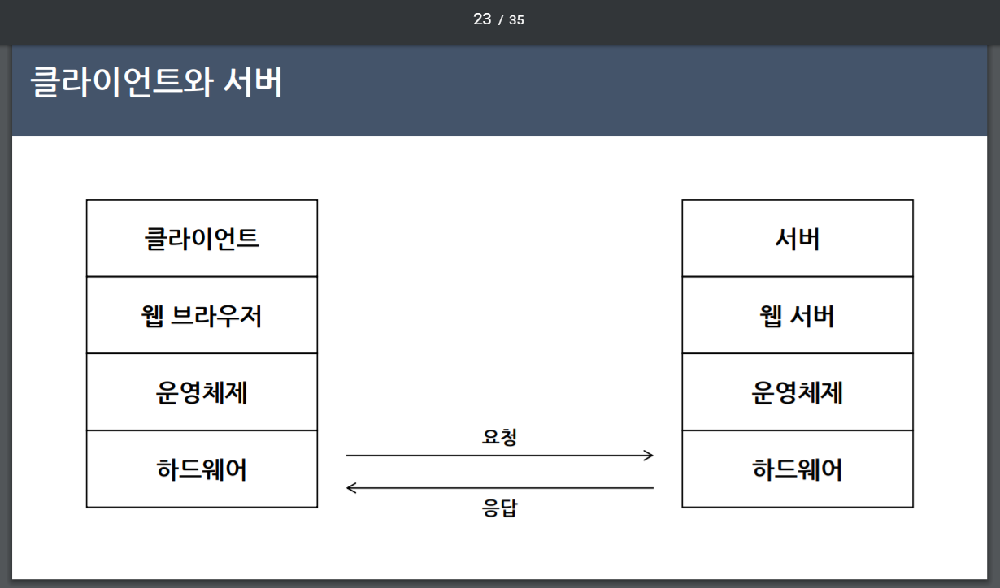
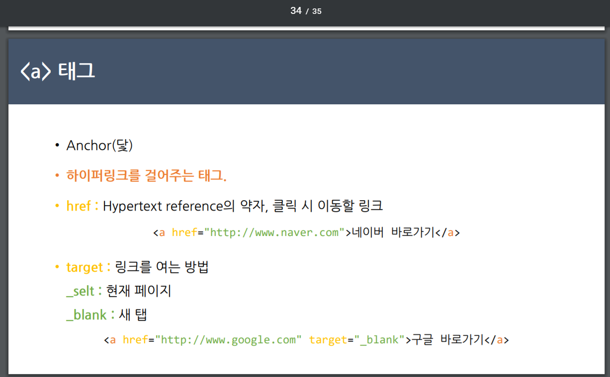

프로그래밍 유치원_2주차(10/28)

담당매니저(장명희 02-517-0562)

Slack [https://programming-first-b.slack.com/messages/C7MPUBJE6/](https://programming-first-b.slack.com/messages/C7MPUBJE6/)

ㅇ 인터넷과 웹의 이해

Html은 프로그래밍 언어가 아닌 마크업 언어

프로그래밍 언어 vs 마크업 언어? -

태그 등을 이용하여 문서나 데이터의 구조를 명기하는 언어의 한 가지, 데이터를 기술하는 정도로만 사용되기에 프로그래밍 언어와는 구별된다.-

&lt;html
&lt;head>
&lt;meta
&lt; title>He110, world!&lt;/title>
&lt;/head
&lt;body
&lt;h1>He110, world!&lt;/hl>
&lt; / html > " width="979" height="593" src="https://graph.microsoft.com/v1.0/users('realpage@naver.com')/onenote/resources/0-063ec54adb3e4093b683d99616975ebd!1-733661839CC53BA5!7917/$value" data-src-type="image/png" data-fullres-src="https://graph.microsoft.com/v1.0/users('realpage@naver.com')/onenote/resources/0-4ca60cfdb2764c43981b85adcd54858d!1-733661839CC53BA5!7917/$value" data-fullres-src-type="image/png" />

*UTF-8은 유니코드를 위한 가변 길이 문자 인코딩 방식 중 하나

 유니코드(Unicode)는 전 세계의 모든 문자를&#160;[컴퓨터](https://ko.wikipedia.org/wiki/%EC%BB%B4%ED%93%A8%ED%84%B0)에서 일관되게 표현하고 다룰 수 있도록 설계된 산업&#160;[표준](https://ko.wikipedia.org/wiki/%ED%91%9C%EC%A4%80)

따라서 유니코드를 사용하면&#160;[한글](https://namu.wiki/w/%ED%95%9C%EA%B8%80)과&#160;[신자체](https://namu.wiki/w/%EC%8B%A0%EC%9E%90%EC%B2%B4)&#183;[간체자](https://namu.wiki/w/%EA%B0%84%EC%B2%B4%EC%9E%90),&#160;[아랍 문자](https://namu.wiki/w/%EC%95%84%EB%9E%8D%20%EB%AC%B8%EC%9E%90)&#160;등을 통일된 환경에서 깨뜨리지 않고 사용할 수 있다.

&lt;!DOCTYPE html&gt;

&lt;html&gt;

&lt;head&gt;

&lt;meta charset=&quot;utf-8&quot;&gt;

&lt;title&gt;Hello, world!&lt;/title&gt;

&lt;/head&gt;

&lt;body&gt;

&lt;h1&gt;Hello, world!&lt;/h1&gt;

&lt;/body&gt;

&lt;/html&gt;

▶ 메모장에 입력하고 확장자.html로 저장

[http://jsbin.com/?html,output](http://jsbin.com/?html,output) Js bin - 자바스크립트를 설치하지 않고도 코드를 확인할 수 있는 사이트

==&lt;p&gt;태그=============

&lt;!DOCTYPE html&gt;

&lt;html&gt;

&lt;head&gt;

&lt;meta charset=&quot;utf-8&quot;&gt;

&lt;title&gt;Hello, world!&lt;/title&gt;

&lt;/head&gt;

&lt;body&gt;

&lt;p&gt;입문자용 강의를 수강해봐도 여전히 어렵지만!&lt;!p&gt;

&lt;p&gt;프로그래밍을 배우고, 알고 싶다면 프로그래밍 유치원 CAMP 시작해 보세요!&lt;/P&gt;

&lt;/body&gt;

&lt;/html&gt;

★ html파일 저장 시, 인코딩을 UTF-8로 변경

=&lt;br&gt;태그================== 강제 줄바꿈 (워드에서 alt+enter 같은 느낌)

&lt;!DOCTYPE html&gt;

&lt;html&gt;

&lt;head&gt;

&lt;meta charset=&quot;utf-8&quot;&gt;

&lt;title&gt;Hello, world!&lt;/title&gt;

&lt;/head&gt;

&lt;body&gt;

&lt;h1&gt;hello, world!&lt;/h1&gt;

&lt;p&gt;입문자용 강의를 수강해봐도 여전히 어렵지만!&lt;!p&gt;

&lt;p&gt;프로그래밍을 배우고, 알고 싶다면 프로그래밍 유치원 CAMP 시작해 보세요!&lt;/P&gt;

&lt;br&gt;입문자용 강의를 수강해봐도 여전히 어렵지만!&lt;!br&gt;

&lt;br&gt;프로그래밍을 배우고, 알고 싶다면 프로그래밍 유치원 CAMP 시작해 보세요!&lt;/br&gt;

&lt;/body&gt;

&lt;/html&gt;

=&lt;h&gt;태그====================================

제목 태그라서 다음줄은 강제 줄바꿈

&lt;!DOCTYPE html&gt;

&lt;html&gt;

&lt;head&gt;

&lt;meta charset=&quot;utf-8&quot;&gt;

&lt;title&gt;Hello, world!&lt;/title&gt;

&lt;/head&gt;

&lt;body&gt;

&lt;h1&gt;hello, world!&lt;/h1&gt;

&lt;h2&gt;hello, world!&lt;/h2&gt;

&lt;h3&gt;hello, world!&lt;/h3&gt;

&lt;h4&gt;hello, world!&lt;/h4&gt;

&lt;h5&gt;hello, world!&lt;/h5&gt;

&lt;h6&gt;hello, world!&lt;/h6&gt;

&lt;p&gt;입문자용 강의를 수강해봐도 여전히 어렵지만!&lt;!p&gt;

&lt;p&gt;프로그래밍을 배우고, 알고 싶다면 프로그래밍 유치원 CAMP 시작해 보세요!&lt;/P&gt;

&lt;br&gt;입문자용 강의를 수강해봐도 여전히 어렵지만!&lt;!br&gt;

&lt;br&gt;프로그래밍을 배우고, 알고 싶다면 프로그래밍 유치원 CAMP 시작해 보세요!&lt;/br&gt;

&lt;/body&gt;

&lt;/html&gt;

=&lt;a&gt;태그================

&lt;!DOCTYPE html&gt;

&lt;html&gt;

&lt;head&gt;

&lt;meta charset=&quot;utf-8&quot;&gt;

&lt;title&gt;Hello, world!&lt;/title&gt;

&lt;/head&gt;

&lt;body&gt;

&lt;h1&gt;a태그_하이퍼링크 태그&lt;/h1&gt;

&lt;a href=&quot;https://www.naver.com/&quot;&gt;네이버 바로가기&lt;/a&gt;

&lt;a herf=&quot;https://www.google.com&quot; target=&quot;blank&quot;&gt;구글 바로가기&lt;/a&gt;

&lt;/body&gt;

&lt;/html&gt;

===들여쓰기는 어떻게 하지? Block quote=========

&lt;!DOCTYPE html&gt;

&lt;html&gt;

&lt;head&gt;

&lt;meta charset=&quot;utf-8&quot;&gt;

&lt;title&gt;Hello, world!&lt;/title&gt;

&lt;/head&gt;

&lt;body&gt;

&lt;h1&gt;JUNE YOUNG&lt;/h1&gt;

&lt;h3&gt;■ 최근에 본 영화 _ &lt;a href=&quot;https://www.youtube.com/watch?v=0xICQTwF0s8&quot; target=&quot;self&quot;&gt;토르 : 라그나로크&lt;/a&gt;&lt;/h3&gt;

    &lt;b&gt;&lt;Blockquote&gt; 평점 ★★★☆☆&lt;/Blockquote&gt;

&lt;h3&gt;■ 최근에 여행지 _ &lt;a href=&quot;https://www.google.com&quot; target=&quot;blank&quot;&gt;그리스&lt;/a&gt;&lt;/h3&gt;

&lt;/body&gt;

&lt;/html&gt;

==[끝]=======================

DNS(Domain Name Server)

HTML/ JAVA Script/ CSS

인코딩/디코딩 방식
