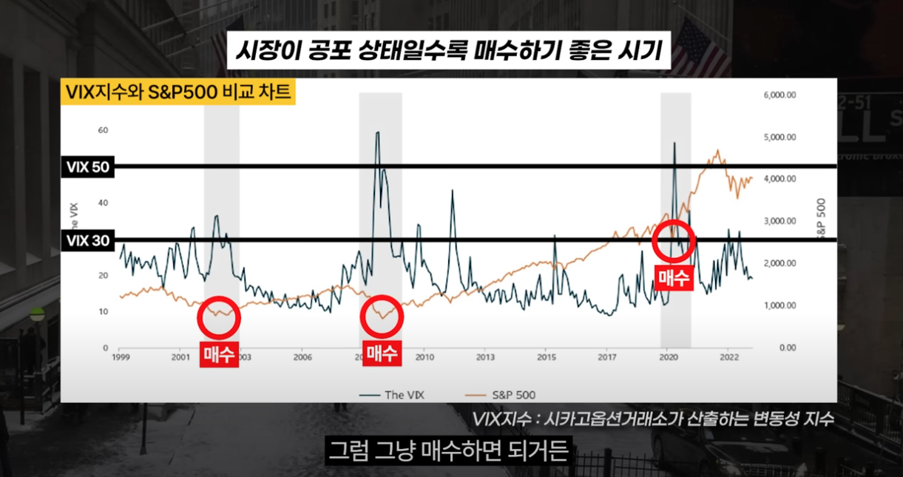

Chart

[세계 1](https://www.youtube.com/watch?v=hdsxqEdyfDg)위하고 알게된 절대 잃지않는 차트보는법 (매억남 2부)

[50만원 → 100](https://www.youtube.com/watch?v=0pUpl9PcW50)억을 만든 차트 갤러리 네임드, &quot;플라이트&quot; 매매법 총 정리

[플라이트 매매](https://www.youtube.com/watch?v=JAXO5sBpg6k)

하락장에서는 vix 지수30-50 넘어갈때 매수

