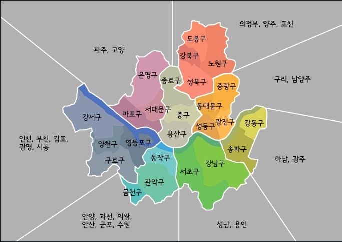
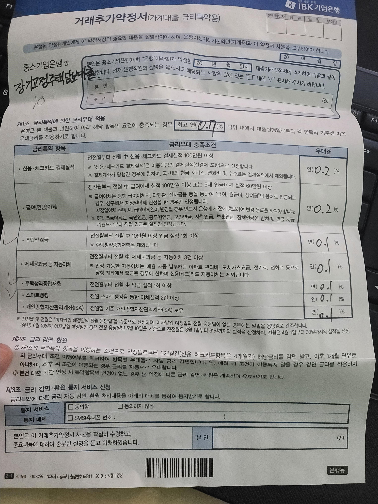

Home Sweet Home

2호선 - 신촌, 아현, 왕십리, 상왕십리, 성수

1호선 -

3호선 -

버스 - 공덕, 서대문

노부모 부양특공

[김현우] [오후 2:07] 사고싶은데 사

[김현우] [오후 2:07] 하왕십리 스위첸은

[김현우] [오후 2:07] 교통 좀 빡세

[김현우] [오후 2:08] 진짜 빡센만큼 싸네 ㅋㅋㅋㅋㅋ

[오세준] [오후 2:08] 서센자는 등기가 안되서 대출이 안나올 듯

[오세준] [오후 2:09] 신당동은 별로

[오세준] [오후 2:09] 나머지는 갠츈하네

[오세준] [오후 2:09] 저 중에서 급매 나오는 걸로 잡으면 되겠네

순화동 빼삼

HUG 보증보험

청약가점 높을 경우 분양시장 노리거나, 자금 여력 충분하다면 6월 전 급매물 노려볼 만

청약 넣기?

전세끼고 살까? -&gt; 그럼 2년 내에 못들어가는데?

집은 언제든 팔 수 있게 전세끼고 사는걸로하자

내 월세살이는? 좀 먼곳에서.

우리회사 대출 얼마까지 : 회사 1억, 은행은 1억까지 이자지원(SC제일은행)

대출 상환계획 및 생활비 등 고려

규제 더 나올수는 있지. 9억미만 대출규제나 전월세상한제, 종부세 인상 등

ㅇ 가설:

1/ 공시가격 상승-&gt; 보유세 부담: 5월 말

2/ 다주택자는 10년 이상 보유한 집을 올해 6월 말까지 처분해야 양도세 중과세를 적용받지 않는다.

    더 떨어질 변수는? 경제위기, 정부 규제

ㅇ Option

- 세 내주고 난 월세 살이:

- 내가 들어가서 거주: 매물 구하기 -&gt; 전세 해지 통보 -&gt; 월세 구하기

ㅇ 변수 - 코인잔고….

-----------------------------------------------------------------------------

ㅇ 목적: 자가/투자(떨어지지 않을 만한 곳)

ㅇ 필수요건

1/ 통근시간: D to D 30m

2/ 가격(세금 포함):

3/ 평형: 애 1명 키울 수 있을정도

4/ 교통: 2호선/ 1호선/ 3호선

ㅇ 선택

- 마트

- 공원

- 한강근접성

- 구축/신축? &gt; 신축(가격방어)

- 층수

- 역과의 거리

- 에어컨/난방/수도

- 동향&gt; 남향

[임장](https://m.blog.naver.com/PostView.nhn?blogId=danmass&amp;logNo=221203523506&amp;proxyReferer=https:%2F%2Fblog.naver.com%2Fdanmass%2F221203523506)

검토요건 [http://www.hanhodaily.com/news/articleView.html?idxno=42904](http://www.hanhodaily.com/news/articleView.html?idxno=42904)

떨어지지 않을 조건

1/ 역세권

2/ 대단지

3/ 언덕에 위치하지 않은

4/ 근처에 학교가 많은

5/ 공공시설과 도서관이 있는

6/ 주변에 랜드마크가 있는

7/ 층간소음 없는

급매물 구하는법

1/ 부동산 전화문의X -&gt; 직접 방문: 의지가 높아보임

2/ 부동산 사장과의 관계

신답역 힐스테이트 [https://m.land.naver.com/article/info/2025612515](https://m.land.naver.com/article/info/2025612515)

홍제천 산책로 [https://www.hankyung.com/politics/article/2020042590327](https://www.hankyung.com/politics/article/2020042590327)

집4 강의요약

[https://m.blog.naver.com/PostView.nhn?blogId=molayo99&amp;logNo=221257896829&amp;proxyReferer=https:%2F%2Fwww.google.com%2F](https://m.blog.naver.com/PostView.nhn?blogId=molayo99&amp;logNo=221257896829&amp;proxyReferer=https:%2F%2Fwww.google.com%2F)

[https://magazine.brique.co/article/%ec%84%b8%ec%83%81%ec%97%90-%ec%97%86%eb%8d%98-%eb%b6%80%eb%8f%99%ec%82%b0%ec%9d%b4-%eb%82%98%ed%83%80%eb%82%ac%eb%8b%a4/](https://magazine.brique.co/article/%ec%84%b8%ec%83%81%ec%97%90-%ec%97%86%eb%8d%98-%eb%b6%80%eb%8f%99%ec%82%b0%ec%9d%b4-%eb%82%98%ed%83%80%eb%82%ac%eb%8b%a4/)

[http://homeshowping.kr/intro](http://homeshowping.kr/intro)

ㅇ 부동산 마스터

선배들 중에?

[https://www.google.com/search?rlz=1C1GCEU_koKR868KR868&amp;tbm=lcl&amp;sxsrf=ALeKk02TUEzzyrqn270MxcX7Q5Z1ieko1w%3A1587819092483&amp;ei=VDKkXtmNHdPVmAX73Z7QDw&amp;q=sk+t%ED%83%80%EC%9B%8C&amp;oq=sk+t%ED%83%80%EC%9B%8C&amp;gs_l=psy-ab.3..0j38.773.6665.0.6848.24.15.7.0.0.0.194.1437.0j11.12.0....0...1c.1j4.64.psy-ab..7.17.1505.10..35i362i39k1j35i39k1j0i131i20i263k1j0i131k1j0i67k1j0i10k1j0i20i263k1.391.LURGU5YP-bo#rlfi=hd:;si:;mv:[[37.61860683888716,127.17769428940319],[37.50266889112041,126.8103389427235],null,[37.56066041625974,126.99401661606335],13]](https://www.google.com/search?rlz=1C1GCEU_koKR868KR868&amp;tbm=lcl&amp;sxsrf=ALeKk02TUEzzyrqn270MxcX7Q5Z1ieko1w%3A1587819092483&amp;ei=VDKkXtmNHdPVmAX73Z7QDw&amp;q=sk+t%ED%83%80%EC%9B%8C&amp;oq=sk+t%ED%83%80%EC%9B%8C&amp;gs_l=psy-ab.3..0j38.773.6665.0.6848.24.15.7.0.0.0.194.1437.0j11.12.0....0...1c.1j4.64.psy-ab..7.17.1505.10..35i362i39k1j35i39k1j0i131i20i263k1j0i131k1j0i67k1j0i10k1j0i20i263k1.391.LURGU5YP-bo#rlfi=hd:;si:;mv:[[37.61860683888716,127.17769428940319],[37.50266889112041,126.8103389427235],null,[37.56066041625974,126.99401661606335],13])

주택댐비대출 주담대

