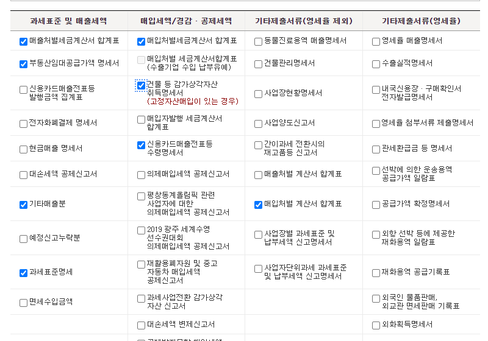
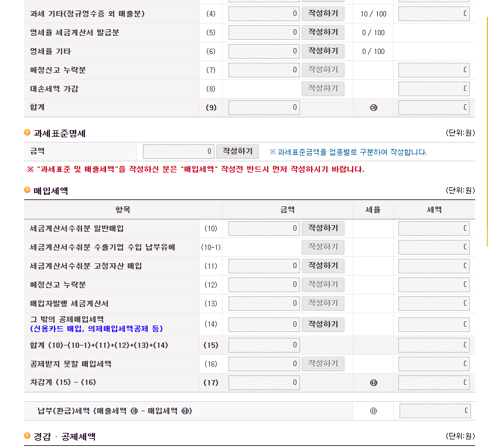
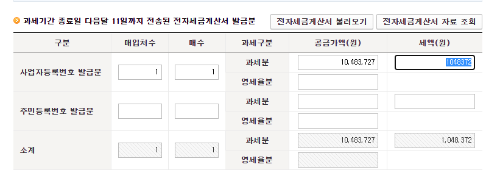
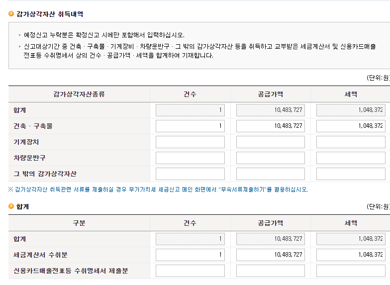
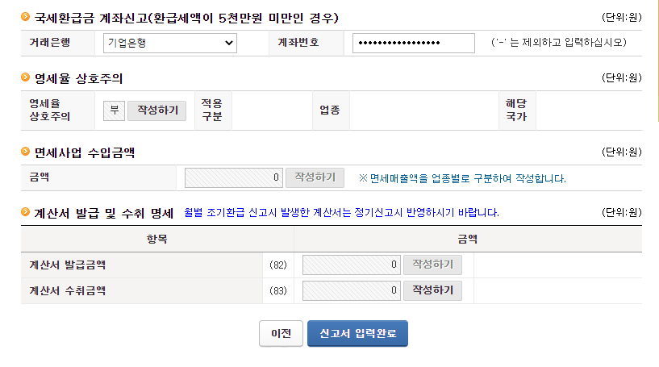
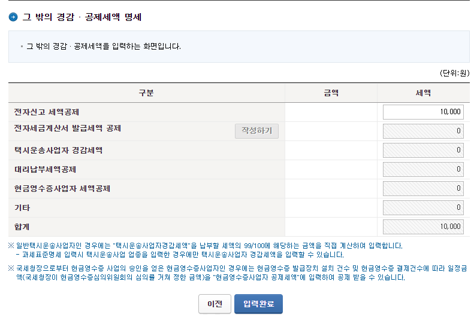

국세청 부가세 신고

E편한 세상 부평역

임대 사업자등록번호

5010494047

501-04-94047

경정 청구

[https://www.hometax.go.kr/websquare/websquare.wq?w2xPath=/ui/pp/index.xml&amp;tmIdx=0&amp;tm2lIdx=&amp;tm3lIdx=](https://www.hometax.go.kr/websquare/websquare.wq?w2xPath=/ui/pp/index.xml&amp;tmIdx=0&amp;tm2lIdx=&amp;tm3lIdx=)

홈택스 - 신고 - 부가가치세

일반과세자 - 정기신고(확정/예정) - 사업자등록번호란 확인 버튼 5010494047

이메일 입력 - 저장 후 다음이동

매입세액 작성 10행과 11행만 작성하면 됨, 작성하기 ㄱㄱㄱ

아래로 이동 후 입력완료 버튼

계좌 재입력

결3사 끌급A|일 소회“률 미용하,`l기 비립니다. " width="699" height="555" src="https://graph.microsoft.com/v1.0/users('realpage@naver.com')/onenote/resources/0-8d288077f9b746aeaf3820a31d6ad8fb!1-733661839CC53BA5!7920/$value" data-src-type="image/png" data-fullres-src="https://graph.microsoft.com/v1.0/users('realpage@naver.com')/onenote/resources/0-8d288077f9b746aeaf3820a31d6ad8fb!1-733661839CC53BA5!7920/$value" data-fullres-src-type="image/png" />

전자새금X산서)결3사 발급A|일 소회“를 미용하,`l기 비립니다. " width="668" height="502" src="https://graph.microsoft.com/v1.0/users('realpage@naver.com')/onenote/resources/0-e2efd37cd1bc4dd0adc770e7b3aa836d!1-733661839CC53BA5!7920/$value" data-src-type="image/png" data-fullres-src="https://graph.microsoft.com/v1.0/users('realpage@naver.com')/onenote/resources/0-e2efd37cd1bc4dd0adc770e7b3aa836d!1-733661839CC53BA5!7920/$value" data-fullres-src-type="image/png" />

메일 수신 이후 사업자등록번호 입력 - 건축비에 해당되는거만 하면 됨, 대지는 안내고 환급도 안받음
