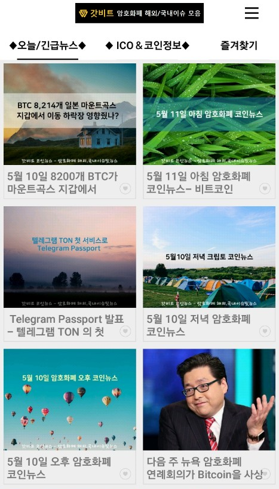
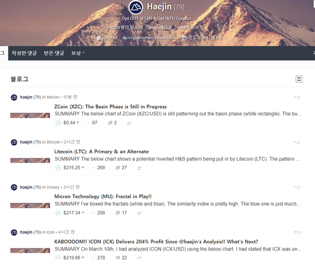
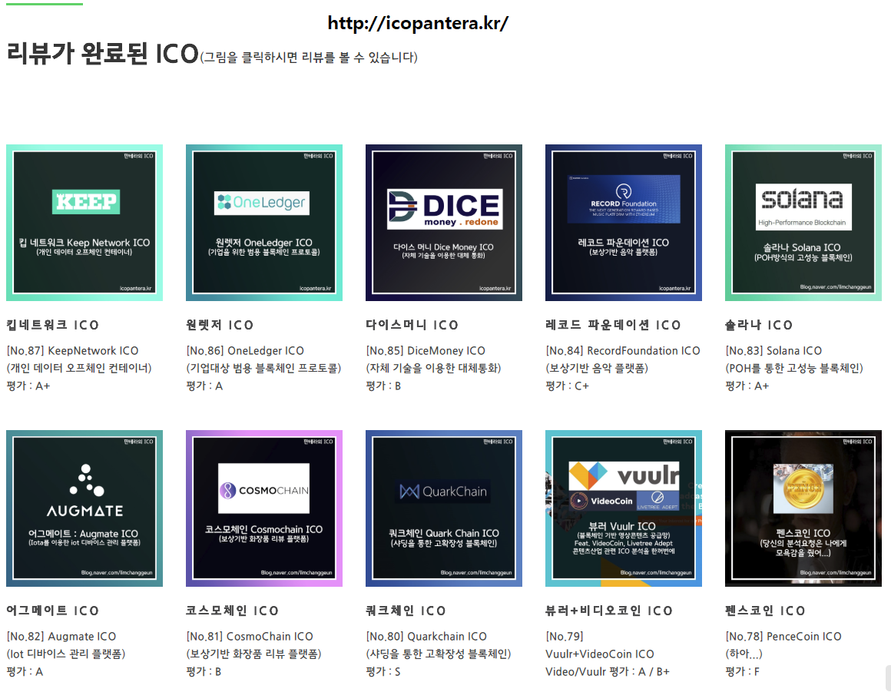
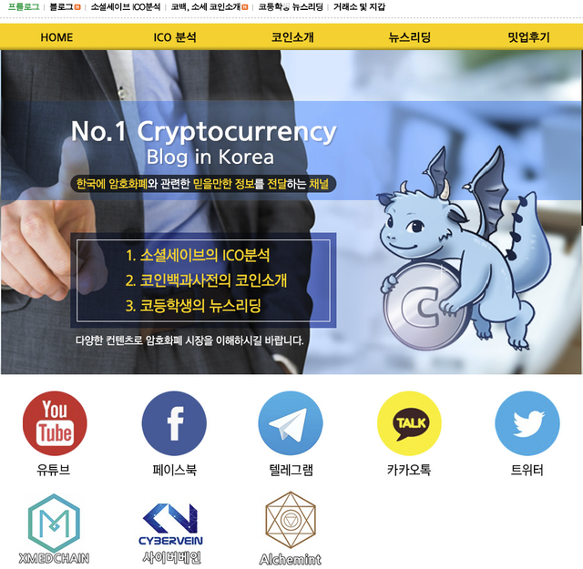
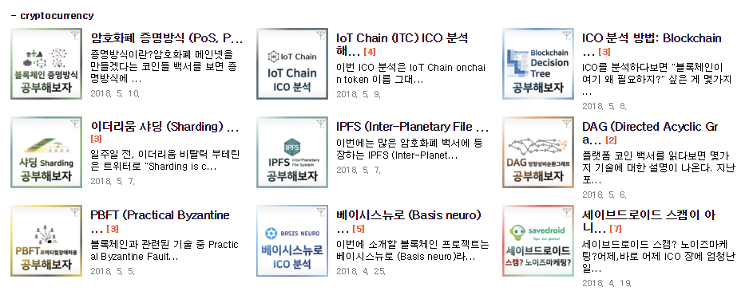
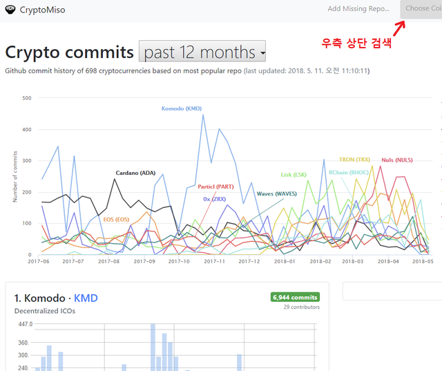
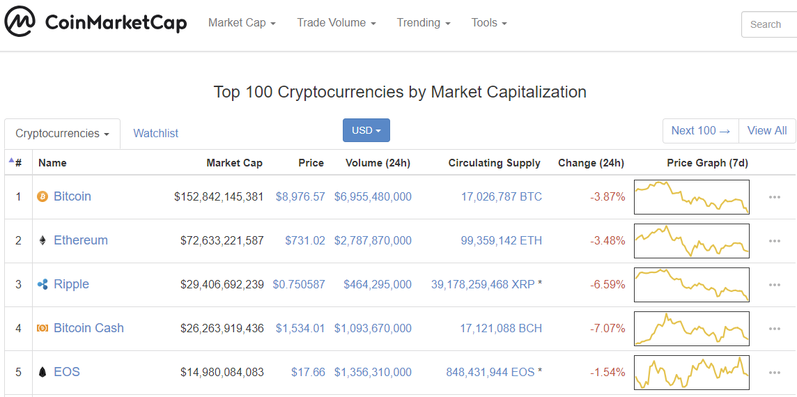
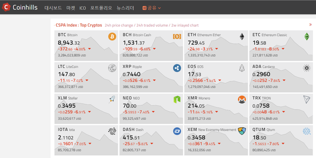
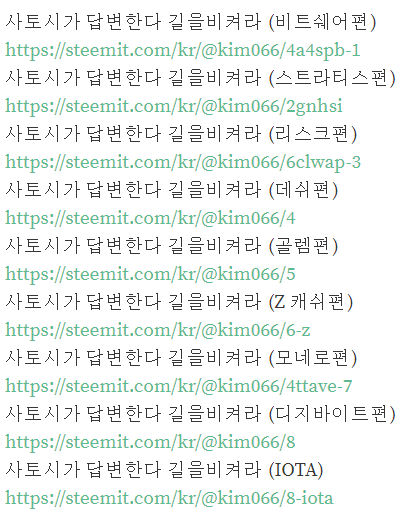
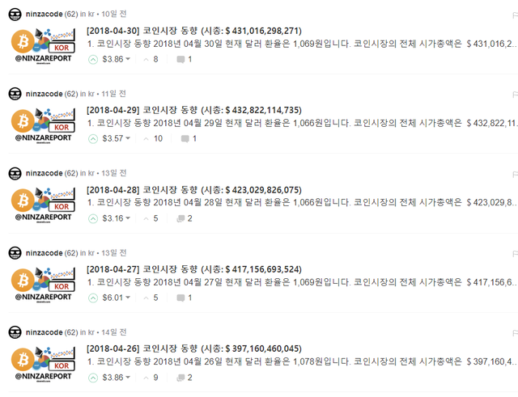

유투버

[1. DataDash]

장점 : 코인 추천해줌. 진입 시기를 추천해줌. 매우 정확함. *개인적으로 이 분 영상이 가장 유익하다고 생각합니다.

단점 : 가끔 영상을 오랜 기간 안올릴 때가 있음.

[https://www.youtube.com/channel/UCCatR7nWbYrkVXdxXb4cGXw](https://www.youtube.com/channel/UCCatR7nWbYrkVXdxXb4cGXw)

[2. The Modern Investor]

장점 : 코인 추천. 정확한 뉴스를 매일 제공함.

단점 : 진입 시점을 가르쳐주지 않음.

[https://www.youtube.com/channel/UC-5HLi3buMzdxjdTdic3Aig](https://www.youtube.com/channel/UC-5HLi3buMzdxjdTdic3Aig)

스티머 및 유투버

[haejin]

장점 : technical analysis 전문가. 자주올림. 장기투자에 유용함 *개인적으로 이 분만큼 분석 잘하는 사람 본적 없음.

단점 : 영어가.. 알아듣기 힘듬...

[https://steemit.com/@haejin](https://steemit.com/@haejin)

출처: &lt;[https://steemit.com/cryptocurrency/@orcaman/2qcsia](https://steemit.com/cryptocurrency/@orcaman/2qcsia)&gt;

코인 뉴스&amp;이슈를 볼 수 있는

어플 &amp; 블로그

갓비트

[https://play.google.com/store/apps/details?id=com.storyshare.nightletter](https://play.google.com/store/apps/details?id=com.storyshare.nightletter)

매일매일 코인 시황과 큰 이슈들을 브리핑해주고 알람도 옵니다.

코인마스터

[https://blog.naver.com/coin_master1](https://blog.naver.com/coin_master1)

코인에 대한 이슈를 거의 매일 포스팅 해주는 블로그입니다.

토큰포스트

[https://tokenpost.kr/](https://tokenpost.kr/)

위에 보여드린 갓비트의 PC버전 같은 사이트입니다.

코인 차트를 분석해주시는 스티머&amp;유튜브

스티머 Haejin LEE

[https://steemit.com/@haejin](https://steemit.com/@haejin)

[https://www.youtube.com/channel/UCpAXWMbMUv4P5R-15kHYFJw](https://www.youtube.com/channel/UCpAXWMbMUv4P5R-15kHYFJw)

코인 차트쪽에서 세계적으로 조회수나 인지도가 1위인

스티머 HaejinLee 입니다.

당연히 맞출 때도 있고 틀릴 때도 있지만

상승장을 많이 예측해서 그런지 하락장일 땐 악플도 많습니다.

상승장일 때 참고하시면 더 좋을 것 같습니다.

헥트 유튜브

[https://www.youtube.com/channel/UCJM1EAVrcWK6aMj4sv1hNUA](https://www.youtube.com/channel/UCJM1EAVrcWK6aMj4sv1hNUA)

한국에서는 기술적 분석으로는 &#39;헥트&#39;라는 분이 유명합니다

지금 구간에서 오를 땐 어떻게 될지, 하락할 땐 어떻게 될지 등을

알려주십니다.

항상 다른 사람의 차트분석과 가격 예측은 참고&amp;재미로만 보시기 바랍니다.

ICO 리뷰 &amp; 코인 정보 블로거

ICO나 장투코인을 사기 전에 백서읽기가 귀찮으시거나

기술적으로 자세히 알고싶다면 한번씩 둘러보면 좋은 블로그입니다.

판테라 ICO

사이트 :&#160;[http://icopantera.kr/](http://icopantera.kr/)

블로그 :&#160;[https://blog.naver.com/limchanggeun](https://blog.naver.com/limchanggeun)

원래는 블로그만 있었던 걸로 알고있는데 최근에

네이버 블로그에 쓴 리뷰와 연동한 사이트도 오픈했다고 합니다.

앞서 위에 소개한 사이트나 유튜버들처럼 매일 올라오진 않고

몰아서 올라오는 경우가 많으니

네이버 이웃이나 텔레그램 구독,오픈채팅방 참여하셔서 참고하시면 좋습니다.

소셜세이브 ICO

[http://socialsave.net/](http://socialsave.net/)

ICO분석 블로그입니다.

개발쪽을 아시는 분도 팀에 있고

암호화폐에 전부터 관심있는 분들이 모여서 리뷰를 한다고 들었습니다.

마찬가지로 블로그 이웃이나 텔레그램, 카톡 참여하셔서 참고하시면 좋습니다.

tyami ICO

블로그: tyami.net

웹사이트: tyami.creatorlink.net

일상 얘기와 더불어 암호화폐 개발쪽에도 지식이 많으신 것 같습니다.

~~을 공부해보자, ~~을 분석해보자 시리즈로 아시는 분들도 계실겁니다.

졸린곰의 낙서장

[https://rino5250.blog.me/](https://rino5250.blog.me/)

본인은 낙서장이라고 적어놨지만 한번 들어가면

정말 볼 게 압도적으로 많습니다.

ICO 분석, 에어드랍, 뉴스, 거래소 소식 등 정말 많은 정보가 있습니다.

코인보고소(코니)

[https://blog.naver.com/kmjkmj4090](https://blog.naver.com/kmjkmj4090)

ICO 정보와 암호화폐 뉴스들을 포스팅합니다

과거에 어떤 뉴스가 있었는지 볼 수 있습니다.

핑크체리(KCS팀)

[https://blog.naver.com/soolmini](https://blog.naver.com/soolmini)

KCS라는 팀 소속인 핑크체리라는 분의 블로그입니다

컨트랙트 개발에 관해 포스팅하시고 블록체인 개발 강의도 합니다.

김새벽

[https://blog.naver.com/asteria89](https://blog.naver.com/asteria89)

위와 같은 KCS 소속으로 블로그에서 ICO리뷰, 코인 분석을 합니다.

그 외의 유용한 사이트&amp;블로거

깃헙 업데이트 수를 그래프로 보는 사이트

[https://cryptomiso.com/](https://cryptomiso.com/)

각종 코인들의 깃헙의 날짜별 업데이트 수를 그래프로,

순위대로 나열한 사이트입니다.

한번만 업데이트 하거나 뚝뚝 끊어서 개발한 경우

스캠이라 불리는 코인이 많으니 주의할 수 있고

개발을 잘한다고 얘기가 나오는 코인들은

순위권에 있고, 매일 업데이트를 하는 걸 볼 수 있습니다.

코인마켓캡

[https://coinmarketcap.com/](https://coinmarketcap.com/)

코인을 사본 사람들 중 모르는 사람이 거의 없는 사이트입니다.

암호화폐 대비 비트코인 비율도 볼 수 있을 뿐만 아니라

코인인지 단순 토큰인지도 검색해서 볼 수 있습니다.

거래소에 등재된 거의 모든 코인들이 여기서 검색되고

차트와 코인 정보를 얻을 수 있습니다.

코인힐스

[https://www.coinhills.com/ko/](https://www.coinhills.com/ko/)

위 코인마켓캡과 비슷한 사이트인데

개인적으로 보기 더 편합니다.

스티머 &#39;참새&#39;

[https://steemit.com/@kim066](https://steemit.com/@kim066)

암호화폐에 대한 전반적인 지식을 나눠주시는 분입니다.

&#39;사토시가 답변한다 길을 비켜라&#39; 시리즈로 유명하십니다.

어떤 코인에대해 대충 포스팅 하신 글이 하나도 없습니다.

스티머 &#39;NINZACODE&#39;

거의 매일마다 작년 7월부터

암호화폐 시장 동향과 시총을 기록하시는 스티머입니다.

과거의 비트코인, 암호화폐 전반적인 동향을 알고싶으시다면

참고하시면 도움이 됩니다.

스티밋은 알람이 가지 않습니다.

텔레그램 채널에서 기록 상황 알려드리고 있습니다.

↓텔레그램 채널 무료 구독(유료채널 없음)↓

[http://www.t.me/krcryptoanalyst](http://www.t.me/krcryptoanalyst)

텔레그램 메시지 문의 ↓

텔레그램 아이디 :&#160;[@kimjihoon](https://steemit.com/@kimjihoon)

출처: &lt;[https://steemit.com/kr/@krcryptoanalyst/5cvzdq](https://steemit.com/kr/@krcryptoanalyst/5cvzdq)&gt;
