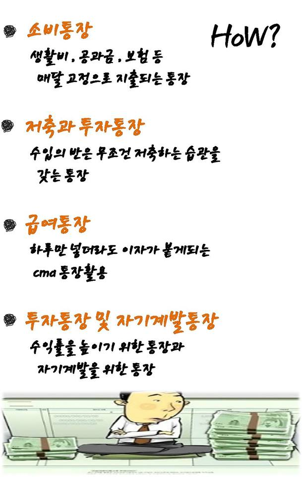

통장쪼개기

- 통장 쪼개기

- 월급/생활비 (용돈, 경조사, 관리비 등)

- 적금 (SIB, SK증권)

- 예비비 (남는 돈 - 국민계좌 - 상품가입)

&lt;meta http-equiv=&quot;refresh&quot; content=&quot;0; URL=/?_fb_noscript=1&quot; /&gt; &lt;meta http-equiv=&quot;X-Frame-Options&quot; content=&quot;DENY&quot; /&gt;

출처: &lt;[https://www.facebook.com/20thmoney/photos/pcb.290913671117559/290913001117626/?type=1&amp;theater](https://www.facebook.com/20thmoney/photos/pcb.290913671117559/290913001117626/?type=1&amp;theater)&gt;

출처: &lt;[https://www.facebook.com/20thmoney/photos/pcb.290913671117559/290913001117626/?type=1&amp;theater](https://www.facebook.com/20thmoney/photos/pcb.290913671117559/290913001117626/?type=1&amp;theater)&gt;

[http://ppss.kr/archives/31583](http://ppss.kr/archives/31583)

- 통장 쪼개기 - 월급 / 생활비 / 적금150 / 예비비

지출통장(타행이체 수수료X, 교통카드되는 체크카드), 비상금통장(남은돈 모으기/동양, 우리종금), 생활비, 자기계발비

- 월급통장 CMA [http://search.naver.com/search.naver?where=nexearch&amp;query=%BF%F9%B1%DE%C5%EB%C0%E5+CMA&amp;sm=top_hty&amp;fbm=1&amp;x=0&amp;y=0](http://search.naver.com/search.naver?where=nexearch&amp;query=%BF%F9%B1%DE%C5%EB%C0%E5+CMA&amp;sm=top_hty&amp;fbm=1&amp;x=0&amp;y=0)

&#160;보도 새퍼, 혼다 켄

&#160;가계부 - 모네카 미니 가계부, 네이버 가계부

경제신문, 재테크서적

저축 (은행 - 예적금, CMA, MMF, MMDA)

투자 (펀드, 주식, 부동산, ETF, ELS, EWS, 금, 채권, 변액유니버셜보험)

[http://blog.naver.com/ttree79?Redirect=Log&amp;logNo=70105515993](http://blog.naver.com/ttree79?Redirect=Log&amp;logNo=70105515993) 서적

[http://cafe.naver.com/jobtong.cafe?iframe_url=/ArticleRead.nhn%3Farticleid=330737&amp;social=1](http://cafe.naver.com/jobtong.cafe?iframe_url=/ArticleRead.nhn%3Farticleid=330737&amp;social=1) 통장

[http://blog.naver.com/lockplant?Redirect=Log&amp;logNo=120122210960](http://blog.naver.com/lockplant?Redirect=Log&amp;logNo=120122210960) 통장 쪼개기

[http://elle3558.blog.me/140124322946](http://elle3558.blog.me/140124322946) 통장 쪼개기

[http://cafe.naver.com/stocknjoy/](http://cafe.naver.com/stocknjoy/) 딸기아빠

[http://blog.daum.net/21cgoldenlife](http://blog.daum.net/21cgoldenlife) 재테크 전문 블로그

[http://unsoundsociety.tistory.com/](http://unsoundsociety.tistory.com/)

[http://blog.hankyung.com/](http://blog.hankyung.com/)

[http://eco.idouble.co.kr/](http://eco.idouble.co.kr/)

[http://blog.naver.com/rins78/](http://blog.naver.com/rins78/)

[http://blog.naver.com/donodonsu/](http://blog.naver.com/donodonsu/)

[http://blog.naver.com/nwind27?Redirect=Log&amp;logNo=40074853759](http://blog.naver.com/nwind27?Redirect=Log&amp;logNo=40074853759)

[http://finance.naver.com/news/issuenews_read.nhn?type=tech&amp;no=22249](http://finance.naver.com/news/issuenews_read.nhn?type=tech&amp;no=22249) 부자

[http://biz.chosun.com/site/data/html_dir/2011/05/26/2011052601297.html](http://biz.chosun.com/site/data/html_dir/2011/05/26/2011052601297.html)

[http://finance.naver.com/news/issuenews_read.nhn?type=tech&amp;no=22582](http://finance.naver.com/news/issuenews_read.nhn?type=tech&amp;no=22582)

[http://elle3558.blog.me/140131747662](http://elle3558.blog.me/140131747662)

[http://book.interpark.com/meet/webZineDiary.do?_method=columnDetail&amp;sc.page=1&amp;sc.row=10&amp;listPage=1&amp;listRow=10&amp;sc.order=&amp;sc.webzNo=11845&amp;sc.cond=&amp;currentPageNo=1&amp;opencast](http://book.interpark.com/meet/webZineDiary.do?_method=columnDetail&amp;sc.page=1&amp;sc.row=10&amp;listPage=1&amp;listRow=10&amp;sc.order=&amp;sc.webzNo=11845&amp;sc.cond=&amp;currentPageNo=1&amp;opencast)

[http://hupuru.blog.me/140130033910](http://hupuru.blog.me/140130033910)

&#160;

[http://biz.heraldm.com/common/Detail.jsp?newsMLId=20110601000651](http://biz.heraldm.com/common/Detail.jsp?newsMLId=20110601000651)

[http://finance.naver.com/news/issuenews_read.nhn?type=tech&amp;no=22728](http://finance.naver.com/news/issuenews_read.nhn?type=tech&amp;no=22728)

제테크 상담 [http://readersrich.com/object/object02.asp](http://readersrich.com/object/object02.asp)

제테크 뉴스 [http://www.asiae.co.kr/news/view.htm?idxno=2011061514570710998](http://www.asiae.co.kr/news/view.htm?idxno=2011061514570710998)

신용카드가 더 [http://blog.naver.com/buhm?Redirect=Log&amp;logNo=60132682784](http://blog.naver.com/buhm?Redirect=Log&amp;logNo=60132682784)

-
통장 쪼개기

- 월급통장 - CMA

- 생활비통장 -

- 투자통장 -

- 예비비통장 - CMA[http://desilian.blog.me/20125072038](http://desilian.blog.me/20125072038)

- [http://speralist.blog.me/120112520744](http://speralist.blog.me/120112520744)

- [http://graceli.blog.me/60123107936](http://graceli.blog.me/60123107936)

- [http://blog.naver.com/happybloggi?Redirect=Log&amp;logNo=100129077389](http://blog.naver.com/happybloggi?Redirect=Log&amp;logNo=100129077389)

- [http://cafeblog.search.naver.com/search.naver?sm=tab_hty&amp;where=post&amp;query=%C5%EB%C0%E5+%C2%C9%B0%B3%B1%E2&amp;x=0&amp;y=0](http://cafeblog.search.naver.com/search.naver?sm=tab_hty&amp;where=post&amp;query=%C5%EB%C0%E5+%C2%C9%B0%B3%B1%E2&amp;x=0&amp;y=0)

&#160;

&#160;

월급통장

금호종금 CMA [http://feelnet.pe.kr/490](http://feelnet.pe.kr/490)

메리츠종금 CMA [http://cn.moneta.co.kr/Service/stock/ShellView.asp?ArticleID=2011061409515201399&amp;LinkID=371](http://cn.moneta.co.kr/Service/stock/ShellView.asp?ArticleID=2011061409515201399&amp;LinkID=371)

CMA 비교 [http://cafe.naver.com/diva9141.cafe?iframe_url=/ArticleRead.nhn%3Farticleid=15623&amp;](http://cafe.naver.com/diva9141.cafe?iframe_url=/ArticleRead.nhn%3Farticleid=15623&amp;)

CMA 장단점 [http://cafe.naver.com/officeinvest.cafe?iframe_url=/ArticleRead.nhn%3Farticleid=580&amp;](http://cafe.naver.com/officeinvest.cafe?iframe_url=/ArticleRead.nhn%3Farticleid=580&amp;)

&#160;

주걸륜, 브래드 피트, 홍정욱, 김어준, 이어령

&#160;

내가 배우고, 성장하고, 돈벌어야 하는 이유

- 엄마, 아빠 빚 갚어주기

- 엄마 그리고 내 고향 집 되찾기

- 아버지 왼쪽 눈

&#160;
