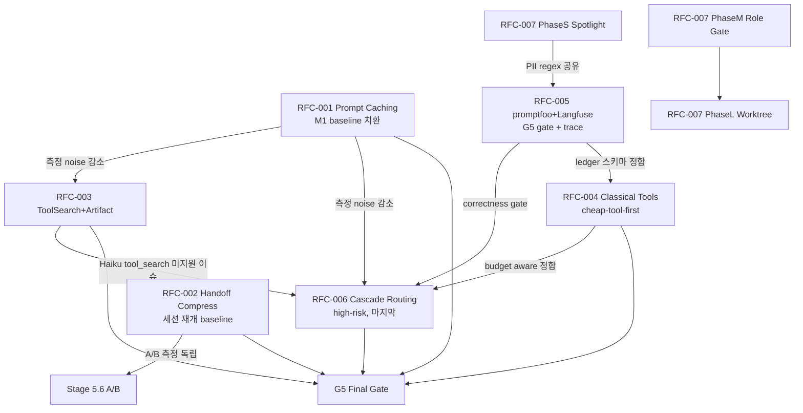

# PRIORITY MATRIX — 2026-04 A-Team Optimization

**Stage**: 6 Final Synthesis | **Inputs**: RFC-001~007 | **Gate**: G5 (M1 ≥15%, M4 ≥ base, σ<mean·0.1)

## 1. 평가 차원 (4D)

| 차원 | 정의 | 스케일 |
|------|------|--------|
| **Impact** | M1 토큰 절감 %, M4 correctness pp 개선, security mitigation | 정량 수치 |
| **Effort** | RFC-선언 LOC + 일수 (S ≤3d/≤500LOC, M 4~7d/500~1k, L 8~14d/1k~2k, XL >14d) | S/M/L/XL |
| **Risk** | 프로덕션 영향 + rollback 복잡도 + 외부 의존 | LOW/MED/HIGH |
| **Urgency** | dependency graph + gate 선제성 | immediate / next-quarter / defer |

## 2. RFC별 4D 점수표

| RFC | Impact (M1 / M4 / Sec) | Effort | Risk | Urgency | 의존 |
|-----|------------------------|--------|------|---------|------|
| **001 Prompt Caching** | M1 −35% / M4 invariant / — | **S** (~200 LOC, 3d) | **LOW** (env flag 즉시 off, legacy 경로 보존) | **immediate** | 없음 (모든 측정 baseline) |
| **002 Handoff Compression** | M1 −74% handoff payload (세션당 −6~8k) / M4 lossless facts-layer / — | **S** (~350 LOC, 4d) | **LOW** (shadow→on, 5-layer fail 시 `full-handoff` fallback) | **immediate** | 없음 |
| **003 ToolSearch + Artifact Cache** | M1 −15% (registry 55k→9.2k + B4 −12%) / M4 unchanged / — | **M** (~1,270 LOC, 4~5d) | **MED** (Haiku tool_search 미지원 → non-defer catalog fallback) | **immediate** | RFC-001 측정 안정화 후 |
| **004 Classical Toolchain (rg/fd/jq+sg)** | Phase1 M1 −20~30%, Phase2 +30~50% / M4 snapshot-diff 강제 / — | Phase1 **M** (~800 LOC, 2wk), Phase2 **M** | **MED** (Windows scoop 부재, rg --json 파싱) | **immediate** (P1), **next-quarter** (P2) | RFC-005 ledger (선택) |
| **005 Eval + Obs (promptfoo + Langfuse)** | M1 +0.5% overhead / **M4 +2~5pp** (gate) / 관측 100% | **M** (~800 LOC, 4.5d) | **MED** (Docker WSL2, OTEL 2~3MB) | **immediate** (G5 gate 전제) | 없음 (다른 RFC 선행 평가) |
| **006 Cascade + Budget Routing** | M1 −32~43% B1-B6 평균 / M4 +0.03 (validation ensemble) / — | Phase1 **S** (4~6h), Phase2 **M** (12~16h) | **HIGH** (Haiku over-confidence, budget drift, Windows rg) | **next-quarter** | RFC-003 (Haiku tool_search 제약), RFC-005 (M4 gate 필수), RFC-004 (cheap-first) |
| **007 Security + Isolation** | M1 <1% overhead / M4 unchanged / **ASR −90%** (35%→<2%) | PhaseS **S** (4d) + PhaseM **M** (2wk) + PhaseL **L** (3wk) | **LOW** (PhaseS), **MED** (worktree), **HIGH** (bubblewrap Phase XL) | **immediate** (PhaseS), **next-quarter** (M/L) | RFC-005 (masking 정합) |

## 3. Impact vs Effort 2×2 Matrix

```
                    Low Effort (≤S)                   High Effort (≥M)
                  ┌──────────────────────────────┬──────────────────────────────┐
High Impact       │  ★ RFC-001 Prompt Caching    │  ★ RFC-003 ToolSearch+Artif. │
(M1 ≥15% or       │  ★ RFC-002 Handoff Compress  │  ★ RFC-006 Cascade Routing   │
 M4 ≥2pp)         │  ★ RFC-007-S Spotlight delim │  ★ RFC-004 Classical (P1+P2) │
                  │                              │  ★ RFC-005 promptfoo+Langfuse│
                  ├──────────────────────────────┼──────────────────────────────┤
Low Impact        │  (none — 모든 RFC gate 통과)  │  RFC-007-L Worktree+Bwrap    │
                  │                              │  (Security이지만 Dev-friction│
                  │                              │   >2 prompts, Phase XL defer)│
                  └──────────────────────────────┴──────────────────────────────┘

시각 추천 순서: 001 → 002 → 007-S → 005 → 003 → 004-P1 → 006 → 004-P2 → 007-M → 007-L
```

## 4. Integration Order (실행 순서 권고)

### Wave 1 — Week 1~2 (Quick Wins, Low Risk, Baseline 확립)
- **RFC-001 Prompt Caching** — 다른 모든 A/B 측정의 baseline 치환 효과 가장 큼
- **RFC-002 Handoff Compression** — 완전 독립, Wave1 병행 가능
- **RFC-007 Phase S (Spotlight delimiting)** — 보안 gate, overhead <1% 검증 후 default on
- **RFC-005 promptfoo + Langfuse** — Wave2 이후 모든 G5 gate의 평가 인프라

### Wave 2 — Week 3~4 (Mid Effort, Dependency Present)
- **RFC-003 ToolSearch + Artifact Cache** — Prompt Caching baseline 안정된 뒤 측정 의미
- **RFC-004 Phase 1 (rg + fd + jq routing)** — ledger 스키마 RFC-005와 정합
- **RFC-007 Phase M (datamarking + role-whitelist)** — PII masking 정합 검증 후

### Wave 3 — Week 5+ (High Risk or High Effort)
- **RFC-006 Cascade + Budget Routing** — 003/004/005 모두 선행. Haiku correctness 실측 후에만 enable
- **RFC-004 Phase 2 (ast-grep `/review` skill)** — Phase1 Gate 통과가 전제
- **RFC-007 Phase L (Worktree)** — coder-specific, dev-friction 벤치 후
- **DEFER**: RFC-007 Phase XL (Bubblewrap, Windows blocker)

## 5. Dependency Graph (text/mermaid)



**핵심 의존 체인**:
1. **RFC-001 → all** — Prompt Caching이 측정 baseline. 먼저 적용하지 않으면 후속 RFC 의 M1 개선치가 "캐시 없어서 많이 썼던 것"과 혼재.
2. **RFC-003 → RFC-006** — Haiku는 tool_search 미지원 (RFC-006 Open Q + RFC-003 §3.1 "Tier-2 Haiku fallback"). ToolSearch가 `non-deferred catalog fallback` 경로를 갖추어야 Cascade가 Haiku로 분기 가능.
3. **RFC-005 → RFC-006** — M4 correctness gate (promptfoo threshold 0.85, B2 RED weight 2) 없이 Cascade를 켜면 Haiku over-confidence 감지 불가 → M4 퇴행 리스크.
4. **RFC-004 → RFC-006** — Budget-Aware Routing은 "cheap tool first"가 실제 라우팅 레이어에 존재해야 의미. rg/fd/jq wrapper가 PreToolUse hook에서 비용 견적을 갱신.
5. **RFC-007 PhaseS → RFC-005** — masking.js (5개 PII regex)와 spotlighting marker가 session log schema 공유. 스키마 충돌 방지.

## 6. Acceptance Recommendation

### ACCEPT WAVE 1 (4건, immediate)
- **RFC-001 Prompt Caching** — S/LOW, M1 −35% 즉효. 모든 벤치의 노이즈 제거.
- **RFC-002 Handoff Compression** — S/LOW, 독립, shadow 모드 → 안전.
- **RFC-005 Eval + Obs** — M/MED, 후속 RFC의 G5-c(M4 gate) 전제. CI exit(1) 연동.
- **RFC-007 Phase S (Spotlight delimiting)** — S/LOW, ASR −90%는 다른 어떤 RFC보다 큰 "순 위험 감소".

### ACCEPT WAVE 2 (3건, next-quarter 앞부분)
- **RFC-003 ToolSearch + Artifact Cache** — M/MED, M1 −15% + B4 114k→27k 대형 개선.
- **RFC-004 Phase 1** — M/MED, Phase1만 우선. Phase2 (ast-grep) Gate 후 승인.
- **RFC-007 Phase M** — M/MED, role whitelist가 다중 에이전트 분기 시 보안 필수.

### ACCEPT WAVE 3 / CONDITIONAL (2건, next-quarter 뒷부분)
- **RFC-006 Cascade + Budget Routing** — HIGH risk. G5-c (M4 ≥ base) 통과 확정 + RFC-003/004/005 안정 후에만. Haiku over-confidence 2주 drift 모니터링 강제.
- **RFC-004 Phase 2 (ast-grep)** — Phase1 Gate 통과 조건부. TS/Python 한정.

### DEFER (Stage 9 이후)
- **RFC-007 Phase XL (Bubblewrap/firejail)** — Windows 미지원. Linux 전용 선택지로 Stage 9 분리.

## 7. Risks Crossed (묶음 위험 + 해결)

### R-X1: Cascade (006) × ToolSearch (003) — Haiku tool_search 미지원
**증상**: RFC-006 Phase 2가 researcher/planner를 Haiku로 라우팅 → Haiku는 `tool_search_tool_regex_20251119` 미지원 → tool resolution 실패 → Sonnet 재escalation → M1 역효과.
**해결**:
- RFC-003 §3.1 "Tier-2 Haiku: non-deferred catalog fallback" 경로를 **먼저 구현**.
- RFC-006 Cascade decision 시 `cascadeModel==='haiku' && toolRequiresSearch` → **force Sonnet** guard rule을 `lib/cost-tracker.ts`에 inline. Haiku 선택은 pure-reasoning subagent (planner, reviewer diff format)로 제한.
- Wave 순서로 **003 선행 → 006 후행** 강제.

### R-X2: Langfuse (005) × Spotlighting (007) — PII 로깅 & 마스킹 정합
**증상**: spotlight.log가 원문 untrusted 콘텐츠(injection payload 포함)를 보존 → Langfuse가 이를 tool_input attribute로 전송 → PII masking regex가 injection 문자열을 우회.
**해결**:
- `.agent/hooks/preToolUse-spotlight.js` 출력에 `provenance.raw_hash` (SHA256) 만 저장, 원문은 **local append-only** `.agent/session/spotlight.log` (git-ignored) 한정.
- `observability/hooks/masking.js` 4 regex (RFC-005) + RFC-007 PhaseM의 role-whitelist 로그 규칙을 **단일 스키마** (`{src, mode, marker, pii_masked:true}`)로 통합.
- Langfuse `LANGFUSE_MASK_PII=true` 서버측 이중 마스킹을 fallback (RFC-005 §3.6).

### R-X3: ripgrep/fd (004) × Budget-Aware Routing (006) — cheap-tool-first 정합
**증상**: RFC-006 PreToolUse hook이 `estimateCost(tool)` 테이블을 참조하나, RFC-004 Phase1 routing이 `Grep→rg` 재작성을 먼저 수행 → cost estimator가 "Grep" 가격을 계산 후 실제는 rg 실행 → 견적/실비 불일치 → budget drift.
**해결**:
- PreToolUse hook 실행 순서 확정: **(1) RFC-004 rewrite → (2) RFC-006 estimateCost** — `.claude/hooks/pre-tool-use.sh` 내 pipeline 순서 governance 문서에 명시.
- `lib/cost-tracker.ts` cost table에 `rg`, `fd`, `jq`, `sg` 항목 추가 (토큰 비용 $0.001 단위). tools-ledger.json (RFC-004 §3.4)과 cost-tracker session total을 매일 reconcile하는 `scripts/verify-budget-drift.sh` Wave2 추가.

### R-X4: Worktree (007) × Prompt Caching (001) — workspace ID 격리
**증상**: RFC-001 `.mcp.json` `workspace:"ateam-${REPO_HASH}"` 설정 시 worktree는 동일 repo hash → 캐시 키 충돌 → worktree 내 코더 변경이 main 세션 캐시를 오염.
**해결**:
- REPO_HASH 계산식에 `git rev-parse --git-dir` 포함 → worktree는 `.worktrees/<task>/.git` 경로로 자연 분리.
- `governance/rules/prompt-caching.md` (RFC-001 §3) 에 "worktree = distinct workspace" 규칙 명시.

### R-X5: promptfoo eval (005) × Cascade (006) — LLM-rubric 자기참조
**증상**: RFC-005 promptfoo가 Haiku를 rubric grader로 사용 (§Risk R4). RFC-006이 researcher를 Haiku로 cascade → Haiku가 Haiku 출력을 채점 → over-scoring bias (arXiv 2404.13076 유사).
**해결**:
- Rubric grader는 **항상 Sonnet 이상** 고정 (RFC-006 "M4 가드레일" 확장 — pre-prod/release-blocking 외에 eval grader도 포함).
- `eval/templates/b*.yml`에 `grader: sonnet` 명시, `.env`에서 override 금지.

---

**최종 권고**: Wave 1 (4개 RFC) 즉시 착수, Wave 2 는 Wave 1 G5 통과 조건부, Wave 3 의 RFC-006은 3개 선행 RFC 모두 stable 후에만 활성. 모든 교차 리스크는 R-X1~X5 해결책을 pre-flight checklist로 Wave 별 release criteria에 포함.
